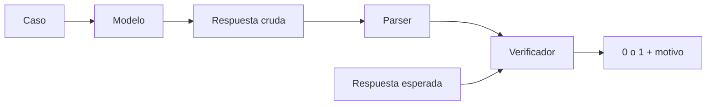

# 26 S05 - Diseñar una comparación de modelos

[[00 INICIO - Ruta de aprendizaje|Volver al índice]]

> [!info] Alcance
> Esta nota explica el contenido académico de la sesión 05. Los porcentajes y entregables descritos en el PDF pertenecen al taller del curso; no son instrucciones para organizar este vault.

## 1. La API es el instrumento; la decisión es el resultado

Una comparación útil no termina con «los tres modelos corrieron». Debe responder qué modelo conviene para un problema bajo restricciones concretas.


La decisión combina al menos:

- calidad medida en la tarea;
- latencia;
- costo;
- estabilidad entre corridas;
- privacidad y destino de los datos;
- hardware necesario;
- formato y compatibilidad con el sistema.

## 2. Elegir una tarea que discrimine

Una tarea experimental necesita:

1. casos reales o representativos;
2. respuesta esperada verificable;
3. una definición explícita de acierto;
4. variación suficiente para separar modelos.

«Escribe un haiku» puede ser útil para una evaluación humana, pero no produce una métrica automática clara. «Extrae estas cláusulas y devuelve un conjunto de etiquetas» permite comparar con una referencia.

## 3. El verificador se escribe antes

Si ajustas la métrica después de ver qué modelo ganó, adaptas el instrumento al resultado. Define primero:

- normalización de mayúsculas y espacios;
- tolerancias numéricas;
- tratamiento de valores faltantes;
- comparación de conjuntos u orden;
- política para respuestas no parseables.



Conserva la salida cruda. El parser y el verificador pueden tener defectos y necesitas poder auditarlos.

## 4. Qué mantener constante

Para comparar modelos en una misma parte del experimento, fija:

- casos y respuestas esperadas;
- prompt exacto;
- formato solicitado;
- límite de salida;
- estrategia de reintentos;
- entorno y cronómetro;
- número de repeticiones.

Si cambias modelo y prompt al mismo tiempo, no sabrás cuál causó la diferencia.

## 5. Exactitud y evaluación cualitativa

Exactitud para $N$ casos:

$$\operatorname{accuracy}=\frac{\text{aciertos}}{N}.$$

Con diez casos, cada acierto vale 10 puntos porcentuales: la incertidumbre es grande. El taller usa diez para hacer la evaluación manejable, no porque diez sea suficiente para toda decisión de producción.

La lectura cualitativa sigue siendo útil para registrar:

- alucinaciones;
- formato incumplido;
- verbosidad;
- evidencia inventada;
- tipo de error.

Evalúa a ciegas si es posible para reducir el efecto de saber qué modelo respondió.

## 6. Latencia

La sesión mide latencia de extremo a extremo:

```python
start = time.perf_counter()
respuesta = llamar_modelo(...)
latencia = time.perf_counter() - start
```

Eso incluye red y proveedor para una API, y hardware local para un modelo abierto. No es lo mismo que tiempo hasta el primer token ni tokens por segundo.

Reporta al menos promedio y rango de varias corridas, y conserva cada tiempo individual. Registra también los tokens de salida: una respuesta más larga puede tardar más aunque el modelo no sea más lento por token. Si calculas segundos por token, informa además la latencia completa, porque ese cociente oculta el tiempo fijo de la llamada.

## 7. Costo

$$C=\frac{n_{in}}{10^6}p_{in}+\frac{n_{out}}{10^6}p_{out}.$$

Registra en cada fila:

- tokens de entrada y salida;
- costo calculado;
- identificador exacto del modelo;
- fuente y fecha del precio;
- razonamiento interno facturado, si existe.

Un modelo local puede tener precio por token cero y aun consumir VRAM, energía y tiempo. Cero en una columna de API no significa costo total cero.

## 8. Barridos: cambia una palanca

Un barrido sistemático puede variar:

- modelo;
- temperatura y top-p;
- variante de prompt;
- nivel de razonamiento.

Para atribuir un cambio a una palanca, fija las demás. Ejemplo de un barrido de temperatura:

```text
modelo fijo × 5 temperaturas × 1 valor top-p × 5 corridas
= 25 observaciones
```

Si quieres estudiar la interacción entre temperatura y top-p, usa una cuadrícula de $5\times3\times5=75$ observaciones y descríbela como un experimento de dos factores. Antes de ejecutar, estima el número de llamadas y costo. La mayor cantidad de llamadas no siempre es la parte más cara si otra usa muchos tokens de razonamiento.

## 9. Estabilidad

Para una configuración, registra:

- media de exactitud;
- mínimo y máximo;
- desviación si hay suficientes repeticiones;
- frecuencia de respuestas no válidas.

Una configuración con 90 % promedio y rango 50–100 % puede ser peor para producción que una con 85 % estable, según el caso.

## 10. Credenciales y reproducibilidad

- `.env.example` puede versionar nombres sin valores.
- `.env` y claves reales deben quedar fuera del repositorio.
- Si una clave se expone, se rota; borrar el archivo no limpia el historial.
- Dependencias, semillas, entorno y comandos deben documentarse.
- El CSV crudo debe conservar todas las corridas, no solo promedios.

## 11. Qué documenta el taller de la sesión 05

El PDF organiza el ejercicio en seis bloques: inspección local de la distribución, comparación de modelos, barrido de decodificación, variantes de prompt, niveles de esfuerzo y reflexión. La rúbrica y sus porcentajes son requisitos docentes fechados del 19 de septiembre de 2026; si vas a entregar el taller, manda el enunciado oficial más reciente.

En el vault ya existe el material de trabajo en `talleres/`, incluido el notebook, resultados y figuras. Esta nota aporta el marco para leerlos y auditarlos.

## Fuentes de esta explicación

- [[sesion-05.pdf#page=2|Sesión 05, páginas 2–7: objetivo, partes y entregables]]
- [[sesion-05.pdf#page=9|Sesión 05, páginas 9–14: verificador, latencia, costo y reproducibilidad]]
- [[25 S04 - Salidas estructuradas costo y razonamiento interno|Validación y costo]]
- [[27 PRÁCTICA - Sesiones 02 a 05|Ejercicios para aplicar el protocolo]]

## Preguntas para comprobar que entendiste

> [!question]- ¿Por qué el verificador se diseña antes de llamar modelos?
> Para evitar adaptar la métrica al resultado observado y mantener una comparación auditable.

> [!question]- ¿Qué significa latencia de extremo a extremo?
> El tiempo de reloj de la llamada completa; no equivale a tiempo al primer token ni a velocidad de generación.

> [!question]- ¿Costo por token cero significa costo total cero para un modelo local?
> No. Hay costos de hardware, memoria, energía, operación y tiempo.

> [!question]- Si cambias prompt y modelo a la vez, ¿qué problema aparece?
> Confundes los efectos: no puedes atribuir la diferencia a una sola variable.
