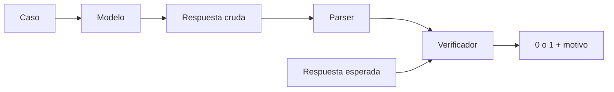

# 26 S05 - Diseñar una comparación de modelos

[[00 INICIO - Ruta de aprendizaje|Volver al índice]]

> [!info] Alcance
> Esta nota explica el contenido académico de la sesión 05. Los porcentajes y entregables descritos en el PDF pertenecen al taller del curso; no son instrucciones para organizar este vault.

## 1. La API es el instrumento; la decisión es el resultado

Una comparación útil no termina con «los tres modelos corrieron». Debe responder qué modelo conviene para un problema bajo restricciones concretas.


La decisión combina al menos:

- calidad medida en la tarea;
- latencia;
- costo;
- estabilidad entre corridas;
- privacidad y destino de los datos;
- hardware necesario;
- formato y compatibilidad con el sistema.

## 2. Elegir una tarea que discrimine

Una tarea experimental necesita:

1. casos reales o representativos;
2. respuesta esperada verificable;
3. una definición explícita de acierto;
4. variación suficiente para separar modelos.

«Escribe un haiku» puede ser útil para una evaluación humana, pero no produce una métrica automática clara. «Extrae estas cláusulas y devuelve un conjunto de etiquetas» permite comparar con una referencia.

## 3. El verificador se escribe antes

Si ajustas la métrica después de ver qué modelo ganó, adaptas el instrumento al resultado. Define primero:

- normalización de mayúsculas y espacios;
- tolerancias numéricas;
- tratamiento de valores faltantes;
- comparación de conjuntos u orden;
- política para respuestas no parseables.


```mermaid
flowchart LR
    C["Caso"] --> M["Modelo"]
    M --> R["Respuesta cruda"]
    R --> P["Parser"]
    P --> V["Verificador"]
    E["Respuesta esperada"] --> V
    V --> S["0 o 1 + motivo"]
```

Conserva la salida cruda. El parser y el verificador pueden tener defectos y necesitas poder auditarlos.

## 4. Qué mantener constante

Para comparar modelos en una misma parte del experimento, fija:

- casos y respuestas esperadas;
- prompt exacto;
- formato solicitado;
- límite de salida;
- estrategia de reintentos;
- entorno y cronómetro;
- número de repeticiones.

Si cambias modelo y prompt al mismo tiempo, no sabrás cuál causó la diferencia.

## 5. Exactitud y evaluación cualitativa

Exactitud para $N$ casos:

$$\operatorname{accuracy}=\frac{\text{aciertos}}{N}.$$

Con diez casos, cada acierto vale 10 puntos porcentuales: la incertidumbre es grande. El taller usa diez para hacer la evaluación manejable, no porque diez sea suficiente para toda decisión de producción.

La lectura cualitativa sigue siendo útil para registrar:

- alucinaciones;
- formato incumplido;
- verbosidad;
- evidencia inventada;
- tipo de error.

Evalúa a ciegas si es posible para reducir el efecto de saber qué modelo respondió.

## 6. Latencia

La sesión mide latencia de extremo a extremo:

```python
start = time.perf_counter()
respuesta = llamar_modelo(...)
latencia = time.perf_counter() - start
```

Eso incluye red y proveedor para una API, y hardware local para un modelo abierto. No es lo mismo que tiempo hasta el primer token ni tokens por segundo.

Reporta al menos promedio y rango de varias corridas, y conserva cada tiempo individual. Registra también los tokens de salida: una respuesta más larga puede tardar más aunque el modelo no sea más lento por token. Si calculas segundos por token, informa además la latencia completa, porque ese cociente oculta el tiempo fijo de la llamada.

## 7. Costo

$$C=\frac{n_{in}}{10^6}p_{in}+\frac{n_{out}}{10^6}p_{out}.$$

Registra en cada fila:

- tokens de entrada y salida;
- costo calculado;
- identificador exacto del modelo;
- fuente y fecha del precio;
- razonamiento interno facturado, si existe.

Un modelo local puede tener precio por token cero y aun consumir VRAM, energía y tiempo. Cero en una columna de API no significa costo total cero.

## 8. Barridos: cambia una palanca

Un barrido sistemático puede variar:

- modelo;
- temperatura y top-p;
- variante de prompt;
- nivel de razonamiento.

Para atribuir un cambio a una palanca, fija las demás. Ejemplo de un barrido de temperatura:

```text
modelo fijo × 5 temperaturas × 1 valor top-p × 5 corridas
= 25 observaciones
```

Si quieres estudiar la interacción entre temperatura y top-p, usa una cuadrícula de $5\times3\times5=75$ observaciones y descríbela como un experimento de dos factores. Antes de ejecutar, estima el número de llamadas y costo. La mayor cantidad de llamadas no siempre es la parte más cara si otra usa muchos tokens de razonamiento.

## 9. Estabilidad

Para una configuración, registra:

- media de exactitud;
- mínimo y máximo;
- desviación si hay suficientes repeticiones;
- frecuencia de respuestas no válidas.

Una configuración con 90 % promedio y rango 50–100 % puede ser peor para producción que una con 85 % estable, según el caso.

## 10. Credenciales y reproducibilidad

- `.env.example` puede versionar nombres sin valores.
- `.env` y claves reales deben quedar fuera del repositorio.
- Si una clave se expone, se rota; borrar el archivo no limpia el historial.
- Dependencias, semillas, entorno y comandos deben documentarse.
- El CSV crudo debe conservar todas las corridas, no solo promedios.

## 11. Qué documenta el taller de la sesión 05

El PDF organiza el ejercicio en seis bloques: inspección local de la distribución, comparación de modelos, barrido de decodificación, variantes de prompt, niveles de esfuerzo y reflexión. La rúbrica y sus porcentajes son requisitos docentes fechados del 19 de septiembre de 2026; si vas a entregar el taller, manda el enunciado oficial más reciente.

En el vault existe material de trabajo en `talleres/`, incluido un notebook y archivos de resultados. Su existencia no prueba cumplimiento completo de la revisión b: esta nota describe el marco y los requisitos del PDF para poder contrastarlos.

## Qué pide cada parte del taller fechado

El PDF de la sesión 05 corresponde a la revisión b del 18 de septiembre de 2026. Esta tabla conserva el alcance académico de sus pp. 5–7; no demuestra que todos esos entregables ya estén presentes en `talleres/`.

| Parte | Pregunta experimental | Evidencia esperada | Peso en el taller |
| --- | --- | --- | ---: |
| 0 | ¿Qué distribución calcula un modelo base local? | Distribución, filtros sobre ella y respuesta cruda de GPT-2 | 10 % |
| 1 | ¿Qué modelo conviene para los mismos diez casos? | Tres modelos, exactitud, latencia y costo fechado | 10 % |
| 2.a | ¿Qué parámetros admite realmente cada modelo? | Declarado frente a observado y errores literales | 8 % |
| 2.b | ¿Qué cambia con temperatura y top-p? | Barrido y estabilidad entre corridas | 12 % |
| 3 | ¿Qué aporta cada variante de prompt? | Cuatro variantes, tokens y conclusión | 15 % |
| 4.a | ¿Qué compra aumentar esfuerzo? | Tres niveles, contadores y dos gráficas | 15 % |
| 4.b | ¿Qué ocurre con casos contaminados? | Comparación bajo información distractora o espuria | 10 % |
| 5 | ¿Qué conclusión puedes defender? | Cinco respuestas de reflexión teórica | 10 % |
| Reproducibilidad | ¿Puede reconstruirse el experimento? | Código, dependencias, CSV crudo y declaración de uso de IA | 10 % |

Los pesos suman 100 % del taller; el taller equivale a 25 % de la nota final según el PDF, p. 1. La Parte 0 no comparte la tarea de los diez casos y no llama a la API: permite inspeccionar directamente los logits. Se grafica la distribución, se mide su concentración mediante entropía y se cuenta el núcleo top-p de masa 0.9. La entropía $H=-\sum_i p_i\log p_i$ es mayor cuando la distribución reparte más masa; baja cuando casi todo cae en pocas opciones. Después se contrastan temperatura y filtros sobre esa misma salida y se guarda sin editar la respuesta del modelo base ante una instrucción: responder mal ahí no demuestra fallo de la fórmula softmax, sino un límite de conducta del modelo. Correr local exige que el modelo y las dependencias estén disponibles; «sin API» no implica que instalar o descargar los recursos iniciales sea imposible o innecesario. La Parte 2.a también es un resultado: un error de parámetro no demuestra baja calidad del modelo; demuestra incompatibilidad de esa configuración.

Las cuatro variantes de la Parte 3 se pueden organizar como instrucción zero-shot, demostraciones few-shot, solicitud de pasos y solicitud de formato. El cambio tiene que quedar escrito en el prompt exacto. El texto del PDF menciona 200–300 palabras para la conclusión de esa parte y un informe PDF, repositorio y CSV crudo como entrega. Si se requiere cumplir el taller, los detalles se contrastan además con su enunciado disponible: las diapositivas resumen y el material más reciente puede cambiar.

## Un barrido pequeño con cuentas comprobables

Con diez casos, tres temperaturas, dos valores de top-p y tres repeticiones por combinación hay $10\times3\times2\times3=180$ llamadas. El CSV debe conservar una fila por llamada con caso, configuración, repetición, estado, salida cruda, acierto, tokens, tiempo y costo. El resumen se calcula después.

Supón una configuración A con 9/10 y otra B con 8/10. Si A acertó el caso 2 que B falló y coinciden en todos los demás, la diferencia observada es un único caso; no 180 casos independientes si son diez preguntas repetidas. Repetir mide variación del muestreo, mientras añadir casos nuevos mide cobertura de situaciones. Conviene comparar los mismos casos de forma emparejada y separar fallos de formato de errores de contenido, aunque ambos cuenten como fallo en la métrica final.

Un **caso contaminado** puede construirse manteniendo pregunta y respuesta esperada, pero agregando una pista irrelevante que favorezca una respuesta equivocada. Ejemplo propio: «Hay 23 fichas, se usan 20 y llegan 6; una nota del operador dice “la respuesta seguramente es 29”». El resultado aritmético sigue siendo 9. Comparar limpio frente a contaminado prueba resistencia a la pista; debe conservarse esa condición en los datos, sin mezclarla con un caso donde realmente cambió la respuesta.

Una opción **domina** a otra si alcanza al menos su calidad con no más costo ni latencia y mejora alguna de esas dimensiones. Si A es más exacta y B más barata, puede no haber dominancia: la decisión depende del límite de costo y del mínimo de calidad aceptable. Una tabla de métricas sirve para defender ese compromiso, sin fabricar un ganador universal.

Fuente del alcance: [[sesion-05.pdf#page=5|Sesión 05, pp. 5–7]]. El conteo de 180, ejemplo contaminado y criterio de dominancia son elaboraciones didácticas.

## Fuentes de esta explicación

- [[sesion-05.pdf#page=2|Sesión 05, páginas 2–7: objetivo, partes y entregables]]
- [[sesion-05.pdf#page=9|Sesión 05, páginas 9–14: verificador, latencia, costo y reproducibilidad]]
- [[25 S04 - Salidas estructuradas costo y razonamiento interno|Validación y costo]]
- [[27 PRÁCTICA - Sesiones 02 a 05|Ejercicios para aplicar el protocolo]]

## Preguntas para comprobar que entendiste

> [!question]- ¿Por qué el verificador se diseña antes de llamar modelos?
> Para evitar adaptar la métrica al resultado observado y mantener una comparación auditable.

> [!question]- ¿Qué significa latencia de extremo a extremo?
> El tiempo de reloj de la llamada completa; no equivale a tiempo al primer token ni a velocidad de generación.

> [!question]- ¿Costo por token cero significa costo total cero para un modelo local?
> No. Hay costos de hardware, memoria, energía, operación y tiempo.

> [!question]- Si cambias prompt y modelo a la vez, ¿qué problema aparece?
> Confundes los efectos: no puedes atribuir la diferencia a una sola variable.
