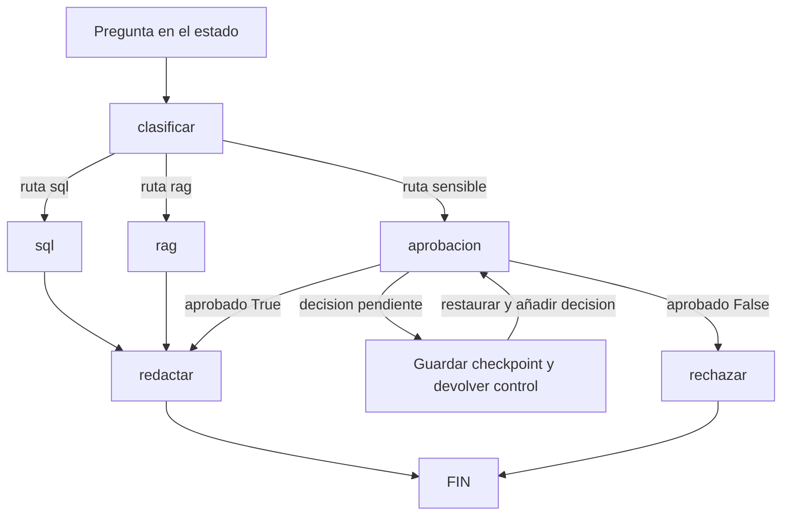
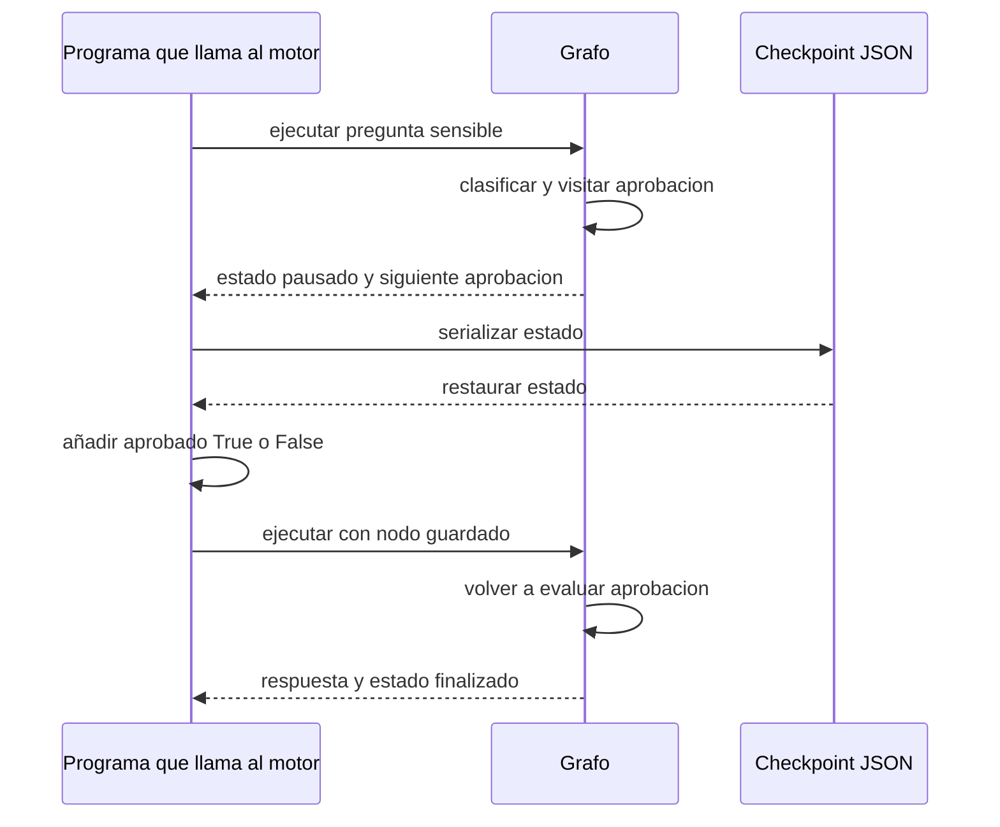

# 94 PRÁCTICA - Notebook del miércoles: grafos, checkpoints y MCP

[[Obsidian/posgrado/master/IA GENERATIVA Y AGENTES/00 Inicio/00 INICIO - Ruta de aprendizaje|Inicio de la materia]] · [[Obsidian/posgrado/master/IA GENERATIVA Y AGENTES/13 MCP descubrimiento y casos de uso/00 Índice - S13 MCP y casos de uso|Teoría de MCP]] · [[Obsidian/posgrado/master/IA GENERATIVA Y AGENTES/12 Patrones de agentes y diseño del toolset/77 S12 - Laboratorio local y soluciones del martes|Práctica del martes]]

Esta práctica explica las **22 celdas** de `s3-mie-estudiante.ipynb`, semana 3, miércoles, MMIA 6013. Aprendes a representar un proceso mediante un grafo, detenerlo para recibir una decisión humana y separar las herramientas de la aplicación que las usa.

El lunes construiste el bucle que ejecuta herramientas; el martes estudiaste cómo controlar intentos y fallas. Aquí haces explícito **qué paso viene después y qué información necesita para continuar**.

## 1. Archivos y forma de estudiar

| Archivo | Para qué sirve |
| --- | --- |
| [[Obsidian/posgrado/master/IA GENERATIVA Y AGENTES/Materiales/s3-mie-estudiante.ipynb\|Notebook original]] | Ver las consignas y los huecos del material docente. |
| [[Obsidian/posgrado/master/IA GENERATIVA Y AGENTES/06 Talleres y práctica/Practica miercoles/s3-mie-resuelto.ipynb\|Notebook resuelto]] | Ejecutar los ejercicios en orden y comparar con las salidas guardadas. |
| [[Obsidian/posgrado/master/IA GENERATIVA Y AGENTES/06 Talleres y práctica/Practica miercoles/s3-mie-resultados-verificados.json\|Resultados verificados]] | Inspeccionar estados, trazas y datos obtenidos en la ejecución local. |

Abre la copia resuelta en Jupyter o VS Code con soporte para notebooks y ejecuta las celdas de arriba hacia abajo. La práctica local usa únicamente la biblioteca estándar de Python. La variante opcional de LangGraph queda como lectura, con el código del original y una aclaración de sus límites.

Antes de ejecutar cada bloque, predice la ruta y las claves que aparecerán en el estado. Después compara tu predicción con la salida. Sigue el notebook resuelto como archivo ejecutable. Esta nota añade fragmentos descompuestos para explicar cada operación; esos fragmentos ilustrativos no forman un segundo programa que debas ejecutar de arriba abajo. Las celdas posteriores del notebook utilizan variables definidas en las anteriores.

> [!info] Qué se está simulando
> No se entrena ni se llama a un LLM. `clasificar` usa palabras clave, `sql` entrega un diccionario fijo, `rag` entrega un texto fijo y `redactar` lo envuelve en una cadena. MCP también se simula mediante objetos Python dentro del mismo proceso. Los ejercicios prueban el mecanismo de coordinación, no la calidad de un modelo ni una conexión real.

### Antes del código: qué estás construyendo exactamente

Vas a construir un programa que recibe una pregunta y la hace pasar por varias tareas. Primero implementas un **motor reutilizable**; después le indicas las tareas concretas que debe ejecutar. Por último construyes un cliente y un servidor simulados para publicar y llamar herramientas.

Hay tres momentos distintos al ejecutar el notebook:

1. **Definir:** `class Grafo` y `def nodo_sql(...)` enseñan a Python qué código existe. Todavía no procesan ninguna pregunta.
2. **Configurar:** `g = Grafo()` crea un objeto; `g.agregar_nodo(...)` y `g.agregar_arista(...)` guardan funciones y conexiones en él. Todavía no consultan ni redactan.
3. **Ejecutar:** `g.ejecutar(...)` toma una pregunta, llama las funciones en el orden del grafo y devuelve el resultado.

Es fácil confundirse si mezclas estos momentos. Registrar una función significa «esta tarea está disponible»; ejecutarla significa «haz esta tarea ahora con este estado».

| Celdas del original, contando desde 0 | Qué debes hacer | Qué queda construido |
| --- | --- | --- |
| 1–3 | Importar JSON y completar `Grafo`. | Un motor capaz de recorrer nodos. |
| 4–7 | Definir tareas, registrarlas y conectarlas. | Un flujo para preguntas de ventas, documentos o revisión. |
| 8–10 | Ejecutar hasta la pausa, serializar y restaurar. | Una ejecución que puede continuar con una decisión nueva. |
| 11–12 | Leer la traducción opcional a LangGraph. | Una comparación con una biblioteca. |
| 13–16 | Leer el servidor y completar el cliente. | Un catálogo que puedes descubrir y herramientas que puedes invocar. |
| 17–18 | Agregar un segundo proveedor. | Herramientas de dos fuentes con un despacho común. |
| 19–21 | Justificar la arquitectura y repasar. | Una explicación de cuándo conviene cada mecanismo. |

### Python que necesitas para seguir la práctica

`estado` es un diccionario: una estructura de claves y valores. Su nombre no le da ningún poder especial; podrías llamarlo `expediente` y funcionaría igual.

```python
estado = {"pregunta": "¿Cuánto vendimos en marzo?"}
pregunta = estado["pregunta"]    # Leer un dato existente.
estado["ruta"] = "sql"         # Agregar o reemplazar un dato.
datos = estado.get("datos", {}) # Leer con valor por defecto si falta la clave.
```

Después de la asignación, `estado` contiene la pregunta y la ruta. Leer `estado["datos"]` antes de agregar esa clave causaría `KeyError`; `.get("datos", {})` devuelve `{}` en ese caso. `.get` no agrega esa clave al diccionario.

Una función recibe ese diccionario, trabaja con él y lo devuelve:

```python
def agregar_dato(estado):
    estado["dato"] = 2695
    return estado

expediente = {"pregunta": "ventas de marzo"}
resultado = agregar_dato(expediente)
print(expediente)
print(resultado is expediente)  # True: ambos nombres apuntan al mismo objeto.
```

El resultado impreso contiene `pregunta` y `dato`. **Estos nodos modifican el diccionario que reciben**; `return estado` no crea una copia. Por eso las claves agregadas por un nodo están disponibles para el siguiente. Más adelante, `json.loads` sí producirá un diccionario independiente.

## 2. Las cinco piezas que necesitas distinguir

Imagina una oficina: llega una pregunta, se envía al área correspondiente, se consulta información y se prepara una respuesta. Si la pregunta necesita revisión, la oficina guarda el expediente hasta que alguien decida.

| Pieza | En la oficina | En el notebook |
| --- | --- | --- |
| **Estado** | El expediente que contiene pregunta, datos y decisiones | Un diccionario `estado`. |
| **Nodo** | Una tarea que modifica el expediente | Una función `nodo_sql(estado)`. |
| **Arista fija** | Después de consultar, siempre se redacta | `sql → redactar`. |
| **Arista condicional** | El área depende del tipo de pregunta | El router lee `estado["ruta"]`. |
| **Checkpoint** | El expediente guardado y la tarea pendiente | Estado serializado más `_siguiente`. |

Un nodo **realiza trabajo**. El router **elige el próximo nodo**. Esa separación permite leer las decisiones en la construcción del grafo.



Las flechas muestran la solución didáctica: añade la rama de rechazo que falta en el original. La pausa devuelve el control al programa que llamó al motor; no deja un `while` esperando activamente a una persona.

## 3. Parte 1 — Construir el motor: ejercicio 1.1

El notebook empieza con `import json`. Esa biblioteca convierte diccionarios en texto JSON y permite restaurarlos después. La clase `Grafo` guarda tres registros:

```python
self.nodos = {"sql": nodo_sql}        # Nombre -> función que realiza trabajo.
self.aristas = {"sql": "redactar"}   # Nombre -> siguiente nombre fijo.
self.routers = {"clasificar": router}  # Nombre -> función que decide.
```

Al registrar `nodo_sql` no se escribe `nodo_sql()`: guardas la función para ejecutarla más adelante. Tampoco se guarda el estado dentro de `self.nodos`; el estado entra en cada ejecución.

### Solución del motor

```python
class Grafo:
    def __init__(self):
        self.nodos = {}
        self.aristas = {}
        self.routers = {}

    def agregar_nodo(self, nombre, fn):
        self.nodos[nombre] = fn

    def agregar_arista(self, desde, hasta):
        self.aristas[desde] = hasta

    def agregar_arista_condicional(self, desde, router):
        self.routers[desde] = router

    def ejecutar(self, estado, inicio=None, max_pasos=20):
        if type(max_pasos) is not int or max_pasos < 1:
            raise ValueError("max_pasos debe ser un entero positivo")
        actual = inicio if inicio is not None else estado.get("_siguiente", "clasificar")
        estado.setdefault("_traza", [])
        estado["_pausa"] = False
        for _ in range(max_pasos):
            if actual == "FIN":
                break
            if actual not in self.nodos:
                raise ValueError(f"Nodo desconocido: {actual}")
            estado = self.nodos[actual](estado)
            estado["_traza"].append(actual)
            if estado.get("_pausa"):
                estado["_siguiente"] = actual
                estado["_estado_ejecucion"] = "pausado"
                return estado
            if actual in self.routers:
                actual = self.routers[actual](estado)
            elif actual in self.aristas:
                actual = self.aristas[actual]
            else:
                raise ValueError(f"Falta una salida para: {actual}")
            estado["_siguiente"] = actual
        estado["_siguiente"] = actual
        estado["_estado_ejecucion"] = "finalizado" if actual == "FIN" else "limite_pasos"
        return estado
```

La firma del ejercicio recibe `inicio`; la solución permite omitirlo para reanudar usando `_siguiente`. `_estado_ejecucion` y `_siguiente` son campos añadidos para observar el resultado y reconstruir la continuación.

### Leer la clase sin perderte en `self`

Una clase agrupa datos y operaciones. `g = Grafo()` crea una instancia de esa clase. `__init__` se ejecuta al crearla y prepara sus tres diccionarios vacíos. Dentro de los métodos, `self` se refiere a esa instancia.

```python
g = Grafo()
g.agregar_nodo("sql", nodo_sql)
```

Python entrega `g` como `self`, `"sql"` como `nombre` y la función `nodo_sql` como `fn`. El método realiza `self.nodos[nombre] = fn`: guarda la asociación entre un nombre de texto y una función que podrá llamar después.

`g.agregar_arista("sql", "redactar")` guarda una asociación distinta: del nombre `sql` al nombre `redactar`. No guarda una función, porque una arista fija solo necesita indicar el destino.

La línea central del motor es:

```python
estado = self.nodos[actual](estado)
```

Puedes leerla como tres operaciones más sencillas:

```python
funcion = self.nodos[actual]       # Buscar por nombre la tarea actual.
estado_devuelto = funcion(estado) # Llamarla con el expediente.
estado = estado_devuelto          # Seguir con el expediente que devolvió.
```

Si `actual == "sql"`, la función encontrada es `nodo_sql`. Los primeros corchetes **buscan**; los paréntesis posteriores **llaman**. La palabra `actual` contiene el nombre del nodo que se ejecutará, no el nombre de una variable del dominio ni la pregunta.

### Qué significa cada grupo dentro de `ejecutar`

| Código | Traducción a lenguaje cotidiano | Motivo |
| --- | --- | --- |
| `inicio if inicio is not None else ...` | Si me dieron un punto de inicio, lo uso; si no, leo el guardado. | Servir tanto para comenzar como para reanudar. |
| `estado.setdefault("_traza", [])` | Crea una lista solo si no había una. | Conservar los pasos anteriores al reanudar. |
| `estado["_pausa"] = False` | Empieza esta llamada sin una señal de pausa vieja. | Volver a evaluar la decisión actual. |
| `for _ in range(max_pasos)` | Intenta ejecutar, como máximo, esa cantidad de nodos. | Contener ciclos o recorridos demasiado largos. |
| `if actual == "FIN": break` | Sal del bucle cuando ya no queda una tarea. | No buscar una función llamada `FIN`. |
| `raise ValueError(...)` | Detén la ejecución con un diagnóstico de configuración. | No continuar silenciosamente con un nodo o salida inexistentes. |
| `_traza.append(actual)` | Anota la tarea que acabas de visitar. | Poder reconstruir el recorrido. |
| `if estado.get("_pausa"): ... return estado` | Devuelve inmediatamente el expediente pendiente. | Entregar el control sin ejecutar la próxima tarea. |
| `self.routers[actual](estado)` | Pregunta a la función de ruta qué tarea sigue. | Elegir según el contenido del estado. |
| `self.aristas[actual]` | Lee un destino ya establecido. | Seguir una transición fija. |

El `_` del `for` es una variable que no utilizamos. `range(3)` produce tres iteraciones, con valores 0, 1 y 2. Una iteración aquí ejecuta **un nodo**, no necesariamente una llamada a un modelo.

`break` sale del bucle y permite ejecutar las líneas finales del método. `return estado` sale del método completo y entrega el resultado a quien llamó. En una pausa se necesita `return`, para impedir que el resto del recorrido continúe.

En esta implementación, un router tiene prioridad sobre una arista fija del mismo nodo, porque se consulta primero en el `if`. La configuración de la práctica usa una sola forma de salida por nodo.

### Cómo trabaja `ejecutar`, paso a paso

1. Selecciona el nodo inicial o el nodo pendiente que llegó en el checkpoint.
2. Crea `_traza` si todavía no existe. `setdefault` conserva la lista de una ejecución pausada.
3. Limpia la señal `_pausa` anterior. El nodo de aprobación vuelve a evaluarla con la decisión recibida.
4. Busca la función del nodo actual, la ejecuta y agrega su nombre a la traza.
5. Si el nodo pide pausa, guarda **ese mismo nodo** como pendiente y devuelve el estado.
6. Si sigue, llama al router o sigue la arista fija y actualiza `_siguiente`.
7. Al alcanzar `FIN`, marca `finalizado`. Si consume los pasos disponibles, marca `limite_pasos`.

`FIN` es una marca de terminación; no se registra como una función ni aparece como nodo visitado en `_traza`. Los nombres con `_` son una convención de esta práctica: no tienen comportamiento especial en Python.

El chequeo final importa: si `redactar` fue el tercer y último paso permitido y su salida es `FIN`, la ejecución terminó correctamente. Agotar exactamente el contador no significa siempre fallar.

> [!question]- ¿Por qué el motor también contiene un bucle?
> El grafo organiza las tareas y decisiones como datos; el bucle recorre esa representación. Un `while` con `if` puede implementar el mismo comportamiento y también se puede dibujar. La ventaja del grafo es que la estructura del flujo queda separada y resulta más fácil inspeccionarla. La frase del original «un loop no se puede dibujar» debe entenderse como una motivación didáctica, no como una limitación del lenguaje.

## 4. Parte 2 — Qué hace cada nodo: ejercicio 2.1

### Clasificar: de pregunta a ruta

La función convierte la pregunta a minúsculas y busca palabras dentro de ella:

```python
p = estado["pregunta"].lower()
if any(w in p for w in ("ventas", "total", "cuánto", "promedio")):
    estado["ruta"] = "sql"
elif any(w in p for w in ("política", "vacaciones", "remoto", "documento")):
    estado["ruta"] = "rag"
else:
    estado["ruta"] = "sensible"
```

`any(...)` devuelve `True` si al menos una comprobación se cumple. `w in p` busca una subcadena, no una palabra completa ni su significado. Como `if` se evalúa primero, «política de ventas» se envía a SQL. `.lower()` no elimina tildes: «cuanto» y «cuánto» son cadenas distintas.

En este código, **sensible significa pregunta no reconocida por las reglas**. No demuestra que se hayan detectado riesgos. Cambiar el clasificador por un LLM o por un detector de políticas sería otro ejercicio.

### SQL, RAG y redacción

| Nodo | Lee | Escribe | Qué ocurre realmente |
| --- | --- | --- | --- |
| `clasificar` | `pregunta` | `ruta` | Aplica las reglas anteriores. |
| `sql` | No utiliza la pregunta | `datos` | Copia `total_marzo=2695` y `n_ventas=4`. |
| `rag` | No busca documentos | `datos` | Copia un `chunk` sobre tres días de trabajo remoto. |
| `aprobacion` | Presencia y valor de `aprobado` | `_pausa` | Espera una decisión explícita. |
| `redactar` | `datos`, si existe | `respuesta` | Inserta el JSON en una cadena. |
| `rechazar` | No requiere datos | `respuesta` | Produce el mensaje de rechazo añadido en la solución. |

`estado.get("datos", {})` devuelve un diccionario vacío si no hay datos. `ensure_ascii=False` conserva caracteres como las tildes al imprimir JSON.

### Ver el código de las tareas, no solo sus nombres

En el clasificador, `p` guarda el texto en minúsculas. La expresión con `any` comprueba si se cumple al menos una de estas condiciones:

```python
"ventas" in p
"total" in p
"cuánto" in p
"promedio" in p
```

Para «¿Cuánto vendimos en marzo?», la tercera condición es verdadera. Se escribe `estado["ruta"] = "sql"` y el nodo devuelve el estado. **El clasificador no ejecuta SQL**: deja una etiqueta que luego leerá el router.

Los siguientes tres nodos originales son:

```python
def nodo_sql(estado):
    estado["datos"] = {"total_marzo": 2695, "n_ventas": 4}
    return estado

def nodo_rag(estado):
    estado["datos"] = {
        "chunk": "El trabajo remoto está permitido hasta 3 días por semana."
    }
    return estado

def nodo_redactar(estado):
    estado["respuesta"] = f"[respuesta redactada con {json.dumps(estado.get('datos', {}), ensure_ascii=False)}]"
    return estado
```

En `nodo_sql`, el diccionario de cifras se convierte en el valor de la clave `datos`. En `nodo_rag`, esa misma clave contiene otro diccionario con un fragmento de texto. Se utiliza un lugar común, `datos`, para que `nodo_redactar` pueda trabajar con cualquiera de las dos rutas.

La expresión de redacción se entiende de dentro hacia fuera:

1. `estado.get('datos', {})` obtiene lo que recuperó la ruta, o un objeto vacío.
2. `json.dumps(...)` convierte esos datos en una cadena de texto.
3. La `f` antes de las comillas indica una *f-string*: inserta el valor de la expresión entre llaves en el texto exterior.
4. `estado["respuesta"] = ...` guarda la cadena final en el expediente.
5. `return estado` entrega el expediente que ahora contiene también la respuesta.

Una versión descompuesta de esa misma redacción sería:

```python
datos = estado.get("datos", {})
datos_como_texto = json.dumps(datos, ensure_ascii=False)
respuesta = "[respuesta redactada con " + datos_como_texto + "]"
estado["respuesta"] = respuesta
```

RAG significa recuperar información para usarla al generar una respuesta. El nodo del ejemplo coloca directamente el fragmento que una búsqueda podría haber devuelto. La frase «hasta 3 días» ya está escrita en el código: el programa no la descubrió consultando documentos.

### Armar el grafo

Primero registra las funciones; luego define cómo se conectan. Esta es la solución completa del ejercicio 2.1:

```python
g = Grafo()
for nombre, fn in {
    "clasificar": nodo_clasificar,
    "sql": nodo_sql,
    "rag": nodo_rag,
    "aprobacion": nodo_aprobacion,
    "redactar": nodo_redactar,
    "rechazar": nodo_rechazar,
}.items():
    g.agregar_nodo(nombre, fn)

g.agregar_arista_condicional("clasificar", lambda e: {
    "sql": "sql", "rag": "rag", "sensible": "aprobacion"
}[e["ruta"]])
g.agregar_arista("sql", "redactar")
g.agregar_arista("rag", "redactar")
g.agregar_arista_condicional(
    "aprobacion", lambda e: "redactar" if e["aprobado"] else "rechazar"
)
g.agregar_arista("redactar", "FIN")
g.agregar_arista("rechazar", "FIN")

resultado_sql = g.ejecutar({"pregunta": "¿Cuánto vendimos en marzo?"}, "clasificar")
resultado_rag = g.ejecutar({"pregunta": "¿Qué política de trabajo remoto existe?"}, "clasificar")
for resultado in [resultado_sql, resultado_rag]:
    print(json.dumps(resultado, ensure_ascii=False, indent=2))
```

La primera expresión `lambda` es una función breve: recibe `e`, lee su ruta y devuelve un nombre de nodo. No consulta datos. Después de `sql` o `rag`, la salida siempre es `redactar`.

### Entender `.items()` y reemplazar la `lambda` por una función normal

El diccionario de registro contiene pares como `"sql": nodo_sql`. `.items()` permite recorrer cada par, y `for nombre, fn in ...` separa sus dos partes. Por tanto, la iteración correspondiente a SQL equivale a:

```python
nombre = "sql"
fn = nodo_sql
g.agregar_nodo(nombre, fn)
```

El router escrito como `lambda` hace exactamente lo que haría esta función con nombre:

```python
def decidir_despues_de_clasificar(estado):
    destinos = {
        "sql": "sql",
        "rag": "rag",
        "sensible": "aprobacion",
    }
    ruta_elegida = estado["ruta"]
    siguiente_nodo = destinos[ruta_elegida]
    return siguiente_nodo
```

Para registrar esta versión, podrías usar `g.agregar_arista_condicional("clasificar", decidir_despues_de_clasificar)`. La `lambda` del notebook es una forma corta de expresar esa función.

En la ruta sensible, la etiqueta es `sensible`, pero el nodo se llama `aprobacion`; el diccionario hace esa traducción. En SQL/RAG los nombres coinciden por comodidad, no porque Python exija que una etiqueta y un nodo se llamen igual.

### Recorrer una ejecución mirando las variables del motor

La llamada `g.ejecutar({"pregunta": "¿Cuánto vendimos en marzo?"}, "clasificar")` empieza con `actual="clasificar"` y con la pregunta como única información de dominio:

| Paso | `actual` antes de llamar al nodo | Trabajo realizado | Cómo se elige el siguiente |
| --- | --- | --- | --- |
| 1 | `clasificar` | Agrega `ruta="sql"`. | El router lee esa ruta y devuelve `"sql"`. |
| 2 | `sql` | Agrega las cifras en `datos`. | La arista fija devuelve `"redactar"`. |
| 3 | `redactar` | Agrega el texto en `respuesta`. | La arista fija devuelve `"FIN"`. |

Antes de redactar, la parte del expediente que necesita la función es:

```json
{
  "pregunta": "¿Cuánto vendimos en marzo?",
  "ruta": "sql",
  "datos": {"total_marzo": 2695, "n_ventas": 4}
}
```

El estado completo tiene también las claves de control del motor. La pregunta y las cifras no desaparecen al redactar: la función añade otra clave al mismo diccionario.

El grafo almacena las tareas posibles; `estado` almacena el expediente de una pregunta. Una nueva llamada con un diccionario nuevo puede usar el mismo `g` y conservar un expediente distinto.

### Una pregunta vista como estados sucesivos

Para «¿Cuánto vendimos en marzo?»:

| Momento | Información acumulada relevante |
| --- | --- |
| Entrada | `pregunta = "¿Cuánto vendimos en marzo?"` |
| Después de clasificar | Se añade `ruta = "sql"`. |
| Después de SQL | Se añade `datos = {"total_marzo": 2695, "n_ventas": 4}`. |
| Después de redactar | Se añade `respuesta`; la siguiente marca es `FIN`. |

La salida redactada es literalmente:

```text
[respuesta redactada con {"total_marzo": 2695, "n_ventas": 4}]
```

La traza es `["clasificar", "sql", "redactar"]`. Para la pregunta sobre trabajo remoto, cambia a `["clasificar", "rag", "redactar"]` y los datos contienen el texto de la política.

Observa una limitación útil: preguntar por abril también devolvería el diccionario fijo de marzo. El nombre `sql` representa dónde conectarías una consulta real; no acredita que esa consulta se haya realizado.

## 5. Parte 3 — Pausar y reanudar: ejercicio 3.1

### El detalle que falta en el original

El original utiliza:

```python
if not estado.get("aprobado"):
    estado["_pausa"] = True
```

Si no existe `aprobado`, `.get` devuelve `None`. Si la persona rechaza, devuelve `False`. Ambos valores hacen que se cumpla el `if`: **el rechazo vuelve a pausar en lugar de terminar**.

Necesitas tres situaciones, aunque la decisión final sea un booleano:

| Estado de la decisión | Representación | Acción |
| --- | --- | --- |
| Nadie ha decidido | Clave `aprobado` ausente | Pausar. |
| Se aprueba | `aprobado=True` | Continuar a redactar. |
| Se rechaza | `aprobado=False` | Continuar a rechazar y terminar. |

La solución añade esta distinción y el nodo de rechazo:

```python
def nodo_aprobacion(estado):
    # Ausente = pendiente. False = decisión explícita de rechazo.
    if "aprobado" in estado and type(estado["aprobado"]) is not bool:
        raise ValueError("La decisión debe ser True o False")
    estado["_pausa"] = "aprobado" not in estado
    return estado

def nodo_rechazar(estado):
    estado["respuesta"] = "Solicitud rechazada por la persona revisora."
    return estado
```

`type(... ) is bool` evita que la cadena `"False"` se interprete como una aprobación por ser un texto no vacío. La decisión se agrega externamente al estado; el simulador no está consultando a una persona real.

### Qué guarda el checkpoint

Con «Autoriza una excepción especial», el clasificador elige `sensible`. La ejecución visita `aprobacion`, encuentra la decisión pendiente y devuelve este estado:

```json
{
  "pregunta": "Autoriza una excepción especial",
  "_traza": ["clasificar", "aprobacion"],
  "_pausa": true,
  "ruta": "sensible",
  "_siguiente": "aprobacion",
  "_estado_ejecucion": "pausado"
}
```

Todavía no existe `respuesta`. Tampoco hay `datos`, porque la ruta sensible no ejecutó SQL ni RAG. Sobreviven la pregunta, la clasificación, la traza y el punto pendiente de reanudación.

`json.dumps` produce texto; `json.loads` crea un nuevo diccionario a partir de ese texto. Para sobrevivir al cierre del programa, además debes **guardar el texto** en un archivo o base de datos y cargarlo después. Una variable que contiene JSON sigue viviendo solo en memoria. En esta práctica, el archivo de resultados conserva también el estado pausado.

### Restaurar dos decisiones alternativas

```python
pausado = g.ejecutar({"pregunta": "Autoriza una excepción especial"}, "clasificar")
checkpoint_json = json.dumps(pausado, ensure_ascii=False)
print("CHECKPOINT:", checkpoint_json)

# Dos restauraciones independientes: representan dos decisiones alternativas.
aprobado = json.loads(checkpoint_json)
aprobado["aprobado"] = True
aprobado = g.ejecutar(aprobado)  # Usa _siguiente = aprobacion.

rechazado = json.loads(checkpoint_json)
rechazado["aprobado"] = False
rechazado = g.ejecutar(rechazado)

print("APROBADO:", json.dumps(aprobado, ensure_ascii=False))
print("RECHAZADO:", json.dumps(rechazado, ensure_ascii=False))
print("ORIGINAL SIGUE PAUSADO:", pausado["_estado_ejecucion"])
```

Las dos llamadas a `json.loads` producen estados independientes. Así puedes comparar aprobación y rechazo sin modificar el objeto pausado original.



| Decisión | Traza completa después de reanudar | Resultado |
| --- | --- | --- |
| Aprobación | `clasificar → aprobacion → aprobacion → redactar` | `finalizado`, con una respuesta basada en `{}`. |
| Rechazo | `clasificar → aprobacion → aprobacion → rechazar` | `finalizado`, con un mensaje de rechazo. |
| Sin agregar decisión | `clasificar → aprobacion → aprobacion` | Vuelve a quedar `pausado`. |

`aprobacion` aparece dos veces porque se visita antes de pausar y al reanudar. Esta es la semántica elegida para el motor local: el nodo vuelve a comprobar la decisión.

La aprobación permite continuar el flujo, pero **no crea información**. Como la pregunta sensible nunca obtuvo `datos`, la redacción original muestra `[respuesta redactada con {}]`. Eso demuestra continuación; no demuestra que se haya contestado bien la pregunta desconocida.

### Leer la serialización y la reanudación línea por línea

`pausado = g.ejecutar(...)` **sí ejecuta** el flujo: visita `clasificar` y `aprobacion`, pero devuelve el control antes de redactar. La variable `pausado` recibe ese diccionario incompleto.

`checkpoint_json = json.dumps(pausado, ensure_ascii=False)` convierte el diccionario en una cadena. Esa cadena contiene una representación de sus claves y valores: `True` de Python se representa como `true` en JSON. No se guarda el bucle ni una función Python en ese texto.

`aprobado = json.loads(checkpoint_json)` lee la cadena y construye otro diccionario. Aquí `aprobado` es el nombre de una variable; `aprobado["aprobado"]` accede a una clave dentro de ese diccionario. Para evitar confundir ambos usos, podrías llamar a la variable `estado_restaurado`:

```python
estado_restaurado = json.loads(checkpoint_json)
estado_restaurado["aprobado"] = True
resultado_final = g.ejecutar(estado_restaurado)
```

Como no se proporciona `inicio`, el motor toma `_siguiente`, que vale `aprobacion`. Limpia `_pausa`, visita ese nodo y descubre que ahora existe la clave `aprobado`. Ya no pide pausa. Solo entonces el router evalúa su valor y envía a `redactar` o `rechazar`.

Esto explica también el orden del código: **se comprueba la pausa antes de llamar al router de aprobación**. Si se llamara al router cuando no existe la clave `aprobado`, `e["aprobado"]` causaría `KeyError`.

Si quieres entender el paso de texto a disco, este bloque opcional escribe y restaura un checkpoint. Depende de haber creado `checkpoint_json` en la celda anterior; crea un archivo en el directorio desde el que ejecutes el notebook:

```python
from pathlib import Path

archivo_checkpoint = Path("checkpoint_ejemplo.json")
archivo_checkpoint.write_text(checkpoint_json, encoding="utf-8")
texto_guardado = archivo_checkpoint.read_text(encoding="utf-8")
estado_desde_disco = json.loads(texto_guardado)
```

Guardar el archivo conserva los datos. Para continuar en otra sesión, aún tendrías que volver a definir la clase, las funciones y las conexiones de `g`. Este bloque es una ampliación explicativa; no se ejecutó al generar las salidas guardadas.

### Por qué hace falta el punto de reanudación

Guardar solo `pregunta` no dice qué pasos se completaron. Guardar `_siguiente="aprobacion"` permite continuar ahí sin volver a clasificar ni repetir las consultas anteriores. También necesitas reconstruir el mismo grafo en el proceso que restaure el estado: el JSON no contiene las funciones.

Un diccionario con textos, números, listas y booleanos puede serializarse directamente. Una conexión de base de datos o una función Python no puede guardarse así. Por eso conviene separar los datos del expediente de los recursos que usa el programa.

## 6. Parte 4 — Qué muestra realmente la variante de LangGraph

La celda opcional del original construye `StateGraph(Estado)`, registra nodos, conecta `START`, define rutas y llama `compile()` antes de usar `invoke(...)`. `TypedDict` describe las claves previstas; no sustituye la validación de valores en ejecución.

La correspondencia conceptual es:

| Motor del ejercicio | Variante del original |
| --- | --- |
| `Grafo()` | `StateGraph(Estado)` |
| `agregar_nodo` | `add_node` |
| `agregar_arista` | `add_edge` |
| `agregar_arista_condicional` | `add_conditional_edges` |
| `inicio="clasificar"` | Arista `START → clasificar`. |
| `FIN` | `END`. |
| `ejecutar(...)` | Grafo compilado y `invoke(...)`. |

Hay dos diferencias que debes detectar leyendo el código:

1. Su router manda cualquier ruta distinta de SQL/RAG a **SQL**. No registra `aprobacion` ni `rechazar`.
2. `sg.compile()` no recibe un checkpointer; la celda no implementa la pausa ni la restauración de la Parte 3.

En LangGraph, los nodos pueden devolver actualizaciones parciales del estado; el esquema y sus reglas de combinación determinan cómo se incorporan. Nuestro motor recibe y devuelve el diccionario completo. La analogía ayuda a entender la coordinación, pero ambos motores no tienen contratos idénticos. [Documentación de Graph API](https://docs.langchain.com/oss/python/langgraph/graph-api).

Para una aprobación reanudable en LangGraph se utiliza un checkpointer, un `thread_id`, `interrupt()` y una reanudación con `Command(resume=...)`. La interrupción puede volver a ejecutar el nodo desde el comienzo; un checkpointer en memoria no persiste tras cerrar el proceso. [Documentación de interrupciones](https://docs.langchain.com/oss/python/langgraph/interrupts).

La versión `langgraph==1.2.12` aparece como indicación del material docente. No se instaló ni se ejecutó esa parte en esta práctica; sus resultados no están incluidos en la verificación local.

## 7. Parte 5 — De funciones locales a herramientas descubribles

Hasta aquí resolviste **cómo coordinar pasos**. Ahora el notebook plantea **cómo publicar herramientas para que varias aplicaciones las utilicen**. Son problemas relacionados, pero diferentes.

Una función local sigue siendo la implementación de la herramienta. El servidor agrega un catálogo que permite descubrir su nombre, descripción y parámetros sin que el cliente importe cada función por separado.

### Leer el servidor de la celda 14

`publicar(...)` guarda dos cosas:

```python
self._catalogo.append({
    "name": name,
    "description": description,
    "inputSchema": input_schema
})
self._impl[name] = fn
```

El catálogo contiene información que describe las funciones; `_impl` guarda las funciones ejecutables. La función Python no viaja dentro del catálogo.

Cuando el cliente pide `tools/list`, obtiene el catálogo. Cuando pide `tools/call`, incluye nombre y argumentos; el servidor busca la función y la ejecuta:

```python
self._impl[nombre](**params.get("arguments", {}))
```

El operador `**` convierte `{"mes": "2026-03"}` en el argumento nombrado `mes="2026-03"`. No valida el mes: solo cambia la forma de pasar el diccionario a la función.

### Primero la herramienta, después el servidor

Antes de mirar la clase, observa la función que hace el trabajo:

```python
VENTAS_MES = {"2026-01": 41200, "2026-02": 38750, "2026-03": 52300}

def _consultar_ventas(mes):
    return {"mes": mes, "total": VENTAS_MES.get(mes, 0)}
```

Llamar `_consultar_ventas("2026-03")` devuelve `{"mes": "2026-03", "total": 52300}`. El trabajo útil sigue siendo leer un diccionario. El servidor añadirá una forma común de pedirle ese trabajo.

`_listar_productos()` no recibe argumentos y devuelve `{"productos": PRODUCTOS}`. La lista ya existe en memoria. El guion bajo al inicio de esos nombres es una convención para indicar funciones internas del ejemplo.

### La clase del servidor leída por bloques

En el original, el servidor funciona así:

```python
class ServidorMCP:
    """Servidor MCP simulado. Solo dos métodos: tools/list y tools/call."""

    def __init__(self, nombre):
        self.nombre = nombre
        self._impl = {}
        self._catalogo = []

    def publicar(self, name, description, input_schema, fn):
        self._catalogo.append({"name": name, "description": description,
                               "inputSchema": input_schema})
        self._impl[name] = fn

    def manejar(self, metodo, params=None):
        params = params or {}
        if metodo == "tools/list":
            return {"tools": self._catalogo}
        if metodo == "tools/call":
            nombre = params["name"]
            if nombre not in self._impl:
                return {"isError": True, "content": f"tool desconocida: {nombre}"}
            return {"isError": False,
                    "content": self._impl[nombre](**params.get("arguments", {}))}
        return {"isError": True, "content": f"método no soportado: {metodo}"}
```

| Bloque | Qué guarda o hace |
| --- | --- |
| `__init__(self, nombre)` | Guarda el nombre del servidor y crea sus registros vacíos. |
| `self._impl = {}` | Guarda funciones ejecutables, buscables por nombre. |
| `self._catalogo = []` | Guarda descripciones de herramientas para que el cliente las lea. |
| `publicar(...)` | Añade una descripción a la lista y una función al diccionario. |
| `params = params or {}` | Si no llegaron parámetros, usa un diccionario vacío. |
| Rama `tools/list` | Devuelve las descripciones; no ejecuta herramientas. |
| Rama `tools/call` | Lee el nombre, comprueba que exista, llama la función y envuelve el resultado. |
| Último `return` | Devuelve un error cuando se pide un método que el ejemplo no soporta. |

Los nombres `tools/list` y `tools/call` son cadenas que la función `manejar` compara. En esta simulación no son URLs ni llamadas de red.

### Qué estás diciendo al publicar una herramienta

En `servidor.publicar("consultar_ventas", descripcion, esquema, _consultar_ventas)` entregas cuatro piezas:

1. **Nombre público:** el cliente puede pedir `consultar_ventas` usando ese texto.
2. **Descripción:** explica para qué sirve la herramienta.
3. **Esquema:** describe los argumentos esperados.
4. **Función:** el código real que el servidor llamará.

El nombre público no necesita ser igual al nombre de la función Python. Aquí se publica `consultar_ventas`, mientras la función interna se llama `_consultar_ventas`.

El esquema del mes dice:

```json
{
  "type": "object",
  "properties": {
    "mes": {"type": "string", "description": "Mes YYYY-MM"}
  },
  "required": ["mes"]
}
```

Se lee como «los argumentos son un objeto con una propiedad `mes`, de tipo texto, que debe estar presente». La descripción menciona `YYYY-MM`, pero no impone por sí sola ese patrón. Además, este servidor no utiliza un validador del esquema.

### Desarmar la línea que ejecuta la función por su nombre

```python
nombre = "consultar_ventas"
argumentos = {"mes": "2026-03"}
funcion = servidor._impl[nombre]
resultado = funcion(**argumentos)
```

La última línea equivale a `_consultar_ventas(mes="2026-03")`. Para `listar_productos`, los argumentos son `{}` y `**{}` no agrega ninguno: se llama `_listar_productos()`.

Si la función interna recibe argumentos incorrectos, puede lanzar una excepción antes de que el servidor termine de construir su respuesta. El `isError=False` del ejemplo solo se devuelve si la llamada concluye; no captura automáticamente todas las fallas.

### Seguir una llamada completa

| Etapa | Información |
| --- | --- |
| Descubrimiento | Herramienta `consultar_ventas`, descripción y esquema con `mes` obligatorio. |
| Petición | `tools/call`, `name="consultar_ventas"`, `arguments={"mes": "2026-03"}`. |
| Despacho | Ejecuta `_consultar_ventas(mes="2026-03")`. |
| Resultado del servidor simulado | `{"isError": False, "content": {"mes": "2026-03", "total": 52300}}`. |
| Resultado que entrega el cliente | `{"mes": "2026-03", "total": 52300}`. |

> [!note] Por qué ahora marzo vale 52300
> La Parte 2 tiene un resultado fijo de 2695 para ilustrar el grafo. La Parte 5 usa otro dataset: enero 41200, febrero 38750 y marzo 52300. Los productos también cambian a `licencia`, `soporte` y `capacitación`. Son ejemplos separados; MCP no convirtió ni recalculó el 2695.

El comentario del servidor habla de tres herramientas del lunes, pero esta celda publica **dos**: `consultar_ventas` y `listar_productos`. Además, la primera ahora devuelve un agregado mensual. El catálogo ejecutable es lo que debes contar.

### Ejercicio 5.1 — Implementar el cliente

```python
class ClienteMCP:
    def __init__(self, servidor):
        self.servidor = servidor
        self.catalogo = []

    def descubrir(self):
        respuesta = self.servidor.manejar("tools/list")
        self.catalogo = json.loads(json.dumps(respuesta["tools"]))
        return self.catalogo

    def esquemas_para_llm(self):
        # Formato INTERNO del ejercicio; un proveedor puede pedir otro envoltorio.
        return [{"name": t["name"], "description": t["description"],
                 "input_schema": t["inputSchema"]} for t in self.catalogo]

    def invocar(self, nombre, argumentos):
        if not isinstance(argumentos, dict):
            raise TypeError("Los argumentos deben ser un diccionario")
        resultado = self.servidor.manejar("tools/call", {
            "name": nombre, "arguments": argumentos
        })
        if resultado.get("isError"):
            raise RuntimeError(resultado["content"])
        return resultado["content"]

cliente = ClienteMCP(servidor)
cliente.descubrir()
print("CATÁLOGO PARA EL MODELO:", json.dumps(cliente.esquemas_para_llm(), ensure_ascii=False))
print("VENTAS:", cliente.invocar("consultar_ventas", {"mes": "2026-03"}))
print("PRODUCTOS:", cliente.invocar("listar_productos", {}))
```

`descubrir()` aprende qué herramientas publica ese servidor. `esquemas_para_llm()` cambia `inputSchema` a `input_schema`, el formato interno pedido en la consigna. `invocar()` envía la solicitud y separa el dato útil de la envoltura con `isError`.

No hay un formato universal de API que se obtenga solo renombrando esa clave. Un adaptador adicional debe preparar el formato que exija el proveedor del modelo. Puedes relacionarlo con [[Obsidian/posgrado/master/IA GENERATIVA Y AGENTES/13 MCP descubrimiento y casos de uso/88 S13 - Catálogo adaptador y function calling|catálogo, adaptador y function calling]].

### Qué ocurre en el cliente durante una llamada

`cliente = ClienteMCP(servidor)` guarda una referencia al objeto `servidor` en `self.servidor`. Así el cliente sabe **con quién hablar**. Todavía no sabe qué herramientas publica, porque su catálogo empieza como `[]`.

En `descubrir()`, `self.servidor.manejar("tools/list")` pide las descripciones. `respuesta["tools"]` extrae la lista del objeto recibido. El paso `json.loads(json.dumps(...))` crea una copia de los datos del catálogo; cambiar la copia del cliente no cambia directamente la lista del servidor. Esa copia es una elección de la práctica, no un requisito de descubrimiento.

La comprensión de lista en `esquemas_para_llm()` recorre las herramientas. Puedes leerla como este bucle, que produce el mismo tipo de lista:

```python
esquemas = []
for herramienta in cliente.catalogo:
    esquema = {
        "name": herramienta["name"],
        "description": herramienta["description"],
        "input_schema": herramienta["inputSchema"],
    }
    esquemas.append(esquema)
```

Cada `herramienta` es una descripción, no la función Python que implementa el trabajo. Este paso prepara información para describir herramientas al modelo; no genera una respuesta ni llama al modelo.

Ahora sigue `cliente.invocar("consultar_ventas", {"mes": "2026-03"})`:

1. Comprueba que los argumentos sean un diccionario. Esto no comprueba todavía que tenga las claves o los tipos exigidos por cada herramienta.
2. Construye `{"name": "consultar_ventas", "arguments": {"mes": "2026-03"}}`.
3. Llama `manejar("tools/call", ...)` en el servidor.
4. Recibe la envoltura con `isError` y `content`.
5. Si es un error, lanza `RuntimeError`; si no, devuelve solo `content`.

Las últimas llamadas a `print` muestran datos devueltos por funciones reales de Python con datos ficticios. No muestran una decisión autónoma de un LLM.

### Ejercicio 5.2 — Incorporar otro servidor

La copia resuelta agrega un servidor de RR. HH. con `consultar_politica`. Reutiliza `ClienteMCP` y añade un `GestorMCP` que agrupa los catálogos y conserva dónde debe enviar cada solicitud.

```text
ventas__consultar_ventas  -> cliente de ventas -> consultar_ventas
ventas__listar_productos -> cliente de ventas -> listar_productos
rrhh__consultar_politica -> cliente de RR. HH. -> consultar_politica
```

Los prefijos los elige nuestro programa como identificadores únicos. Permiten distinguir dos servidores que publiquen el mismo nombre local. El notebook resuelto incluye la implementación completa y prueba esa situación con dos fuentes de ventas.

La lógica de ejecución sigue siendo:

```python
def ejecutar_peticion(toolset, peticion):
    return toolset.invocar(peticion["name"], peticion["arguments"])
```

El programa configura un cliente para cada proveedor; el gestor descubre y enruta las herramientas. Cambiar la configuración y adaptar el catálogo todavía es trabajo. «El agente no cambia» significa que la lógica genérica de despacho puede conservarse, no que una herramienta desconocida se integre sin configuración.

Aquí las peticiones están escritas a mano. Se verifica el descubrimiento y despacho; no se prueba que un LLM haya elegido la herramienta nueva.

### Qué añade exactamente el gestor de dos clientes

`GestorMCP` es una ampliación didáctica de la solución. Resuelve una pregunta concreta: cuando hay dos clientes, **¿a cuál le mando una petición?**

```python
gestor = GestorMCP({
    "ventas": cliente,
    "rrhh": ClienteMCP(servidor_rrhh),
})
```

El diccionario entrega un alias y un cliente para cada proveedor. Al descubrir, el gestor visita cada cliente, pide su catálogo y construye un nombre con prefijo:

```python
nombre = f"{alias}__{tool['name']}"
self.rutas[nombre] = (cliente, tool["name"])
```

Si el alias es `rrhh` y el nombre local es `consultar_politica`, el nombre agregado es `rrhh__consultar_politica`. El valor guardado en `rutas` contiene **el cliente correspondiente y el nombre original**. Es una pareja o tupla de dos elementos.

La invocación deshace esa traducción:

```python
cliente, nombre_original = self.rutas[nombre]
return cliente.invocar(nombre_original, argumentos)
```

El servidor de RR. HH. recibe `consultar_politica`, sin el prefijo. El prefijo pertenece al catálogo agrupado de nuestra aplicación.

En `self.catalogo.append({**tool, "name": nombre})`, el uso de `**tool` tiene otro significado contextual: **copia las claves del diccionario** en uno nuevo. Después `"name": nombre` sustituye el nombre local por el nombre con prefijo. En una llamada como `funcion(**argumentos)`, en cambio, `**` reparte argumentos nombrados.

El servidor añadido usa `lambda: {"remoto_dias_por_semana": 3}`: una función sin argumentos que devuelve ese diccionario. Es la forma breve de definir una herramienta fija de RR. HH. La lógica de selección de políticas no forma parte de este ejemplo.

### Qué simplifica esta simulación de MCP

La especificación describe `tools/list`, `tools/call`, esquemas de entrada, envolturas JSON-RPC y resultados con bloques de contenido; los objetos estructurados pueden ir en `structuredContent`. También contempla catálogos paginados y nombres que pueden coincidir entre servidores. Nuestro ejemplo reduce esa comunicación a `manejar(...)` y devuelve un diccionario directamente en `content`. No implementa un servidor de red compatible con MCP. [Especificación de herramientas MCP, revisión 2026-07-28](https://modelcontextprotocol.io/specification/2026-07-28/server/tools).

La simulación tampoco valida `inputSchema`: omitir `mes` genera un `TypeError` al llamar a Python. Un mes inexistente devuelve `0` porque `_consultar_ventas` utiliza `.get(mes, 0)`; no puedes distinguir con ese resultado entre «sin dato» y «ventas iguales a cero». Publicar un esquema no equivale a comprobarlo.

## 8. Respuestas razonadas a las dos preguntas finales

### La cuenta M × N frente a M + N

El notebook pide tus números de aplicaciones y herramientas. Como no están dados, usa este **ejemplo ficticio**, que puedes reemplazar:

| Elemento | Ejemplo |
| --- | --- |
| M = aplicaciones | 4: agente de ventas, IDE, soporte y proceso programado. |
| N = sistemas a exponer | 6: ventas, productos, RR. HH., calendario, incidencias y documentos. |
| M × N | `4 × 6 = 24` integraciones particulares posibles. |
| M + N | `4 + 6 = 10` componentes/adaptadores con un protocolo común, en el modelo simplificado. |

La cuenta supone que cada aplicación necesita conectarse con cada sistema. **24 y 10 cuentan cosas diferentes**: enlaces particulares frente a componentes reutilizables. No mide horas de desarrollo, latencia ni costo total. Si un servidor expone diez herramientas, no necesariamente necesitas diez servidores ni diez implementaciones del protocolo. La precisión está desarrollada en [[Obsidian/posgrado/master/IA GENERATIVA Y AGENTES/13 MCP descubrimiento y casos de uso/86 S13 - Cuándo conviene MCP y la cuenta de integraciones|la cuenta de integraciones]].

MCP define cómo se describen e invocan capacidades; el sistema aún debe configurar permisos, decidir qué solicitudes permite, ejecutar el despacho y manejar resultados y errores. Un resultado de herramienta sigue siendo información que puede ser incorrecta o contener instrucciones no confiables. El modelo no adquiere autorización solo por conocer una herramienta.

### ¿Loop simple o grafo para Lab 03?

Como ejercicio, elige un grafo para este flujo:

```text
pregunta -> clasificar
             |-> sql -> redactar -> FIN
             |-> rag -> redactar -> FIN
             |-> aprobacion -> pausa si falta decision
                                  |-> redactar -> FIN, si se aprueba
                                  |-> rechazar -> FIN, si se rechaza
```

**Justificación de ejemplo:** hay rutas diferentes y una tarea que puede quedar pendiente. Representarlas como nodos y aristas hace visible dónde se decide, qué estado se conserva y desde dónde se reanuda. Para una secuencia corta, fija y sin pausas, un loop simple puede ser suficiente.

Esta respuesta explica la decisión de arquitectura que pide el notebook. No presupone los requisitos completos de Lab 03 ni constituye una entrega de ese laboratorio.

## 9. Experimentos para entenderlo y preguntas resueltas

Realiza estas variaciones en una copia y predice el resultado antes de ejecutar:

| Cambio | Resultado esperado | Qué enseña |
| --- | --- | --- |
| Preguntar «política de ventas» | Ruta SQL. | La prioridad de las reglas afecta el flujo. |
| Preguntar «cuanto ganamos» sin tilde | Ruta sensible. | La clasificación es por cadenas, no por significado. |
| Usar `max_pasos=1` para ventas | Traza con `clasificar`, estado `limite_pasos`, sin respuesta. | Un límite de pasos no equivale a éxito. |
| Usar `max_pasos=3` para ventas | Finaliza tras clasificar, consultar y redactar. | Terminar justo en el límite puede ser correcto. |
| Reanudar sin agregar `aprobado` | Vuelve a pausar. | Restaurar estado no sustituye recibir una decisión. |
| Agregar `aprobado="False"` | Error de decisión inválida. | Una cadena no es el booleano `False`. |
| Invocar una herramienta inexistente | El cliente levanta `RuntimeError`. | Los errores deben conservarse como errores. |
| Invocar ventas sin `mes` | `TypeError` de la función Python. | El servidor simulado no valida el esquema. |

El máximo de pasos de esta solución se aplica **por llamada a `ejecutar`**. Reanudar concede un nuevo contador. Un presupuesto total de un proceso requeriría acumular consumo en el estado, como discutiste en [[Obsidian/posgrado/master/IA GENERATIVA Y AGENTES/12 Patrones de agentes y diseño del toolset/72 S12 - Pasos presupuestos timeouts y condiciones de parada|pasos y presupuestos]].

> [!question]- 1. ¿Cuál es la diferencia entre `ruta` y `_siguiente`?
> `ruta` es una clasificación del dominio, como `sql` o `sensible`. `_siguiente` es la posición de ejecución, como `redactar` o `aprobacion`. Después de ejecutar SQL, `ruta` continúa siendo `sql`, pero `_siguiente` ya apunta a `redactar`.

> [!question]- 2. ¿Por qué un checkpoint necesita más que `_pausa=True`?
> La señal informa que hay una pausa; no identifica el trabajo pendiente ni guarda la pregunta y los resultados previos. Hace falta el estado y un punto de continuación, además de almacenamiento si el proceso se cerrará.

> [!question]- 3. ¿Aprobar garantiza una respuesta correcta?
> No. Autoriza la continuación del flujo representado. En la ruta sensible de esta práctica no se recuperaron datos, así que la redacción usa un objeto vacío.

> [!question]- 4. ¿MCP reemplaza al grafo?
> No. El grafo coordina el orden y las decisiones entre pasos. Un nodo puede utilizar un cliente MCP para ejecutar una herramienta publicada por otro componente.

> [!question]- 5. ¿MCP reemplaza a function calling?
> No. Function calling expresa una petición de herramienta desde el modelo. El host la interpreta y un cliente MCP puede comunicarla al servidor que implementa la herramienta. El código sigue ejecutando la operación y devolviendo el resultado al modelo.

> [!question]- 6. ¿Qué demostró agregar el segundo servidor?
> Que se puede descubrir otro catálogo y enrutar solicitudes usando la misma interfaz del cliente. No se demostró una conexión de red, una decisión de LLM ni compatibilidad completa con el protocolo.

## 10. Qué cambia cuando conectes herramientas reales

Cuando el mecanismo te resulte claro, puedes reconocer dónde reemplazar la simulación:

| Código de esta práctica | Trabajo que ocuparía ese lugar en una aplicación real |
| --- | --- |
| Reglas de palabras en `nodo_clasificar` | Un clasificador, reglas del dominio o una decisión de modelo que produzca una ruta válida. |
| Diccionario fijo en `nodo_sql` | Ejecutar una consulta y guardar su resultado en `datos`. |
| Texto fijo en `nodo_rag` | Buscar documentos y conservar los fragmentos recuperados. |
| F-string en `nodo_redactar` | Preparar una respuesta a partir de la pregunta y los datos, posiblemente con un modelo. |
| `aprobado=True` escrito en una celda | Una interfaz que reciba y registre la decisión de la persona. |
| `servidor.manejar(...)` entre objetos Python | Comunicación mediante una implementación del protocolo MCP. |

El ejercicio te ayuda a localizar cada responsabilidad. No necesitas convertir todas esas piezas en reales para comprenderlo: primero verifica que la pregunta llegue al nodo correcto, que los datos se conserven y que la pausa permita continuar desde el punto previsto.

## 11. Verificación y procedencia

La copia del original en `Materiales` es idéntica al archivo compartido en Descargas. Su SHA-256 es `ff8b91cd927fa4f43616dd679660c53d3bcf33fb86c4380546676df836766d17`. Las celdas del original se numeran aquí desde cero; no contiene resultados de ejecución guardados.

Se ejecutaron en orden las **11 celdas de código de la copia resuelta**. Pasaron las comprobaciones de rutas SQL/RAG; JSON y conservación del estado; aprobación, rechazo y nueva pausa sin decisión; finalización al alcanzar exactamente el límite; corte de un ciclo; descubrimiento, adaptación y despacho; herramientas desconocidas, argumentos faltantes y colisión de nombres entre dos proveedores.

Los resultados están guardados junto al notebook. La prueba de JSON reproduce la serialización y restauración en la misma sesión; no se midió una espera de horas ni se ensayó un reinicio de Jupyter. La variante de LangGraph no se ejecutó. El motor no incluye transacciones, reintentos ni ejecución concurrente; es una solución de estudio.

Fuentes: notebook aportado por el usuario; documentación oficial enlazada en las secciones 6 y 7, consultada el 30 de septiembre de 2026. Las consignas del cuaderno se explican como material académico. Las soluciones, la rama de rechazo, el gestor de dos servidores y los ejemplos de arquitectura son elaboración didáctica.
