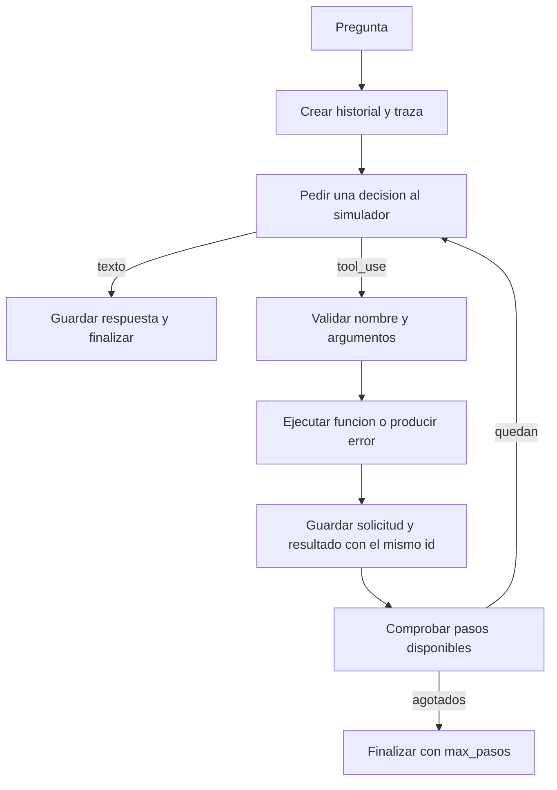

# 95 PRÁCTICA - Notebook del lunes resuelto y explicado

[[Obsidian/posgrado/master/IA GENERATIVA Y AGENTES/00 Inicio/00 INICIO - Ruta de aprendizaje|Inicio de la materia]] · [[Obsidian/posgrado/master/IA GENERATIVA Y AGENTES/06 Talleres y práctica/Practica lunes/s3-lun-estudiante.ipynb|Original]] · [[Obsidian/posgrado/master/IA GENERATIVA Y AGENTES/06 Talleres y práctica/Practica lunes/s3-lun-resuelto.ipynb|Notebook resuelto]] · [[Obsidian/posgrado/master/IA GENERATIVA Y AGENTES/06 Talleres y práctica/Practica lunes/s3-lun-resultados-verificados.json|Resultados verificados]]

Esta guía explica qué hace el código, qué información entra en cada bloque y qué debes observar al ejecutarlo. Abre el notebook resuelto y ejecuta sus celdas en orden. Las explicaciones se conservan también junto a las celdas. Los fragmentos de la nota descomponen operaciones para estudiarlas; algunos dependen de variables de los bloques del notebook.

El original adjuntado con `(1)` es idéntico al que ya estaba en `Materiales`. Aquí se guarda otra copia íntegra junto a la versión resuelta, para tener toda la práctica en **Talleres y práctica**. Los ejercicios se explican como material académico; las respuestas finales sobre el proyecto son ejemplos razonados.

## Antes de empezar: cómo usar esta práctica

Un notebook mezcla **celdas de texto**, que explican, con **celdas de código**, que Python ejecuta. Ábrelo en Jupyter o en un editor compatible, selecciona un kernel de Python **3.10 o superior** y ejecuta de arriba hacia abajo. Esta versión no necesita instalar paquetes: usa `json` y `re`, que vienen con Python. El original declara Python 3.11; la anotación `str | None` necesita Python 3.10 o superior.

Si ves `NameError`, comprueba si ejecutaste la celda donde se define esa variable o función. Después de cambiar una definición, vuelve a ejecutar esa celda y las que la usan; reiniciar el kernel y ejecutar todo permite comprobar que ninguna variable quedó de una prueba anterior.

El objetivo concreto es responder preguntas de ventas mediante este recorrido: **pregunta → solicitud de herramienta → función Python → resultado → respuesta final**. El simulador representa la parte que decide. El controlador representa el programa que realmente ejecuta. Las celdas originales que se conservan describen también una conexión real; en esta copia, todas las celdas ejecutables trabajan localmente.

## 1. Preparar datos: leer una venta como diccionario

Una fila de `VENTAS` representa una venta. `fecha`, `producto`, `region` y `monto` son claves; los textos y números a su derecha son valores. La lista contiene siete filas, cuatro de marzo y tres de abril.

```python
primera_venta = VENTAS[0]
fecha = primera_venta["fecha"]
monto = primera_venta["monto"]
```

`VENTAS[0]` toma la primera fila; `primera_venta["monto"]` lee 1200. Una lista usa posiciones; un diccionario usa claves.

La configuración original busca una carpeta `curso/actividades` hacia arriba desde el directorio de ejecución. En esta carpeta de notas esa estructura no existe, por lo que fallaría antes de empezar los ejercicios. La copia resuelta conserva el dataset y utiliza `json` y `re` de la biblioteca estándar. La selección de servicios reales se explica como lectura opcional más adelante.

## 2. Las herramientas: funciones que sí hacen el trabajo

Una herramienta se define con una función Python y una descripción de sus argumentos. El nombre `consultar_ventas` no hace nada por sí solo; `consultar_ventas("2026-03")` sí ejecuta la función.

`def` define una función: guarda instrucciones para usarlas después. La sangría señala qué líneas pertenecen a esa función y `return` entrega su resultado a quien la llamó. En `mes: str`, `str` indica que se espera texto; `region: str | None = None` indica texto o ausencia de región, con `None` como valor predeterminado. Estas anotaciones documentan tipos; Python no los comprueba automáticamente.

### `consultar_ventas`: filtrar filas

La comprensión de lista recorre cada `v` de `VENTAS` y la conserva si su fecha empieza con el mes pedido y si cumple el filtro opcional de región. Puedes leerla como:

```python
filas = []
for v in VENTAS:
    coincide_mes = v["fecha"].startswith(mes)
    coincide_region = region is None or v["region"] == region
    if coincide_mes and coincide_region:
        filas.append(v)
```

Si `region` vale `None`, no se restringe la región. Si vale `sierra`, solo se conservan sus ventas. `startswith` compara prefijos de texto; no interpreta un calendario. Por eso el controlador añadido verifica `YYYY-MM` antes de despachar.

`return json.dumps(filas, ensure_ascii=False)` devuelve una **cadena que contiene JSON**, no una lista Python. El historial del simulador recibe esa cadena; `json.loads` la convierte otra vez en datos.

### `estadisticas_ventas`: obtener montos y agregarlos

`montos` toma solo el campo `monto` de las filas del mes. `len(montos)` cuenta ventas, `sum(montos)` suma sus importes y la división calcula el promedio por venta. `round(..., 2)` redondea a dos decimales.

Para marzo: `[1200, 300, 1150, 45]`, total `2695`, cantidad `4`, promedio `673.75`. Para abril: `[1300, 320, 50]`, total `1670`, cantidad `3`, promedio `556.67`. Si la lista está vacía, la función devuelve JSON con un campo `error`.

### `listar_productos`: quitar duplicados y ordenar

`{v["producto"] for v in VENTAS}` construye un conjunto: varias ventas de laptop cuentan como un solo nombre. `sorted(...)` convierte esos nombres en la lista ordenada `laptop`, `monitor`, `teclado`.

### `ESQUEMAS` y `TOOLS` cumplen responsabilidades distintas

`ESQUEMAS` contiene nombre, descripción y forma esperada de los argumentos: información para elegir una herramienta. `TOOLS` relaciona nombres con funciones ejecutables: información para que nuestro programa la ejecute.

```python
funcion = TOOLS["estadisticas_ventas"]
resultado = funcion(mes="2026-03")
```

En el esquema, `required: ["mes"]` declara que el mes debe estar presente; `enum` enumera regiones admitidas. Declararlo no obliga a Python a validarlo automáticamente. En la solución, esa validación ocurre en `validar_entrada`.

### Código completo de las herramientas

```python
def consultar_ventas(mes: str, region: str | None = None) -> str:
    filas = [v for v in VENTAS if v["fecha"].startswith(mes)
             and (region is None or v["region"] == region)]
    return json.dumps(filas, ensure_ascii=False)

def estadisticas_ventas(mes: str) -> str:
    montos = [v["monto"] for v in VENTAS if v["fecha"].startswith(mes)]
    if not montos:
        return json.dumps({"error": f"sin datos para {mes}"})
    return json.dumps({"n": len(montos), "total": sum(montos),
                       "promedio": round(sum(montos) / len(montos), 2)})

def listar_productos() -> str:
    return json.dumps(sorted({v["producto"] for v in VENTAS}))

ESQUEMAS = [
    {
        "name": "consultar_ventas",
        "description": ("Devuelve las filas de ventas de un mes dado, opcionalmente filtradas "
                        "por región (sierra, costa u oriente). Úsala cuando el usuario pida "
                        "el detalle de ventas. No calcula agregados."),
        "input_schema": {"type": "object",
                         "properties": {
                             "mes": {"type": "string", "description": "Mes en formato YYYY-MM"},
                             "region": {"type": "string", "enum": ["sierra", "costa", "oriente"]}},
                         "required": ["mes"]},
    },
    {
        "name": "estadisticas_ventas",
        "description": ("Calcula número de ventas, total y promedio de un mes. Úsala cuando "
                        "pidan cifras agregadas ('cuánto vendimos', 'promedio')."),
        "input_schema": {"type": "object",
                         "properties": {"mes": {"type": "string", "description": "YYYY-MM"}},
                         "required": ["mes"]},
    },
    {
        "name": "listar_productos",
        "description": "Lista los productos distintos que aparecen en las ventas.",
        "input_schema": {"type": "object", "properties": {}},
    },
]

TOOLS = {"consultar_ventas": consultar_ventas,
         "estadisticas_ventas": estadisticas_ventas,
         "listar_productos": listar_productos}
```

## 3. Adaptar un esquema: cambiar la envoltura, conservar la información

`a_formato_openai` recorre los esquemas y coloca cada uno dentro de `{"type": "function", "function": ...}`. El campo `input_schema` pasa a llamarse `parameters` en esa envoltura de Chat Completions. Las funciones de ventas no cambian.

La comprensión de lista devuelve una lista nueva. `e` representa un esquema en cada vuelta y `e.get("input_schema", ...)` proporciona un esquema por defecto si falta esa clave.

Las impresiones terminan en `[:150]`: muestran solo los primeros 150 caracteres, por eso ves una descripción recortada. No se ha truncado el esquema almacenado en `ESQUEMAS_OPENAI`.

Esta adaptación prepara descripciones. No solicita al modelo ni ejecuta herramientas. La explicación del protocolo se contrastó con [OpenAI: function calling](https://developers.openai.com/api/docs/guides/function-calling).

## 4. El simulador: pedir una herramienta antes de responder

`LLMSimulado.responder(messages)` lee la pregunta inicial y revisa las herramientas cuyos resultados ya están en el historial. Tiene dos posibles salidas:

```python
{"tipo": "tool_use", "name": "estadisticas_ventas", "input": {"mes": "2026-03"}}
{"tipo": "texto", "texto": "En ese mes hubo 4 ventas..."}
```

La primera es una **solicitud**, todavía sin ejecutar la función. La segunda es un texto final. La clave `tipo` permite que el controlador sepa qué hacer. Estas estructuras son el contrato interno de la práctica; el adaptador real transforma la respuesta HTTP del proveedor a ese contrato antes de entregársela al controlador.

`class LLMSimulado` define un objeto con una operación llamada `responder`. `llm = LLMSimulado()` crea ese objeto. Al llamar `llm.responder(messages)`, Python pasa el propio objeto como `self` y el historial como `messages`; no tienes que escribir `self` en la llamada.

`messages[0]["content"].lower()` toma el contenido del primer mensaje y lo convierte a minúsculas. `ya_llamadas` recorre el historial y recoge los nombres de las herramientas con resultados. Por eso comienza vacío y luego contiene `estadisticas_ventas`.

Los `if` se evalúan en orden: primero cifras agregadas, luego productos, después detalle. Cada `return` termina esa decisión. Las descripciones de `ESQUEMAS` servirían a un modelo real; este simulador elige por condiciones escritas en Python. Por ejemplo, «total y detalle de marzo» entra en la primera condición y solo pide estadísticas.

Para «¿Cuánto vendimos en marzo?», la primera llamada devuelve `tool_use`. Una vez que el controlador agrega el resultado al historial, la siguiente llamada a `responder` convierte el JSON en datos y redacta con `n`, `total` y `promedio`.

### Corrección necesaria del original

El original busca resultados con rol `tool_result_meta`, mientras el ejercicio pide guardar `assistant_tool_use` y `tool_result`. Si sigues literalmente la consigna, el simulador no reconoce que la función ya se ejecutó y la pide otra vez.

En esta copia se cambia el filtro a `role == "tool_result"`. Además, si el resultado trae `error`, el simulador lo informa en lugar de intentar leer cifras inexistentes. Se conserva el comportamiento por reglas: no es un LLM que aprendió a actuar.

El simulador selecciona marzo cuando la pregunta contiene `marzo`; en caso contrario selecciona abril. Solo reconoce `sierra` como filtro de región en sus reglas. Estas limitaciones permanecen visibles para estudiar la diferencia entre un guion y una comprensión general del lenguaje.

## 5. El bucle: decidir, ejecutar, observar y volver a decidir

`ejecutar_agente` devuelve un diccionario con `estado`, `respuesta`, `pasos`, `traza` y `messages`. Así puedes distinguir una respuesta final de un corte por límite. La copia añade validación de argumentos y resultados de error para que los ejemplos no fallen de manera confusa.



### Preparar y contar

`messages` empieza con la pregunta del usuario. `traza=[]` empieza vacía. `range(1, max_pasos + 1)` produce pasos numerados del 1 al máximo incluido.

Aquí **un paso es una decisión del simulador**, no una llamada de herramienta. Una pregunta de ventas normalmente usa una herramienta pero necesita dos decisiones: pedirla y responder con su resultado.

### Tomar una decisión

`decision = llm.responder(messages)` pide qué hacer. Si `tipo` es `texto`, el controlador registra el texto y usa `return` para terminar la función completa. Si es `tool_use`, extrae el nombre y los argumentos.

`decision.get("input", {})` lee una clave con un valor alternativo: si no existe `input`, devuelve un diccionario vacío. La comprobación de protocolo exige un diccionario, un `tipo` reconocido y, en decisiones de texto, un campo `texto` que sea cadena. Una decisión mal formada termina con `error_protocolo`; no se presenta como respuesta final.

### Ejecutar con `**entrada`

```python
nombre = "estadisticas_ventas"
entrada = {"mes": "2026-03"}
resultado = TOOLS[nombre](**entrada)
```

Los corchetes buscan la función por su nombre. `**entrada` reparte las claves del diccionario como argumentos nombrados. Equivale a `estadisticas_ventas(mes="2026-03")`. **Esta línea de nuestro programa ejecuta la herramienta**; el simulador solo solicitó su uso.

La validación anterior rechaza herramientas desconocidas, argumentos inesperados y meses con formato incorrecto. Si falla, se construye un JSON de error. Si una función lanza una excepción, el `try/except` también la convierte en un resultado de error.

### Registrar para que la siguiente decisión tenga datos

Se agregan dos mensajes:

```python
{"role": "assistant_tool_use", "id": "c1", "name": "estadisticas_ventas", "input": {"mes": "2026-03"}}
{"role": "tool_result", "id": "c1", "name": "estadisticas_ventas", "content": "{...resultado...}"}
```

El identificador común enlaza el resultado con la solicitud. El simulador sin ID recibe uno generado como `c1`, `c2`, etc. Un resultado de error también debe tener su pareja.

`messages` contiene la conversación que recibe el simulador en la próxima vuelta; `traza` contiene eventos para inspeccionar lo ocurrido. Son dos listas con usos diferentes.

### Agotar el contador

Si hay una llamada de herramienta en el último paso permitido, se registra su resultado pero no queda otra decisión para redactar. La salida dice `max_pasos` y `respuesta=None`. Ejecutar una herramienta no implica haber completado la pregunta.

### Código completo del controlador

```python
def validar_entrada(nombre, entrada):
    if not isinstance(nombre, str) or nombre not in TOOLS:
        return "Herramienta no registrada"
    if not isinstance(entrada, dict):
        return "input debe ser un diccionario"
    permitidos = {
        "consultar_ventas": {"mes", "region"},
        "estadisticas_ventas": {"mes"},
        "listar_productos": set(),
    }
    if set(entrada) - permitidos[nombre]:
        return "Hay argumentos inesperados"
    if nombre != "listar_productos":
        mes = entrada.get("mes")
        if not isinstance(mes, str) or re.fullmatch(r"[0-9]{4}-(0[1-9]|1[0-2])", mes) is None:
            return "mes debe usar YYYY-MM con mes entre 01 y 12"
    region = entrada.get("region")
    if region is not None and region not in ("sierra", "costa", "oriente"):
        return "region debe ser sierra, costa u oriente"
    return None


def ejecutar_agente(pregunta, max_pasos=5):
    if type(max_pasos) is not int or max_pasos < 1:
        raise ValueError("max_pasos debe ser un entero positivo")
    messages = [{"role": "user", "content": pregunta}]
    traza = []
    for paso in range(1, max_pasos + 1):
        decision = llm.responder(messages)
        if (not isinstance(decision, dict)
                or decision.get("tipo") not in ("texto", "tool_use")
                or (decision.get("tipo") == "texto" and not isinstance(decision.get("texto"), str))):
            traza.append({"paso": paso, "tipo": "parada", "motivo": "error_protocolo"})
            return {"estado": "error_protocolo", "respuesta": None,
                    "pasos": paso, "traza": traza, "messages": messages}
        if decision["tipo"] == "texto":
            texto = decision["texto"]
            traza.append({"paso": paso, "tipo": "texto", "texto": texto})
            messages.append({"role": "assistant", "content": texto})
            return {"estado": "respuesta_final", "respuesta": texto,
                    "pasos": paso, "traza": traza, "messages": messages}

        nombre = decision.get("name", "")
        entrada = decision.get("input", {})
        llamada_id = decision.get("id", f"c{paso}")
        error = validar_entrada(nombre, entrada)
        if error:
            resultado = json.dumps({"error": error}, ensure_ascii=False)
        else:
            try:
                resultado = TOOLS[nombre](**entrada)
            except Exception as exc:
                resultado = json.dumps({"error": type(exc).__name__}, ensure_ascii=False)
        messages.append({"role": "assistant_tool_use", "id": llamada_id,
                         "name": nombre, "input": entrada})
        messages.append({"role": "tool_result", "id": llamada_id,
                         "name": nombre, "content": resultado})
        traza.append({"paso": paso, "tipo": "tool_use", "id": llamada_id,
                      "name": nombre, "input": entrada, "resultado": resultado})

    traza.append({"tipo": "parada", "motivo": "max_pasos"})
    return {"estado": "max_pasos", "respuesta": None,
            "pasos": max_pasos, "traza": traza, "messages": messages}
```

## 6. Leer la traza de marzo

La celda anterior deja `traza = corrida_marzo["traza"]`. Por eso `for e in traza` ahora puede imprimir eventos; en el notebook original esa variable queda sin definir hasta que completes y ejecutes el bucle.

| Paso | Decisión | Ejecución del controlador | Información nueva |
| --- | --- | --- | --- |
| 1 | Pide `estadisticas_ventas` con marzo. | Llama la función y registra solicitud y resultado. | 4 ventas, 2695 total, 673.75 promedio. |
| 2 | Devuelve texto final. | Lo guarda y finaliza. | La respuesta redactada. |

El historial contiene pregunta, solicitud, resultado y respuesta final. La traza resume las dos decisiones. El simulador nunca sumó las ventas: la función hizo esa suma.

Puedes reconstruir la ejecución de marzo así:

1. `messages` contiene solo la pregunta; `ya_llamadas` está vacío. El simulador devuelve una solicitud para `estadisticas_ventas`.
2. El controlador ejecuta la función. La función toma `[1200, 300, 1150, 45]`, suma `2695` y calcula `2695 / 4 = 673.75`.
3. Se agregan la solicitud `c1` y su resultado JSON. El historial ahora tiene tres mensajes. Se registra un evento en `traza`.
4. La segunda decisión recibe ese historial. `ya_llamadas` ya contiene la herramienta y `json.loads(messages[-1]["content"])` lee el resultado. El simulador construye el texto con esos datos.
5. El controlador agrega el texto al historial y devuelve la corrida. Quedan cuatro mensajes, dos eventos de traza y una sola ejecución de herramienta.

`messages[-1]` significa «último mensaje», porque Python permite contar desde el final con índices negativos. `for e in traza` toma un evento por vuelta y `print(e)` lo muestra; imprime diccionarios Python, no un razonamiento oculto del modelo.

## 7. Ejercicio 4.1: qué debes observar en cada pregunta

La celda construye una lista de preguntas y usa `{p: ejecutar_agente(p) for p in preguntas}` para guardar una corrida por pregunta. Cada corrida comienza con un historial nuevo; las herramientas son las mismas.

| Pregunta | Herramienta y entrada | Resultado | Decisiones / herramientas |
| --- | --- | --- | --- |
| ¿Cuánto vendimos en marzo? | `estadisticas_ventas`, mes marzo. | 2695 total, 4 ventas, 673.75 promedio. | 2 / 1 |
| ¿Qué productos vendemos? | `listar_productos`, `{}`. | laptop, monitor, teclado. | 2 / 1 |
| Dame el detalle de ventas de marzo en sierra | `consultar_ventas`, marzo y sierra. | laptop 1200 y teclado 45. | 2 / 1 |
| ¿Cuál es el sentido de la vida? | Ninguna. | Pide reformular dentro de su alcance. | 1 / 0 |

Los 1245 del detalle son la suma de esas dos filas, pero `consultar_ventas` devuelve las filas, no ese agregado. La pregunta de productos describe nombres presentes en ventas; no consulta inventario.

Si cambias marzo por abril, la función de estadísticas devuelve 1670 y promedio 556.67. Si pides comparar ambos meses, el simulador no planifica dos consultas: sus reglas son más simples que esa tarea.

## 8. Reflexión del ejercicio: cuándo detenerse y cómo tratar escrituras

La pregunta fuera del dominio recibe un texto final en la primera decisión. Eso es apropiado para este asistente acotado: informa su alcance en vez de inventar una herramienta.

Antes de agregar una función que modifique datos habría que validar su operación y sus permisos; incorporar una revisión humana donde el efecto lo requiera; registrar el resultado; y evitar duplicar escrituras en reintentos mediante idempotencia. Estas son respuestas al ejercicio: la práctica no implementa una función de escritura.

## 9. Taxonomía: responder sin buscar una línea mágica

La tabla de cuatro capas es una clasificación divulgativa del curso. El bucle acotado de ventas encaja en su capa 3; la capa 4 pretende describir una coordinación de procesos más amplia. No existe una modificación puntual que cambie universalmente de categoría al programa.

Un chatbot que solo devuelve texto encaja en la capa 2 de esa tabla. Bajo la definición operativa usada por esta actividad, no realiza el bucle de selección y ejecución de herramientas. Las categorías ayudan a conversar; para evaluar el código debes revisar decisiones, resultados, límites y responsabilidad de ejecución.

## 10. Variante real: qué hace su adaptador

La celda 1 original localiza la raíz del repositorio y puede leer su `.env`. La celda 7 define `LLMReal` y llama `hacer_llm()`: intenta un servicio configurado y, si no funciona, intenta el servidor universitario antes de utilizar el simulador. Esta copia local selecciona explícitamente `LLMSimulado`.

`LLMReal.responder` convierte los roles internos a mensajes de Chat Completions: la solicitud pasa a `tool_calls` y el resultado a un mensaje `tool` emparejado con `tool_call_id`. Los argumentos del cable se representan como una cadena JSON que debe analizarse. [Guía oficial de function calling](https://developers.openai.com/api/docs/guides/function-calling).

En `_pedir`, `cuerpo` contiene el modelo, historial y esquemas. `json.dumps(...).encode()` prepara bytes para la solicitud HTTP, `Request` construye la petición y `urlopen` realiza la conexión. Un timeout es una espera máxima de red, no un presupuesto de toda la corrida.

El adaptador original toma solo la primera llamada de `tool_calls`; no procesa un conjunto de solicitudes. Además, si los argumentos no son JSON válido, devuelve un texto de error con `tipo="texto"`. En ese caso terminar por texto no significa haber resuelto la pregunta. La selección de parámetros según presencia de clave es una decisión del código docente y debe comprobarse contra el servicio usado.

Los nombres de modelos y direcciones en el original se conservan como datos del curso; no se verificó su disponibilidad. 

El código opcional completo queda en la última sección de lectura del notebook resuelto.

## Verificación y procedencia

Se ejecutaron las **10 celdas de código** de la copia resuelta en un entorno limpio de variables. Las salidas guardadas provienen de esa ejecución; todas las comprobaciones locales pasaron. El original se copió sin cambios, SHA-256: `17baf4a2bfe1cba85f2b3232660324ee9b88f2f1fc9fb5d13b76cb072a9a858e`.

Se verificaron total y promedio de ambos meses, productos, filas filtradas de marzo en sierra, el conteo de decisiones, el emparejamiento solicitud–resultado, el corte con un solo paso y con un backend que repite solicitudes, y la respuesta de error para herramientas o argumentos inválidos. También se comprobaron un mes válido sin ventas, decisiones mal formadas y límites inválidos. La variante real no se ejecutó; el simulador solo sigue reglas de palabras clave. No se midió calidad de un LLM ni compatibilidad de un servicio remoto.

Amplía la teoría en [[Obsidian/posgrado/master/IA GENERATIVA Y AGENTES/11 Agentes y uso de herramientas/68 S11 - Notebook del lunes explicado y revisado|la revisión del notebook del lunes]].
