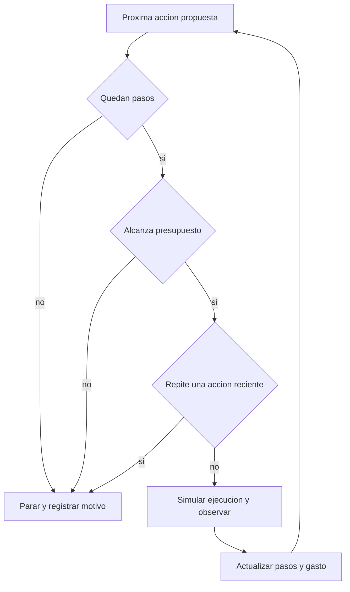
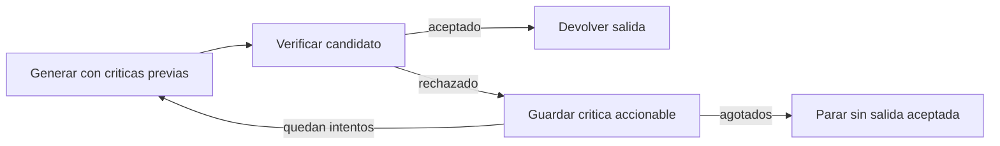

# 96 PRÁCTICA - Notebook del martes resuelto y explicado

[[Obsidian/posgrado/master/IA GENERATIVA Y AGENTES/00 Inicio/00 INICIO - Ruta de aprendizaje|Inicio de la materia]] · [[Obsidian/posgrado/master/IA GENERATIVA Y AGENTES/06 Talleres y práctica/Practica martes/s3-mar-estudiante.ipynb|Original]] · [[Obsidian/posgrado/master/IA GENERATIVA Y AGENTES/06 Talleres y práctica/Practica martes/s3-mar-resuelto.ipynb|Notebook resuelto]] · [[Obsidian/posgrado/master/IA GENERATIVA Y AGENTES/06 Talleres y práctica/Practica martes/s3-mar-resultados-verificados.json|Resultados verificados]]

Esta guía explica qué hace el código, qué información entra en cada bloque y qué debes observar al ejecutarlo. Abre el notebook resuelto y ejecuta sus celdas en orden. Las explicaciones se conservan también junto a las celdas. Los fragmentos de la nota descomponen operaciones para estudiarlas; algunos dependen de variables de los bloques del notebook.

El original adjuntado con `(1)` es idéntico al que ya estaba en `Materiales`. Aquí se guarda otra copia íntegra junto a la versión resuelta, para tener toda la práctica en **Talleres y práctica**. Los ejercicios se explican como material académico; las respuestas finales sobre el proyecto son ejemplos razonados.

## 1. Qué programa estás construyendo

El lunes completaste el bucle que ejecuta herramientas. El martes examinas sus fallas y construyes tres controles: un detector de repetición, un presupuesto externo y un procedimiento que verifica y corrige salidas.

`json` convierte texto JSON en datos. `re` reconoce palabras para comparar solicitudes. Las trazas son listas ya escritas: imprimirlas no realiza búsquedas ni llama a un modelo. Los eventos `thought` son textos públicos del ejemplo, no acceso al razonamiento privado de un LLM.

Define funciones primero, ejecútalas después y compara la salida con lo previsto. Todas las celdas de esta copia usan biblioteca estándar y datos ficticios.

### Cómo recorrer la práctica sin perderte

Primero lee la explicación de una celda; después mira el código y finalmente su salida guardada. Si ejecutas el notebook, empieza por `import json` e `import re` y continúa de arriba abajo. Ejecutar una función antes de la celda que la define provoca `NameError`. Para repetir la verificación completa, reinicia el kernel y ejecuta todas las celdas: así no dependes de variables de una corrida anterior.

Una línea `def detectar_loop(...):` **define** qué hará una función; todavía no procesa ninguna traza. La línea `detectar_loop(TRAZA_LOOP)` **la llama** y entrega una traza concreta. `return` entrega un resultado y termina esa llamada; `print` lo muestra en pantalla. No son intercambiables.

| Función | Qué recibe | Qué devuelve | Para qué sirve |
| --- | --- | --- | --- |
| `imprimir_traza` | Lista de eventos. | `None`; escribe texto en la salida. | Leer lo ocurrido. |
| `normalizar_input` | Texto de una consulta. | Tupla de palabras ordenadas. | Comparar entradas. |
| `detectar_loop` | Traza y tamaño de ventana. | `True` o `False`. | Señalar repetición reciente. |
| `controlar_agente` | Acciones y límites. | Diccionario con estado, pasos, gasto y traza. | Bloquear acciones antes de exceder límites. |
| `verificador` | Texto candidato. | Pareja `(ok, critica)`. | Comprobar el contrato JSON. |
| `reflexion` | Número de intentos y función generadora opcional. | Diccionario con estado, respuesta y traza. | Reintentar con feedback verificable. |

## 2. Una traza es una secuencia de eventos

Cada evento es un diccionario cuyo campo `tipo` dice cómo interpretarlo:

En Python, `[...]` crea una lista y `{...}` con pares `clave: valor` crea un diccionario. `TRAZA_LOOP[1]` accede al segundo evento, porque el primer índice es 0. `TRAZA_LOOP[1]["input"]` accede después al texto de entrada de ese diccionario.

El `for e in traza` visita un evento por vuelta. La condición `e["tipo"] == "action"` elige cómo imprimirlo. Dos signos `==` comparan valores; un solo `=` asigna un valor a una variable. Cada evento del ejemplo posee los campos que usa su rama: una acción tiene `tool` e `input`; una observación tiene `texto`.

| Tipo | Qué representa | Campos importantes |
| --- | --- | --- |
| `thought` | Una explicación escrita para el ejemplo. | `texto`. |
| `action` | Una petición de herramienta. | `tool` e `input`. |
| `observation` | El resultado recibido de una herramienta. | `texto`. |
| `answer` | Una respuesta final. | `texto`. |

`imprimir_traza` recorre la lista. Para una acción imprime el nombre de herramienta y su entrada; para los demás eventos imprime el texto. `!r` muestra la representación de una cadena con comillas; `capitalize()` pone su primera letra en mayúscula; `:12s` reserva un ancho mínimo para alinear la salida.

La traza sana del material realiza dos búsquedas diferentes antes de responder. La resta de años es solo una aproximación; para una edad exacta haría falta comparar fechas completas. El ejercicio estudia cómo la respuesta se relaciona con lo observado, no ejecuta una investigación biográfica.

## 3. Diagnóstico manual: repetición y fabricación no son el mismo fallo

En `TRAZA_LOOP`, la primera acción pide `precio acción NimbusSoft`. Después de «sin resultados», la segunda pide las mismas palabras en otro orden. Se repite una estrategia sin información nueva; vuelve a hacerlo dos veces más.

En `TRAZA_FABRICA`, la observación solo dice que la empresa es de software y fue fundada en 2019. El evento siguiente introduce «45 millones» y la respuesta final repite la cifra. **La cifra no procede de la observación**.

| Traza | Dónde aparece el problema | Protección pertinente |
| --- | --- | --- |
| Loop | La segunda acción repite la búsqueda normalizada; índices 1 y 4, contando desde 0. | Detector de repetición y límite de pasos/costo. |
| Fabricación | El `thought` de índice 3 introduce una cifra sin respaldo. | Comprobar evidencia y abstenerse cuando falta. |

Un detector de acciones repetidas no comprueba la verdad de los resultados. Por eso puede detectar el loop y no la fabricación.

## 4. Detector: comparar la herramienta y las palabras de su entrada

`normalizar_input` transforma una cadena en una representación comparable. Para `precio acción NimbusSoft`:

```text
lower() -> precio acción nimbussoft
findall -> ['precio', 'acción', 'nimbussoft']
sorted -> ['acción', 'nimbussoft', 'precio']
tuple  -> ('acción', 'nimbussoft', 'precio')
```

`re.findall(r"\w+", ...)` encuentra grupos de caracteres de palabra. La tupla permite usar el resultado como parte de una clave en un conjunto. Reordenar las palabras produce la misma clave normalizada.

`traza[-ventana:]` selecciona los últimos eventos; con `ventana=6`, son **seis eventos**, no seis acciones. El detector ignora los que no son `action` mediante `continue`.

Para cada acción construye `(tool, input_normalizado)`. Si esa pareja ya está en `vistos`, devuelve `True`. Si no, la agrega. Solo devuelve `False` después de revisar toda la ventana.

| Entrada | Resultado esperado |
| --- | --- |
| `TRAZA_SANA` | `False`: las dos búsquedas tienen entradas distintas. |
| `TRAZA_LOOP` | `True`: la ventana contiene acciones equivalentes. |
| `TRAZA_FABRICA` | `False`: hay una sola búsqueda. |

La herramienta también forma parte de la clave: dos herramientas diferentes con el mismo texto no se consideran la misma acción.

### Seguir el detector con dos acciones

`vistos = set()` crea un conjunto vacío: conserva claves únicas y permite preguntar `clave in vistos`. No se escribe `{}` porque eso crearía un diccionario vacío.

1. Al encontrar la primera búsqueda, su clave es `("buscar", ("acción", "nimbussoft", "precio"))`. El conjunto está vacío: se añade con `vistos.add(clave)`.
2. Una observación no es una acción: `continue` salta a la siguiente vuelta sin crear una clave.
3. La segunda búsqueda cambia el orden de palabras, pero produce exactamente la misma clave. `clave in vistos` es verdadero y la función termina con `True`.

La ventana delimita **qué parte de la lista se revisa en esta llamada**. En `TRAZA_LOOP`, los últimos seis eventos contienen las acciones de índices 7 y 10. Con `ventana=3`, solo queda una acción y el resultado es `False`, aunque hubo repetición antes. Ampliar a seis vuelve a devolver `True`.

`detector_resultados` usa una comprensión de diccionario: por cada par `nombre, traza` de `.items()` ejecuta el detector y guarda `nombre: resultado`. Equivale a crear un diccionario vacío y llenarlo en un `for`.

El patrón `r"\w+"` es una cadena para una expresión regular: `r` conserva la barra inversa y `+` pide uno o más caracteres de palabra. Reconoce letras, dígitos y guiones bajos; omite la puntuación. Conserva tildes: `acción` y `accion` siguen siendo palabras distintas. No calcula significado.

### Límites de esta regla

«Cotización de NimbusSoft» no tiene las mismas palabras que «precio acción NimbusSoft», aunque pueda intentar lo mismo. En cambio, «Ana paga a Luis» y «Luis paga a Ana» tienen las mismas palabras, pero representan relaciones diferentes. Ordenar pierde esa diferencia.

Repetición tampoco demuestra siempre un error: otra consulta puede ser legítima si cambió el dato externo. Este detector implementa la regla del ejercicio, no una prueba universal de ausencia de progreso.

### Código del detector

```python
def normalizar_input(texto):
    palabras = re.findall(r"\w+", texto.lower())
    return tuple(sorted(palabras))


def detectar_loop(traza, ventana=6):
    if type(ventana) is not int or ventana < 1:
        raise ValueError("ventana debe ser un entero positivo")
    vistos = set()
    for evento in traza[-ventana:]:
        if evento["tipo"] != "action":
            continue
        clave = (evento["tool"], normalizar_input(evento["input"]))
        if clave in vistos:
            return True
        vistos.add(clave)
    return False


detector_resultados = {nombre: detectar_loop(traza) for nombre, traza in {
    "sana": TRAZA_SANA, "loop": TRAZA_LOOP, "fabrica": TRAZA_FABRICA
}.items()}
print(detector_resultados)
```

## 5. Presupuesto: decidir si una acción puede ejecutarse

La solución envuelve una lista de acciones simuladas con tres condiciones externas: máximo de pasos, costo disponible y repetición. La ejecución debe detenerse con un motivo explícito en su traza.



`pasos`, `gastado` y `traza` empiezan en cero, cero y lista vacía. La función interna `detener` usa esos valores actuales para registrar una parada y devolver el resumen. Ese acceso a variables de la función externa se llama cierre; permite no repetir el código de salida en cada condición.

### Las comprobaciones ocurren antes de ejecutar

`pasos >= max_pasos` impide dar un paso extra. `gastado + costo_paso > presupuesto` comprueba si alcanza para el siguiente paso; comprobar solo lo ya gastado permitiría exceder el presupuesto.

Se construye una propuesta con `ejecutada=False` y se compara junto con la traza existente. Si es repetida, se registra como bloqueada; **no se ejecuta ni se cobra**. Si pasa, se agrega como `ejecutada=True`, se suma el costo y se crea una observación simulada.

`{**accion, "ejecutada": True}` copia el diccionario de la acción y agrega o reemplaza una clave. No llama una función: aquí `**` está dentro de un diccionario.

### Tres salidas que debes poder calcular a mano

| Caso | Cálculo | Resultado |
| --- | --- | --- |
| Presupuesto 7, costo 2 por paso | Gastos 2, 4, 6; el cuarto requeriría 8. | Parada por presupuesto tras 3 pasos, gasto 6. |
| Presupuesto 100, máximo 5 | El costo no corta antes; se bloquea el sexto paso. | Parada por `max_pasos` tras 5 pasos, gasto 10. |
| Búsquedas repetidas normalizadas | Se realiza la primera; se bloquea la segunda propuesta. | Parada por repetición tras 1 paso, gasto 2. |

Los 12 pasos deseados se simulan con 12 consultas distintas. Las búsquedas repetidas son otro escenario: así puedes verificar cada condición por separado.

### Leer la construcción de las acciones y la parada

`range(1, 13)` produce los números del 1 al 12; el extremo 13 no se incluye. La comprensión de lista crea un diccionario por número y `f"consulta {i}"` inserta ese número en el texto. Por eso las 12 entradas son diferentes y el detector no corta este escenario.

`[e for e in TRAZA_LOOP if e["tipo"] == "action"]` conserva solo las acciones de la traza original. En este caso no conserva pensamientos ni observaciones; el controlador crea sus propias observaciones al simular cada ejecución.

| Propuesta en el caso de costo | Valores antes de proponerla | Comprobación | Qué cambia |
| --- | --- | --- | --- |
| Primera | `pasos=0`, `gastado=0`. | `0 + 2 <= 7`. | Ejecuta: pasos 1, gasto 2. |
| Segunda | `pasos=1`, `gastado=2`. | `2 + 2 <= 7`. | Ejecuta: pasos 2, gasto 4. |
| Tercera | `pasos=2`, `gastado=4`. | `4 + 2 <= 7`. | Ejecuta: pasos 3, gasto 6. |
| Cuarta | `pasos=3`, `gastado=6`. | `6 + 2 > 7`. | Registra parada; conserva pasos 3 y gasto 6. |

`traza + [propuesta]` crea una lista temporal para evaluar la acción antes de aceptarla. No modifica `traza`. `traza.append(...)` sí modifica la lista. `pasos += 1` equivale a `pasos = pasos + 1`.

Las comprobaciones tienen prioridad: primero pasos, luego costo y luego repetición. Si dos límites fallan simultáneamente, se registra el primero que encuentre el código. Si todas las acciones terminan justo en el límite, el estado es `completado`: ya no hay otra propuesta que bloquear.

Las salidas principales que debes ver son:

```text
costo -> presupuesto pasos: 3 gasto: 6
pasos -> max_pasos pasos: 5 gasto: 10
repeticion -> repeticion pasos: 1 gasto: 2
```

Los mensajes originales «seguro que nunca falla» y «un agente sin tope no falla» son énfasis didáctico. Estos límites contienen las acciones que pasan por este controlador; no resuelven una llamada de herramienta que nunca retorna. Para esa situación haría falta además un timeout.

Aquí un paso equivale a una acción simulada ejecutada. En la práctica del lunes un paso cuenta una decisión del simulador. Los nombres de los contadores son parecidos, pero debes definir qué cuentan antes de compararlos.

El costo usa **unidades ficticias**, no precios ni tokens de un servicio real. Para acotar consumo real habría que contar todas las llamadas del sistema, estimar o reservar su costo y registrar el consumo informado por el proveedor.

### Código del presupuesto

```python
def controlar_agente(acciones, max_pasos=5, presupuesto=7, costo_paso=2):
    if type(max_pasos) is not int or max_pasos < 1:
        raise ValueError("max_pasos debe ser positivo")
    if type(presupuesto) is not int or presupuesto < 0:
        raise ValueError("presupuesto debe ser un entero no negativo")
    if type(costo_paso) is not int or costo_paso < 1:
        raise ValueError("costo_paso debe ser positivo")
    pasos, gastado, traza = 0, 0, []

    def detener(motivo):
        traza.append({"tipo": "parada", "motivo": motivo})
        return {"estado": motivo, "pasos": pasos, "gastado": gastado, "traza": traza}

    for accion in acciones:
        if pasos >= max_pasos:
            return detener("max_pasos")
        if gastado + costo_paso > presupuesto:
            return detener("presupuesto")
        propuesta = {**accion, "ejecutada": False}
        if detectar_loop(traza + [propuesta]):
            traza.append(propuesta)
            return detener("repeticion")
        # Este es el punto donde se ejecutaría una herramienta real.
        # Aquí solo simulamos una observación y un gasto fijo.
        pasos += 1
        gastado += costo_paso
        traza.append({**accion, "ejecutada": True, "paso": pasos})
        traza.append({"tipo": "observation", "texto": "Resultado simulado",
                      "gasto_acumulado": gastado})
    return {"estado": "completado", "pasos": pasos, "gastado": gastado, "traza": traza}


acciones_doce = [{"tipo": "action", "tool": "buscar", "input": f"consulta {i}"}
                for i in range(1, 13)]
acciones_repetidas = [e for e in TRAZA_LOOP if e["tipo"] == "action"]
por_costo = controlar_agente(acciones_doce)
por_pasos = controlar_agente(acciones_doce, presupuesto=100)
por_repeticion = controlar_agente(acciones_repetidas, presupuesto=100)
for nombre, caso in [("costo", por_costo), ("pasos", por_pasos), ("repeticion", por_repeticion)]:
    print(nombre, "->", caso["estado"], "pasos:", caso["pasos"], "gasto:", caso["gastado"])
    print("último evento:", caso["traza"][-1])
```

## 6. Verificador: separar JSON válido de un objeto que cumple el contrato

La salida exigida es un objeto con exactamente `categoria` y `urgencia`, categoría `tecnico` o `ventas`, y urgencia entera. El material no define un rango para urgencia; esta solución no añade uno.

El verificador devuelve una pareja `(ok, critica)`: un booleano y un mensaje. `ok, critica = verificador(respuesta)` separa esa pareja en dos variables.

| Comprobación | Qué evita |
| --- | --- |
| `json.loads(respuesta)` | Texto extra o sintaxis JSON incorrecta. |
| `isinstance(datos, dict)` | Aceptar arrays, `null` u otros tipos de raíz. |
| `set(datos) == {"categoria", "urgencia"}` | Campos faltantes o adicionales. |
| Categoría de tipo texto y dentro del conjunto | Categorías no admitidas o valores del tipo incorrecto. |
| `type(datos["urgencia"]) is int` | Decimales y booleanos. |

El original no comprueba si la raíz es un objeto y puede lanzar `AttributeError` para `[]` o `null`. También usa `isinstance(valor, int)`, que acepta `True` porque en Python `bool` es subclase de `int`. La copia corrige ambos casos y comprueba el tipo de categoría antes de buscarlo en un conjunto.

`"técnico"` es distinto de `"tecnico"` en una enumeración. Rechazarlo aquí significa incumplir el contrato, no escribir mal español.

Este verificador comprueba formato y dominio de campos. No recibe un ticket ni una respuesta de referencia, así que no prueba que la categoría o urgencia sean las correctas para una situación real.

### Qué sucede con una entrada concreta

Para `'{"categoria": "tecnico", "urgencia": 4}'`, `json.loads` crea el diccionario Python `{"categoria": "tecnico", "urgencia": 4}`. `set(datos)` toma sus **claves**, no sus valores. El orden de las claves no importa: se acepta también un objeto que escriba `urgencia` antes de `categoria`.

Un candidato con `urgencia: 4.0` es JSON válido, pero se convierte en un `float`, así que incumple el requisito de entero. Un candidato con `urgencia: true` se convierte en `True`, de tipo `bool`, y también se rechaza. El `try/except` permite devolver una crítica cuando el texto no se puede interpretar como JSON, en vez de detener toda la práctica con una excepción.

La condición de categoría usa `or`: si el valor no es texto, ya se rechaza y Python no evalúa la segunda parte. Así una lista como categoría no llega a la operación de pertenencia en un conjunto, que necesita valores utilizables como claves. Cada `return False, ...` describe el primer fallo encontrado; no enumera todos los errores del candidato a la vez.

### Código del verificador

```python
def verificador(respuesta):
    try:
        datos = json.loads(respuesta)
    except (json.JSONDecodeError, TypeError):
        return False, "Entrega solo JSON válido, sin texto adicional"
    if not isinstance(datos, dict):
        return False, "La raíz debe ser un objeto JSON"
    if set(datos) != {"categoria", "urgencia"}:
        return False, "Usa exactamente las claves categoria y urgencia"
    if not isinstance(datos["categoria"], str) or datos["categoria"] not in {"tecnico", "ventas"}:
        return False, "categoria debe ser tecnico o ventas, sin tilde"
    if type(datos["urgencia"]) is not int:
        return False, "urgencia debe ser un entero, no booleano ni decimal"
    return True, "OK"


INTENTOS_SIMULADOS = [
    'La categoría es técnica con urgencia 4: {"categoria": "tecnico", "urgencia": 4}',  # texto extra
    '{"categoria": "técnico", "urgencia": 4}',                                          # tilde: fuera de dominio
    '{"categoria": "tecnico", "urgencia": 4}',                                          # ✓
]
```

## 7. Mini-Reflexion: la crítica debe entrar en la siguiente generación

`INTENTOS_SIMULADOS` contiene tres salidas candidatas: una con texto extra, otra con la categoría fuera del dominio y otra válida. Recorrer esa lista automáticamente no demostraría que el generador leyó el feedback.

En la solución, `generar_con_criticas` recibe las críticas anteriores y usa la última para elegir una salida. No recibe el número de intento. Así queda visible qué información provocó el cambio.



### Seguir las variables del bucle

`criticas=[]` conserva el feedback acumulado. `traza=[]` conserva qué salió en cada intento y qué críticas recibió el generador. `list(criticas)` pasa una copia de la lista para que el registro no cambie cuando se añadan críticas después.

En cada vuelta, se genera un candidato, se llama al verificador y se registra el resultado. Si `ok` es verdadero, `return` termina inmediatamente: no se sigue corrigiendo una respuesta ya aceptada. Si es falso, `criticas.append(critica)` añade el mensaje que verá la próxima generación.

| Intento | Críticas recibidas | Salida y resultado |
| --- | --- | --- |
| 1 | Ninguna. | Texto antes del JSON; se pide entregar solo JSON. |
| 2 | Crítica sobre JSON. | `"técnico"`; se pide usar categoría admitida sin tilde. |
| 3 | Las dos críticas. | `{"categoria": "tecnico", "urgencia": 4}`; aceptado. |

Con `max_intentos=2`, la salida es `intentos_agotados`, con `respuesta=None`: dos intentos no alcanzan en este guion. Un generador que ignora siempre las críticas también agota el límite. Si el primer candidato ya es válido, termina en un intento.

El generador es una regla local escrita para enseñar el mecanismo. No se midió si un modelo real mejora, ni se entrenaron sus pesos. La «memoria» aquí es la lista de críticas que se conserva dentro de la corrida.

### Qué se conserva entre intentos

En el primer intento, `criticas=[]`; el generador devuelve texto extra y el verificador lo rechaza. Después de `criticas.append(critica)`, la lista contiene una instrucción de formato. En el segundo intento se **entrega esa lista al generador**; su condición `"solo JSON" in criticas[-1]` reconoce el feedback y elige otra salida. `[-1]` significa último elemento. La segunda crítica permite elegir la tercera salida.

`generador` es una función que se puede pasar como argumento. La comprobación `reflexion(generador=lambda criticas: INTENTOS_SIMULADOS[0])` reemplaza el generador por uno que devuelve siempre la primera salida. `lambda` define aquí una función breve: recibe `criticas`, pero las ignora. El resultado es `intentos_agotados`, aunque el verificador siga dando consejos. Ese contraste comprueba que el éxito de esta simulación depende de usar el feedback.

`list(criticas)` crea una copia en dos lugares: al llamar al generador y al guardar cada evento. Si se guardara la misma lista compartida, las críticas añadidas después aparecerían también en registros anteriores y parecería que el primer intento recibió información del futuro. La primera fila de la traza debe conservar `criticas_recibidas: []`.

`None` representa ausencia de respuesta aceptada cuando se agotan los intentos. La traza conserva candidatos rechazados para inspeccionarlos, pero el campo `respuesta` no los presenta como una solución válida.

### Código de Mini-Reflexion

```python
def generar_con_criticas(criticas):
    # La crítica recibida participa en la elección: no usamos el número de intento.
    if not criticas:
        return INTENTOS_SIMULADOS[0]
    if "solo JSON" in criticas[-1]:
        return INTENTOS_SIMULADOS[1]
    if "sin tilde" in criticas[-1]:
        return INTENTOS_SIMULADOS[2]
    return INTENTOS_SIMULADOS[0]


def reflexion(max_intentos=3, generador=None):
    if type(max_intentos) is not int or max_intentos < 1:
        raise ValueError("max_intentos debe ser positivo")
    if generador is None:
        generador = generar_con_criticas
    criticas, traza = [], []
    for intento in range(1, max_intentos + 1):
        respuesta = generador(list(criticas))
        ok, critica = verificador(respuesta)
        traza.append({"intento": intento, "respuesta": respuesta,
                      "criticas_recibidas": list(criticas), "ok": ok, "critica": critica})
        if ok:
            return {"estado": "verificado", "respuesta": respuesta, "traza": traza}
        criticas.append(critica)
    return {"estado": "intentos_agotados", "respuesta": None, "traza": traza}


reflexion_resultado = reflexion()
print(json.dumps(reflexion_resultado, ensure_ascii=False, indent=2))
```

## 8. Reflexión para un proyecto: una respuesta de ejemplo

Para un agente que consulta información, ReAct simple puede servir como baseline porque la siguiente consulta depende de lo observado. Primero conviene medir qué resuelve ese bucle con límites y trazas, antes de añadir coordinación compleja.

Para reintentos, una señal verificable podría ser el parseo JSON, el conjunto de campos y sus tipos. Si la tarea exige clasificar tickets correctamente, además necesitas casos etiquetados o reglas de dominio. Un objeto bien formado puede contener una clasificación equivocada.

Esta respuesta es un ejemplo de razonamiento sobre arquitectura; no presupone el contenido completo de tu Lab 03.

## 9. Clasificar los diez términos sin mezclar niveles

La consigna exige una cubeta principal por elemento. Esta es una solución posible, indicando cuándo depende de cómo se implemente:

| Término | Cubeta principal para esta actividad | Motivo |
| --- | --- | --- |
| ReAct | Control. | Organiza decisión, acción y observación. |
| Parallel Execution | Control. | Organiza tareas independientes simultáneamente. |
| Agent Handoff | Control. | Transfiere responsabilidad y contexto. |
| LLM Workflow | Control. | Nombre amplio para una secuencia organizada. |
| Task Decomposition | Control, si coordina subproblemas. | Divide y organiza el trabajo; puede ser solo prompting en otra implementación. |
| Chain of Thought | Prompting. | Cambia cómo se pide elaborar una respuesta. |
| Self-Critique | Prompting, como instrucción de revisión. | Pide evaluar un candidato; puede integrarse en un controlador. |
| Self-Reflection | Prompting, como instrucción de reflexión. | Pide extraer una lección; puede incorporar memoria y control. |
| Function Calling | Mecanismo. | Estructura una petición de función. |
| Episodic Memory | Memoria. | Conserva experiencias de corridas. |

La pareja que probablemente busca la consigna es Self-Critique y Self-Reflection. Algunos autores las usan como sinónimos, pero no son universalmente idénticas: revisar una salida y guardar una lección para otra ejecución pueden ser operaciones distintas. La lista fuente no está adjunta; no se puede comprobar que sus implementaciones sean exactamente iguales.

Que el autor venda memoria puede explicar su énfasis. Para evaluar la lista hay que contrastar definiciones, ejemplos de código, señales de aceptación y mediciones, en vez de aceptar o rechazar todo por su afiliación.

## Verificación y procedencia

Se ejecutaron las **10 celdas de código** de la copia resuelta en un entorno limpio de variables. Las salidas guardadas provienen de esa ejecución; todas las comprobaciones locales pasaron. El original se copió sin cambios, SHA-256: `d3f7565c16ff4ced9aaa4fdc9ed27f100f55132fc23f43f7d6eafe165f4eb1bf`.

Se verificaron las tres trazas, ventanas de tres y seis eventos, distinción entre herramientas, traza vacía, los cortes por pasos/costo/repetición, cero presupuesto, finalización exacta en el límite, JSON y tipos inválidos, el feedback exacto recibido en cada intento, aceptación temprana e intentos agotados. El detector es una heurística de palabras, el costo es ficticio y el verificador comprueba un contrato de formato. No se ejecutaron búsquedas reales ni se midió aprendizaje de un modelo.

Amplía la teoría en [[Obsidian/posgrado/master/IA GENERATIVA Y AGENTES/12 Patrones de agentes y diseño del toolset/74 S12 - Verificadores fiables y errores del notebook|verificadores y errores del original]] y [[Obsidian/posgrado/master/IA GENERATIVA Y AGENTES/12 Patrones de agentes y diseño del toolset/75 S12 - Plan-and-Execute y elección de patrones|elección de patrones]].
