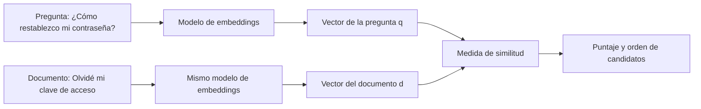

# 28 S06 - Qué es un embedding y qué significa cercanía

[[00 INICIO - Ruta de aprendizaje|Volver al índice]] · Siguiente: [[29 S06 - De tokens a un vector de texto]]

## 1. El problema que intenta resolver

Imagina que una persona pregunta «¿Cómo restablezco mi contraseña?» y un documento dice «Olvidé mi clave de acceso». Una búsqueda que depende solo de palabras compartidas puede perder la relación. Un **embedding de texto** transforma cada texto en una lista de números para poder comparar sus representaciones.

$$f_\theta:\text{texto}\longrightarrow \mathbb{R}^{d},\qquad u=f_\theta(x).$$

- $x$ es una oración, fragmento o documento de entrada.
- $\theta$ son los parámetros aprendidos del modelo.
- $d$ es el número fijo de componentes del vector. El PDF da ejemplos de 384, 1024, 1536 y 3072 dimensiones; no todos los modelos usan el mismo $d$.
- $u$ es el vector final del **texto completo**. No hay que confundirlo con los vectores de sus tokens.

> [!important] La promesa exacta
> La proximidad de vectores resulta útil si el modelo fue entrenado para que **la medida elegida** refleje la semejanza relevante para nuestra tarea. Convertir texto en números, por sí solo, no crea significado ni garantiza buenas búsquedas.

## 2. Una imagen mental de la búsqueda

El plano es **ilustrativo**: los modelos reales suelen producir cientos o miles de dimensiones, y este dibujo no muestra vectores calculados. La idea es que textos con expresiones distintas puedan ser vecinos si el entrenamiento los relacionó.

Se representa la consulta y cada documento con el **mismo espacio vectorial**. Después se calcula un puntaje y se ordenan documentos. El puntaje no es automáticamente una probabilidad de que la respuesta sea verdadera.

## 3. ¿Qué significa «similar»?

Depende de los pares y etiquetas usados durante el entrenamiento. Si el objetivo premia textos del mismo tema, el espacio puede agruparlos por tema. Si premia reseñas del mismo sentimiento, puede acercar reseñas positivas aunque traten productos diferentes. Si se entrena para recuperar respuestas a preguntas, puede acercar una pregunta y un pasaje que la responde, aunque no se parezcan gramaticalmente.

| Par | Una relación posible | Precaución |
| --- | --- | --- |
| «El perro corre» / «El can galopa» | paráfrasis aproximada | No son idénticos en todos los detalles |
| «¿Cómo facturo con RUC?» / «Pasos para emitir factura electrónica» | pregunta y posible respuesta | Relevancia no prueba que el pasaje sea correcto |
| «El gato duerme» / «El gato no duerme» | mismo tema y muchas palabras iguales | Tienen afirmaciones opuestas |

Un embedding condensa información. Por ello, dos textos pueden quedar cerca por **tema** y diferir en la afirmación central. La contradicción se estudia de nuevo en [[32 S06 - Elegir modelo y reconocer límites]].

## 4. Dimensión, coordenadas y distancia

Un vector pequeño, solo para hacer cuentas, puede ser $u=(0.8,0.6)$. Sus componentes son coordenadas. En un modelo real no conviene interpretar «la coordenada 17 es el tema de contraseñas»: normalmente el significado se distribuye entre muchas dimensiones.

Dos cuestiones diferentes:

1. **Construir el vector**: el modelo aprende $f_\theta$ a partir de datos. Lo vemos en [[29 S06 - De tokens a un vector de texto]] y [[30 S06 - Cómo se entrena SBERT y por qué permite buscar]].
2. **Comparar vectores**: coseno, producto punto o distancia euclídea dan puntajes distintos según la normalización. Lo vemos en [[31 S06 - Coseno producto punto y normalización]].

Si cambia el modelo de embeddings, cambia el espacio. No se deben comparar a ciegas vectores de modelos diferentes, aunque casualmente tengan igual dimensión.

## 5. Mini ejemplo pensado como sistema

Tenemos tres fragmentos:

1. «Cambiar la clave de acceso desde el perfil».
2. «Preparar locro de papa».
3. «Configurar un servidor de correo».

Para la consulta «Olvidé mi contraseña», esperaríamos que el primero tenga mejor posición **si** el modelo fue entrenado y evaluado para esa relación. Primero se calculan los embeddings de los tres fragmentos y se guardan; al recibir la consulta se calcula su vector y se comparan puntajes. Esto permite reutilizar los vectores de los documentos para muchas consultas.

> [!question]- Comprueba tu comprensión
> **¿Un vector cercano demuestra que un documento responde bien?** No. Es una señal de recuperación que hay que verificar con el contenido, la tarea y ejemplos etiquetados.

## Fuente y alcance

- [[sesion-06.pdf#page=4|Sesión 06, p. 4]]: definición, dimensiones de ejemplo y cercanía entrenada.
- [[sesion-06.pdf#page=20|Sesión 06, p. 20]]: límites de «similaridad» por tema y polaridad.
- El mapa de puntos y el mini sistema son explicaciones originales; no representan una medición del curso.
