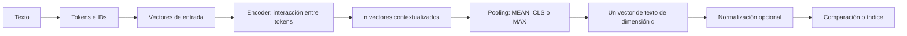

# 29 S06 - De tokens a un vector de texto

[[28 S06 - Qué es un embedding y qué significa cercanía|Anterior]] · [[30 S06 - Cómo se entrena SBERT y por qué permite buscar|Siguiente]]

## 1. Tres representaciones que suelen llamarse «embedding»

La palabra aparece en tres puntos del proceso. Separarlos evita la confusión más común de la sesión.

| Nivel | ¿Qué representa? | ¿Depende del contexto? | ¿Cuántos vectores produce? |
| --- | --- | --- | --- |
| Embedding de token de entrada | Un ID del vocabulario | No: el mismo ID parte del mismo vector aprendido | Uno por token |
| Salida contextualizada del encoder | Cada token después de atender al resto del texto | Sí | Uno por token |
| Embedding del texto | La secuencia completa tras una agregación | Sí, porque agrega salidas contextualizadas | Uno por texto |

En «banco de peces» y «banco de crédito», la palabra puede compartir un ID de token de partida (según el tokenizador), pero el encoder produce representaciones contextualizadas diferentes. La búsqueda de fragmentos necesita un vector final de dimensión fija por fragmento.

El esquema describe la familia estudiada en el PDF, especialmente SBERT. Otros modelos pueden construir embeddings con arquitecturas y objetivos distintos.

## 2. El problema de longitud variable

Una oración puede tener 8 tokens y un párrafo 100. Tras el encoder quedan $n$ vectores $t_1,\ldots,t_n\in\mathbb{R}^{d}$. Para indexar textos de distinta longitud con una interfaz fija, una operación de **pooling** combina esos $n$ vectores en uno $u\in\mathbb{R}^{d}$.

### MEAN: promedio

$$u_j=\frac{1}{n}\sum_{i=1}^{n} t_{ij}.$$

Promedia cada coordenada entre los tokens válidos. En una implementación real se excluyen los tokens de relleno mediante una máscara; el detalle exacto de qué posiciones se promedian depende del modelo.

### CLS: seleccionar una posición

$$u=t_{\mathrm{CLS}}.$$

Se usa la salida contextualizada de un token especial. Como esta salida ya atendió a otras posiciones, puede resumirlas, pero su utilidad para comparar textos depende del entrenamiento. Que BERT tenga `[CLS]` no implica que su coseno sea un buen buscador.

### MAX: máximo por coordenada

$$u_j=\max_{1\le i\le n}t_{ij}.$$

Puede tomar la coordenada 1 del primer token y la coordenada 2 del tercero. El resultado no corresponde necesariamente a ningún token real.

## 3. Haz el cálculo a mano

Ejemplo **inventado para estudiar** con tres tokens contextualizados de tres dimensiones:

| Token | Coordenada 1 | Coordenada 2 | Coordenada 3 |
| --- | ---: | ---: | ---: |
| $t_1$ | 4 | 0 | 0 |
| $t_2$ | 0 | 5 | 0 |
| $t_3$ | 2 | 1 | 3 |
| **MEAN** | **2** | **2** | **1** |
| **MAX** | **4** | **5** | **3** |

MEAN conserva el aporte promedio; MAX toma el pico de cada dimensión. Aquí el primer 4 procede de $t_1$, el 5 de $t_2$ y el 3 de $t_3$: el vector $(4,5,3)$ nunca salió de un token individual. Además, MEAN y MAX apuntan a direcciones distintas, por lo que pueden cambiar una comparación por coseno. El ejemplo muestra el mecanismo, **no** la calidad de una estrategia: la calidad se mide en una tarea.

## 4. Qué midió el estudio citado

En la ablación de Reimers y Gurevych (2019) citada por la sesión, sobre el conjunto de desarrollo STSb y con objetivo de **regresión**, MEAN obtuvo 87,44 y MAX 69,92 en Spearman ×100; CLS obtuvo 86,62. Con el objetivo de **clasificación**, MEAN obtuvo 80,78 y MAX 79,07. No se deben mezclar esos dos objetivos ni convertir estas cifras históricas en una regla universal para cualquier modelo.

La lección útil es experimentar con la representación y la tarea objetivo. En la configuración SBERT descrita, MEAN era la opción por defecto.

## 5. Qué se guarda en un índice

Para una colección de fragmentos, el índice guarda **un embedding por fragmento**. No guarda una fila por cada vector contextualizado de token para la búsqueda explicada aquí. Por ejemplo, 1000 fragmentos producen 1000 vectores de dimensión $d$.

Si cada coordenada se almacena como `float32`, solo los valores vectoriales ocupan aproximadamente $1000\times d\times4$ bytes, antes de metadatos e índice. Con $d=384$, son unos 1,54 MB decimales; con $d=3072$, unos 12,29 MB. Es una cuenta de almacenamiento bruto, no la memoria total de un sistema.

> [!question]- Comprueba tu comprensión
> **¿Por qué el mismo token puede terminar distinto en dos oraciones?** Porque el encoder incorpora el contexto. El vector de entrada parte del mismo ID, pero la salida contextualizada depende de los demás tokens.

> [!question]- Comprueba tu comprensión
> **¿MAX selecciona el «token más importante»?** No necesariamente. Selecciona un máximo independiente para cada coordenada; distintos tokens pueden aportar coordenadas distintas.

## Fuente y alcance

- [[sesion-06.pdf#page=5|Sesión 06, p. 5]]: token de entrada, encoder contextual y vector de texto.
- [[sesion-06.pdf#page=6|Sesión 06, p. 6]]: tres poolings y ablación citada.
- La tabla numérica y la cuenta de memoria son ejemplos originales con las fórmulas de la sesión.
