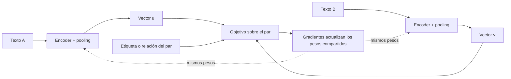
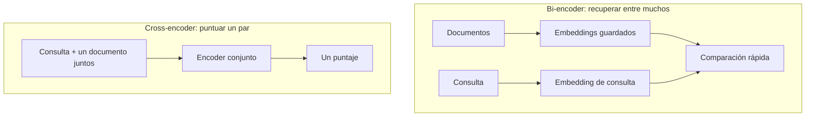

# 30 S06 - Cómo se entrena SBERT y por qué permite buscar

[[29 S06 - De tokens a un vector de texto|Anterior]] · [[31 S06 - Coseno producto punto y normalización|Siguiente]]

## 1. El problema de usar BERT «crudo» para buscar

Un encoder puede entender contexto y aun así producir vectores cuyo **coseno** no ordene bien oraciones. En el estudio de SBERT citado por la sesión, promediar salidas de BERT alcanzó 54,81, y usar CLS 29,19, frente a 74,89 de SBERT-NLI base en el promedio de siete tareas de similitud textual (Spearman ×100). Son resultados de **modelos y pruebas de 2019**, no una clasificación de modelos actuales.

¿Por qué un encoder útil puede fallar con coseno? Un clasificador entrenado encima de sus vectores puede aprender qué dimensiones pesan y cómo combinarlas. El coseno, por sí solo, usa la geometría existente. Si el entrenamiento no organizó esa geometría para la tarea, «cerca» no tiene el significado deseado.

## 2. La arquitectura siamesa

SBERT aplica el **mismo encoder con los mismos pesos** a ambos textos. No son dos modelos independientes. Cada rama produce su vector, y la señal de aprendizaje compara el par.

La etiqueta pertenece a la **relación entre textos**: semejantes, distintos o una relación NLI según la tarea. Repetir esto con muchos ejemplos moldea el espacio. En inferencia para búsqueda se calcula un vector para cada texto; la cabeza de clasificación del entrenamiento ya no participa.

## 3. No hay una sola función objetivo

El paper de SBERT estudió tres formas, resumidas en el PDF:

| Objetivo | Entrada supervisada | Qué aprende a predecir |
| --- | --- | --- |
| Clasificación | pares con clase, por ejemplo NLI | una clase a partir de $u$, $v$ y $|u-v|$ |
| Regresión | pares con puntaje de similitud | que el coseno se acerque al puntaje humano, con error cuadrático |
| Triplet | ancla, positivo y negativo | que el positivo quede más cerca que el negativo por un margen |

En la variante triplet citada se usa distancia euclídea y margen $\varepsilon=1$. La configuración principal NLI del paper entrenó con 570 000 pares SNLI y 430 000 MultiNLI durante una época. Es contexto histórico para entender el método, no una receta obligatoria de entrenamiento.

> [!important] Separar entrenamiento de inferencia
> Durante el entrenamiento hay pares, etiquetas, pérdida y gradientes. Durante una búsqueda habitual, los pesos quedan fijos: se obtienen embeddings y se comparan. La consulta no reentrena el modelo.

## 4. Bi-encoder y cross-encoder

Un **bi-encoder** representa consulta y documento por separado. Así podemos precalcular los documentos. Un **cross-encoder** recibe ambos textos juntos y produce un puntaje para ese par; su atención puede cruzar los dos textos, pero no entrega dos embeddings independientes reutilizables para la búsqueda vectorial descrita aquí.

Para $n=10\,000$ textos, comparar todos los pares una vez requiere $n(n-1)/2=49\,995\,000$ evaluaciones conjuntas. El trabajo de 2019 citó aproximadamente 65 horas en una V100 para el cross-encoder, frente a unos 5 segundos para generar embeddings y 0,01 segundos para compararlos en su entorno experimental. Estas cifras explican el cambio de escala; **no son tiempos esperables en tu equipo**.

El intercambio es real: el cross-encoder puede usar interacciones finas del par y ser más preciso en ciertas pruebas; el bi-encoder hace posible buscar en una colección grande. Una arquitectura común recupera candidatos con bi-encoder y luego reordena unos pocos con cross-encoder.

## 5. La conexión con la sesión anterior

En [[18 S02 - Transformer de extremo a extremo]] estudiaste cómo un transformer crea representaciones contextualizadas. Aquí se agrega un objetivo **entre textos** y una forma de obtener **un vector por texto**. Esa diferencia explica por qué «usar un transformer» no basta para obtener un buscador semántico.

> [!question]- Comprueba tu comprensión
> **¿Por qué el bi-encoder permite precalcular documentos y el cross-encoder no de la misma manera?** Porque el primero calcula cada documento independientemente de la consulta; el segundo puntúa un par completo y debe ejecutar el modelo con cada consulta y candidato.

## Fuente y alcance

- [[sesion-06.pdf#page=8|Sesión 06, p. 8]]: estructura siamesa, objetivos y configuración NLI.
- [[sesion-06.pdf#page=9|Sesión 06, p. 9]]: comparación histórica de correlaciones.
- [[sesion-06.pdf#page=10|Sesión 06, p. 10]]: bi-encoder, cross-encoder y costos del experimento.
- La posible etapa de reordenamiento se presenta como aplicación conceptual de ambas arquitecturas, no como resultado medido en esta sesión.
