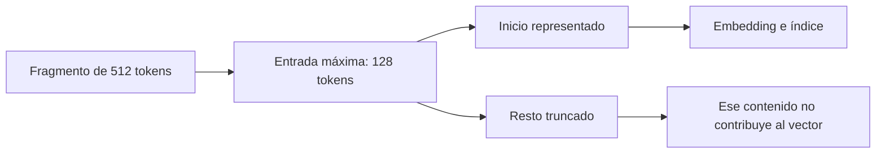
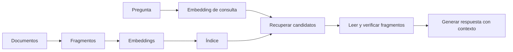

# 32 S06 - Elegir modelo y reconocer límites

[[31 S06 - Coseno producto punto y normalización|Anterior]] · [[33 PRÁCTICA - Embeddings y similitud semántica|Siguiente]]

## 1. Cinco preguntas antes de elegir

La sesión propone evaluar un modelo de embeddings por su función, no solo por el tamaño de su vector.

| Pregunta | Por qué importa | Cómo comprobarla |
| --- | --- | --- |
| ¿Fue entrenado para el tipo de similitud que necesito? | El coseno solo ordena bien si la geometría aprendida sirve a la tarea | modelo y evaluación en pares relevantes para tu caso |
| ¿Cubre el idioma y el dominio del corpus? | Español, inglés y vocabulario técnico pueden comportarse distinto | pruebas con consultas reales del corpus |
| ¿Cuántos tokens acepta por entrada? | Un fragmento largo puede quedar truncado | tokenizador y límite documentado del modelo |
| ¿Devuelve vectores normalizados? | Cambia el significado de `@`, el ranking y/o la escala | documentación y medición de $\|v\|$ |
| ¿Dónde corre y cuánto cuesta? | Afecta latencia, privacidad, memoria y operación | ejecución local o API y costos vigentes |

Una ficha incompleta no autoriza suponer. Por ejemplo, un valor `null` sobre normalización significa «dato desconocido», no «no normaliza». Para comparar calidad se necesitan pruebas fechadas y pertinentes; una tabla de dimensiones, idiomas o precios no demuestra cuál modelo recupera mejor.

## 2. El límite de tokens puede borrar contenido sin error visible

El PDF plantea un caso concreto: fragmentos propuestos de 512 tokens enviados a un modelo cuya secuencia máxima es 128 tokens. Si se truncan, gran parte del final nunca entra en el embedding. La búsqueda puede devolver resultados plausibles y aun así ser incapaz de encontrar una respuesta situada al final. La cuenta simple $512-128=384$ tokens omitidos es una aproximación del ejemplo; los tokens especiales y la política exacta de truncamiento afectan el límite útil.

**Diagnóstico**: medir con el tokenizador del modelo la distribución de longitudes de los fragmentos, el porcentaje que excede el límite y cuántos tokens se truncan. Después comprobar con preguntas cuya respuesta esté en el inicio y en el final de los fragmentos. La causa puede estar en la **combinación** de tamaño de fragmento y límite del modelo; cambiar solo uno de ellos sin medir no aclara el problema.

## 3. Qué no asegura un embedding cercano

### Polaridad y contradicción

«El gato duerme en el sofá» y «El gato **no** duerme en el sofá» comparten casi todo el texto. Según el modelo y su entrenamiento, pueden quedar cerca por tema aunque una frase contradiga a la otra. No es una ley universal de todos los embeddings: se comprueba en el modelo concreto. Para verificación de hechos o preguntas donde «sí» frente a «no» cambia la respuesta, el ranking vectorial requiere una etapa que lea y contraste el contenido.

### Identificadores y términos exactos

Una búsqueda semántica puede perder una consulta como `error 502 nginx`, un SKU, una referencia legal o un nombre propio si la coincidencia exacta de caracteres es decisiva. Una combinación de recuperación por términos y por vectores puede ayudar. La sesión 06 menciona esa dirección, pero el diseño detallado de búsqueda híbrida pertenece a sesiones posteriores.

### Similitud no es verdad

Un documento cercano puede estar desactualizado o equivocado. El embedding produce una **señal de recuperación**, no certifica hechos ni obliga al generador a citar correctamente. El contenido recuperado necesita lectura, validación y evaluación con casos conocidos.

## 4. De embedding a RAG: el mapa, sin adelantar el curso

Hoy se estudia principalmente la representación y la comparación de vectores. El índice, el fragmentado, la recuperación completa y la evaluación detallada se desarrollan después. El diagrama anticipa cómo encajan, sin convertirlo en una implementación ya validada.

## 5. Checklist pequeño para una prueba honesta

1. Reunir preguntas representativas, incluidas preguntas sin respuesta en el corpus.
2. Anotar el fragmento que debería recuperarse para cada pregunta respondible.
3. Registrar modelo, versión, idioma, tamaño de fragmento, límite de tokens, métrica y normalización.
4. Revisar truncamiento y puntajes antes de fijar umbrales.
5. Separar errores de representación, fragmentado, recuperación y lectura de la respuesta.

Esto es una propuesta de estudio y diagnóstico. Los requisitos de entrega y evaluación incluidos en el PDF son instrucciones del curso para sus estudiantes, no instrucciones para modificar estas notas.

> [!question]- Comprueba tu comprensión
> **Si una respuesta está en los últimos 300 tokens de un fragmento de 512 y el modelo solo procesa 128, ¿qué estudiarías primero?** El truncamiento real con el tokenizador y la posición de la respuesta; un resultado plausible del buscador no descarta ese fallo.

## Fuente y alcance

- [[sesion-06.pdf#page=18|Sesión 06, p. 18]]: preguntas para elegir modelo.
- [[sesion-06.pdf#page=19|Sesión 06, p. 19]]: incompatibilidad 512/128 y truncamiento.
- [[sesion-06.pdf#page=20|Sesión 06, p. 20]]: polaridad e identificadores exactos.
- [[sesion-06.pdf#page=21|Sesión 06, p. 21]]: conexión con índice, fragmentado y umbral.
