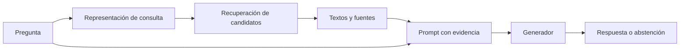

# 51 S10 - Del documento a una respuesta con evidencia

[[50 S10 - Guía para comprender el taller RAG|Guía de la sesión 10]] · [[00 INICIO - Ruta de aprendizaje|Inicio de la materia]]

Anterior: [[50 S10 - Guía para comprender el taller RAG]]

Siguiente: [[52 S10 - Ingesta tokens y tres fallas silenciosas]]

## 1. Qué es el baseline

Un **baseline**, o línea base, es una configuración inicial definida y conservada para compararla con otra. «Uso RAG» no es una definición suficiente. Debes saber qué documentos entran, cómo se extraen, cómo se fragmentan, qué modelo crea los vectores, cómo se recuperan resultados y cómo se construye la respuesta.

Una línea base sencilla puede usar fragmentos de tamaño fijo medido en tokens, embeddings, búsqueda vectorial y los cinco primeros resultados para generar. Su sencillez permite interpretar cambios posteriores. No implica que sea débil ni que la extensión tenga que superarla.

## 2. Preparación: convertir archivos en evidencia recuperable

### Ingesta

Leer un PDF significa extraer su contenido mediante un lector; no significa que el programa vea lo mismo que tú ves en pantalla. Un PDF con texto seleccionable puede producir cadenas útiles. Un escaneo puede producir una cadena vacía. Incluso con texto, tablas y columnas pueden extraerse en un orden incorrecto.

Por eso se conservan el archivo de origen, páginas y señales de calidad. Si aparece «10» separado de «días hábiles», el problema puede comenzar antes de crear cualquier embedding.

### Fragmentación

Un documento largo se divide en unidades recuperables o *chunks*. Una unidad debería aportar evidencia con suficiente contexto. Para el ejemplo de equivalencias, queremos conservar juntos el trámite, el plazo, el punto desde el que se cuenta y las excepciones relevantes.

Cortar por longitud controla el presupuesto, pero no comprende automáticamente la estructura del reglamento. Cortar por secciones mantiene organización, pero una sección puede superar el límite del modelo. La elección necesita combinar estructura y medición.

### Embeddings

Una función de embedding transforma el texto en un vector:

$$e_i=f(c_i)\in\mathbb{R}^{d}$$

$c_i$ es un fragmento; $d$ es la cantidad de coordenadas del vector. **Dimensión no equivale a longitud de entrada**: un vector de cientos de coordenadas puede corresponder a textos de diferentes longitudes, siempre dentro de las condiciones del modelo.

El vector permite comparar representaciones. No es un resumen escrito ni una copia reversible. Dos párrafos pueden quedar próximos porque hablan de plazos, aunque uno se refiera a matrícula y otro a equivalencias.

### Índice y metadatos

La base vectorial organiza vectores para consultarlos y asocia cada uno con un identificador. Los metadatos o *payload* pueden guardar texto, documento, página y versión. El identificador conecta la proximidad numérica con una evidencia que podemos leer.

Una **colección** agrupa registros con una configuración determinada. Si cambias el modelo de embeddings, la compatibilidad no depende solo de que la dimensión coincida: los vectores de ambos modelos pueden pertenecer a espacios diferentes. Como regla práctica, se reindexa con una representación coherente para documentos y consultas, respetando los modos de codificación del modelo.

## 3. Consulta: del vector a la respuesta

La pregunta se representa mediante el encoder de consultas compatible con el de documentos. El buscador devuelve candidatos ordenados por el criterio elegido. **Top-5** significa hasta cinco resultados, sujeto a existencia, filtros y umbrales; no significa cinco resultados correctos.

Si se utiliza coseno:

$$\operatorname{cos}(q,e_i)=\frac{q\cdot e_i}{\|q\|\,\|e_i\|}$$

El numerador mide alineación mediante un producto punto; dividir por las longitudes elimina el efecto de la magnitud. Un valor alto indica cercanía según esa representación. No es una probabilidad de que la respuesta sea verdadera.

Después se recupera el texto asociado a los candidatos, se prepara el contexto y se construye el prompt. Este puede pedir responder con evidencia, citar fuentes y abstenerse si no hay soporte suficiente. Finalmente el generador produce texto condicionado por la pregunta, las instrucciones y ese contexto.

La pregunta entra tanto al buscador como al generador. Recuperar un texto correcto no obliga al generador a respetarlo. La evaluación debe mirar las dos etapas.

## 4. Por qué RAG no es reentrenamiento

En el RAG habitual, añadir un reglamento modifica el material consultable. No actualiza por sí mismo los parámetros del generador. La información llega a través del contexto en cada consulta. Por eso el modelo puede responder algo hoy y no hacerlo mañana si cambia la colección, el filtro o la selección de fragmentos.

Esta separación permite actualizar información sin reentrenar todo el modelo, pero crea una dependencia: si la evidencia no llega al prompt, el generador no la recibe por esta vía.

## 5. Ejemplo de un fallo en cada etapa

| Etapa | Fallo en el ejemplo | Evidencia para localizarlo |
| --- | --- | --- |
| Ingesta | No se extrajo la página del plazo. | Texto extraído y registro por documento. |
| Fragmentación | Se separó el plazo de su excepción. | Texto completo de los fragmentos vecinos. |
| Embedding | La cláusula quedó fuera del prefijo admitido. | Tokens efectivos y configuración de truncamiento. |
| Recuperación | Se priorizó matrícula por vocabulario similar. | Ranking con IDs, texto, puntaje y referencia. |
| Contexto | El fragmento correcto se eliminó al ajustar longitud. | Prompt final realmente enviado. |
| Generación | Se convirtió «hábiles» en «calendario». | Respuesta comparada con la evidencia. |

> [!question] Comprueba tu comprensión
> Si el relevante está en el ranking pero no en el prompt, ¿debes cambiar inmediatamente el embedding?
>
> No. Primero revisa la construcción del contexto. Un cambio anterior puede no afectar la causa observada.

## El prompt docente y el prompt realmente archivado

La sesión 08 muestra una instrucción para citar documento y página. En `rag_pipeline.py` de la entrega archivada, el prompt etiqueta los pasajes y exige usar el contexto y abstenerse si no alcanza, pero **no exige explícitamente incluir citas en la respuesta**. Tener fuentes en el prompt no basta para esperar referencias consistentes en la salida. Para estudiar citas hay que conservar la respuesta completa, localizar qué pasaje sustenta cada afirmación y evaluar el vínculo; Hit Rate no lo mide. Esta diferencia corresponde al snapshot entregado, no a toda versión posible del laboratorio.

**Fuente:** PDF, pp. 2–5 y 7. La descomposición detallada y el caso universitario son ampliaciones didácticas.
