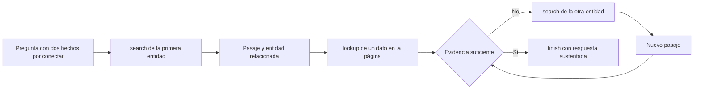

# 70 S12 - ReAct pensamiento acción observación y evidencia

[[Obsidian/posgrado/master/IA GENERATIVA Y AGENTES/12 Patrones de agentes y diseño del toolset/69 S12 - Guía para entender patrones y toolsets|Guía de la sesión 12]] · [[Obsidian/posgrado/master/IA GENERATIVA Y AGENTES/00 Inicio/00 INICIO - Ruta de aprendizaje|Inicio de la materia]]

**ReAct** combina razonamiento expresado en lenguaje con acciones que consultan o modifican el entorno. El nombre une *reasoning* y *acting*. Su idea es que un resultado externo puede cambiar la próxima decisión. El patrón se presentó en 2022 y se publicó en ICLR 2023; su identificación se contrastó con [el registro del artículo](https://arxiv.org/abs/2210.03629).

## 1. Thought, Action y Observation tienen funciones distintas

En la comparación de ventas, un `Thought` puede decir «necesito el total de abril». Eso identifica una carencia; no obtiene el total. Una `Action` pide `estadisticas_ventas(mes="2026-04")`. El programa la ejecuta y produce una `Observation`: tres ventas y total 1670. Con esa nueva información se decide si seguir o responder.

![[Obsidian/posgrado/master/IA GENERATIVA Y AGENTES/Recursos visuales/50-s12-react-contexto.png|50-s12-react-contexto.png]]

La caja naranja representa una decisión expresada en texto y un cambio del contexto. La caja azul es una solicitud de operación. La verde contiene el dato recibido. El retorno muestra que el siguiente paso depende de ese dato. El gráfico no muestra el razonamiento privado de un modelo real: es una reconstrucción didáctica del flujo.

Una observación tiene procedencia externa al texto que el modelo acaba de generar, pero puede estar equivocada, desactualizada o incompleta. La herramienta y sus fuentes también requieren control. Un pensamiento sin respaldo tampoco es un dato verificado.

## 2. La definición matemática, traducida al ejemplo

El artículo llama $A$ al conjunto de acciones del entorno y $L$ al espacio de lenguaje. ReAct utiliza:

$$\widehat A=A\cup L$$

Eso significa que el agente puede tanto **actuar afuera** como **producir texto que organiza el contexto**. Si emite un pensamiento $\widehat a_t\in L$, su efecto directo es:

$$c_{t+1}=(c_t,\widehat a_t)$$

$c_t$ es el historial disponible hasta el paso $t$. La expresión de la derecha significa «añadir el pensamiento al historial». No actualiza automáticamente una base de datos ni los pesos del modelo. Una operación externa agrega su resultado cuando el entorno responde.

Los pensamientos pueden descomponer un objetivo, extraer lo importante de un resultado, revisar el progreso o proponer otra consulta ante un error. El artículo no obliga a escribir un Thought antes de **cada** acción en todas las tareas: algunas trayectorias de decisión emplean razonamiento intermitente.

## 3. El ejemplo completo debe conservar sus límites

Una trayectoria razonable obtiene 2695 y 1670, usa marzo como denominador y calcula -38,03 %. La explicación fiel sería «en las filas disponibles, el total de abril cayó aproximadamente 38,03 % respecto de marzo». Afirmar «la caída se debió a menor demanda» agrega una causa que los datos no prueban.

Si la consulta devuelve «sin datos para abril», no se puede reemplazar por 0 sin comprobar qué significa ausencia de filas. Si las cantidades corresponden a definiciones diferentes de ventas, tampoco se deben comparar. ReAct aporta ocasiones para descubrir estos problemas; no garantiza que el modelo los interprete bien.

## El entorno y las acciones del experimento original

La implementación experimental principal usa **PaLM-540B con parámetros congelados**: las demostraciones se suministran en contexto, sin ajustar pesos durante esa corrida. El prompt de HotpotQA incluye seis ejemplos y el de FEVER tres. Esto es *few-shot*: pocos ejemplos de cómo recorrer la tarea, no entrenamiento adicional sobre cada pregunta.

| Tarea | Qué exige al sistema | Qué representa su resultado |
| --- | --- | --- |
| HotpotQA | Unir información de dos o más pasajes de Wikipedia | Coincidencia exacta de la respuesta esperada |
| FEVER | Verificar una afirmación con evidencia de Wikipedia | Clasificar como respaldada, refutada o sin información suficiente |
| ALFWorld | Moverse y manipular objetos en un hogar textual simulado | Cumplir el objetivo del episodio |
| WebShop | Seleccionar un producto y sus opciones según requisitos | Cumplir atributos solicitados en un entorno de compra experimental |

Para las dos primeras, el modelo recibe pregunta o afirmación sin los pasajes de respaldo. Tiene tres acciones: `search[entidad]` obtiene las primeras cinco frases de la página o sugiere cinco entidades parecidas; `lookup[cadena]` busca la siguiente frase que contiene esa cadena en la página actual; `finish[respuesta]` termina. **Buscar una entidad y buscar dentro de una página son operaciones distintas.** Un resultado puede ayudar a escoger la próxima entidad sin contener todavía la respuesta.

Los autores eligieron deliberadamente una interfaz más limitada que un recuperador léxico o neuronal avanzado para estudiar la interacción. Por eso una falla de recuperación no debe atribuirse automáticamente al razonamiento. En la tabla 2, búsqueda vacía o sin información útil representa 23 % de las fallas ReAct analizadas.

La primera búsqueda establece una página y puede revelar una entidad relacionada. La búsqueda dentro de esa página extrae un dato específico; si falta el segundo hecho, una nueva consulta añade evidencia. El cierre depende de disponer de datos suficientes. Este flujo es un ejemplo propio del uso de las acciones del paper, con la condición de parada general explicada en la nota 72.

## 4. Qué resultados apoyan la idea

Un **benchmark** es un conjunto de tareas y un protocolo de medición. Una **línea base** es el procedimiento usado como comparador. La ganancia depende de ambos y del modelo.

![[Obsidian/posgrado/master/IA GENERATIVA Y AGENTES/Recursos visuales/51-s12-react-resultados.png|51-s12-react-resultados.png]]

Cada barra muestra un porcentaje de la tabla 1 del artículo, con PaLM-540B y prompting. En HotpotQA se mide coincidencia exacta de la respuesta, o EM; en FEVER se mide exactitud de clasificación. ReAct mejora frente a Act en ambos paneles, pero en HotpotQA queda por debajo de CoT y Standard. La escala compartida facilita comparar procedimientos **dentro de cada tarea**; EM y accuracy no describen una capacidad única intercambiable.

En FEVER, ReAct supera a CoT en $60{,}9-56{,}3=4{,}6$ **puntos porcentuales**. En HotpotQA queda $27{,}4-29{,}4=-2$ puntos por debajo de CoT. No es correcto anunciar una mejora universal.

Otros resultados del artículo precisan la historia:

| Experimento histórico | Resultado | Condición necesaria para interpretarlo |
| --- | --- | --- |
| ALFWorld | ReAct 71; Act 45; BUTLER 37 % | Mejores corridas de protocolos distintos, no promedio de todas las corridas |
| ALFWorld, promedio ReAct | 57 % | No confundir con su mejor corrida de 71 |
| Sustituir pensamientos por feedback denso | 71 → 53 % en mejores corridas | Ablación ReAct-IM, no eliminación de toda información externa |
| HotpotQA, método combinado | 35,1 % | ReAct → CoT-SC |
| FEVER, método combinado | 64,6 % | CoT-SC → ReAct; la dirección difiere |
| Modelos PaLM-8B/62B | La clasificación cambia con ajuste fino | Prompting y entrenamiento no son el mismo régimen |

CoT-SC combina varias respuestas mediante auto-consistencia. Las dos conmutaciones anteriores son reglas de control distintas: no se debe juntar 35,1 y 64,6 como si provinieran de un único método.

La auto-consistencia usada como línea base genera 21 trayectorias CoT a temperatura 0,7 y elige la respuesta mayoritaria. En `ReAct → CoT-SC`, se cambia cuando ReAct no responde dentro de siete pasos en HotpotQA o cinco en FEVER. En `CoT-SC → ReAct`, se cambia cuando la respuesta mayoritaria aparece menos de $n/2$ veces entre $n$ muestras. Una conmutación responde a falta de terminación; la otra, a falta de acuerdo. Su costo incluye esas generaciones adicionales.

La tabla 1 incluye sistemas supervisados específicos de tarea: 67,5 en HotpotQA y 89,5 en FEVER. Es otra familia de comparadores, no el mismo PaLM con otra plantilla. La comparación explica la brecha histórica, pero no permite atribuir toda la diferencia al patrón por tener datos y procedimientos de entrenamiento distintos.

En ALFWorld, BUTLER se entrenó con $10^5$ trayectorias expertas por tipo de tarea. ReAct usa dos demostraciones en cada prompt de evaluación, tomadas de tres trayectorias anotadas; «best of 6» elige la mejor configuración entre seis prompts. No significa dar seis reintentos a cada problema para obtener ese porcentaje. En WebShop, la tabla 4 distingue puntaje de atributos y éxito completo: ReAct obtiene 66,6 de puntaje y 40,0 % de éxito, frente a Act 62,3 y 30,1 %. Satisfacer parte de los requisitos no equivale a completar la compra solicitada. Son resultados del entorno experimental, sin compras reales realizadas por estas notas.

## 5. «Cero alucinaciones» no es la conclusión del estudio

La tabla 2 analiza 200 trayectorias seleccionadas: 50 correctas y 50 incorrectas por método. Entre las **fallidas**, la categoría alucinación aparece en 56 % de CoT y 0 % de ReAct. En cambio, entre las trayectorias con respuesta correcta hay hechos o razonamientos inventados en 14 % de CoT y 6 % de ReAct. Por tanto, aquel cero no demuestra ausencia universal de fabricación.

Entre las fallas analizadas, los errores de razonamiento son 47 % para ReAct y 16 % para CoT. Esos denominadores son subconjuntos de fallas, no todas las preguntas del benchmark. El estudio sugiere un compromiso entre fundamentación y flexibilidad; no permite afirmar que toda mejora de factualidad exija exactamente esa pérdida en otros sistemas.

> [!question]- ¿Un agente que usa function calling ya demuestra que implementa el ReAct del paper?
> No. Function calling describe un mecanismo para pedir funciones. ReAct organiza razonamiento y acciones en una trayectoria. El protocolo por sí solo no identifica todo el patrón de control.

Fuentes: [[Obsidian/posgrado/master/IA GENERATIVA Y AGENTES/Materiales/sesion-12.pdf#page=4|PDF 4–9]]; [[Obsidian/posgrado/master/IA GENERATIVA Y AGENTES/Materiales/fuentes/papers/s3-agentes/yao-2023-react.pdf#page=3|artículo, §2, PDF 3–4]], tablas 1–2 en PDF 5–6 y tabla 3 en PDF 8. Son resultados históricos, no mediciones realizadas con tus notebooks.

---

← [[Obsidian/posgrado/master/IA GENERATIVA Y AGENTES/12 Patrones de agentes y diseño del toolset/69 S12 - Guía para entender patrones y toolsets|Anterior]] · [[Obsidian/posgrado/master/IA GENERATIVA Y AGENTES/12 Patrones de agentes y diseño del toolset/71 S12 - Autopsia de trazas y detector de repetición|Siguiente]] →

