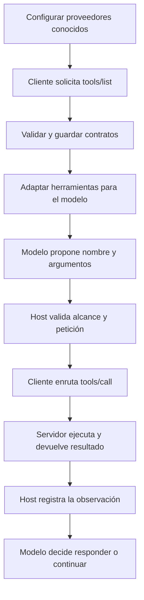

# 87 S13 - Host cliente servidor y descubrimiento

[[Obsidian/posgrado/master/IA GENERATIVA Y AGENTES/13 MCP descubrimiento y casos de uso/00 Índice - S13 MCP y casos de uso|Índice de la sesión 13]] · [[Obsidian/posgrado/master/IA GENERATIVA Y AGENTES/00 Inicio/00 INICIO - Ruta de aprendizaje|Inicio de la materia]]

## Tres piezas con responsabilidades distintas

Un **host** es la aplicación que coordina la interacción: un agente de ventas, un IDE o una aplicación de chat. Maneja el contexto, las decisiones y las políticas. Un **cliente MCP** es su conector hacia un servidor. Un **servidor MCP** publica capacidades y atiende solicitudes.

| Pieza | Qué sabe | Qué hace en el ejemplo |
| --- | --- | --- |
| Host | Pregunta, contexto y políticas | Organiza la comparación de ventas |
| Cliente | Catálogo y ruta hacia su servidor | Descubre, adapta y envía la llamada |
| Servidor | Funciones y acceso a sus datos | Ejecuta `consultar_ventas` |
| Modelo | Contratos ofrecidos y observaciones | Propone herramienta y argumentos |

![[Obsidian/posgrado/master/IA GENERATIVA Y AGENTES/Recursos visuales/Capítulo 13/03-host-clientes-servidores.png]]

Los clientes A y B pertenecen al mismo host y se comunican cada uno con un servidor. Un agregador de varios servidores coordina varios clientes; no convierte cada conexión individual en una relación con varios proveedores. Las flechas indican comunicación, no que el modelo pueda ejecutar directamente Python.

La relación cliente–servidor es 1:1, y el host administra los clientes. Esta separación se confirma en la [arquitectura oficial de MCP, revisión 2026-07-28](https://modelcontextprotocol.io/specification/2026-07-28/architecture), consultada el 30 de septiembre de 2026.

## Descubrir cambia cuándo llega la lista

Un **registro fijo** suele ser un diccionario como `{"consultar_ventas": funcion}`. El programa conoce esa lista desde que se escribió o importó. En el caso de la sesión, para añadir una función hay que revisar ese registro.

Con descubrimiento, el cliente pregunta durante la ejecución. `tools/list` devuelve herramientas y contratos; el cliente los guarda, los adapta y construye una ruta de despacho. Se sabe de antemano cómo hablar con el proveedor, aunque no se hayan escrito a mano todas sus operaciones.

La primera parte del flujo prepara el catálogo. La segunda conserva el bucle de la sesión 11: propuesta, validación, ejecución y observación. Conocer la dirección del proveedor y ofrecer sus capacidades son pasos diferentes. Descubrir tampoco implica conectarse indiscriminadamente a cualquier servidor disponible.

## Dónde se ejecuta una operación

Si el servidor es un subproceso local, el código corre en la máquina que lo lanza. Si es un servicio remoto, corre en el entorno del servicio. Si el notebook solo instancia una clase Python y llama a sus métodos, corre en el proceso del notebook. Las tres posibilidades conservan la separación entre la propuesta del modelo y la ejecución del programa.

El PDF describe un simulador con clases `ServidorMCP` y `ClienteMCP`. Una clase que reproduce `tools/list` y `tools/call` permite estudiar el desacople. Eso no demuestra que el programa implemente todas las reglas, transportes o seguridad de la especificación.

## El mapa de cinco formas de conexión

La sesión lista alternativas, pero no todas pertenecen al mismo nivel:

| Forma | Pregunta que resuelve | Relación con las demás |
| --- | --- | --- |
| API directa | Cómo invoco un servicio concreto | Puede estar dentro de un servidor MCP |
| Function calling | Cómo el modelo propone una llamada | Puede utilizar contratos descubiertos con MCP |
| Framework | Cómo organizo el código y el bucle | Puede usar registro fijo o descubrimiento |
| Plugin | Cómo empaqueto o amplío una aplicación | Puede incluir herramientas y conectores |
| MCP | Cómo intercambio capacidades con un proveedor | Puede combinarse con las cuatro anteriores |

El PDF no desarrolla «plugin»; su explicación en la tabla es una ampliación conceptual. Un framework no obliga por naturaleza a una lista fija: ese es el diseño del ejemplo de clase. Las categorías pueden combinarse, y no forman cinco opciones excluyentes.

> [!question]- ¿MCP permite descubrir un servidor cuya dirección nadie configuró?
> La lista de herramientas y la ubicación del proveedor son problemas distintos. El ejemplo configura proveedores y descubre sus capacidades. Un registro externo de servidores sería otra pieza, que esta práctica no implementa.

Fuente de clase: PDF 9–10, 13, 19 · numeración visible igual a la página PDF · [[Obsidian/posgrado/master/IA GENERATIVA Y AGENTES/Materiales/sesion-13.pdf#page=9|Sesión 13]].

---

← [[Obsidian/posgrado/master/IA GENERATIVA Y AGENTES/13 MCP descubrimiento y casos de uso/86 S13 - Cuándo conviene MCP y la cuenta de integraciones|Anterior]] · [[Obsidian/posgrado/master/IA GENERATIVA Y AGENTES/13 MCP descubrimiento y casos de uso/88 S13 - Catálogo adaptador y function calling|Siguiente]] →
