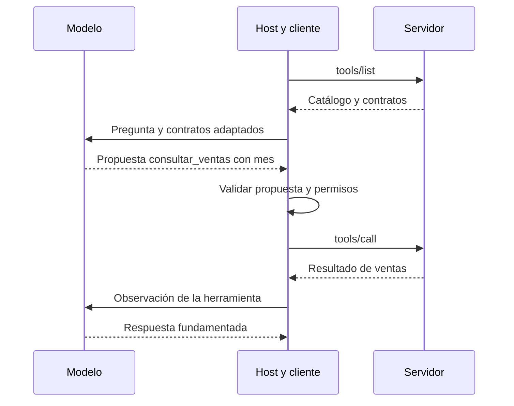

# 88 S13 - Catálogo adaptador y function calling

[[Obsidian/posgrado/master/IA GENERATIVA Y AGENTES/13 MCP descubrimiento y casos de uso/00 Índice - S13 MCP y casos de uso|Índice de la sesión 13]] · [[Obsidian/posgrado/master/IA GENERATIVA Y AGENTES/00 Inicio/00 INICIO - Ruta de aprendizaje|Inicio de la materia]]

## El catálogo es un contrato publicado

Un **catálogo** es la lista de capacidades con la información necesaria para utilizarlas. En el ejemplo de clase cada herramienta contiene nombre, descripción y esquema de entrada. El nombre identifica la operación; la descripción ayuda a decidir cuándo utilizarla; el esquema define la estructura de los argumentos.

Este contrato propio conserva la forma del material y añade un dominio explícito:

```json
{
  "name": "consultar_ventas",
  "description": "Obtiene el total registrado para un mes disponible; no explica sus causas",
  "inputSchema": {
    "type": "object",
    "properties": {"mes": {"type": "string", "enum": ["2026-03", "2026-04"]}},
    "required": ["mes"],
    "additionalProperties": false
  }
}
```

`type: object` significa que la entrada es un objeto de campos. `required` obliga a proporcionar `mes`; `enum` limita sus valores; `additionalProperties: false` rechaza campos extra cuando se aplica una validación compatible. Publicar un esquema no sustituye la comprobación efectiva del servidor.

La lista llega al ejecutar; el responsable de la herramienta la publica. La descripción sigue influyendo en la selección del modelo. Una descripción ambigua puede hacer elegir una operación incorrecta aunque el transporte funcione perfectamente.

## El adaptador convierte formatos

Un **adaptador** transforma un contrato al formato que espera otro componente. MCP publica `inputSchema`; una API de modelo puede esperar un campo llamado `parameters` dentro de su estructura de herramientas. El nombre y la forma concreta dependen del proveedor.

```python
# Ejemplo conceptual; no es el contrato universal de todas las APIs.
def adaptar(tool):
    return {
        "type": "function",
        "function": {
            "name": tool["name"],
            "description": tool["description"],
            "parameters": tool["inputSchema"],
        },
    }
```

![[Obsidian/posgrado/master/IA GENERATIVA Y AGENTES/Recursos visuales/Capítulo 13/04-contratos-y-adaptador.png]]

La caja verde muestra el contrato del servidor y la azul el contrato que consume la llamada al modelo. La caja naranja traduce ambos formatos y conserva a qué proveedor corresponde cada operación. Si el agente recibe siempre el mismo formato adaptado, puede incorporar herramientas nuevas sin conocer sus detalles.

La diapositiva ubica el adaptador en el cliente para explicar el desacople. Es una decisión útil de arquitectura; **MCP no obliga a que toda traducción a una API de LLM viva literalmente dentro del cliente**. Un módulo del host también puede realizarla si la lógica del agente sigue desacoplada.

## Function calling y MCP trabajan en tramos diferentes

**Function calling** permite que el modelo produzca una propuesta estructurada: herramienta y argumentos. **MCP** comunica la aplicación con quien publica y ejecuta las capacidades. El código de la aplicación une los tramos.



El catálogo se obtiene antes de ofrecer herramientas al modelo. La propuesta del modelo vuelve al host, que decide si puede enviarla. El resultado del servidor se incorpora como observación para la siguiente decisión. Las flechas entre host y servidor son MCP; las que unen host y modelo son la interacción con el LLM.

Es posible usar function calling con un registro local sin MCP, como el ejemplo del lunes. También un programa determinista puede usar un servidor MCP sin llamar a un modelo. Tener un servidor compatible no convierte automáticamente a su consumidor en un agente.

## Tres primitivas

![[Obsidian/posgrado/master/IA GENERATIVA Y AGENTES/Recursos visuales/Capítulo 13/05-tres-primitivas.png]]

Las herramientas son operaciones invocables; los recursos son contenido; los prompts son plantillas reutilizables. `consultar_ventas` realiza una consulta, `reporte://ventas/marzo` identifica información y `comparar_periodos` organiza una conversación. Estos nombres son propios; una plantilla no comprueba que la comparación sea correcta.

La presentación introductoria de la clase enfoca MCP en publicación y descubrimiento de tools. El protocolo abarca también otras primitivas: la frase «solo estandariza dos cosas» debe entenderse dentro de ese foco docente. La [especificación oficial](https://modelcontextprotocol.io/specification/2026-07-28) incluye contexto, herramientas y plantillas.

## Un nombre también necesita una ruta

Dos servidores pueden publicar una tool llamada `buscar`. El cliente agregado debe distinguirlas, por ejemplo `ventas__buscar` y `documentos__buscar`, y guardar la correspondencia con el nombre original. Si presenta el nombre al modelo pero no conserva la ruta al proveedor, el descubrimiento no produce una operación ejecutable.

> [!question]- ¿Basta con guardar la respuesta de tools/list en una variable?
> No. Debe validarse, adaptarse, ofrecerse al modelo y conectarse con el despacho de llamadas. También hace falta devolver resultados con la correlación correcta al historial del agente.

Fuente de clase: PDF 11–14, 20, 25 · numeración visible igual a la página PDF · [[Obsidian/posgrado/master/IA GENERATIVA Y AGENTES/Materiales/sesion-13.pdf#page=11|Sesión 13]].

---

← [[Obsidian/posgrado/master/IA GENERATIVA Y AGENTES/13 MCP descubrimiento y casos de uso/87 S13 - Host cliente servidor y descubrimiento|Anterior]] · [[Obsidian/posgrado/master/IA GENERATIVA Y AGENTES/13 MCP descubrimiento y casos de uso/89 S13 - Mensajes transportes y versiones de MCP|Siguiente]] →
