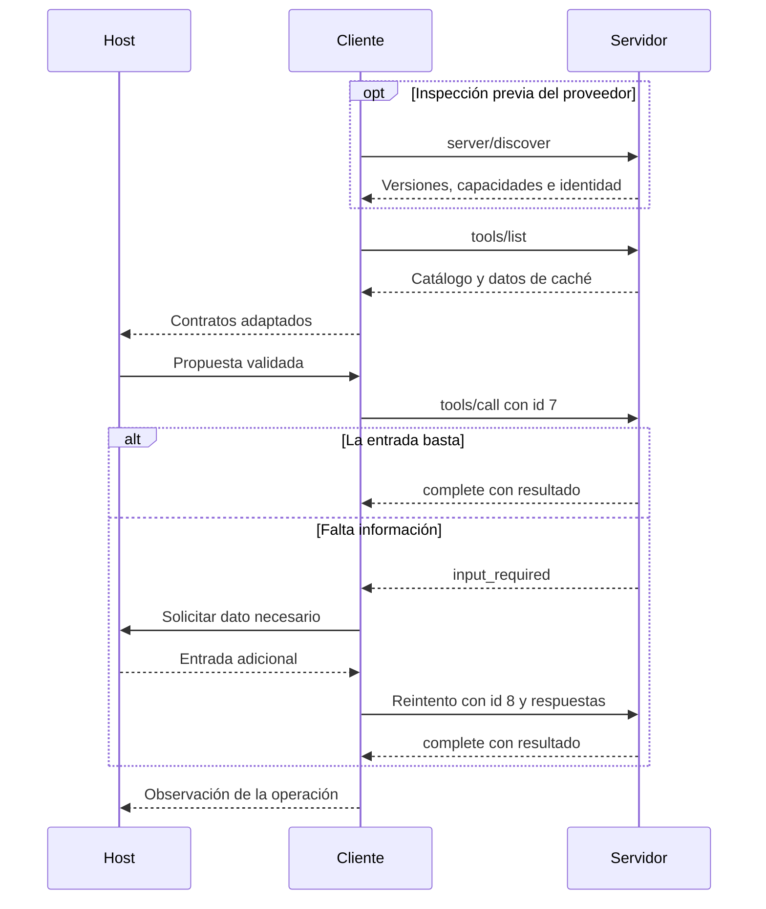

# 89 S13 - Mensajes transportes y versiones de MCP

[[Obsidian/posgrado/master/IA GENERATIVA Y AGENTES/13 MCP descubrimiento y casos de uso/00 Índice - S13 MCP y casos de uso|Índice de la sesión 13]] · [[Obsidian/posgrado/master/IA GENERATIVA Y AGENTES/00 Inicio/00 INICIO - Ruta de aprendizaje|Inicio de la materia]]

## Una revisión concreta, no un protocolo sin fecha

Las diapositivas citan **2026-07-28**, consultada el 30 de septiembre de 2026. Se comprobó que [latest](https://modelcontextprotocol.io/specification/latest) redirige a esa revisión en la consulta realizada para estas notas. Una fecha de especificación identifica un contrato; no mide cuántas organizaciones lo adoptaron ni demuestra que todos los SDK instalados sean compatibles.

La revisión importa porque tutoriales anteriores utilizan un saludo inicial `initialize`. Copiar fragmentos de distintas versiones puede producir un cliente que mezcla reglas incompatibles.

| Aspecto | Revisión 2025-11-25 | Revisión 2026-07-28 utilizada en clase |
| --- | --- | --- |
| Inicio | Intercambio `initialize` y notificación `initialized` | Metadatos por petición; desaparece ese saludo |
| Sesión de protocolo | Existe negociación inicial y soporte de sesiones HTTP | Peticiones autosuficientes, sin sesión de protocolo |
| Información adicional | El servidor puede iniciar peticiones al cliente | La devuelve dentro de `input_required` |

La primera columna se contrastó con [Lifecycle de 2025-11-25](https://modelcontextprotocol.io/specification/2025-11-25/basic/lifecycle); la segunda con [Key Changes de 2026-07-28](https://modelcontextprotocol.io/specification/2026-07-28/changelog). No hay que eliminar el saludo de un servidor antiguo que todavía lo requiere.

## Tres operaciones diferentes

`server/discover` informa sobre versiones, capacidades e identidad del proveedor. En esta revisión el servidor debe implementarlo; el cliente puede consultarlo antes de operar. **Obligatorio implementarlo no significa obligatorio invocarlo al comienzo de cada operación.**

`tools/list` obtiene el catálogo de herramientas. `tools/call` solicita una de esas operaciones con sus argumentos. Descubrir al servidor y listar las herramientas no son la misma consulta.



El tramo opcional informa sobre el proveedor. La lista prepara el contrato de las operaciones. La bifurcación representa una ejecución completa o una petición que necesita información adicional. El nuevo identificador distingue el reintento de la solicitud anterior; el host conserva el contexto de la tarea.

## JSON-RPC: nombre, argumentos e identificador

**JSON** representa datos con objetos, listas y valores. **RPC**, llamada a procedimiento remoto, expresa una solicitud de ejecutar una operación; también sirve para procesos locales. JSON-RPC 2.0 define un formato de petición y respuesta.

```json
{
  "jsonrpc": "2.0",
  "id": 7,
  "method": "tools/call",
  "params": {
    "name": "consultar_ventas",
    "arguments": {"mes": "2026-03"},
    "_meta": {
      "io.modelcontextprotocol/protocolVersion": "2026-07-28",
      "io.modelcontextprotocol/clientCapabilities": {},
      "io.modelcontextprotocol/clientInfo": {"name": "cliente-estudio", "version": "1.0"}
    }
  }
}
```

El identificador 7 correlaciona la respuesta con esta petición; no es necesariamente el identificador de tool call que genera la API del modelo. El método es `tools/call`; `name` elige una herramienta de ese método. `_meta` lleva información del cliente y la revisión utilizada. El objeto describe una petición de estudio; no se envió a un servicio real.

Una respuesta propia para la misma solicitud podría ser:

```json
{
  "jsonrpc": "2.0",
  "id": 7,
  "result": {
    "resultType": "complete",
    "content": [{"type": "text", "text": "Total registrado: 2695"}],
    "isError": false
  }
}
```

`isError: true` señala un fallo al ejecutar la herramienta; un error JSON-RPC corresponde a otro nivel del intercambio. Un error puede aportar información para corregir la entrada, pero no obliga a reintentar siempre: siguen aplicándose el presupuesto y las condiciones de parada.

## Caché y catálogo actualizado

**Cachear** significa conservar una respuesta para reutilizarla. La revisión incluye `ttlMs` y `cacheScope` en resultados cacheables. Un TTL expresa frescura en milisegundos; el alcance distingue uso privado o público. La especificación recomienda orden determinista de las herramientas; la diapositiva dice «orden fijo», una formulación más fuerte. También hay paginación, por lo que un cliente real debe completar la lista si recibe un cursor siguiente. Estos matices se comprobaron en [Tools](https://modelcontextprotocol.io/specification/2026-07-28/server/tools).

Cachear el catálogo evita algunas consultas al servidor. No equivale a eliminar sus contratos del contexto del LLM. Si el programa los vuelve a incluir en cada llamada al modelo, seguirán aportando tokens de entrada.

## Dos transportes

| Transporte | Dónde suele estar el servidor | Cómo viaja el mensaje |
| --- | --- | --- |
| `stdio` | Subproceso lanzado por el cliente | Entrada y salida estándar; un mensaje por línea |
| Streamable HTTP | Proceso independiente accesible por HTTP | POST al endpoint MCP; respuesta JSON o flujo SSE |

**SSE**, *Server-Sent Events*, permite transmitir eventos en una respuesta HTTP. No convierte al LLM en quien ejecuta. En `stdio`, los mensajes del protocolo utilizan `stdout`; los registros pueden ir a `stderr`. Un `print` de depuración en `stdout` puede contaminar el canal. [Transporte stdio](https://modelcontextprotocol.io/specification/2026-07-28/basic/transports/stdio).

El JSON anterior es el cuerpo de una petición. Una implementación HTTP también debe enviar los encabezados requeridos para versión, método y nombre, según corresponda. No basta con tener el cuerpo correcto. [Streamable HTTP](https://modelcontextprotocol.io/specification/2026-07-28/basic/transports/streamable-http).

## Sin sesión no significa sin datos persistentes

La ausencia de sesión del protocolo no borra una base de datos ni el historial del host. Si una operación necesita continuidad, puede recibir un identificador explícito, por ejemplo el de un informe en preparación. Las peticiones contienen lo que el proveedor necesita para entenderlas sin depender de una negociación de sesión previa.

> [!question]- ¿Una base de datos de ventas persistente viola la idea de MCP sin sesión?
> No. Persistencia del negocio y sesión del protocolo son conceptos distintos. La base puede conservar ventas; la petición identifica de forma explícita la operación y sus parámetros.

Fuente de clase: PDF 14–16 · numeración visible igual a la página PDF · [[Obsidian/posgrado/master/IA GENERATIVA Y AGENTES/Materiales/sesion-13.pdf#page=14|Sesión 13]].

Los campos ampliados, la comparación entre revisiones y las precisiones de implementación se contrastaron con documentación oficial; consulta registrada el 30 de septiembre de 2026.

---

← [[Obsidian/posgrado/master/IA GENERATIVA Y AGENTES/13 MCP descubrimiento y casos de uso/88 S13 - Catálogo adaptador y function calling|Anterior]] · [[Obsidian/posgrado/master/IA GENERATIVA Y AGENTES/13 MCP descubrimiento y casos de uso/90 S13 - Confianza permisos costo y límites|Siguiente]] →
