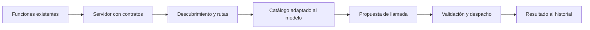

# 92 S13 - Laboratorio local de descubrimiento y extensión B

[[Obsidian/posgrado/master/IA GENERATIVA Y AGENTES/13 MCP descubrimiento y casos de uso/00 Índice - S13 MCP y casos de uso|Índice de la sesión 13]] · [[Obsidian/posgrado/master/IA GENERATIVA Y AGENTES/00 Inicio/00 INICIO - Ruta de aprendizaje|Inicio de la materia]]

## Qué pide la sesión y qué puede comprobarse aquí

El PDF describe la Parte 5 del notebook del miércoles: implementar descubrimiento con `tools/list`, añadir un segundo servidor y comprobar que el agente conserve su código. La diapositiva 24 señala que falta un enunciado operativo para `ClienteMultiMCP`. Esto se registra **según el PDF**: no se recibió ese notebook para reproducir el defecto.

La práctica adjunta es una construcción propia, local y determinista. Usa clases Python para representar catálogo, servidor y cliente agregado. **No implementa transporte MCP real ni utiliza un LLM.** Sirve para demostrar el desacople, la validación y el enrutamiento; no prueba interoperabilidad, autenticación, latencia ni selección inteligente de herramientas.

Código: [[Obsidian/posgrado/master/IA GENERATIVA Y AGENTES/13 MCP descubrimiento y casos de uso/Practica/s13_descubrimiento_local.py|s13_descubrimiento_local.py]]. Resultado de la ejecución: [[Obsidian/posgrado/master/IA GENERATIVA Y AGENTES/13 MCP descubrimiento y casos de uso/Practica/s13_resultados_verificados.json|s13_resultados_verificados.json]].

Para reproducirlo desde cualquier directorio:

```bash
python3 "/Users/alech/Documents/notes/Obsidian/posgrado/master/IA GENERATIVA Y AGENTES/13 MCP descubrimiento y casos de uso/Practica/s13_descubrimiento_local.py"
```

Solo requiere la biblioteca estándar de Python. La tasa de conversión usada es **ficticia y fija: 2**; no es información de mercado ni una recomendación financiera.

## Paso 1: publicar un contrato completo

`ServidorSimulado.publicar()` guarda dos cosas separadas: el contrato descriptivo y la función que ejecuta la operación. El servidor de ventas publica `consultar_ventas(mes)` para marzo y abril de 2026. La primera llamada devuelve marzo con total 2695.

Esta separación corrige conceptualmente el hueco que la diapositiva 25 atribuye a `TOOL_REGISTRY`: un mapa nombre→función permite despachar, pero no contiene necesariamente descripción ni esquema. Publicar un catálogo requiere datos que ese mapa simple no aporta.

## Paso 2: descubrir y conservar la ruta

`ClienteMultiSimulado.descubrir()` consulta los proveedores configurados y produce nombres públicos con prefijo. Por ejemplo, `ventas__consultar_ventas` apunta al servidor de ventas y a su nombre local `consultar_ventas`.

```python
# Estructura conceptual de una entrada del dispatcher.
rutas["ventas__consultar_ventas"] = (servidor_ventas, "consultar_ventas")
```

El **dispatcher** es el componente que decide a dónde enviar la llamada. El nombre público sirve para distinguir herramientas en el host; el nombre local sirve para invocar la implementación correcta en su servidor. El prefijo utiliza un identificador configurado por esta práctica.

## Paso 3: ofrecer el catálogo a la decisión

La función `agente(catalogo, despachar, politica)` recibe sus dependencias desde fuera. No contiene un registro literal de las operaciones de ventas o cambio. La política de prueba recibe el catálogo y devuelve una propuesta; sustituye deliberadamente al LLM para que la demostración sea reproducible.

```python
propuesta = politica(catalogo)
resultado = despachar(propuesta["name"], propuesta["arguments"])
```

Antes del despacho, el agente comprueba que la propuesta pertenezca a la lista ofrecida. El servidor valida argumentos antes de ejecutar. En un agente real, aquí faltaría adaptar el catálogo para la API del modelo, incluirlo en su llamada y devolver resultados al historial con sus identificadores.

## Paso 4: agregar el segundo proveedor

El proveedor `cambio` publica `convertir_moneda(monto)`. Se añade a la configuración del cliente y se vuelve a descubrir:

```text
Antes:   ventas__consultar_ventas
Después: cambio__convertir_moneda, ventas__consultar_ventas
```

Se llama al mismo agente con una nueva política guionizada. Para monto 100 y tasa ficticia 2, el resultado es 200. El script calcula el SHA-256 del texto fuente de `agente` antes y después y exige que coincida. Eso prueba que **esta demostración** incorporó la capacidad sin editar esa función. Cambiaron la configuración y la política de prueba; no se afirma autonomía del modelo.

## Qué se verificó al ejecutar

| Comprobación | Resultado |
| --- | --- |
| Consulta al catálogo inicial | Marzo devuelve 2695 |
| Herramienta nueva descubierta | Conversión ficticia devuelve 200 |
| Fuente de `agente` | Igual antes y después |
| Mes fuera del dominio | Rechazado |
| Campo requerido ausente | Rechazado |
| Campo extra | Rechazado |
| Monto de tipo string | Rechazado |
| Booleano usado como monto | Rechazado |
| Nombre fuera del catálogo | Rechazado |
| Mismo nombre local en dos proveedores | Rutas públicas distintas y resultados correctos |
| Seis pares M,N de las notas | Conteos y desigualdad coherentes |

El validador solo cubre el subconjunto de esquema usado: objetos, campos requeridos, campos extra, string, number y enum. Un cliente o servidor de producción necesita un validador completo para los contratos que admita. La práctica no intenta ser un SDK MCP.

## La extensión B exige más que cambiar el registro

La diapositiva 25 señala dos ajustes en el andamiaje: incorporar contratos completos y dar al catálogo un lugar en la llamada al modelo. De forma concreta, la cadena completa debe quedar conectada:



Publicar funciones no resuelve la mitad derecha. La lista debe llegar a la decisión del modelo y las propuestas deben volver al proveedor correcto. La observación debe volver al historial para que la respuesta use el resultado real.

La extensión es opcional según el PDF. Para revisar su criterio «herramienta nueva sin editar el agente» hace falta demostrar antes y después con una traza, y distinguir configuración del código del bucle. La práctica reproduce esa propiedad arquitectónica; una entrega con MCP real deberá además comprobar el transporte y la revisión exigida por su entorno.

Fuente de clase: PDF 24–26 · numeración visible igual a la página PDF · [[Obsidian/posgrado/master/IA GENERATIVA Y AGENTES/Materiales/sesion-13.pdf#page=24|Sesión 13]].

---

← [[Obsidian/posgrado/master/IA GENERATIVA Y AGENTES/13 MCP descubrimiento y casos de uso/91 S13 - Agentes analistas de código y de investigación|Anterior]] · [[Obsidian/posgrado/master/IA GENERATIVA Y AGENTES/13 MCP descubrimiento y casos de uso/93 S13 - Ejercicios resueltos y repaso activo|Siguiente]] →
