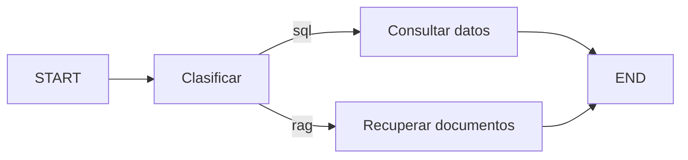

# 100 S14 - Estado nodos y aristas en LangGraph

[[Obsidian/posgrado/master/IA GENERATIVA Y AGENTES/14 Multiagente LangGraph y robustez/00 Índice - S14 Multiagente LangGraph y robustez|Índice de S14]] · [[Obsidian/posgrado/master/IA GENERATIVA Y AGENTES/00 Inicio/00 INICIO - Ruta de aprendizaje|Inicio de la materia]]

LangGraph representa un proceso como un **grafo de estados**. El estado guarda la información disponible; los nodos realizan trabajo y devuelven actualizaciones; las aristas determinan qué nodo sigue. Un nodo puede llamar a un LLM, consultar datos o ejecutar código determinista.

## Del diccionario al contrato del estado

```python
from typing import TypedDict

class Estado(TypedDict):
    pregunta: str
    ruta: str
    respuesta: str
```

`TypedDict` describe las claves y sus tipos para herramientas de análisis estático. **No valida por sí solo los datos en tiempo de ejecución.** Si un clasificador devuelve una ruta desconocida, el programa necesita rechazarla o manejarla. Un esquema documentado no equivale a una garantía de corrección semántica.

Un nodo devuelve lo que modifica. Si solo responde, puede devolver `{"respuesta": "..."}`. Para las claves sin reductor, una actualización sustituye el valor anterior. Devolver el diccionario entero puede reenviar valores que no querías actualizar.

## Ejemplo completo sin modelo remoto

```python
from typing import TypedDict
from langgraph.graph import StateGraph, START, END

class Estado(TypedDict):
    pregunta: str
    ruta: str
    respuesta: str

def clasificar(e: Estado):
    ruta = "sql" if "ventas" in e["pregunta"].lower() else "rag"
    return {"ruta": ruta}

def sql(e: Estado):
    return {"respuesta": "Aquí se consultaría la base de ventas."}

def rag(e: Estado):
    return {"respuesta": "Aquí se recuperarían las políticas."}

def router(e: Estado):
    return e["ruta"]

g = StateGraph(Estado)
g.add_node("clasificar", clasificar)
g.add_node("sql", sql)
g.add_node("rag", rag)
g.add_edge(START, "clasificar")
g.add_conditional_edges("clasificar", router, {"sql": "sql", "rag": "rag"})
g.add_edge("sql", END)
g.add_edge("rag", END)
app = g.compile()
resultado = app.invoke({"pregunta": "¿Cuáles son las ventas de marzo?",
                        "ruta": "", "respuesta": ""})
```

Este ejemplo propio clasifica por una palabra y devuelve mensajes ilustrativos; no calcula ventas ni busca documentos. Su sintaxis se revisó, pero no se ejecutó con LangGraph en esta entrega.



La bifurcación representa una sola ruta elegida por pregunta. No hay dos agentes ejecutándose en paralelo. `START` señala la entrada y `END` el cierre. Compilar prepara el grafo y comprueba su estructura antes de invocarlo; no compila un nuevo modelo ni valida la verdad de la respuesta.

## Traducción desde el miércoles

| Motor de bolsillo | LangGraph | Qué se vuelve explícito |
| --- | --- | --- |
| `Grafo()` | `StateGraph(Estado)` | Esquema del estado |
| `agregar_nodo` | `add_node` | Nombre y función |
| `agregar_arista_condicional` | `add_conditional_edges` | Router y destinos |
| `ejecutar(estado, inicio=...)` | `START`, `compile`, `invoke` | Entrada, preparación y ejecución |

El grafo reemplaza el motor de coordinación. Las funciones que consultan y los permisos que las limitan siguen requiriendo diseño.

Fuente: PDF 9–10 · numeración visible = página PDF · [[Obsidian/posgrado/master/IA GENERATIVA Y AGENTES/Materiales/sesion-14.pdf#page=9|sesion-14.pdf]].

---

← [[Obsidian/posgrado/master/IA GENERATIVA Y AGENTES/14 Multiagente LangGraph y robustez/99 S14 - Evidencia histórica y cómo comparar varios agentes|Anterior]] · [[Obsidian/posgrado/master/IA GENERATIVA Y AGENTES/14 Multiagente LangGraph y robustez/101 S14 - Reductores concurrencia y límites del grafo|Siguiente]] →
