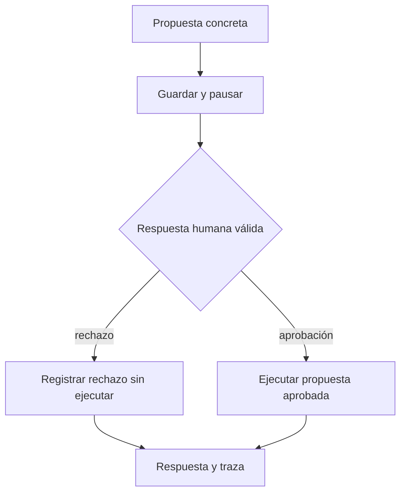

# 102 S14 - Pausas aprobación humana y contrato de salida

[[Obsidian/posgrado/master/IA GENERATIVA Y AGENTES/14 Multiagente LangGraph y robustez/00 Índice - S14 Multiagente LangGraph y robustez|Índice de S14]] · [[Obsidian/posgrado/master/IA GENERATIVA Y AGENTES/00 Inicio/00 INICIO - Ruta de aprendizaje|Inicio de la materia]]

Una confirmación protege una acción cuando el programa detiene su ejecución hasta recibir una decisión. Escribir «pide permiso antes de borrar» en el prompt no coloca una barrera en el camino de la función de borrado.

## Tres piezas de una pausa

Un **checkpoint** guarda el estado para reanudarlo. El **checkpointer** es el componente que lo almacena. `thread_id` identifica la ejecución persistida que debe recibir la decisión. `interrupt(...)` comunica lo pendiente y pausa; `Command(resume=...)` entrega la decisión para continuar.

![[Obsidian/posgrado/master/IA GENERATIVA Y AGENTES/Recursos visuales/Capítulo 14/04-pausa-y-aprobacion.png]]

La propuesta azul conserva lo que se intenta hacer. El interrupt y la decisión humana están separados del efecto. El checkpoint permite relacionar esa decisión con el trabajo pendiente. La rama roja cierra con rechazo y la verde ejecuta la propuesta aprobada. Aprobar una descripción ambigua no alcanza: destino, contenido y alcance también deben ser los que se ejecuten.



Las dos ramas tienen cierre explícito. Una decisión ausente queda pendiente o se rechaza según la política elegida; nunca debería convertirse por accidente en permiso.

## Un detalle al reanudar

La documentación aclara que el nodo con `interrupt` vuelve a ejecutarse desde su comienzo. Colocar un envío antes de la pausa puede repetirlo. Conviene separar el nodo que pide aprobación del que realiza el efecto, y diseñar operaciones idempotentes cuando puedan reintentarse. **Idempotente** significa que repetir la misma operación no añade un efecto distinto del primero. [Interrupts](https://docs.langchain.com/oss/python/langgraph/interrupts).

`InMemorySaver` sirve para una demostración en el mismo proceso; no conserva el estado después de perder esa memoria. La sesión recomienda un checkpointer durable para usos que necesitan sobrevivir a reinicios. Un `thread_id` es una clave de recuperación, no una autorización de usuario por sí misma.

## Migrar sin romper a quien llama

La sesión describe que Lab 04 importa `AnalystAgent`, llama a `run(question)` y lee `answer`. La migración debe conservar ese contrato externo aunque internamente use un grafo:

```json
{
  "question": "¿Qué se pudo comprobar?",
  "answer": "Respuesta completa o parcial con su explicación",
  "trace": [],
  "status": "max_steps_reached"
}
```

`trace` recoge eventos y resultados. Una ejecución pausada necesita además una representación clara de lo pendiente; no debería fingir que terminó. Los archivos reales de Lab 03 y Lab 04 no se recibieron aquí: el contrato se explica según el PDF.

La guía v1 marca `create_react_agent` como deprecada y remite a `create_agent` de LangChain. Deprecado significa que se desaconseja para desarrollo nuevo y tiene una vía de migración; no afirma que el símbolo haya desaparecido de toda versión. [Guía de migración](https://docs.langchain.com/oss/python/migrate/langgraph-v1).

Fuente: PDF 13–14 · numeración visible = página PDF · [[Obsidian/posgrado/master/IA GENERATIVA Y AGENTES/Materiales/sesion-14.pdf#page=13|sesion-14.pdf]].

---

← [[Obsidian/posgrado/master/IA GENERATIVA Y AGENTES/14 Multiagente LangGraph y robustez/101 S14 - Reductores concurrencia y límites del grafo|Anterior]] · [[Obsidian/posgrado/master/IA GENERATIVA Y AGENTES/14 Multiagente LangGraph y robustez/103 S14 - Presupuestos repetición y costo del historial|Siguiente]] →
