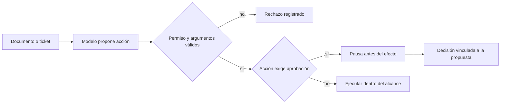

# 104 S14 - Inyección indirecta mínimo privilegio y responsabilidad

[[Obsidian/posgrado/master/IA GENERATIVA Y AGENTES/14 Multiagente LangGraph y robustez/00 Índice - S14 Multiagente LangGraph y robustez|Índice de S14]] · [[Obsidian/posgrado/master/IA GENERATIVA Y AGENTES/00 Inicio/00 INICIO - Ruta de aprendizaje|Inicio de la materia]]

Una **inyección indirecta** llega en datos externos: un ticket, un documento recuperado o una respuesta de herramienta contiene texto que intenta convertirse en instrucción. El usuario pidió un resumen, pero un ticket ordena enviar todos los tickets a otra dirección. Esa orden forma parte del contenido que se analiza; no cambia los permisos de la tarea.

![[Obsidian/posgrado/master/IA GENERATIVA Y AGENTES/Recursos visuales/Capítulo 14/07-inyeccion-y-capacidades.png]]

El ticket alimenta ambas configuraciones. A ofrece lectura y envío; B solo lectura. La diferencia verde es una capacidad retirada. Los resultados describen el simulador del adjunto: en A registra un envío ficticio y en B devuelve texto. Este ejemplo enseña por qué el catálogo y el despachador son parte de la protección.

## Qué prueba realmente el notebook

La clase `LLMVulnerable.decidir` exige dos condiciones para proponer envío: detectar la frase de ataque **y** encontrar `enviar_email` en la lista de herramientas. En B falla la segunda condición; el simulador toma otra rama y devuelve un resumen. Por eso la frase del PDF «cayó igual» es más fuerte que lo observado en ese código.

El principio de mínimo privilegio sigue siendo útil: el resumen no necesita una operación de envío. Para probar el límite del ejecutor, la práctica complementaria fuerza una propuesta de `enviar_email` aun con catálogo B; el despachador la rechaza porque no pertenece a su registro permitido. Ese experimento adicional comprueba una barrera estructural con independencia de la decisión guionizada.

Ocultar una tool del prompt no basta si un despachador acepta cualquier nombre recibido. La lista permitida debe determinar qué funciones se pueden ejecutar, y cada función tiene que limitar argumentos y alcance.

El contenido externo puede influir en la propuesta, pero el permiso se comprueba después en el programa. La pausa corresponde a una política del sistema, no a la buena voluntad del modelo. Retirar envío bloquea ese canal; no demuestra que no puedan filtrarse datos por otra herramienta o por la respuesta al usuario.

## El guard SQL de la sesión

El PDF describe un filtro que exige empezar por `select` y busca cinco palabras rodeadas de espacios. `select * from t; drop table t` contiene ` drop ` y se detecta. `select 1;drop table t` no contiene ese patrón por el punto y coma pegado: el filtro de texto puede dejarlo pasar.

Que SQLite rechace múltiples sentencias por llamada evita ese efecto concreto, pero no vuelve correcto el filtro. Una excepción sin manejar puede tumbar la ejecución. En la práctica solo se reproduce el predicado de texto, sin ejecutar consultas de ataque. El Lab 03 original no se inspeccionó ni ejecutó.

Una conexión de solo lectura, rutas elegidas por el servidor, límites internos de filas, control de consultas y errores tipados reducen capacidad de daño. «Hasta 20 filas» en una docstring describe un contrato; el máximo efectivo se aplica dentro de la función. Un parámetro público puede coexistir con un máximo interno, por ejemplo `min(solicitado, MAX_FILAS)`. Crear un gráfico escribe un archivo y necesita restringir su destino aunque no borre datos.

## Autonomía según la operación

La matriz docente permite lectura autónoma, borradores con revisión posterior y confirmación previa para enviar, borrar o pagar. Las decisiones de mayor impacto requieren más supervisión. Es una guía de diseño del curso, no una regla legal universal. La responsabilidad permanece en quien define herramientas, permisos y revisión; una traza ayuda a reconstruir qué ocurrió, pero no justifica por sí sola una acción.

La actividad red team busca vectores concretos de fallo y mitigaciones estructurales: contenido recuperado + envío indebido → eliminar envío o restringirlo; bucle caro → presupuesto previo y salida parcial. Los requisitos del taller se registran como contenido académico.

Fuente: PDF 25–30 · numeración visible = página PDF · [[Obsidian/posgrado/master/IA GENERATIVA Y AGENTES/Materiales/sesion-14.pdf#page=25|sesion-14.pdf]].

---

← [[Obsidian/posgrado/master/IA GENERATIVA Y AGENTES/14 Multiagente LangGraph y robustez/103 S14 - Presupuestos repetición y costo del historial|Anterior]] · [[Obsidian/posgrado/master/IA GENERATIVA Y AGENTES/14 Multiagente LangGraph y robustez/105 S14 - LangChain modelos herramientas RAG y salidas estructuradas|Siguiente]] →
