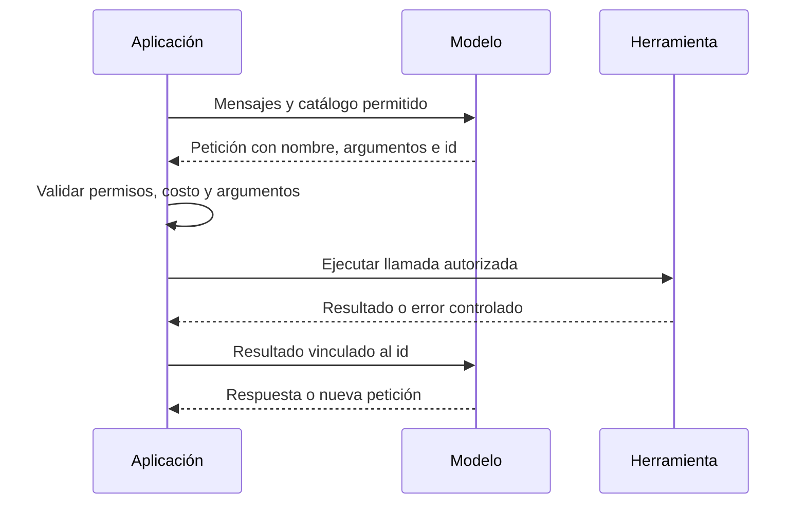

# 105 S14 - LangChain modelos herramientas RAG y salidas estructuradas

[[Obsidian/posgrado/master/IA GENERATIVA Y AGENTES/14 Multiagente LangGraph y robustez/00 Índice - S14 Multiagente LangGraph y robustez|Índice de S14]] · [[Obsidian/posgrado/master/IA GENERATIVA Y AGENTES/00 Inicio/00 INICIO - Ruta de aprendizaje|Inicio de la materia]]

LangChain reúne interfaces para modelos, herramientas y recuperadores. LangGraph coordina estados y transiciones. LangSmith registra y evalúa ejecuciones. Las tres piezas pueden participar en una aplicación, pero el curso permite construir el bucle directamente.

![[Obsidian/posgrado/master/IA GENERATIVA Y AGENTES/Recursos visuales/Capítulo 14/08-tres-bibliotecas.png]]

La primera caja conecta con capacidades; la segunda decide cómo avanza la ejecución; la tercera registra lo ocurrido. La banda inferior conserva responsabilidades del diseño: elegir permisos, comprobar evidencia y controlar gasto. Empaquetar el bucle ahorra código, pero esas decisiones siguen existiendo.

## El modelo como objeto

El tutorial configura `ChatOpenAI` con una URL compatible con la interfaz OpenAI y descubre un identificador mediante `/models`. El nombre de la clase es el adaptador utilizado; no implica que el servidor remoto pertenezca a OpenAI. Elegir automáticamente el primer id es una simplificación: cuando hay varios modelos, debes seleccionar uno por capacidades y configuración.

`invoke` recibe mensajes y devuelve una respuesta. `usage_metadata` puede conservar tokens de entrada y salida si el servidor los informa. Si no están disponibles, la traza debe indicarlo; inventar ceros impediría medir consumo. Los tokens reportados en el tutorial son resultados de sus llamadas del 1 de octubre, no cifras reproducidas aquí.

La URL privada de la H200 y la cadena `local` se explican como configuración docente. No se estableció una conexión a la universidad para crear estas notas.

## De una función a una herramienta

`@tool` utiliza el nombre, la descripción de la docstring y las anotaciones de tipos para construir un contrato. `bind_tools` presenta ese catálogo al modelo. Una entrada en `tool_calls` es una solicitud; hace falta código que ejecute la función y devuelva su resultado ligado a la llamada.

La aplicación controla el paso entre petición y ejecución. El id permite que el modelo relacione el resultado con la solicitud correcta. Si existen varias llamadas, el bucle debe manejar cada una y producir sus resultados correspondientes, o rechazos explícitos.

El ejemplo SQL del tutorial abre la base con `mode=ro` y envuelve una subconsulta con `LIMIT 20`. Eso impone un alcance más concreto que un prompt, pero no es una solución general para cualquier entrada SQL: una sintaxis inválida falla, una consulta de agregación puede costar trabajo aunque devuelva una fila, y se necesitan controles de tiempo y manejo de errores. La base del tutorial no forma parte de los adjuntos recibidos.

## Clasificar con estructura y verificar significado

Un esquema `Ruta` con `Literal["sql", "rag", "sensible"]` acota la forma de la salida. `motivo: str` añade una explicación. Un valor `sql` válido puede seguir siendo incorrecto para «borra duplicados»; validar forma no valida la decisión.

El tutorial observó 25 tokens de entrada con el método `json_schema` y 245 con `function_calling`, y obtuvo la ruta correcta en tres preguntas solo con este último. Es una observación de ese endpoint, modelo y versión. No demuestra que toda implementación `json_schema` omita el esquema. La documentación distingue estrategias de proveedor y de herramientas; la compatibilidad debe comprobarse. [Salida estructurada](https://docs.langchain.com/oss/python/langchain/structured-output).

## RAG como una capacidad más

El recuperador convierte pregunta y documentos en embeddings, busca fragmentos y devuelve texto. Al envolverlo como tool, el agente puede decidir cuándo usarlo. `InMemoryVectorStore` sirve para un ejemplo en memoria; Qdrant requiere su integración y persistencia. `k=1` devuelve un fragmento, no garantiza toda la evidencia para una pregunta compleja. La salida de búsqueda debe conservar referencias para poder citarla y tratarse como contenido no confiable frente a inyección.

`MessagesState`, `ToolNode` y `tools_condition` empaquetan mensajes, ejecución y ruta herramientas/fin. `create_agent` de LangChain crea el grafo del bucle y acepta configuración adicional. Ocultar detalles de ensamblaje no elimina el presupuesto ni la política de errores. La relación LangChain sobre LangGraph se confirma en la [introducción oficial](https://docs.langchain.com/oss/python/langchain/overview).

Fuente: PDF 2–11 · numeración visible = página PDF · [[Obsidian/posgrado/master/IA GENERATIVA Y AGENTES/Materiales/tutorial-langgraph.pdf#page=2|tutorial-langgraph.pdf]].

---

← [[Obsidian/posgrado/master/IA GENERATIVA Y AGENTES/14 Multiagente LangGraph y robustez/104 S14 - Inyección indirecta mínimo privilegio y responsabilidad|Anterior]] · [[Obsidian/posgrado/master/IA GENERATIVA Y AGENTES/14 Multiagente LangGraph y robustez/106 S14 - LangSmith trazas evaluación y elección de herramientas|Siguiente]] →
