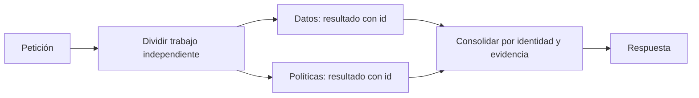

# 98 S14 - Contratos de traspaso y paralelismo

[[Obsidian/posgrado/master/IA GENERATIVA Y AGENTES/14 Multiagente LangGraph y robustez/00 Índice - S14 Multiagente LangGraph y robustez|Índice de S14]] · [[Obsidian/posgrado/master/IA GENERATIVA Y AGENTES/00 Inicio/00 INICIO - Ruta de aprendizaje|Inicio de la materia]]

Un **traspaso de control**, o handoff, permite que otro agente continúe la tarea. La sesión propone tres piezas: resultado parcial, objetivo siguiente y restricciones. Es el equivalente de un contrato de herramienta, aplicado a un destinatario con capacidad de decidir.

## Un contrato que conserva lo necesario

«Sigue con las ventas» deja sin especificar el mes, las unidades y lo que falta. Este ejemplo propio reduce esa ambigüedad:

```json
{
  "resultado_parcial": {
    "total": 12000,
    "moneda": "USD",
    "periodo": "2026-03",
    "fuente": "consulta-17"
  },
  "objetivo_siguiente": "Relacionar el total con la política de devoluciones",
  "restricciones": ["No inventar porcentajes", "Citar la versión vigente de la política"]
}
```

Los 12 000 USD son un dato inventado para enseñar el contrato. Un sistema real debe incluir evidencia comprobable, quién produjo el dato y qué sigue pendiente. Una lista de restricciones sigue siendo texto para el modelo; los permisos de ejecutar acciones se aplican además en el programa.

## Ramas independientes y consolidación

El paralelismo ejecuta trabajos a la vez. Si A tarda 4 segundos y B tarda 6, una ejecución en serie toma aproximadamente 10; una paralela, aproximadamente 6 más coordinación. Es una estimación propia con recursos suficientes y ramas independientes. Si B necesita primero el resultado de A, ese ahorro no existe.

Para el mismo conjunto de llamadas, el costo aditivo de las ramas se suma tanto en serie como en paralelo. El paralelismo lo concentra en menos tiempo. En una ejecución real pueden cambiar reintentos, respuestas y costos, por lo que no se promete igualdad exacta de facturación.



Las dos ramas no se leen mutuamente. La consolidación recibe resultados etiquetados y utiliza su significado. El orden de llegada puede variar: «primer resultado = ventas» sería una suposición frágil. Un campo `id` o `tipo` identifica ventas aunque llegue después de políticas.

## Un presupuesto para toda la tarea

Tres ramas con un presupuesto individual de 1 USD pueden gastar 3 USD. Si el usuario esperaba un tope total de 1 USD, el diseño ya lo incumple aunque cada rama obedezca su límite.

La solución necesita un contador compartido y **reserva atómica**: comprobar disponibilidad y descontar lo autorizado como una sola operación. Si dos ramas ven 0,60 USD disponibles y cada una reserva 0,40 sin coordinación, ambas pueden aprobarse y sumar 0,80. Un reductor que junta listas de resultados no implementa esa reserva de dinero.

También hacen falta una política para ramas que fallan y un cierre definido: respuesta parcial con evidencia disponible, reintento acotado o fallo explicado. El supervisor no debe convertir una ausencia de datos en una cifra inventada.

> [!question]- ¿Qué distingue supervisor y handoff?
> En el supervisor, la delegación regresa al coordinador. En el handoff, el destinatario continúa con el control. La diferencia está en las aristas y en el contrato, no solo en el nombre del rol.

Fuente: PDF 5–7 y 12 · numeración visible = página PDF · [[Obsidian/posgrado/master/IA GENERATIVA Y AGENTES/Materiales/sesion-14.pdf#page=5|sesion-14.pdf]].

---

← [[Obsidian/posgrado/master/IA GENERATIVA Y AGENTES/14 Multiagente LangGraph y robustez/97 S14 - Cuándo dividir un agente y usar un supervisor|Anterior]] · [[Obsidian/posgrado/master/IA GENERATIVA Y AGENTES/14 Multiagente LangGraph y robustez/99 S14 - Evidencia histórica y cómo comparar varios agentes|Siguiente]] →
