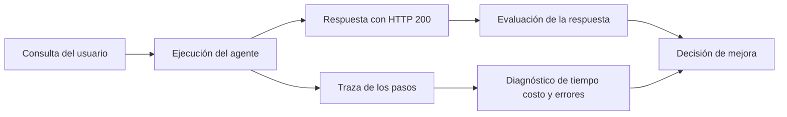

# 01 S17 - Por qué una respuesta exitosa puede ser un fallo

[[Obsidian/posgrado/master/IA GENERATIVA Y AGENTES/17 Observabilidad y versionado de prompts/00 Índice - S17 Observabilidad y prompts|Índice de S17]] · [[Obsidian/posgrado/master/IA GENERATIVA Y AGENTES/00 Inicio/00 INICIO - Ruta de aprendizaje|Inicio de la materia]]

Una aplicación puede contestar con normalidad y aun así equivocarse, gastar demasiado o hacer esperar al usuario. Esa es la idea central de la sesión: **que el servidor diga «la petición terminó» no demuestra que el trabajo esté bien hecho**.

Imagina un asistente que consulta las ventas de una tienda. El servidor devuelve una respuesta, pero afirma que se vendieron 120 unidades cuando la base de datos dice 12. Otra ejecución responde correctamente y envía al modelo un documento enorme que no necesitaba. Una tercera responde bien, pero tarda 30 segundos porque una herramienta repite una consulta. Las tres pueden aparecer como exitosas en el registro del servidor. El ejemplo de la tienda es elaboración didáctica propia; los tres tipos de fallo proceden de la sesión.

## Qué significa HTTP 200

**HTTP** es el protocolo con el que un cliente y un servidor intercambian peticiones y respuestas. **HTTP 200** es un código de estado que suele indicar que el servidor procesó la petición correctamente. Describe el intercambio técnico. No comprueba si la respuesta contiene una cifra falsa, si cumplió las instrucciones o si su costo fue razonable.

Esto importa porque, en un agente, hay al menos tres niveles de éxito: la petición llegó, el procedimiento terminó y la respuesta resolvió la necesidad del usuario. Es posible aprobar los dos primeros y fallar en el tercero.

## Logging y observabilidad

Un **log** es una anotación de un evento: «se recibió una pregunta», «la herramienta devolvió un error», «terminó la ejecución». **Logging** es la actividad de producir esas anotaciones. Los logs son útiles, pero una lista desordenada de mensajes puede no permitir asociar todos los pasos a la misma consulta.

**Observabilidad** es la capacidad de reconstruir una ejecución y explicar qué ocurrió con la evidencia registrada. Para un agente necesitamos saber qué pasos ejecutó, cuánto duraron, qué modelo usó, cuántos tokens consumió, qué prompt tenía y dónde apareció un error. Los logs pueden formar parte de esa evidencia. La diferencia es la capacidad de responder preguntas, no el nombre del archivo.

Un **token** es una unidad en la que el modelo divide el texto para procesarlo: puede ser una palabra o parte de ella. Un **prompt** es la combinación de instrucciones y contexto que se envía para pedir la tarea. Estas dos piezas importan aquí porque el consumo se cuenta en tokens y las instrucciones pueden cambiar entre corridas.

**LLM** significa modelo grande de lenguaje: un modelo que procesa y genera lenguaje. Una **API** es la interfaz con la que un programa solicita operaciones a otro; no es el modelo mismo. Cuando el agente usa una API de un modelo, necesita enviar la solicitud y recibir su respuesta, además de registrar cómo fue la llamada.

**LLMOps** reúne las prácticas para operar aplicaciones con modelos de lenguaje: evaluar, desplegar, medir, corregir y controlar cambios. **MLOps** aplica esa idea a sistemas de aprendizaje automático en general. La sesión destaca dos particularidades de las aplicaciones con LLM: las instrucciones pueden cambiar sin cambiar el modelo y muchas llamadas se cobran según los tokens. Por eso controlar solo el código de la aplicación deja una parte del sistema sin describir.

La respuesta permite comprobar si el usuario recibió algo útil. La traza permite entender el procedimiento que produjo esa respuesta. Las dos ramas se juntan al decidir una mejora: conocer la causa sin verificar la calidad no basta, y conocer una respuesta incorrecta sin su recorrido tampoco explica cómo corregirla.

## Del síntoma a una explicación comprobable

En el ejemplo propio de ventas, el síntoma es «la respuesta dice 120 y el dato correcto es 12». Hay al menos dos causas posibles: la herramienta devolvió 120 por consultar otra tienda, o devolvió 12 y el modelo lo convirtió erróneamente en 120. Cambiar el prompt sin distinguirlas sería actuar a ciegas.

Si la traza de la consulta `ventas-001` muestra una herramienta con `tienda = 102` cuando la pregunta pedía la 101, se investiga la selección de argumentos. Si sus argumentos corresponden a la tienda 101 y su salida es 12, pero la generación recibe 12 y responde 120, se investiga la elaboración de la respuesta. Una **herramienta** es una operación que el agente puede solicitar a un programa externo: consultar datos, calcular o buscar. Sus argumentos son los valores que necesita para ejecutar la operación.

La traza no demuestra por sí sola la verdad de todos los datos: hay que contrastar lo registrado con una fuente válida. Sí permite ubicar **dónde cambió la información** y formular una hipótesis que se pueda probar. El paso siguiente sería repetir el caso con una corrección y evaluar si la respuesta ya coincide con 12, sin empeorar otros casos.

## Cuatro preguntas que sí debe responder el registro

| Pregunta | Evidencia necesaria | Qué decisión permite |
| --- | --- | --- |
| ¿Qué consultas fallan más? | Tipo de consulta, errores técnicos y resultados de evaluación | Priorizar un grupo de fallos |
| ¿Cuánto cuesta cada tipo? | Modelo, tokens y tarifas aplicables | Encontrar el gasto que puede reducirse |
| ¿Empeoró el cambio de prompt? | Versión exacta y evaluación comparable | Mantener, corregir o revertir |
| ¿Qué ocurrió en esta respuesta? | Identificador de traza, pasos, entradas y salidas permitidas | Reconstruir el caso concreto |

El PDF asocia la primera pregunta al campo `error`. Eso cubre **errores técnicos registrados**, como una consulta que lanza una excepción. Una respuesta falsa con HTTP 200 puede tener `error = null`. Para descubrirla se necesita además una evaluación de calidad. Esta precisión evita confundir «no hubo excepción» con «todo fue correcto».

Con 1 000 consultas diarias y una tasa de fallo del 5 %, el cálculo es `1 000 × 0,05 = 50` fallos diarios. Saber que existen 50 fallos todavía no explica sus causas. Podrían concentrarse en preguntas de facturación, en una herramienta particular o en una versión nueva del prompt.

La frase del curso «si no está en la traza, no pasó» expresa una regla de evidencia. No significa que el mundo real deje de ocurrir cuando no se registra; significa que un informe no puede demostrar ni atribuir un evento ausente del registro.

> [!question]- Un asistente devuelve HTTP 200 y una respuesta incorrecta. ¿Dónde se registra el problema?
> La traza registra el recorrido, sus entradas y salidas permitidas, modelo, versión, tiempos y consumo. Un evaluador registra que la respuesta es incorrecta. Puede no existir una excepción técnica. Ambas evidencias deben vincularse a la misma ejecución.

Fuente: PDF 1–3 · numeración visible = página PDF · [[Obsidian/posgrado/master/IA GENERATIVA Y AGENTES/Materiales/S17 Observabilidad y versionado de prompts.pdf#page=2|Sesión 17, página 2]].

---

← [[Obsidian/posgrado/master/IA GENERATIVA Y AGENTES/17 Observabilidad y versionado de prompts/00 Índice - S17 Observabilidad y prompts|Anterior]] · [[Obsidian/posgrado/master/IA GENERATIVA Y AGENTES/17 Observabilidad y versionado de prompts/02 S17 - Trazas spans y campos para reconstruir una corrida|Siguiente]] →
