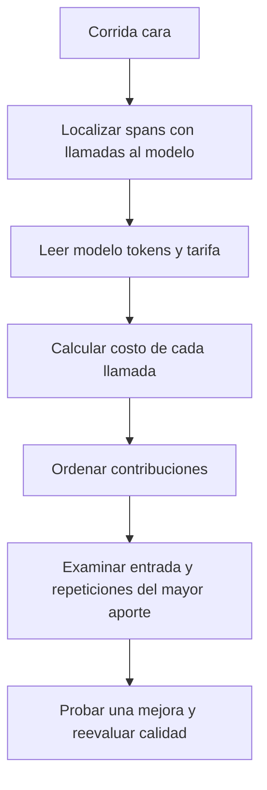

# 03 S17 - Tokens costos y atribución del gasto

[[Obsidian/posgrado/master/IA GENERATIVA Y AGENTES/17 Observabilidad y versionado de prompts/00 Índice - S17 Observabilidad y prompts|Índice de S17]] · [[Obsidian/posgrado/master/IA GENERATIVA Y AGENTES/00 Inicio/00 INICIO - Ruta de aprendizaje|Inicio de la materia]]

Un **token** es una unidad de texto que usa el modelo. Puede ser una palabra, parte de una palabra o un signo; no equivale siempre a un carácter ni a una palabra. Los tokens de entrada representan lo enviado al modelo y los de salida lo producido por él. El proveedor suele devolver estos conteos en un objeto de uso, llamado `usage` en los ejemplos del PDF.

El costo depende de la cantidad **y** de la tarifa. Una salida corta no garantiza una llamada barata si la entrada es enorme.

## Calcular el costo paso a paso

Para las cuentas del material se usa una tarifa histórica de ejemplo de **1 USD por millón de tokens de entrada y 5 USD por millón de tokens de salida**, atribuida a su tabla semestral verificada el 10 de julio de 2026. Se conserva para estudiar los ejercicios; no es una cotización vigente ni una tarifa universal.

La fórmula, cuando esas dos categorías cubren todo el consumo facturable, es:

`costo = (tokens_in / 1 000 000) × precio_entrada + (tokens_out / 1 000 000) × precio_salida`

Ejemplo propio: una llamada usa 1 200 tokens de entrada y 100 de salida.

1. Entrada: `1 200 / 1 000 000 × 1 = 0,0012 USD`.
2. Salida: `100 / 1 000 000 × 5 = 0,0005 USD`.
3. Total: `0,0012 + 0,0005 = 0,0017 USD`.

Para 1 000 llamadas iguales: `1 000 × 0,0017 = 1,70 USD`. Es una estimación del consumo del modelo. No añade impuestos, servidores, servicio de observabilidad u otras tarifas. Si hay categorías con precios distintos —entrada en caché o tokens de razonamiento, por ejemplo— el esquema debe adaptarse a la definición de uso y facturación del proveedor. No se deben sumar conteos de razonamiento dos veces si ya están incluidos en la salida.

## Por qué la cifra de la diapositiva 7 no basta

El PDF presenta 2 800 tokens de entrada, 295 de salida y un total impreso de 0,011 USD. Con las tarifas de ejemplo, la cuenta sería:

`2 800 × 1 / 1 000 000 + 295 × 5 / 1 000 000 = 0,004275 USD`.

Pero la figura no identifica todos los modelos ni todas las tarifas usadas. **No podemos concluir cuál fue el costo real de la traza solo a partir de los tokens agregados**. La cifra 0,004275 USD es válida bajo el supuesto de que todos esos tokens se facturaron a 1/5 USD por millón. El total 0,011 USD queda sin justificar con la información visible.

Esto distingue un error de aritmética de un hueco de evidencia: antes de corregir un total, hay que conocer sus supuestos.

## De una llamada aislada al consumo de una corrida real

Una pregunta del usuario puede producir varias llamadas al modelo. La primera decide qué herramienta utilizar, la herramienta devuelve datos y una segunda llamada redacta la respuesta. El consumo de la corrida es la suma de **las llamadas que realmente se hicieron**, con sus modelos y tarifas correspondientes.

Ejemplo propio, con tarifas inventadas para demostrar el mecanismo. No son precios de productos:

| Llamada | Tarifa entrada/salida por millón | Entrada | Salida | Costo calculado |
| --- | --- | --- | --- | --- |
| Decidir, modelo A | 1 / 5 USD | 1 200 | 100 | `0,0012 + 0,0005 = 0,0017 USD` |
| Redactar, modelo B | 2 / 10 USD | 800 | 150 | `0,0016 + 0,0015 = 0,0031 USD` |
| Corrida completa | No existe una tarifa única | 2 000 | 250 | `0,0017 + 0,0031 = 0,0048 USD` |

Si se aplicara la tarifa de A a los 2 000/250 tokens agregados, el resultado sería `0,002 + 0,00125 = 0,00325 USD`, inferior al total correcto. Se perdería que parte del trabajo usó B. Esa es la razón de conservar economía por generación antes de agruparla por traza.

La entrada no es únicamente la pregunta. Puede contener instrucciones, historial, documentos recuperados, descripción de herramientas y resultados anteriores. Aunque el usuario escriba una línea, el programa puede enviar miles de tokens. La fuente confiable del conteo es el uso que devuelve el proveedor, según sus categorías, no el número de palabras de la pregunta.

Un **reintento** es una nueva ejecución de una operación tras un fallo o resultado insatisfactorio. Si la generación de B termina y consume 0,0031 USD, pero su respuesta no pasa un verificador y se repite con el mismo consumo, el total del ejemplo pasa a `0,0017 + 0,0031 + 0,0031 = 0,0079 USD`. Guardar solo el último intento ocultaría el consumo anterior. Conviene conservar un span por intento con su motivo y resultado.

Si una llamada falla sin devolver `usage`, el consumo no queda determinado por esa ausencia. `tokens = desconocidos` y `tokens = 0` significan cosas distintas. Un cero se justifica cuando sabemos que no hubo llamada o consumo según el alcance del registro; un valor desconocido exige contrastar la evidencia del proveedor o reportar el hueco. El laboratorio propio tiene tokens ficticios conocidos, por lo que no resuelve esa reconciliación de facturación.

## Diez corridas: el 10 % del tráfico concentra el 41 % del gasto

Los datos que informa la sesión son diez corridas simuladas, 59 000 tokens de entrada y 2 914 de salida. Su costo total es 0,07357 USD.

| Cuenta | Operación | Resultado |
| --- | --- | --- |
| Entrada | `59 000 / 1 000 000 × 1` | 0,059 USD |
| Salida | `2 914 / 1 000 000 × 5` | 0,01457 USD |
| Total | `0,059 + 0,01457` | 0,07357 USD |
| Parte de entrada en el gasto | `0,059 / 0,07357 × 100` | 80,2 % aproximadamente |
| Parte de entrada en los tokens | `59 000 / 61 914 × 100` | 95,3 % aproximadamente |

La salida es cinco veces más cara por token, pero la entrada es aproximadamente veinte veces más abundante. Esa abundancia explica que domine el gasto.

La corrida 7 cuesta 0,03013 USD. Su participación es `0,03013 / 0,07357 × 100 = 40,95 %`, alrededor del 41 %. Representa una de diez consultas, el 10 % del tráfico. La **mediana** de costo de las diez corridas es 0,004835 USD; es el valor central del conjunto ordenado. La relación `0,03013 / 0,004835 ≈ 6,23` muestra que la corrida 7 cuesta unas 6,2 veces la mediana.

## Atribuir el gasto es localizarlo

**Atribución** significa asociar una cantidad a la operación que la produjo. Para reducir el costo de la corrida 7 hace falta identificar qué llamadas consumieron tokens y cuánto aportó cada una. Puede que una llamada recibió demasiado contexto, que una herramienta desencadenó varias llamadas o que se repitió el prompt innecesariamente. Estas son hipótesis didácticas, no hechos demostrados sobre la traza 7: el archivo original con sus spans no fue adjuntado.

El flujo pasa del total al detalle. Ordenar las contribuciones evita optimizar una llamada pequeña mientras una entrada excesiva domina el gasto. La última caja obliga a comprobar calidad: reducir contexto puede ahorrar tokens y a la vez eliminar información necesaria.

> [!question]- Un span consume 20 000 tokens de entrada y 200 de salida con las tarifas del ejercicio. ¿Qué parte conviene examinar primero?
> Entrada: `20 000 / 1 000 000 × 1 = 0,02 USD`. Salida: `200 / 1 000 000 × 5 = 0,001 USD`. Total: 0,021 USD. La entrada aporta aproximadamente el 95,24 % del costo. Primero se examina si sus 20 000 tokens son necesarios, y luego se comprueba que cualquier recorte conserva la calidad.

Fuente: PDF 7 y 10–12 · numeración visible = página PDF · [[Obsidian/posgrado/master/IA GENERATIVA Y AGENTES/Materiales/S17 Observabilidad y versionado de prompts.pdf#page=7|Sesión 17, página 7]].

---

← [[Obsidian/posgrado/master/IA GENERATIVA Y AGENTES/17 Observabilidad y versionado de prompts/02 S17 - Trazas spans y campos para reconstruir una corrida|Anterior]] · [[Obsidian/posgrado/master/IA GENERATIVA Y AGENTES/17 Observabilidad y versionado de prompts/04 S17 - Latencia percentiles y diagnóstico de anomalías|Siguiente]] →
