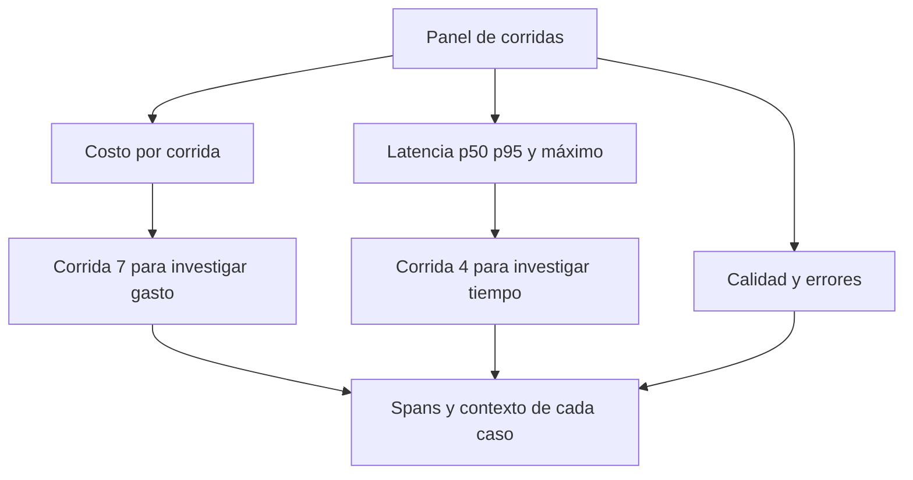

# 04 S17 - Latencia percentiles y diagnóstico de anomalías

[[Obsidian/posgrado/master/IA GENERATIVA Y AGENTES/17 Observabilidad y versionado de prompts/00 Índice - S17 Observabilidad y prompts|Índice de S17]] · [[Obsidian/posgrado/master/IA GENERATIVA Y AGENTES/00 Inicio/00 INICIO - Ruta de aprendizaje|Inicio de la materia]]

La **latencia** es el tiempo transcurrido entre iniciar una operación y obtener su resultado. En esta sesión se mide principalmente en **milisegundos**, abreviados ms: 1 000 ms equivalen a un segundo. Una corrida puede durar mucho por una llamada al modelo, una herramienta lenta, varios pasos encadenados o un guardrail costoso.

Un **dashboard** es un panel que reúne métricas para detectar cambios. Una **métrica** es una medida numérica como costo, duración o tasa de error. Un promedio aislado pierde información sobre la variedad de experiencias del usuario.

## Media, p50 y p95

La **media** suma las duraciones y divide entre la cantidad de corridas. La **mediana** es el centro de los valores ordenados; también se llama percentil 50 o **p50**. Un **percentil** ubica un valor dentro de una distribución ordenada. El **p95** describe la zona en la que se encuentra el 95 % de las observaciones según una convención de cálculo. Ayuda a seguir las respuestas lentas que experimenta una parte pequeña de los usuarios.

En el conjunto de diez corridas de la sesión:

| Estadístico | Valor informado, redondeado | Qué describe |
| --- | --- | --- |
| p50 | 272 ms | La zona central de las corridas |
| Media | 346 ms | El reparto del tiempo total entre las diez |
| p95 | 740 ms | La cola lenta según interpolación lineal |
| Máximo | 1 111,69 ms | La corrida más lenta observada |

El **máximo** es el mayor valor registrado. p95 y máximo no son lo mismo. Con pocas observaciones, un percentil alto cambia mucho al agregar o quitar una corrida; diez consultas son suficientes para el ejercicio, pero ofrecen evidencia limitada sobre el tráfico real.

La sesión usa percentiles con interpolación lineal, como el cálculo que atribuye a **NumPy**, una biblioteca de Python para cálculos numéricos. **Interpolar** es estimar un valor entre dos valores observados. Esto explica que p95 pueda ser 740 ms aunque no exista ninguna corrida con exactamente esa duración.

## Un percentil calculado a mano

Ejemplo didáctico propio, distinto de las diez corridas del curso: duraciones ordenadas `[100, 200, 300, 400, 1 000]` ms.

1. Media: `(100 + 200 + 300 + 400 + 1 000) / 5 = 400 ms`.
2. Mediana: el tercer valor es `300 ms`.
3. Para p95 con interpolación lineal, índice base cero: `(5 − 1) × 0,95 = 3,8`.
4. El índice 3 contiene 400 ms y el índice 4 contiene 1 000 ms.
5. Interpolamos el 80 % de la distancia: `400 + 0,8 × (1 000 − 400) = 880 ms`.

La media es 400 ms aunque cuatro de las cinco consultas sean de 400 ms o menos. El p95 se aproxima a la consulta lenta; el máximo dice que esta llegó a 1 000 ms. Un panel útil puede conservar p50, p95, máximo y número de corridas, además del detalle por span.

## Del percentil al paso que se puede corregir

Un p95 elevado dice que existe una cola lenta, pero no nombra su causa. Se seleccionan las corridas de esa zona, se comparan con otras de la misma tarea y se examinan sus intervalos. Mezclar consultas de una frase con informes de diez páginas puede atribuir a una regresión lo que en realidad es un cambio del tipo de trabajo.

En el ejemplo propio de la [[Obsidian/posgrado/master/IA GENERATIVA Y AGENTES/17 Observabilidad y versionado de prompts/02 S17 - Trazas spans y campos para reconstruir una corrida|nota 02]], la corrida tarda 1 000 ms. La redacción aporta 400 ms y la herramienta 200 ms. Si la redacción se reduce a 250 ms y el resto permanece igual, la nueva latencia secuencial sería `1 000 − 400 + 250 = 850 ms`: mejora de 150 ms o 15 %. Reducir el paso más largo no elimina el tiempo de las otras operaciones.

Cuando hay paralelismo, el cálculo cambia. Supongamos dos búsquedas que comienzan juntas: A tarda 100 ms y B tarda 400 ms; la generación empieza solo cuando llegan ambas y tarda 600 ms. La respuesta tarda aproximadamente `máximo(100, 400) + 600 = 1 000 ms`, sin otros costos.

| Cambio hipotético | Espera por ambas búsquedas | Generación | Tiempo total |
| --- | --- | --- | --- |
| Original | 400 ms | 600 ms | 1 000 ms |
| A baja a 50 ms | 400 ms, B sigue pendiente | 600 ms | 1 000 ms |
| B baja a 200 ms | 200 ms | 600 ms | 800 ms |

El **camino crítico** es la cadena de operaciones y dependencias que determina cuándo puede terminar el trabajo. En este ejemplo, B y la generación forman esa cadena. Optimizar A ahorra trabajo en A, pero no adelanta la respuesta porque sigue esperando B. Esta distinción evita prometer un ahorro de latencia basándose solo en la suma de duraciones.

En el ejemplo de cinco datos anterior, p95 = 880 ms es una interpolación y solo cuatro de cinco duraciones observadas —el 80 %— quedan por debajo. Con muestras pequeñas, «percentil 95» no significa que exactamente el 95 % de esas cinco corridas esté por debajo del número. Describe el cuantil según el método elegido; no garantiza tiempos de futuras consultas.

## La corrida cara y la lenta son diferentes

La corrida 4 dura 1 111,69 ms y cuesta 0,004875 USD. La corrida 7 dura 231,53 ms y cuesta 0,03013 USD. Según la sesión, la 7 es la segunda más rápida y la 4 es la más lenta.

El gasto promedio es `0,07357 / 10 = 0,007357 USD`. La corrida 4 queda por debajo de esa media, pero por encima de la mediana de costo, 0,004835 USD. La diferencia es pequeña pero relevante: llamar «barata» a una corrida depende de la referencia elegida.

El PDF dice que costo y latencia son «ejes independientes». La interpretación precisa aquí es que **una métrica no sustituye a la otra**. Los ejemplos no prueban independencia estadística. En otros sistemas podrían estar correlacionadas: generar más tokens puede incrementar tanto el costo como el tiempo.

Las ramas representan preguntas distintas. El gasto señala la corrida 7 y la duración señala la corrida 4; luego ambas requieren spans para localizar una causa. La tercera rama evita que una respuesta barata y rápida parezca buena cuando su contenido es incorrecto.

## Cómo decidir cuál arreglar

No hay una respuesta universal para la pregunta del PDF «¿cuál arreglar primero?». Si el presupuesto está desbordándose, una corrida que concentra el 41 % del gasto merece atención. Si el compromiso con el usuario exige respuestas rápidas y la corrida lenta bloquea una tarea crítica, la latencia puede tener prioridad.

La regla «alertar si p95 supera tres veces la latencia normal», citada por el PDF, necesita definir qué significa normal: una línea base, un período y consultas comparables. Un umbral sin esa referencia puede generar alertas equivocadas. La **línea base** es el comportamiento medido que sirve de comparación antes de un cambio.

> [!question]- ¿Puede afirmarse que p95 = 740 ms descubre todas las consultas lentas?
> No. Resume una zona de la distribución y puede ocultar casos extremos por encima de ella. Se debe conservar el máximo y permitir abrir las trazas concretas. Además, la convención del percentil y el tamaño de la muestra afectan el resultado.

Fuente: PDF 9–12 y 37 · numeración visible = página PDF · [[Obsidian/posgrado/master/IA GENERATIVA Y AGENTES/Materiales/S17 Observabilidad y versionado de prompts.pdf#page=9|Sesión 17, página 9]].

---

← [[Obsidian/posgrado/master/IA GENERATIVA Y AGENTES/17 Observabilidad y versionado de prompts/03 S17 - Tokens costos y atribución del gasto|Anterior]] · [[Obsidian/posgrado/master/IA GENERATIVA Y AGENTES/17 Observabilidad y versionado de prompts/05 S17 - Instrumentar el bucle y conservar los errores|Siguiente]] →
