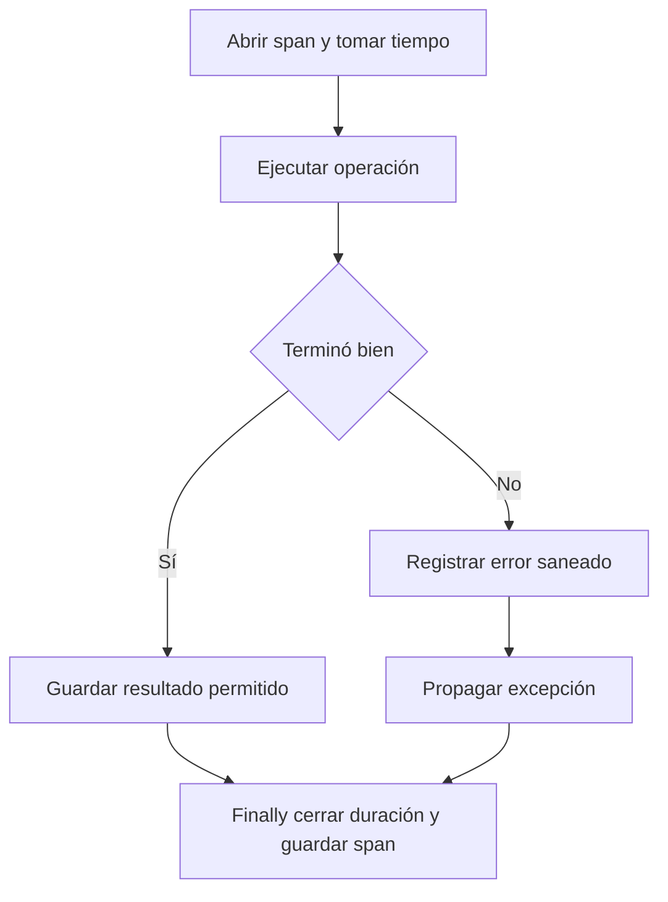

# 05 S17 - Instrumentar el bucle y conservar los errores

[[Obsidian/posgrado/master/IA GENERATIVA Y AGENTES/17 Observabilidad y versionado de prompts/00 Índice - S17 Observabilidad y prompts|Índice de S17]] · [[Obsidian/posgrado/master/IA GENERATIVA Y AGENTES/00 Inicio/00 INICIO - Ruta de aprendizaje|Inicio de la materia]]

**Instrumentar** significa agregar mediciones al lugar donde ocurre una operación. Para explicar por qué un agente tarda o gasta demasiado, necesitamos medir sus pasos internos. Un cronómetro alrededor de toda la función solo dice cuánto tardó la corrida completa.

## Por fuera y por dentro

Un envoltorio es una función que llama al agente y registra información antes o después. Es útil para medir la duración total, pero no ve automáticamente cada consulta o llamada al modelo. Si una corrida dura 1,1 segundos, el envoltorio no identifica si 900 ms corresponden a una herramienta o al modelo.

La instrumentación interna abre y cierra un span alrededor de cada operación importante. Permite relacionar una duración con una causa potencial. Esto no cambia la lógica de parada del agente: todavía puede terminar con una respuesta final o cuando alcanza un límite de pasos. Simplemente conserva evidencia durante el recorrido.

## Qué falta en el andamiaje que describe la sesión

El **andamiaje** es el código base del laboratorio, un punto de partida que el estudiante debe completar. El PDF analiza un agente anterior cuyo `TraceStep` guarda cuatro piezas: número de paso, pensamiento, acción y observación. **Acción** es la operación solicitada a una herramienta; **observación**, en ese bucle, es el resultado que el agente vuelve a recibir. Esa observación del agente no es necesariamente una `observation` del servicio de trazas.

El número de paso no identifica la corrida. Tampoco aparecen los tiempos, el modelo, los tokens o la versión del prompt. La fuente concluye que no contiene ninguno de los once campos mínimos de la sesión. Es una evaluación del archivo citado por el docente; ese repositorio no está entre los archivos adjuntos para comprobarlo aquí.

La página 15 agrupa las exigencias del taller en nueve piezas: cuatro tipos de span, tres correcciones del envoltorio —tiempo que incluya el guardrail, registro aun cuando falla y entrada saneada—, costo e identificación de la traza. Es un recuento del contrato académico, distinto del esquema de once campos. El envoltorio agrega `latency_seconds` y `observed_at`, pero no instrumenta por dentro esas nueve piezas. También señala que los laboratorios se acoplan mediante una importación de código, no leyendo el archivo de trazas anterior. Por eso no se puede asumir que envolver el agente ya completa su evidencia.

El PDF muestra además una llamada que obtiene una respuesta del proveedor y retorna solo su texto convertido a JSON. **JSON** es un formato para representar objetos, listas y valores de forma estructurada. Al descartar el objeto completo de respuesta también se pierde `response.usage`, aunque el proveedor ya haya contado el consumo. La solución es capturar el uso antes de transformar o devolver la respuesta.

## Los cuatro defectos del envoltorio

| Defecto observado en la sesión | Por qué ocurre | Corrección de diseño |
| --- | --- | --- |
| El tiempo excluye el guardrail | El cronómetro empieza después de validar | Abrir la corrida antes del primer control |
| No hay registro si el agente lanza una excepción | La escritura está solo después de la llamada exitosa | Cerrar y persistir evidencia también en una salida de error |
| La entrada bloqueada conserva un correo original | La rama de bloqueo guarda el texto sin sanear | Redactar datos sensibles en todas las ramas antes de persistir |
| La integración invoca una API antigua | Usa una llamada incompatible con el SDK declarado | Adaptar la integración y probar con la versión fijada |

Un **guardrail** es un control que comprueba o limita entradas, acciones o salidas. Una **excepción** es la señal que usa el programa para interrumpir la ruta normal cuando encuentra un problema. Registrar excepciones no significa ignorarlas.

El PDF describe un caso con aproximadamente 0,4 s de validación que aparece con latencia 0,0 s porque el reloj comienza tarde. También describe una excepción tras la cual no aumenta la cantidad de registros. Ambas situaciones demuestran que la instrumentación puede fallar silenciosamente: el agente y el archivo parecen funcionar, pero la evidencia queda incompleta.

## Registrar, cerrar y propagar

La estructura pedagógica usa un **context manager**, un bloque que ejecuta preparación al entrar y limpieza al salir. En Python suele usarse con `with`. El siguiente esquema es pseudocódigo propio; no representa la API de Langfuse:

```text
abrir span y recordar reloj monotónico
establecer su padre desde el contexto activo
intentar:
    ejecutar operación
si aparece una excepción:
    guardar clase y mensaje saneado del error
    propagar la misma excepción
siempre:
    guardar duración
    restaurar contexto del padre
    agregar span al registro
```

**Propagar** o relanzar una excepción permite que otra capa decida cómo responder. El instrumento observa y conserva evidencia; la política del agente decide si reintenta, informa al usuario o transforma el error en una observación para el modelo.



Las dos rutas llegan al cierre del span. La ruta de error conserva el fallo y lo deja seguir hacia la capa que sabe cómo tratarlo. Así una ejecución fallida no desaparece del registro.

**Finally** es una parte del manejo de excepciones que se ejecuta al salir del bloque en condiciones normales del lenguaje, incluso si hubo error. No garantiza guardar archivos ante un cierre abrupto del proceso, un corte de energía o una falla del propio almacenamiento. El laboratorio resuelto usa esta estructura y un reloj monotónico, `perf_counter`, para duración; una fecha UTC identifica cuándo comenzó. Un reloj monotónico mide intervalos sin depender de correcciones del reloj del sistema.

La pila del ejemplo del PDF guarda los spans activos. Una **pila** es una estructura en la que el último elemento agregado es el primero en salir. En un bucle secuencial ayuda a asignar padres automáticamente. Si varias tareas corren al mismo tiempo, una única pila compartida puede mezclar contextos: cada tarea debe conservar su propio contexto. El laboratorio de estas notas es secuencial.

## Qué sucede exactamente al entrar y salir de un bloque

En el patrón de la página 18, `yield` es el punto donde el context manager cede el control a la operación que está dentro del `with`. Antes de ese punto crea el span y lo pone en la pila. Si la operación termina bien, continúa después del `yield`. Si falla, la excepción vuelve al context manager y pasa por `except`; en ambos casos el cierre pasa por `finally`.

Este recorrido es un **ejemplo propio**. Los identificadores abreviados solo facilitan su lectura:

| Momento | Pila de spans activos | Qué se conserva |
| --- | --- | --- |
| Se abre agente `a1` | `[a1]` | La operación padre comienza |
| Se abre herramienta `t1` | `[a1, t1]` | `t1.padre = a1` |
| La herramienta falla | `[a1, t1]` | `t1.error = RuntimeError: consulta no disponible` |
| Finally de herramienta | `[a1]` | Duración y registro final de t1 |
| El error llega al padre | `[a1]` | a1 registra que su ejecución falló |
| Finally del padre | `[]` | Duración y registro final de a1 |
| El responsable externo decide | `[]` | Informa el fallo o aplica una política de reintento |

Los dos spans pueden mostrar el mismo error porque el fallo se propagó. Eso no implica dos incidentes independientes: un padre quedó afectado por el fallo de su hijo. Para contar corridas fallidas se cuentan trazas, y para estudiar fallos de herramientas se seleccionan spans de herramienta; sumar todas las marcas rojas sin distinguir su nivel inflaría el resultado.

Un registro final de t1 podría guardar `tipo = tool`, `padre = a1`, `duracion_ms = 200` y el mensaje saneado. La generación posterior no tendría un span porque nunca se llamó. Crear un registro de éxito para esa generación haría parecer que el agente produjo una respuesta que no existió. El laboratorio 09 conserva esta diferencia con su caso fallido.

> [!question]- ¿Por qué guardar un error y luego relanzarlo no es contradictorio?
> Guardar evidencia responde «¿qué ocurrió?». Relanzar mantiene el comportamiento del programa para que la capa responsable responda «¿qué hacemos con el fallo?». Silenciar la excepción para que el registro parezca exitoso cambiaría el comportamiento del agente.

Fuente: PDF 13–19 · numeración visible = página PDF · [[Obsidian/posgrado/master/IA GENERATIVA Y AGENTES/Materiales/S17 Observabilidad y versionado de prompts.pdf#page=16|Sesión 17, página 16]].

---

← [[Obsidian/posgrado/master/IA GENERATIVA Y AGENTES/17 Observabilidad y versionado de prompts/04 S17 - Latencia percentiles y diagnóstico de anomalías|Anterior]] · [[Obsidian/posgrado/master/IA GENERATIVA Y AGENTES/17 Observabilidad y versionado de prompts/06 S17 - Langfuse y el mapa de sus objetos|Siguiente]] →
