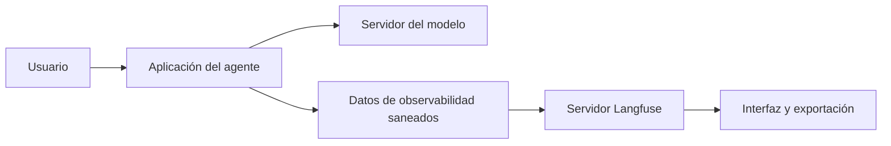

# 07 S17 - Configuración privacidad y exportación de trazas

[[Obsidian/posgrado/master/IA GENERATIVA Y AGENTES/17 Observabilidad y versionado de prompts/00 Índice - S17 Observabilidad y prompts|Índice de S17]] · [[Obsidian/posgrado/master/IA GENERATIVA Y AGENTES/00 Inicio/00 INICIO - Ruta de aprendizaje|Inicio de la materia]]

La sesión propone una demo local con Langfuse en Docker y un modelo accesible mediante una API compatible con OpenAI. Estas notas explican sus componentes; las órdenes, claves y servidores del PDF son **contenido del curso**, no instrucciones ejecutadas al crear las notas.

## Qué pieza hace qué

**Docker** permite ejecutar servicios en contenedores, entornos empaquetados con sus dependencias. **Docker Compose** describe varios servicios relacionados y cómo arrancan juntos. **Autoalojar** significa operar el servicio en infraestructura que administras, en vez de contratar su interfaz cloud.

Un **puerto** identifica un punto de conexión de un servicio. En el ejemplo, `localhost:3000` es una interfaz en la propia máquina. `localhost` no significa que todos los servicios involucrados sean locales: si el modelo está en un servidor remoto, las entradas del modelo salen hacia ese servidor.

Una **VPN** conecta de manera controlada con otra red. El PDF utiliza una H200 accesible mediante la VPN del curso o un modelo servido localmente por Ollama. **H200** es el hardware del servidor mencionado; no es el nombre del modelo que responde. **vLLM** y **Ollama** son programas usados para servir modelos en los ejemplos. El servidor, la biblioteca cliente y el modelo son piezas diferentes.



La aplicación envía solicitudes al modelo y evidencia a Langfuse por rutas diferentes. Sanear la evidencia protege lo exportado al servicio de observabilidad. La ruta del modelo necesita su propia política de datos; que Langfuse esté en la máquina no convierte en local un modelo remoto.

## Entorno y credenciales

Un **entorno virtual** separa las dependencias de un proyecto de las de otros. Una versión fijada expresa qué biblioteca se usó para reproducir un resultado. El PDF fija Python 3.11+ para el curso y paquetes específicos. Ejecutar los ejemplos hoy requeriría comprobar sus requisitos y compatibilidad en ese entorno concreto.

Una **clave de API** identifica o autoriza una aplicación ante un servicio. El material distingue las claves del proyecto Langfuse, la URL de Langfuse, la URL del servidor del modelo y su clave. No son intercambiables. Un archivo `.env` sirve para cargar configuración y credenciales sin escribirlas directamente en el código. `.gitignore` indica a Git qué archivos no añadir automáticamente al repositorio.

Que un archivo esté ignorado por Git no cifra su contenido ni revoca una clave que ya se compartió. La práctica que importa es mantener credenciales fuera de código, capturas, notas públicas y trazas, y controlar quién puede leer el archivo local.

El PDF propone `auth_check()` como prueba de conexión a Langfuse. Una autenticación exitosa confirma ese enlace, pero no confirma que el modelo responda ni que las trazas se estén exportando con todos los campos. Son pruebas distintas.

## Máscara antes de persistir o enviar

Una **máscara** reemplaza datos sensibles por marcadores. Por ejemplo, `ana.perez@ejemplo.test` puede convertirse en `<CORREO>`. **PII** significa información que identifica a una persona, como correos, teléfonos, nombres o direcciones. La máscara por correo de la sesión es una demostración limitada; no elimina toda PII.

El fallo de la página 31 es concreto: los argumentos decorados llegaban como una **tupla**, una colección ordenada similar a una lista en Python, pero la máscara solo recorría listas. Un correo dentro de esa tupla no se transformaba. El principio general es revisar todas las estructuras por las que pasan los datos.

Esquema propio de sanitización recursiva:

```text
sanear(valor):
    si es texto: reemplazar correos identificados
    si es diccionario: sanear claves y valores permitidos
    si es lista o tupla: sanear cada elemento
    en otros casos: conservar solo los tipos y campos previstos
```

**Recursiva** significa que la misma operación se aplica de nuevo a los elementos internos. Un mensaje de error puede incluir una URL o entrada original; por eso también necesita saneamiento. Guardar datos seguros solo en la ruta exitosa deja fugas posibles en bloqueos, reintentos y excepciones.

## Un dato que cruza tres estructuras

Este ejemplo es **propio**, usa un correo ficticio y representa la entrada con sintaxis de Python:

```python
("Soy ana@ejemplo.test", {"contactos": ["ana@ejemplo.test"], "caso": 7})
```

La estructura externa es una tupla de dos elementos. El primero es texto y el segundo es un diccionario que contiene una lista. La función del laboratorio recorre tupla → texto/diccionario → lista → texto. Su salida serializable queda así:

```json
["Soy <CORREO>", {"contactos": ["<CORREO>"], "caso": 7}]
```

El número de caso permanece porque no coincide con el patrón de correo. La tupla pasa a lista para poder guardar la estructura en JSON. Si se saneara solo la lista interna, el primer texto seguiría conteniendo el correo; si se saneara solo el primer texto, la lista interna seguiría conteniéndolo. Por eso hay que cubrir el árbol completo de datos.

La máscara de trazas no necesariamente modifica la entrada que recibe el modelo. Son acciones con objetivos distintos: cambiar la solicitud puede afectar lo que el modelo entiende, mientras sanear la copia de observabilidad controla lo que se registra. Si el proveedor no debe recibir ese dato, hace falta un control antes de esa ruta también.

## De la memoria al archivo exportado

En una integración con envío diferido, crear un span puede dejarlo primero en memoria. El exportador recoge registros y los transmite. Langfuse los almacena y finalmente una exportación los descarga a JSONL. Son etapas distintas. **Asíncrono**, en este contexto, significa que el envío puede ejecutarse sin detener a la aplicación en cada registro.

Si un script imprime la respuesta y termina antes del envío, el usuario ve un resultado pero la interfaz no tiene evidencia. Si el envío llega y la consulta de exportación usa un filtro de sesión equivocado, la evidencia existe pero el archivo descargado puede quedar vacío. Por eso el control de la entrega consiste en abrir el resultado final, comprobar cantidad de corridas y campos y localizar un caso conocido.

El laboratorio local evita esa red: acumula registros saneados y escribe directamente el JSONL. Enseña el contenido y su conservación, pero no prueba colas, conexión o retención de un servicio externo.

## Cliente, sesión y envío final

La sesión recomienda inicializar un cliente con la máscara antes de usarlo en el resto de la aplicación. Un **cliente** es el objeto que conoce cómo enviar datos al servicio. Si se utiliza un cliente compartido, cambiar su configuración después de haberlo obtenido puede no afectar las instancias ya creadas. La máscara debe quedar configurada desde el inicio.

Agrupar varias corridas con un identificador de sesión permite analizarlas juntas. Etiquetas como `taller-04` ayudan a filtrarlas. No deberían contener secretos o datos personales innecesarios.

**Flush** significa enviar los registros pendientes del búfer, un almacenamiento temporal en memoria. Un script corto puede terminar antes de que un exportador asíncrono complete su trabajo. El PDF utiliza `flush()` antes de salir. Además hay que comprobar que el envío realmente ocurrió: llamar al método no sustituye la evidencia de registros disponibles.

## Qué debe conservar la entrega del curso

El material exige Langfuse para la Parte 1 del Taller 4 a partir del 6 de octubre y solicita JSONL exportado. Una captura bonita no reemplaza un registro que pueda analizarse. Esta es una consigna académica histórica, no una entrega que se haya enviado desde estas notas.

Una exportación útil conserva identidad, jerarquía, tipos de paso, modelo y consumo donde corresponde, versión, tiempos y errores saneados. También debe mantener suficiente contexto para la evaluación sin almacenar más datos de los necesarios. Retención —cuánto tiempo guardar—, permisos de acceso y borrado forman parte de operar el registro.

La demostración con Compose no acredita alta disponibilidad, capacidad de escalado ni recuperación con copias de respaldo. **Alta disponibilidad** reduce interrupciones; **escalado** adapta capacidad a carga; **respaldo** permite recuperar datos. Son responsabilidades adicionales al prototipo.

> [!question]- ¿Cómo se prueba que la máscara cubre las ramas de error?
> Se usan datos ficticios reconocibles en entrada, salida y una excepción controlada. Luego se inspecciona el archivo o registro exportado y se verifica que el texto original no aparece, incluso dentro de dict, list y tuple. Una prueba sobre correos no demuestra protección de toda PII; demuestra ese alcance concreto.

Fuente: PDF 16, 24–25, 30–31 y 34–35 · numeración visible = página PDF · [[Obsidian/posgrado/master/IA GENERATIVA Y AGENTES/Materiales/S17 Observabilidad y versionado de prompts.pdf#page=31|Sesión 17, página 31]].

---

← [[Obsidian/posgrado/master/IA GENERATIVA Y AGENTES/17 Observabilidad y versionado de prompts/06 S17 - Langfuse y el mapa de sus objetos|Anterior]] · [[Obsidian/posgrado/master/IA GENERATIVA Y AGENTES/17 Observabilidad y versionado de prompts/08 S17 - Versiones etiquetas evaluación y rollback de prompts|Siguiente]] →
