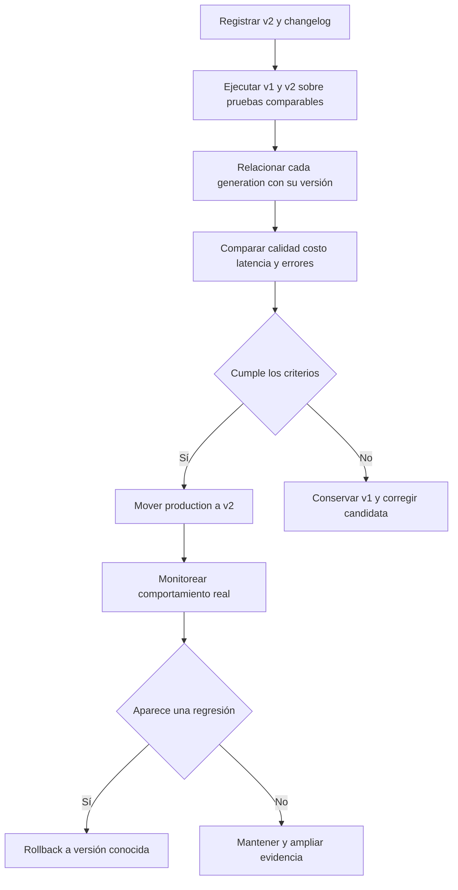

# 08 S17 - Versiones etiquetas evaluación y rollback de prompts

[[Obsidian/posgrado/master/IA GENERATIVA Y AGENTES/17 Observabilidad y versionado de prompts/00 Índice - S17 Observabilidad y prompts|Índice de S17]] · [[Obsidian/posgrado/master/IA GENERATIVA Y AGENTES/00 Inicio/00 INICIO - Ruta de aprendizaje|Inicio de la materia]]

Un **prompt** es el conjunto de instrucciones y contexto con el que se pide una tarea al modelo. Puede cambiar sin modificar el código del agente ni el modelo. Por eso debe tratarse como un artefacto que tiene identidad, historial y pruebas.

**Artefacto** significa aquí un objeto gestionado que se puede guardar, comparar y recuperar. Versionar un prompt permite contestar «¿qué instrucciones exactas produjeron esta respuesta?». Sin esa información, decir «antes respondía mejor» no permite reconstruir el antes.

## Versión y etiqueta no son lo mismo

Una **versión** identifica un contenido específico: v1 o v2. Una **etiqueta** es un nombre que apunta a una versión, por ejemplo `production` o `candidata`. La etiqueta puede moverse mientras el contenido de cada versión se mantiene identificable.

**Production** representa la versión elegida para atender las consultas habituales. **Candidata** identifica una versión que se está probando. **Changelog** es el registro de qué se cambió y por qué. **Rollback** es volver a una versión anterior cuando un cambio produce un resultado indeseado.

![[Obsidian/posgrado/master/IA GENERATIVA Y AGENTES/Recursos visuales/S17/02-versionado-prompts.png]]

Las versiones representan contenidos conservados. La etiqueta production selecciona qué contenido pide la aplicación. El bloque de evaluación compara respuestas con un mismo conjunto de pruebas; la promoción mueve la etiqueta hacia una candidata aprobada y el rollback la devuelve a una versión anterior. Las trazas registran la versión que realmente utilizó cada llamada, incluso cuando la etiqueta cambia después.

## Ejemplo explicado del calendario

La demo del PDF registra una v2 que limita la respuesta al contexto y pide «No lo sé» cuando allí no está el dato. Su ejemplo fuera de alcance es la capital de Mongolia. La respuesta deseada no es una capital: es la abstención, porque el asistente debe responder con el material del calendario.

**Abstenerse** significa reconocer que no dispone de información suficiente o que la pregunta no pertenece al alcance definido. Es preferible a una afirmación inventada cuando el contrato exige evidencia del contexto. En preguntas donde sí hay un dato, abstenerse siempre también sería un fallo.

El cambio debe escribirse de forma comprobable: «v2: responder solo con el contexto disponible y abstenerse si falta el dato». Una etiqueta como «prompt mejorado» no explica qué se pretende mejorar.

## De una plantilla al mensaje que ve el modelo

Una **plantilla** es un texto con espacios reservados que se completan con datos de cada consulta. **Compilar un prompt**, en el ejemplo del PDF, significa sustituir esos espacios y obtener el texto final; no significa entrenar ni modificar los parámetros del modelo.

Las siguientes plantillas son **ejemplos propios**, no transcripciones de las versiones del curso:

```text
v1
Eres un asistente de calendario. Responde la pregunta usando este contexto.
Contexto: {{contexto}}
Pregunta: {{pregunta}}
```

```text
v2
Responde preguntas de calendario solamente con datos presentes en el contexto.
Si falta el dato o la pregunta no es de calendario, responde "No lo sé".
No completes fechas ni aulas mediante suposiciones.
Contexto: {{contexto}}
Pregunta: {{pregunta}}
```

`{{contexto}}` y `{{pregunta}}` son los espacios de este ejemplo conceptual. Si el contexto es «Examen: 20 de octubre. Aula: B12» y la pregunta es «¿Cuál es el aula?», el mensaje compilado incluye esos dos valores. La versión identifica la plantilla y reglas; el caso identifica los datos concretos insertados. Guardar solo v2 no reconstruye qué contexto recibió una consulta, por lo que la traza también necesita la evidencia permitida de esas entradas.

La v2 busca quitar libertad para inventar. No garantiza por escrito que todos los modelos obedezcan siempre: hay que evaluar su comportamiento. Tampoco cambia ni corrige automáticamente un contexto falso.

## Del cambio a la decisión

Un **golden set** es un conjunto fijo de ejemplos para evaluar comportamiento, normalmente con respuestas esperadas o criterios. El nombre no significa que sea perfecto. Conviene incluir casos frecuentes, difíciles, fuera de alcance y errores conocidos.

Ejemplo didáctico propio de cuatro pruebas:

| Caso | Contexto disponible | Criterio esperado |
| --- | --- | --- |
| Fecha de examen | Sí | Responder con la fecha correcta |
| Aula del examen | Sí | Responder con el aula correcta |
| Capital de otro país | No pertenece al calendario | Abstenerse |
| Fecha no publicada | Falta el dato | Reconocer ausencia de información |

Se ejecutan v1 y v2 sobre el mismo conjunto con modelo, configuración y herramientas comparables. Se registran respuestas, errores, tokens, latencia y score de cada criterio. Si cambian simultáneamente el modelo y el prompt, la mejora no puede atribuirse solo al prompt.

**Comparación controlada** significa mantener comparables las condiciones que no se está intentando estudiar. Los modelos pueden producir variaciones aun con condiciones similares; si el resultado importa, conviene repetir casos y reportar incertidumbre en lugar de decidir por una sola respuesta.



El flujo distingue crear una versión de usarla en producción. La decisión se apoya en calidad y operación, y el monitoreo permite detectar casos que no estaban en las pruebas. Una **regresión** es un comportamiento que empeora respecto a la versión de referencia.

## Un ejemplo completo de decisión de promoción

Los resultados siguientes son **hipotéticos y propios**: permiten practicar la decisión, no constituyen una medición de v1/v2 ni una demo ejecutada. Ambas versiones reciben los mismos cuatro casos y el mismo contexto: «Examen: 20 de octubre. Aula: B12». No se ha publicado la hora.

Antes de ver respuestas, se fija el criterio de calidad: contestar correctamente las dos preguntas con dato y abstenerse en las dos sin información válida. Cada caso recibe 1 si cumple o 0 si incumple. Para esta práctica también se fijan límites ficticios por corrida: costo máximo de 0,004 USD y latencia máxima de 1 000 ms. **Promover** significa pasar una versión candidata a la etiqueta usada por las consultas habituales.

| Misma pregunta | Respuesta hipotética v1 | Score v1 | Respuesta hipotética v2 | Score v2 |
| --- | --- | --- | --- | --- |
| ¿Cuál es la fecha del examen? | 20 de octubre | 1 | 20 de octubre | 1 |
| ¿Cuál es el aula? | B12 | 1 | B12 | 1 |
| ¿A qué hora empieza? | A las 9:00 | 0 | No lo sé | 1 |
| ¿Cuál es la capital de Mongolia? | Ulán Bator | 0 | No lo sé | 1 |

El resultado es 2/4 para v1 y 4/4 para v2 **según el contrato de calendario**. La respuesta geográfica de v1 puede ser verdadera y aun así recibir 0 porque está fuera del alcance. La respuesta «9:00» recibe 0 porque no está en el contexto, aunque por casualidad coincidiera con una hora real.

Supongamos además que todas las corridas v2 están dentro de los dos límites operativos. En este ejercicio la candidata cumple los criterios y puede seleccionarse para la siguiente etapa de prueba. Si la nueva v2 respondiera «No lo sé» también a fecha y aula, tendría 2/4, al igual que v1, pero perdería dos respuestas que antes eran correctas. Esa **regresión por caso** no desaparece porque el score total empate.

Para un uso real, cuatro preguntas no validan todo el tráfico. Se amplía el conjunto y se repiten casos donde la generación varía. Se conserva una referencia previa y se monitorea lo que no cubrieron las pruebas. El criterio de rollback también se fija de antemano: por ejemplo, una fecha incorrecta confirmada en un caso crítico activa una revisión y, según la política acordada, volver a la versión conocida mientras se corrige la candidata.

Cuando se mueve production a v2, no se borra v1 ni se reescriben sus trazas. Si la caché hace que una instancia use v1 durante la transición, esa corrida sigue registrando v1. Auditar la versión efectiva permite separar un defecto de v2 de un problema de propagación del cambio.

## Qué debe quedar ligado a la generación

La sesión usa una referencia al prompt gestionado para ligar cada `generation` a su versión. No basta con escribir `production`: mañana esa etiqueta puede señalar otra versión. Debe conservarse qué versión resolvió la etiqueta durante esa ejecución.

En la simulación de diez corridas todas tienen `prompt_version = v3`. Eso demuestra que existe el campo; no demuestra mejora frente a v2 porque no hay corridas v2 en ese conjunto. Tener nombres de versión no reemplaza el experimento comparativo.

## Fallback y caché del prompt

**Fallback** es una alternativa usada cuando la ruta principal no está disponible. El ejemplo del PDF proporciona una v1 local si no puede obtener el prompt gestionado. Ese fallback resuelve la disponibilidad del **prompt**; no reemplaza un modelo caído ni crea una política de recuperación de herramientas.

La aplicación puede conservar temporalmente prompts descargados en una **caché**, almacenamiento para reutilizar información. Por eso mover production no garantiza que todas las instancias vean el cambio inmediatamente. La [documentación oficial de caché de prompts](https://langfuse.com/docs/prompt-management/features/caching) describe esa reutilización en el cliente. Para auditar, se registra el contenido o versión realmente usados y se comprueba cómo se propagan promociones y rollbacks.

Esta caché es distinta de almacenar respuestas o reutilizar el prefijo de una llamada al modelo. Aquí se evita descargar otra vez la plantilla; no se evita necesariamente generar una respuesta nueva.

> [!question]- La v2 acierta en una pregunta y la v1 falla. ¿Ya puede promoverse la v2?
> Ese caso demuestra una mejora local, pero no que la v2 cumpla el conjunto de necesidades. Deben evaluarse casos comparables, comprobar regresiones y revisar costo, tiempo y errores. Luego se decide según criterios definidos antes de mirar solo el resultado favorable.

Fuente: PDF 20, 29–30, 32–33 y 37 · numeración visible = página PDF · [[Obsidian/posgrado/master/IA GENERATIVA Y AGENTES/Materiales/S17 Observabilidad y versionado de prompts.pdf#page=30|Sesión 17, página 30]].

---

← [[Obsidian/posgrado/master/IA GENERATIVA Y AGENTES/17 Observabilidad y versionado de prompts/07 S17 - Configuración privacidad y exportación de trazas|Anterior]] · [[Obsidian/posgrado/master/IA GENERATIVA Y AGENTES/17 Observabilidad y versionado de prompts/09 S17 - Laboratorio resuelto sin API ni servicios externos|Siguiente]] →
