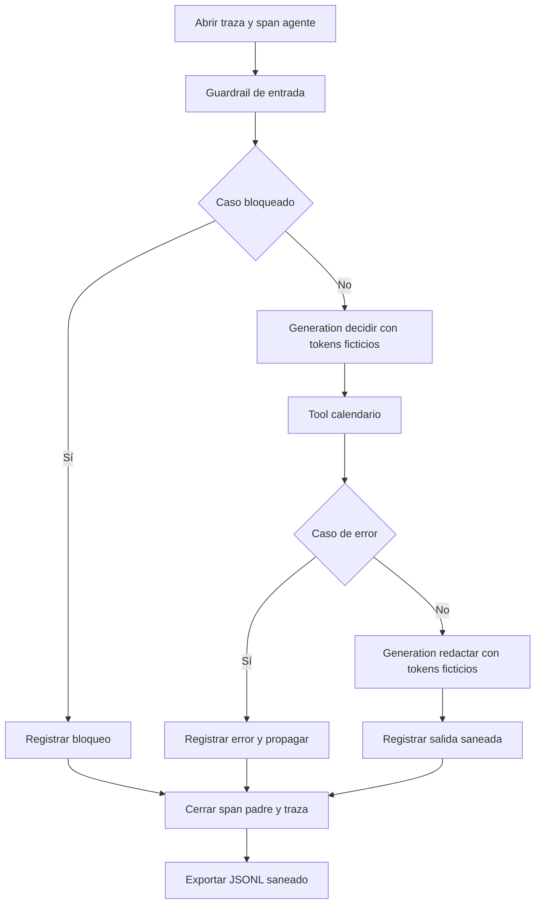

# 09 S17 - Laboratorio resuelto sin API ni servicios externos

[[Obsidian/posgrado/master/IA GENERATIVA Y AGENTES/17 Observabilidad y versionado de prompts/00 Índice - S17 Observabilidad y prompts|Índice de S17]] · [[Obsidian/posgrado/master/IA GENERATIVA Y AGENTES/00 Inicio/00 INICIO - Ruta de aprendizaje|Inicio de la materia]]

Este laboratorio es **elaboración propia**, inspirado en la estructura de la sesión. No ejecuta sus scripts ni reproduce las trazas del curso: esos archivos no fueron adjuntados. Usa solo la **biblioteca estándar de Python**, los módulos que vienen con el lenguaje sin instalar paquetes adicionales, diez consultas ficticias y ningún modelo, credencial, Docker o servicio externo.

El archivo ejecutable está en [[Obsidian/posgrado/master/IA GENERATIVA Y AGENTES/17 Observabilidad y versionado de prompts/Practica/s17_trazador_local.py|s17_trazador_local.py]]. Guarda [[Obsidian/posgrado/master/IA GENERATIVA Y AGENTES/17 Observabilidad y versionado de prompts/Practica/s17_trazas_ficticias.jsonl|las diez trazas ficticias]] y [[Obsidian/posgrado/master/IA GENERATIVA Y AGENTES/17 Observabilidad y versionado de prompts/Practica/s17_resultados_verificados.json|el resumen verificado]].

## Qué hace cada corrida

Cada consulta abre una traza y un span padre de tipo `agent`. Dentro se ejecutan un guardrail de entrada, una generación simulada para decidir, una herramienta de calendario y otra generación simulada para redactar. El orden es secuencial, pero el span padre contiene a todos sus hijos.

Tres casos tienen una diferencia deliberada:

- La corrida 3 queda bloqueada por una regla simulada antes de llamar a las generaciones.
- La corrida 4 lanza un error controlado en la herramienta. La excepción queda registrada y se propaga hasta el bucle del laboratorio, que continúa con el caso siguiente.
- La corrida 7 envía 20 000 tokens ficticios en la generación de decisión, en lugar de 1 000. Por eso es más cara según las tarifas de ejemplo.



La ruta de bloqueo conserva la evidencia sin fingir que el modelo trabajó. La ruta de error termina con una corrida fallida registrada. El cierre común mide toda la corrida, incluido el guardrail. Los datos se sanean antes de guardarse y una verificación final confirma que el correo ficticio original no quedó en el archivo.

## Paso 1: conservar identidad y estructura

La clase `Trazador` crea un identificador completo con `uuid` para la traza y otro para cada span. **UUID** es un identificador diseñado para distinguir objetos con una probabilidad de colisión muy baja. Cada span conserva el ID de la traza y el de su padre.

La pila identifica los spans abiertos. Cuando comienza una herramienta, su padre es el span `agente`. Cuando termina, sale de la pila y se agrega al registro. Como los hijos terminan antes que el padre, el archivo puede contener primero los hijos y al final el padre. Reconstruir el árbol requiere las relaciones, no confiar en el orden de las líneas.

El trazador es intencionalmente secuencial. No es un exportador de producción ni permite compartir la pila entre tareas concurrentes.

## Paso 2: separar fechas y duraciones

`datetime.now(timezone.utc)` guarda cuándo comenzó un evento. `time.perf_counter()` mide cuánto tiempo pasó. La primera sirve para ubicar la corrida en una fecha; la segunda evita que ajustes del reloj civil alteren un intervalo.

La duración registrada es **real**, correspondiente a las operaciones pequeñas del script. Los tokens son **simulados**. No se espera que la corrida 7 sea la más lenta: asignarle tokens no ejecuta un modelo ni crea una espera real. Esto enseña por qué las etiquetas de origen y unidades deben ser claras.

## Paso 3: conservar fallos sin esconderlos

La herramienta de la corrida 4 lanza una excepción. Su span guarda el error, cierra su duración y relanza. El span padre también conserva el error propagado; luego la traza guarda `status = error`. Finalmente, el bucle de las diez corridas decide continuar para que podamos estudiar el resto de los casos.

El archivo cuenta diez corridas, incluida la fallida. Si solo se guardaran las consultas exitosas, el resumen mostraría nueve y el caso problemático desaparecería.

## Paso 4: sanear estructuras y mensajes de error

El correo ficticio está en un texto de entrada, una tupla, un diccionario, una lista, la salida de herramienta, la respuesta y el mensaje de error. `sanear()` recorre estas estructuras y sustituye el correo por `<CORREO>`. No hace falta un dato personal real para demostrar el mecanismo.

El resumen verifica que el texto `ana.perez@ejemplo.test` no aparece en la exportación. El patrón no detecta toda PII: nombres, direcciones y otros identificadores requieren reglas y decisiones adicionales. La verificación confirma el alcance concreto del ejercicio, no una garantía general de anonimización.

## Paso 5: interpretar los resultados obtenidos

El laboratorio se ejecutó al crear estas notas. Produjo 10 corridas y 46 spans: ocho corridas normales de cinco spans, una bloqueada de dos spans y una fallida de cuatro spans.

`8 × 5 + 1 × 2 + 1 × 4 = 46 spans`.

Para una corrida normal distinta de la 7, los tokens ficticios son:

- Decisión: 1 000 de entrada y 80 de salida, costo `0,001 + 0,0004 = 0,0014 USD`.
- Redacción: 500 de entrada y 120 de salida, costo `0,0005 + 0,0006 = 0,0011 USD`.
- Total: `0,0025 USD`.

La corrida 7 cuesta `0,0204 + 0,0011 = 0,0215 USD`. La 4 falla después de la decisión y cuesta 0,0014 USD ficticios. La 3 se bloquea antes de la generación y tiene cero costo de LLM en este modelo de cuenta. Hay siete corridas normales de 0,0025 USD y una normal más cara:

`7 × 0,0025 + 0,0215 + 0,0014 + 0 = 0,0404 USD`.

Ese total no fue cobrado: describe consumo inventado con una tarifa para practicar. El script calcula media, p50, p95 y máximo de las duraciones reales con interpolación lineal. Esos tiempos y la corrida más lenta pueden cambiar entre ejecuciones porque el trabajo es diminuto y depende del sistema. No deben compararse con los 272/346/740 ms del PDF.

## Resolver el diagnóstico directamente desde el registro

En las trazas generadas, un span `generation` conserva sus tokens ficticios y costo; el span `agent` conserva el tiempo de sus hijos, pero no recibe un segundo costo por contenerlos. El total de la traza suma las generaciones una vez. Esa organización evita contar el mismo consumo de nuevo en el padre.

Para diagnosticar la corrida 7, se comparan sus dos generaciones: `decidir` cuesta 0,0204 USD ficticios y `redactar` 0,0011 USD. La participación de decidir es `0,0204 / 0,0215 × 100 ≈ 94,88 %`. La diferencia respecto a una corrida normal está en los 19 000 tokens adicionales de entrada de decidir; la redacción no cambió. Por eso la hipótesis de mejora se dirige al contexto de decisión, no a la herramienta de calendario.

Para diagnosticar la corrida 4, el span `consultar_calendario` conserva un error y no existe `redactar`. El padre también muestra un error propagado. Eso representa una misma corrida fallida, no dos consultas fallidas. Se puede comprobar su historia sin depender de que los spans estén ordenados como se abrieron.

El valor `datos_simulados = true` ayuda a distinguir este archivo de evidencia de uso real. No convierte sus costos en facturación. Del mismo modo, un bloqueo con cero costo de LLM no dice que validar haya tenido costo de infraestructura cero: solo describe el alcance de consumo modelado aquí.

## Ejecutarlo de nuevo

El comando siguiente reproduce **este laboratorio propio**, sobrescribiendo solo sus dos archivos de resultados dentro de `Practica`:

```bash
python3 "/Users/alech/Documents/notes/Obsidian/posgrado/master/IA GENERATIVA Y AGENTES/17 Observabilidad y versionado de prompts/Practica/s17_trazador_local.py"
```

La ejecución verifica diez corridas conservadas, excepción propagada, error de herramienta registrado, saneamiento de diccionarios/listas/tuplas, ausencia del correo original y restauración del contexto. Estas comprobaciones validan mecanismos concretos del ejemplo; no validan un SDK ni el agente del curso.

## Relación con la actividad del PDF

La sesión pide construir un trazador, generar diez corridas simuladas, analizar costo y latencia por corrida y por span, y abrir los casos más caro y más lento. La actividad «encuentra al culpable» del PDF se refiere a sus trazas 4 y 7 originales. Sin esos spans no se puede identificar responsable real por nombre. Aquí sí puede encontrarse el span costoso porque su entrada ficticia está explícita.

El material también plantea una respuesta incorrecta que, según la propia diapositiva 12, no está sembrada en su cuaderno. Instrumentar no crea ese caso de evaluación. Para probar calidad habría que agregar respuestas simuladas y un criterio independiente.

> [!question]- ¿Qué cambiaría si se sumaran las duraciones del span agente y sus hijos?
> Se contarían de nuevo intervalos ya incluidos en el padre. La duración de la corrida se mide directamente desde su apertura hasta su cierre. Los hijos se usan para localizar contribuciones y solapamientos, no para sumarlos sin conocer la estructura.

Fuente: PDF 12, 17–19 y 37 · numeración visible = página PDF · [[Obsidian/posgrado/master/IA GENERATIVA Y AGENTES/Materiales/S17 Observabilidad y versionado de prompts.pdf#page=19|Sesión 17, página 19]].

---

← [[Obsidian/posgrado/master/IA GENERATIVA Y AGENTES/17 Observabilidad y versionado de prompts/08 S17 - Versiones etiquetas evaluación y rollback de prompts|Anterior]] · [[Obsidian/posgrado/master/IA GENERATIVA Y AGENTES/17 Observabilidad y versionado de prompts/10 S17 - Repaso activo y preguntas resueltas|Siguiente]] →
