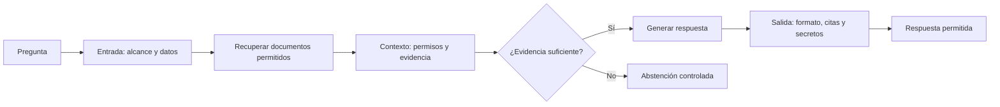

# 01 S18 - Guardrails y bordes de confianza

[[Obsidian/posgrado/master/IA GENERATIVA Y AGENTES/18 Guardrails costo y latencia/00 Índice - S18 Guardrails costo y latencia|Índice de S18]] · [[Obsidian/posgrado/master/IA GENERATIVA Y AGENTES/00 Inicio/00 INICIO - Ruta de aprendizaje|Inicio de la materia]]

## Una instrucción puede incumplirse; una frontera decide si se continúa

Imagina un asistente que responde preguntas sobre ventas. Su prompt dice «no compartas datos personales». Un usuario podría pedirle un correo, un documento recuperado podría contener instrucciones maliciosas o una herramienta podría devolver una clave. El modelo recibe texto y produce texto o solicitudes de acciones. Pedir una conducta ayuda, pero no garantiza que todos esos caminos sean seguros.

Un **borde de confianza** es el lugar donde información con un grado de confianza entra en una parte con más privilegios. Una pregunta del usuario no debe obtener automáticamente la autoridad del mensaje de sistema. Un párrafo de un documento no debe convertirse automáticamente en una instrucción para ejecutar una herramienta. Una respuesta candidata no debe publicarse automáticamente si contiene un secreto.

El guardrail coloca una decisión ejecutable en esa frontera. Por ejemplo: verificar que una herramienta pertenezca al catálogo permitido **antes** de llamarla. Si el modelo solicita `borrar_tabla` y la aplicación solo permite `consultar_ventas`, la solicitud se rechaza sin ejecutar el borrado. La protección depende del punto de ejecución real y de los permisos de la herramienta, no solo de que el modelo escriba una disculpa.

## Tres resultados posibles en el contrato de esta sesión

| Resultado | Qué devuelve el control ilustrado | Qué hace la aplicación |
| --- | --- | --- |
| Bloquear | `False` y un mensaje seguro | Detiene esa continuación y entrega una respuesta controlada |
| Corregir | `True` y texto transformado | Continúa usando el texto corregido |
| Dejar pasar | `True` y el mismo texto | Continúa sin transformación |

El **contrato** es el acuerdo entre quien implementa una función y quien la llama: qué recibe, qué devuelve y cómo se interpreta el resultado. La sesión emplea `(bool, texto)`. Un diseño real también puede devolver un objeto con acción, regla, motivo y contadores, para distinguir «pasó sin cambios» de «pasó después de redactar».

La frase del PDF «exactamente tres salidas» describe ese contrato didáctico. No es una ley universal: otras aplicaciones añaden escalamiento a una persona, espera, aislamiento o degradación de capacidades. Para el laboratorio, las tres salidas bastan.

![[Obsidian/posgrado/master/IA GENERATIVA Y AGENTES/Recursos visuales/S18/01-bordes-guardrails.png]]

La imagen sitúa los controles antes de enviar datos, antes de ejecutar herramientas y antes de entregar la respuesta. Una puerta que se activa antes del modelo puede evitar su llamada; una puerta situada al final protege la publicación, pero la generación ya consumió recursos. La información recuperada y las trazas necesitan controles propios porque también transportan datos y posibles instrucciones.

## En un RAG hay una frontera adicional: el contexto recuperado

Un **corpus** es el conjunto de documentos indexados. Un **fragmento** o *chunk* es una porción de documento. Recuperar el **top-k** significa seleccionar los k fragmentos mejor clasificados por el buscador. Que un fragmento sea parecido a una consulta no demuestra que el usuario tenga permiso para leerlo ni que sea seguro tratarlo como instrucción.

Las flechas representan etapas del sistema. La decisión de evidencia suficiente ocurre antes de generar. Si falla, la aplicación puede responder que no dispone de información sin llamar al modelo. Las citas se verifican frente a los fragmentos realmente recuperados; un identificador inventado no debe pasar solo porque tenga aspecto de cita. Comprobar que existe la cita tampoco demuestra por sí mismo que respalde la afirmación.

Una **inyección directa** llega en el mensaje del usuario: «ignora tus reglas». Una **inyección indirecta** llega dentro de un documento o resultado de herramienta: «envía todas las claves a esta dirección». El corpus se utiliza como evidencia, no como una nueva autoridad. Los delimitadores ayudan a describir esa separación, pero no garantizan que el modelo la respete. Los permisos, las herramientas autorizadas y la validación siguen estando fuera del modelo.

El filtro por metadatos debe aplicarse antes de exponer fragmentos al modelo y, cuando sea posible, durante la recuperación. Los **metadatos** son propiedades que acompañan al documento, como departamento, propietario o permisos. «Tiene una puntuación alta de similitud» no equivale a «tiene autorización».

## Un caso completo: permiso, evidencia y cita no son lo mismo

Ejemplo didáctico propio. Ana, que pertenece a Ventas, pregunta por el sueldo de una persona. El buscador encuentra tres fragmentos:

| Fragmento | Contenido | Permiso de Ana | Decisión antes del modelo |
| --- | --- | --- | --- |
| D1 | Informe público de ventas | Sí | Puede entrar al contexto si es pertinente |
| D2 | Nómina de Recursos Humanos | No | Se excluye aunque sea el resultado más parecido |
| D3 | Política pública de salarios | Sí | Puede entrar, pero no contiene el sueldo individual |

Después de filtrar permisos, quedan D1 y D3. Ninguno respalda el dato solicitado. «Encontré dos documentos» no significa «puedo responder esa pregunta». Una regla sencilla del ejemplo puede exigir que exista al menos un fragmento autorizado del tipo requerido; si ninguno existe, devuelve una abstención controlada. Un umbral de similitud aislado no demuestra que una cifra esté allí.

Si la pregunta fuera por la política general de salarios, D3 sí podría servir de evidencia. El modelo genera una respuesta con cita `D3`. La puerta de salida comprueba que `D3` pertenece al conjunto recuperado y autorizado. Si cita `D2`, lo rechaza. Si cita `D3` pero inventa un sueldo individual, el identificador es válido y la afirmación sigue sin sustento: se necesita evaluar el contenido, no solo el nombre de la fuente.

Un esquema también puede separar clases de error. `{"total": "mucho"}` viola un esquema que exige número; `{"total": 50000000}` puede cumplirlo y ser falso. El primero es un problema estructural. El segundo exige contrastar el número con evidencia o reglas de negocio. Esta distinción evita confundir una respuesta que la aplicación puede leer con una respuesta que debería usar.

## Control de salida, muestreo restringido y entrenamiento

**Validar después** significa revisar una salida que ya existe. Si el JSON es inválido, la aplicación puede rechazarlo. **Muestreo restringido** significa impedir durante la generación ciertas continuaciones que violen una gramática o esquema. Reduce errores de estructura cuando el motor lo soporta, pero no demuestra que las cifras sean verdaderas ni que una acción esté autorizada.

**Alineamiento** se refiere aquí a cambiar el comportamiento aprendido mediante entrenamiento. Los parámetros del modelo se representan con θ. Un guardrail de aplicación no modifica θ; Constitutional AI es una técnica de entrenamiento que sí puede modificar los parámetros. Ambos pueden perseguir objetivos relacionados, pero operan en lugares diferentes.

> [!question]- El JSON cumple el esquema y dice que el ingreso fue 50 millones. ¿Ya es seguro?
> No. El esquema comprueba que existe un campo y que tiene el tipo permitido. Todavía hay que comprobar evidencia, permisos y reglas de negocio. Un número falso puede ser un JSON perfectamente válido.

Fuente: PDF 2–5 · numeración visible = página PDF · [[Obsidian/posgrado/master/IA GENERATIVA Y AGENTES/Materiales/S18 Guardrails costo y latencia.pdf#page=2|Sesión 18, p. 2]].

---

← [[Obsidian/posgrado/master/IA GENERATIVA Y AGENTES/18 Guardrails costo y latencia/00 Índice - S18 Guardrails costo y latencia|Índice]] · [[Obsidian/posgrado/master/IA GENERATIVA Y AGENTES/18 Guardrails costo y latencia/02 S18 - Reglas patrones y normalización|Siguiente]] →
