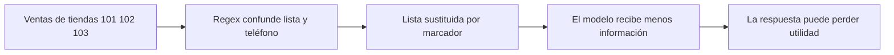

# 03 S18 - Datos personales y errores de redacción

[[Obsidian/posgrado/master/IA GENERATIVA Y AGENTES/18 Guardrails costo y latencia/00 Índice - S18 Guardrails costo y latencia|Índice de S18]] · [[Obsidian/posgrado/master/IA GENERATIVA Y AGENTES/00 Inicio/00 INICIO - Ruta de aprendizaje|Inicio de la materia]]

## Qué son PII, redacción y bloqueo

**PII** significa información que permite identificar o relacionar a una persona, por ejemplo correo, teléfono, documento de identidad o dirección, según el contexto. Detectar algunas formas de correo y teléfono no cubre toda la información personal.

**Redactar** o **enmascarar** significa sustituir un dato por un marcador, por ejemplo `[EMAIL_REDACTADO]`. El mensaje continúa, pero cambia. **Bloquear** detiene la continuación. En el archivo descrito por la sesión, una sospecha de inyección bloquea la entrada; los correos y teléfonos detectados se redactan y la entrada se acepta.

Ejemplo propio: «Escribe a ana@ejemplo.test para confirmar mi compra» puede convertirse en «Escribe a [EMAIL_REDACTADO] para confirmar mi compra». La exposición disminuye, pero la aplicación ya no tiene destinatario. Si la tarea necesita realmente enviar un correo, debe tratar el dato mediante un camino autorizado y separado, no suponer que la redacción conserva la misma capacidad.

## Las dos regex del PDF, desarmadas

```python
EMAIL_RE = re.compile(r"[\w\.-]+@[\w\.-]+\.\w+")
PHONE_RE = re.compile(r"(?<!\d)(?:\+?\d[\d\s\-\(\)]{7,}\d)(?!\d)")
```

En el patrón de correo, `[\w\.-]+` acepta una o más letras/dígitos/caracteres de palabra, puntos o guiones; después exige `@`, otro grupo y un punto seguido de caracteres de palabra. Es una aproximación, no una validación completa de todas las direcciones aceptables.

| Pieza del patrón de teléfono | Significado |
| --- | --- |
| `(?<!\d)` | Justo antes no debe haber un dígito |
| `(?:...)` | Agrupa sin guardar un grupo de captura |
| `\+?` | Un signo más opcional |
| `\d` | Un dígito de inicio |
| `[\d\s\-\(\)]{7,}` | Al menos 7 caracteres, que pueden ser dígitos, espacios, guiones o paréntesis |
| `\d` | Un dígito final |
| `(?!\d)` | Justo después no debe haber un dígito |

La pieza crucial es `{7,}`: cuenta **caracteres de la clase**, no siete dígitos. Un espacio cuenta. La presencia de nueve o más caracteres admitidos no demuestra que exista un número telefónico.

## El falso positivo de las tiendas

Entrada: `ventas de las tiendas 101 102 103`.

1. No aparece `@`, por lo que el patrón de correo no coincide.
2. `101 102 103` tiene 11 caracteres: nueve dígitos y dos espacios.
3. El primer `1` cumple el dígito inicial y el último `3` cumple el final.
4. Los nueve caracteres del medio pertenecen a la clase admitida. Los dos espacios también cuentan.
5. No hay otro dígito pegado fuera de los extremos. El patrón de teléfono coincide con toda la lista.
6. La salida de entrada es `(True, 'ventas de las tiendas [TELEFONO_REDACTADO]')`.

La aplicación no se detiene ni lanza un error. El modelo recibe una pregunta que perdió los números de tienda. Ese error silencioso puede acabar en una respuesta genérica, una aclaración innecesaria o una cifra equivocada. El control perjudicó la tarea legítima aunque su código haya funcionado exactamente como fue escrito.



Las cajas muestran una cadena causal. La pérdida comienza en el control, no necesariamente en el modelo. Si se evalúa solo la respuesta final, puede atribuirse al LLM un error provocado por una redacción previa.

## Cómo mejorar sin prometer detección perfecta

Primero se construye un conjunto de consultas legítimas del dominio: tiendas, facturas, fechas, códigos, listas, montos y teléfonos reales de prueba. Luego se mide qué borra la regla. Un refinamiento puede exigir un prefijo explícito de teléfono o considerar campos estructurados. Ese refinamiento reducirá algunos falsos positivos, pero podría dejar pasar teléfonos escritos de otra manera.

Un detector con **NER**, reconocimiento de entidades nombradas, intenta identificar entidades a partir del contexto. Puede detectar más formas que una regex, pero también se equivoca y consume cómputo. Que no consuma tokens de una API no significa que tenga costo cero.

Los marcadores también necesitan diseño. Si un mensaje contiene tres teléfonos y los tres se sustituyen por el mismo marcador, desaparece la distinción entre personas. Marcadores estables como `[TELEFONO_1]` pueden preservar relaciones, siempre que el mapa hacia los originales se custodie con permisos y retención definidos.

## Qué cambiaría con datos estructurados

Ejemplo propio: en una consulta con campos separados, `tiendas: [101, 102, 103]` y `telefono: "+593 99 123 4567"` cumplen funciones distintas. La aplicación puede validar `tiendas` como lista de identificadores autorizados y redactar `telefono` según su política. No tiene que adivinar por la forma de toda la frase qué secuencia representa cada cosa.

| Dato | Acción del ejemplo | Información conservada para responder |
| --- | --- | --- |
| Lista de tiendas | Validar tipo, existencia y permisos | Los tres identificadores necesarios |
| Teléfono opcional | Sustituir o excluir antes del modelo | Que había un teléfono, sin su valor |
| Texto libre | Aplicar controles de PII e inyección | Solo las partes permitidas |

Los campos estructurados facilitan el control porque hacen explícito el significado esperado. Todavía hay que verificar que el usuario no haya colocado un teléfono en `texto_libre` o solicitado una tienda sin permiso. La ventaja práctica es que los números de tienda dejan de competir con una regex genérica de teléfonos dentro de la misma cadena.

Por eso detectar PII, redactar y completar la tarea son tres preguntas distintas: ¿se reconoció el dato?, ¿se ocultó donde correspondía?, ¿quedó información suficiente para responder? Se pueden medir por separado y explicar qué se pierde con cada transformación.

## La asimetría entre entrada y salida

Según la página 14, un correo en la entrada se redacta; el mismo correo en la salida puede salir entero porque el validador de salida mostrado busca secretos, no ese correo. Un nombre o una dirección tampoco tiene un patrón específico en el ejemplo. Por tanto, «la entrada pasa por `redact_pii`» no demuestra «el sistema no revela datos personales».

El control debe cubrir cada destino pertinente: proveedor, respuesta, herramienta, traza y exportación. Para auditar sin duplicar el dato sensible, puede registrar `accion=corregir`, la regla y la cantidad de coincidencias. El evento no necesita incluir el valor original.

> [!question]- El guardrail devuelve `True`. ¿Significa que el texto no cambió?
> No. En el contrato del PDF, `True` significa continuar. El texto puede haber sido redactado. El llamador debe usar el texto devuelto y registrar de forma segura si hubo transformación.

Fuente: PDF 7, 11–14, 16–17 · numeración visible = página PDF · [[Obsidian/posgrado/master/IA GENERATIVA Y AGENTES/Materiales/S18 Guardrails costo y latencia.pdf#page=11|Sesión 18, p. 11]].

---

← [[Obsidian/posgrado/master/IA GENERATIVA Y AGENTES/18 Guardrails costo y latencia/02 S18 - Reglas patrones y normalización|Anterior]] · [[Obsidian/posgrado/master/IA GENERATIVA Y AGENTES/18 Guardrails costo y latencia/04 S18 - Trazas secretos y retención|Siguiente]] →
