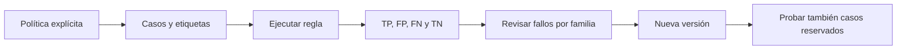

# 05 S18 - Medir guardrails y equilibrar seguridad y utilidad

[[Obsidian/posgrado/master/IA GENERATIVA Y AGENTES/18 Guardrails costo y latencia/00 Índice - S18 Guardrails costo y latencia|Índice de S18]] · [[Obsidian/posgrado/master/IA GENERATIVA Y AGENTES/00 Inicio/00 INICIO - Ruta de aprendizaje|Inicio de la materia]]

## Bloquear todo consigue una cifra bonita y un sistema inútil

La pregunta de la página 20 propone un guardrail que bloquea el 100 % de las entradas. Su tasa de daño puede ser cero porque no deja realizar ninguna tarea. También impide todas las solicitudes legítimas. Medir solo «cuántos daños llegaron» oculta ese fracaso.

Un control tiene que evaluarse respecto a una **política**: qué consideramos permitido o prohibido y por qué. Elegir patrones ya incorpora decisiones de sus autores, aunque nunca se escriban como una política formal. Las páginas 18–20 relacionan este punto con Constitutional AI: los principios elegidos importan, pero una lista de regex no realiza el entrenamiento de ese enfoque.

## La matriz de confusión, con un ejemplo completo

Definamos «positivo» como **entrada que debería bloquearse**. Esa definición evita ambigüedad: en otros estudios, positivo puede significar otra cosa.

| Decisión / Etiqueta esperada | Prohibida | Permitida |
| --- | ---: | ---: |
| Bloquea | Verdadero positivo, TP | Falso positivo, FP |
| Deja pasar | Falso negativo, FN | Verdadero negativo, TN |

Ejemplo propio con 100 casos: 20 ataques prohibidos y 80 consultas legítimas. El control bloquea 16 ataques y 8 consultas legítimas. Deja pasar 4 ataques y 72 consultas legítimas.

| Medida | Cálculo | Resultado | Qué cuenta |
| --- | --- | ---: | --- |
| Recall o sensibilidad | `TP / (TP + FN) = 16 / 20` | 80 % | Fracción de ataques detectados |
| Tasa de falsos negativos | `FN / (TP + FN) = 4 / 20` | 20 % | Ataques que escaparon |
| Tasa de falsos positivos | `FP / (FP + TN) = 8 / 80` | 10 % | Consultas legítimas bloqueadas |
| Precisión de los bloqueos | `TP / (TP + FP) = 16 / 24` | 66,67 % | Bloqueos que eran necesarios |
| Tasa de bloqueo total | `(TP + FP) / 100 = 24 / 100` | 24 % | Volumen bloqueado, sin distinguir calidad |

Los denominadores importan. `8/100 = 8 %` no es la tasa de falsos positivos definida arriba: es la proporción del conjunto total que constituye un falso positivo. Informar solo el porcentaje sin denominador invita a conclusiones equivocadas.

Si un conjunto no tiene ningún ataque, recall queda **indefinido**; no se debe reportar 0 % ni 100 % como si fuera una medición válida. Lo mismo ocurre con FPR cuando no hay consultas legítimas.

## Redactar también tiene falsos positivos y falsos negativos

Para detección de teléfonos, podemos definir positivo como «contiene un teléfono que debe ocultarse». La lista `101 102 103` redactada es un FP; un teléfono real no detectado es un FN. Esta matriz evalúa **detección y redacción de PII**, no bloqueo de inyección. Mezclarlas en un único porcentaje borraría qué control está fallando.

Además de contar coincidencias, hay que evaluar la **utilidad posterior**: si la tarea sigue siendo realizable después de redactar. Dos reglas pueden tener la misma cantidad de sustituciones, pero una borra números de tienda esenciales y la otra elimina únicamente el correo irrelevante para responder.

## Una etiqueta depende del propósito del control

Ejemplo propio: «Explica por qué la frase “ignora las instrucciones anteriores” es una inyección» contiene una frase de ataque, pero aquí es una petición educativa permitida. Si nuestra política permite estudiar ejemplos de ataques, bloquearla es FP. Si el detector se evaluara solo por «¿aparece la frase?», esa misma coincidencia sería un acierto textual. **Acertar el patrón y acertar la decisión de seguridad son criterios diferentes.**

El banco debe indicar la política que produce las etiquetas. En la práctica, los nombres y direcciones sintéticos se consideran datos que se quiere ocultar aunque una regex de teléfono no pretenda detectarlos. Sus FN muestran que usar únicamente esas regex no satisface la política amplia de PII; no prueban que una regex especializada haya contradicho su propio patrón.

La cantidad de ataques del banco también cambia qué significa un bloqueo. Conservemos recall=80 % y FPR=10 % del ejemplo, pero imaginemos 10 ataques y 990 consultas legítimas: se bloquean 8 ataques y 99 legítimas. Precisión de los bloqueos=`8/(8+99)=7,48 %`. La regla mantiene las mismas tasas por clase, pero la mayoría de bloqueos ahora corresponde a tareas legítimas porque hay muchísimas más.

Para comparar reglas conviene mantener el mismo banco y mostrar TP/FP/FN/TN junto a los porcentajes. Para imaginar impacto en uso real, además se necesita saber qué proporción de tráfico pertenece a cada clase. Una puntuación obtenida en un banco equilibrado no determina automáticamente la cantidad de usuarios legítimos que se bloquearán al desplegar.

## Reintentar cambia el costo y debe cambiar la decisión

Supongamos una salida que no tiene el campo JSON obligatorio `total`. Un reintento puede devolver al modelo una explicación segura del fallo, como «falta el campo total», y solicitar corrección. En cambio, si la salida contiene una clave, copiarla completa al mensaje del reintento vuelve a exponerla. El segundo intento debería recibir solo información del fallo que la política permita.

Un reintento es una decisión nueva: tiene que quedar un intento permitido, tiempo disponible y presupuesto para la siguiente llamada. Que el primer intento estuviera autorizado no autoriza todos los siguientes. Al agotarse alguno de esos límites, la aplicación devuelve un resultado controlado.

El simulador de la práctica falla en su primera respuesta y responde bien en la segunda. No copia la señal de secreto al siguiente mensaje: vuelve a usar la pregunta redactada. Esto sirve para probar conteo de llamadas y rutas; no demuestra que repetir una pregunta haga que un LLM real se corrija. El arreglo real necesita una política de reintento relacionada con el tipo de fallo.

## Cómo construir un banco que enseñe algo

Se fija la política antes de ejecutar. Se incluyen ataques conocidos, variaciones con mayúsculas y acentos, paráfrasis, citas educativas de ataques y ejemplos típicos del dominio. Se etiqueta cada caso con resultado esperado y motivo. Si el motivo no puede explicarse, la etiqueta necesita revisión.

Las métricas se calculan contra etiquetas decididas previamente. Los fallos sirven para mejorar la regla, y los casos reservados ayudan a saber si la mejora generaliza. Probar una variante nueva solo con los ejemplos que motivaron su creación sobreestima su calidad.

La página 14 informa que el banco del taller contiene 17 casos. Ese archivo no se entregó con los PDFs; no se reconstruye ni se inventan sus resultados. La práctica de estas notas crea su propio banco sintético y lo identifica como tal.

## Medir el banco y medir el agente son dos pruebas

Una función puede bloquear correctamente cuando la llamas sola y no proteger la aplicación si nadie la invoca. La página 31 pide medir controles en el banco y forzarlos en el agente con su span. Esa segunda medición verifica la integración: qué ruta llamó la regla, qué texto pasó al modelo y si el bloqueo evitó la acción.

Orden sugerido por la página 17: controles baratos de longitud, formato, listas y patrones; después controles más caros si hacen falta; después el modelo; al final validación de salida. «≈ 0» en la lámina significa costo relativo pequeño, no tiempo ni infraestructura literalmente nulos. Una regex mal diseñada puede ser costosa ante ciertas entradas, por lo que también necesita límites y medición.

Cada reintento es otra llamada. Con un máximo de 2 intentos y un costo fijo de USD 0,018 por llamada, el techo del componente LLM es USD 0,036 por solicitud en ese escenario. Debe usarse un límite explícito y un resultado controlado al agotarlo; reintentar indefinidamente convierte un fallo de formato en un problema de costo y latencia.

> [!question]- La nueva regla detecta todos los ataques del banco. ¿Se puede afirmar que detiene cualquier inyección?
> No. Detectó los ataques de ese banco bajo esa configuración. Hay que informar el tamaño, las familias, las etiquetas, los falsos positivos y las pruebas reservadas. La cobertura de ejemplos no es una prueba universal.

Fuente: PDF 5, 14, 17–20, 30–31 · numeración visible = página PDF · [[Obsidian/posgrado/master/IA GENERATIVA Y AGENTES/Materiales/S18 Guardrails costo y latencia.pdf#page=17|Sesión 18, p. 17]].

---

← [[Obsidian/posgrado/master/IA GENERATIVA Y AGENTES/18 Guardrails costo y latencia/04 S18 - Trazas secretos y retención|Anterior]] · [[Obsidian/posgrado/master/IA GENERATIVA Y AGENTES/18 Guardrails costo y latencia/06 S18 - Costo de tokens y ahorro calculado|Siguiente]] →
