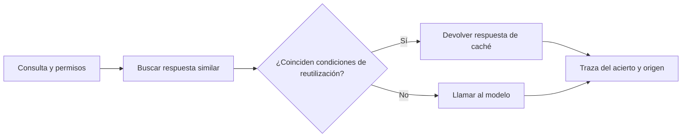

# 07 S18 - Cachés streaming batching y latencia

[[Obsidian/posgrado/master/IA GENERATIVA Y AGENTES/18 Guardrails costo y latencia/00 Índice - S18 Guardrails costo y latencia|Índice de S18]] · [[Obsidian/posgrado/master/IA GENERATIVA Y AGENTES/00 Inicio/00 INICIO - Ruta de aprendizaje|Inicio de la materia]]

## Dos cachés con mecanismos diferentes

Una **caché** conserva un resultado o trabajo previo para reutilizarlo. La palabra por sí sola no dice qué se guarda, cómo se reconoce un acierto ni qué se cobra. Conviene separar la caché de prefijo y la caché semántica.

### Caché de prefijo: reutilizar cálculo, todavía generar una respuesta

En un Transformer, **K** y **V** son representaciones de claves y valores usadas por atención. La **KV cache** evita recalcular representaciones anteriores durante generación. Algunos motores reutilizan trabajo de un prefijo coincidente entre solicitudes; los proveedores pueden exponer políticas particulares de *prompt caching* y facturación.

El prefijo es la parte inicial del contexto. Compartir solo una frase en medio no equivale a compartir el mismo prefijo. Si la fecha cambia al principio del prompt, puede romper la coincidencia de una gran parte estable que viene después, según el motor. Organizar instrucciones estables al inicio ayuda cuando coincide con los requisitos del proveedor.

Un acierto de caché de prefijo todavía necesita procesar lo nuevo y generar la salida. No es reutilizar toda la respuesta. La página 22 recuerda que su tabla tiene solo entrada y salida, por lo que faltan tarifas de escritura y lectura de caché. No se puede extraer un descuento real de campos que no existen.

Modelo general ilustrativo de costos, si las categorías son excluyentes:

$$C=\frac{T_{nuevo}P_{nuevo}+T_{escritura}P_{escritura}+T_{lectura}P_{lectura}+T_{salida}P_{salida}}{10^6}.$$

Los nombres y condiciones reales dependen del proveedor. Hay que evitar contar el mismo token como entrada nueva y escritura a la vez si la tarifa de escritura ya incorpora esa entrada. El tiempo de vida, la cantidad mínima de tokens y la tasa de aciertos también cambian el resultado.

### Cuándo compensa pagar la creación de caché

Ejemplo completamente inventado para comprender el mecanismo, sin tarifas de ningún proveedor. Procesar un prefijo sin caché cuesta USD 0,010 por llamada; crearlo en caché cuesta USD 0,012 y cada lectura posterior USD 0,001. Supongamos que no expira, que el prefijo coincide y que pregunta y salida tienen el mismo costo en todas las alternativas.

- Una llamada sin caché paga USD 0,010 de prefijo. Crear la caché para una sola llamada paga USD 0,012: cuesta más.
- Dos llamadas sin caché pagan `2 × 0,010 = USD 0,020`. Con creación y una lectura pagan `0,012 + 0,001 = USD 0,013`.
- Diez llamadas sin caché pagan USD 0,100. Con una creación y nueve lecturas pagan `0,012 + 9 × 0,001 = USD 0,021`.

El **punto de equilibrio** es la cantidad de usos a partir de la cual la alternativa comienza a compensar. En este ejemplo, `0,012 + (n−1)×0,001 < n×0,010`, que se simplifica a `0,011 < n×0,009`: para n entero, ocurre desde 2 llamadas. La expiración o un prefijo distinto obliga a recrear y cambia la cuenta. El ahorro calculado aquí es solo el componente prefijo, no el total de la aplicación.

Esta cuenta no contradice la falta de tarifas del PDF: muestra exactamente qué datos adicionales habría que obtener para completar su ejercicio con caché real.

### Caché semántica: reutilizar una respuesta de otra consulta

Un **embedding** representa un texto como un vector de números. Una caché semántica busca preguntas previas con vectores cercanos y devuelve la respuesta almacenada si la similitud supera un **umbral**. El umbral es un límite elegido: por ejemplo, decidir reutilizar cuando la puntuación es al menos cierto valor.

«Ventas de Quito en enero» y «ventas de Guayaquil en enero» pueden parecer semánticamente cercanas, pero requieren cifras distintas. Similitud no equivale a igualdad de respuesta. Cambiar usuario, permisos, período, versión de datos o instrucciones puede invalidar el acierto.

La decisión considera condiciones adicionales a la similitud. El acierto evita una nueva generación, pero necesita un registro propio que indique de dónde provino la respuesta, su versión y antigüedad. No debe atribuirse a una llamada que nunca ocurrió.

La página 26 menciona embeddings con `max_seq_tokens = 128`. Cuando un sistema trunca todo lo posterior al token 128 antes de calcular el embedding, dos entradas cuyo prefijo efectivo es idéntico se convierten en la misma entrada al modelo de embeddings. Una diferencia esencial al final desaparece para el buscador. El número concreto es del ejemplo del curso, no una propiedad de todos los modelos de embeddings.

## Streaming: cuándo aparece algo útil

**Streaming** entrega fragmentos conforme se generan en lugar de esperar a recibir todo. Puede mejorar la sensación de espera y la capacidad de cancelar, pero no reduce por sí mismo la cantidad de tokens generados ni su tarifa.

**TTFT**, *time to first token*, mide cuánto tarda el primer token. Hay que declarar si se mide desde el cliente, el servidor o después de la cola. El primer evento del protocolo puede ser metadato; el primer token generado puede pertenecer a razonamiento u otra categoría que no se muestra. Por eso también conviene medir el primer fragmento visible y útil de respuesta.

Ejemplo propio: solicitud enviada en `0 s`; primer evento en `0,2 s`; primer token interno en `0,5 s`; primer texto visible en `1,2 s`; respuesta completa en `4 s`. Decir «respondió en 0,2 s» describe el evento, no que el usuario ya tuviera su respuesta. Si la tasa después del primer texto es 50 tokens/s y quedan 140 tokens visibles, esa parte tardaría aproximadamente `140/50 = 2,8 s`, bajo una tasa constante simplificada.

## Batching: cambiar tiempo por condiciones de procesamiento

**Batching** agrupa trabajos. Un procesamiento por lotes puede esperar a reunir solicitudes y ejecutarlas según las condiciones del servicio. Puede mejorar utilización o facturación, pero también aumentar espera. **Paralelismo** es ejecutar trabajos simultáneamente; no implica que el proveedor aplique una tarifa de lote.

Conviene medir dos tiempos: espera en cola y procesamiento. Un informe nocturno que tolera horas puede beneficiarse de lote; un chat interactivo necesita límites más exigentes. No hay descuento universal de batching en la tabla de esta sesión.

## La misma consulta con tres mecanismos

Ejemplo propio: el asistente tiene un prefijo estable con instrucciones para consultas de ventas. Primera pregunta: «ventas de Quito en enero». Segunda pregunta: «ventas de Quito en febrero». Tercera: «¿cuánto se vendió en Quito durante enero?». Las dos primeras requieren datos distintos; la tercera puede pedir lo mismo que la primera bajo iguales permisos y versión de datos.

| Camino de la segunda o tercera consulta | Trabajo realizado | Respuesta que se entrega |
| --- | --- | --- |
| Caché de prefijo con la pregunta de febrero | Reutilizar cálculo del prefijo, procesar pregunta nueva y generar | Una respuesta nueva para febrero |
| Caché semántica con paráfrasis de enero y condiciones coincidentes | Buscar y validar reutilización | La respuesta almacenada de enero |
| Streaming de la pregunta de febrero | Generar una respuesta nueva y entregar fragmentos durante el proceso | La misma generación, recibida gradualmente |

La caché de prefijo y el streaming se pueden usar juntos: una optimiza procesamiento inicial y el otro cambia la entrega. Una caché semántica correcta puede evitar toda la generación de una paráfrasis; una incorrecta podría devolver enero cuando se preguntó febrero. Cambiar el modo de entrega no corrige esa selección equivocada.

Hay además una relación entre streaming y validación de salida. Si se publica cada fragmento antes de validarlo, un secreto detectado al final ya pudo haberse mostrado. Si se espera a tener toda la respuesta validada, se pierde parte del beneficio de empezar a leer pronto. El diseño puede validar fragmentos o zonas estructuradas antes de publicarlas, pero un fragmento aislado quizá no baste para detectar patrones que atraviesan su límite. La política de publicación debe definir qué unidad se libera y qué controles la revisan.

## Comparación de palancas

| Mecanismo | Qué reutiliza o cambia | Llamada nueva de generación | Qué debe medirse |
| --- | --- | --- | --- |
| Caché de prefijo | Cálculo de contexto estable | Sí, normalmente | Aciertos, escritura/lectura, TTFT y costo real |
| Caché semántica | Respuesta almacenada | No en un acierto | Validez, permisos, frescura y errores de reutilización |
| Streaming | Momento de entrega | Sí | Primer contenido útil y tiempo total |
| Batching | Agrupación y espera | Sí | Cola, plazo, tarifa y capacidad |

La página 30 indica que la parte 5 del cuaderno mide caché y streaming en una H200 mediante VPN; esos resultados no están incluidos en el PDF. Las notas no inventan una tasa ni un ahorro de ese servidor. Que `usage` no reporte caché tampoco demuestra que no exista: hay que observar las señales disponibles y describir la limitación.

> [!question]- Una caché semántica acierta el 90 %. ¿Ya se sabe que ahorra el 90 % del costo?
> No. Hay costo de embeddings y búsqueda, las llamadas evitadas pueden tener precios distintos y algunos aciertos pueden ser incorrectos. Se necesita comparar costo total y calidad de respuestas bajo las mismas condiciones.

Complemento verificado el 9 de octubre de 2026: la [documentación oficial de prompt caching de Anthropic](https://platform.claude.com/docs/en/build-with-claude/prompt-caching) exige coincidencia exacta del prefijo, describe mínimos y expiración según modelo/plataforma y separa tokens de entrada nueva, creación y lectura. Estos requisitos ilustran por qué no se puede inferir un descuento solo de la tabla histórica del PDF.

Fuente: PDF 22, 25–26, 30 · numeración visible = página PDF · [[Obsidian/posgrado/master/IA GENERATIVA Y AGENTES/Materiales/S18 Guardrails costo y latencia.pdf#page=22|Sesión 18, p. 22]].

---

← [[Obsidian/posgrado/master/IA GENERATIVA Y AGENTES/18 Guardrails costo y latencia/06 S18 - Costo de tokens y ahorro calculado|Anterior]] · [[Obsidian/posgrado/master/IA GENERATIVA Y AGENTES/18 Guardrails costo y latencia/08 S18 - Prompts versionados evaluación y rollback|Siguiente]] →
