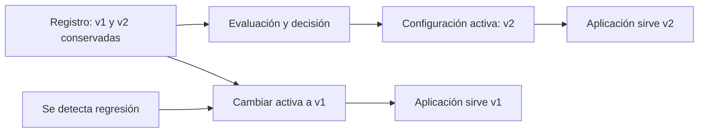

# 08 S18 - Prompts versionados evaluación y rollback

[[Obsidian/posgrado/master/IA GENERATIVA Y AGENTES/18 Guardrails costo y latencia/00 Índice - S18 Guardrails costo y latencia|Índice de S18]] · [[Obsidian/posgrado/master/IA GENERATIVA Y AGENTES/00 Inicio/00 INICIO - Ruta de aprendizaje|Inicio de la materia]]

## El prompt es parte del comportamiento del sistema

Un **artefacto** es un componente que se identifica, conserva y despliega de forma controlada. Tratar el prompt como artefacto permite saber qué instrucciones produjo una respuesta y qué cambio podría explicar una regresión.

No basta con un archivo llamado `prompt_final_final.txt`. Se necesita un identificador, una versión y la relación entre esa versión y la ejecución. Ejemplo propio: `asistente_ventas`, versión entera `2`, archivo versionado en Git y huella del contenido. La traza registra el identificador y la versión, sin tener que copiar todo el prompt en cada evento.

Un **changelog** describe qué cambió y por qué. «v2» no explica el cambio. «Exigir campos `total` y `fuentes` en JSON; aclarar que los documentos recuperados son evidencia» permite evaluar el efecto previsto.

## El cambio de formato tiene dos métricas

La página 28 muestra una v2 con JSON estricto y delimitadores contra inyección. Su decisión de despliegue exige mejorar formato **sin degradar correctitud**. La comparación de versiones del cuaderno está rotulada como simulada; no es un resultado experimental real del modelo.

Un **golden set** es un conjunto de casos de referencia con expectativas y criterios de evaluación. Debe incluir ejemplos legítimos, casos difíciles y condiciones de seguridad relevantes. Una versión se compara sobre los mismos casos, modelos, parámetros y criterios, o se explica la diferencia.

Ejemplo propio:

| Versión | Respuestas con JSON válido | Respuestas correctas |
| --- | ---: | ---: |
| v1 | 80 de 100 | 92 de 100 |
| v2 | 98 de 100 | 83 de 100 |

La v2 mejoró estructura y empeoró exactitud. Publicarla solo por su 98 % de formato ocultaría una regresión. Es útil medir correctitud sobre todos los casos y también examinar el subconjunto que pudo parsearse, declarando ambos denominadores. Medir solo respuestas que parsean puede excluir silenciosamente fallos de una versión.

## Guardar versiones y hacer rollback son cosas diferentes

**Rollback** significa volver a usar una versión anterior. El registro descrito en la página 29 ofrece `registrar`, `obtener` e `historial`. Si `obtener()` devuelve siempre la versión máxima, seguirá usando v2 aunque v1 esté guardada.

Falta el **puntero de versión activa**: una configuración que señale qué versión se sirve. La aplicación debe consultar ese puntero, no asumir que «la más reciente» equivale a «la aprobada».

El registro conserva alternativas. La configuración elige cuál se usa. Cambiar el puntero permite regresar sin borrar v2 ni reconstruir v1. La aplicación debe leer la nueva configuración y registrar el cambio; si mantiene una caché local del puntero, puede requerir recarga o propagación explícita.

## Dos errores pequeños que rompen el contrato

**`version or ultima`.** En Python, `0` es falso en una condición. Si la versión 0 es válida, una expresión que usa `or` la sustituye por la última versión. La comprobación correcta de omisión es `version is None`, para distinguir «no se entregó» de «se entregó cero».

**Máximo de cadenas.** Ordenar cadenas no ordena necesariamente versiones numéricas: al comparar caracteres, `"v9"` puede resultar mayor que `"v10"`. Para este laboratorio se usan enteros `1` y `2`. Para versiones más complejas hay que definir un orden o seleccionar explícitamente la versión activa.

También hay que evitar sobrescribir silenciosamente una versión publicada. Si v1 cambia de contenido sin cambiar su identificación, dos trazas con «v1» ya no garantizan haber usado lo mismo.

## El rollback no cambia respuestas que ya se entregaron

Ejemplo propio: a las 10:00 la activa pasa de v1 a v2. Una solicitud que empieza a las 10:01 registra v2. A las 10:05 se detecta la regresión y la configuración vuelve a v1. Las solicitudes posteriores deben registrar v1; una ejecución que ya había tomado v2 puede seguir en curso. Conviene definir si se permite terminar o se cancela, según el efecto de la tarea.

Volver a v1 tampoco modifica el contenido de una respuesta de caché semántica generada con v2. Para evitar reutilizar comportamiento retirado, la versión del prompt puede formar parte de la clave de caché o de sus condiciones de validez. Registrar la versión en la traza permite comprobar qué se sirvió; el puntero activo permite elegir qué se sirve después. Son responsabilidades complementarias.

## Un ciclo completo de cambio

1. Registrar el nuevo contenido con versión única y motivo.
2. Ejecutar el golden set y comparar seguridad, utilidad, formato, costo y latencia según el propósito.
3. Aprobar la selección de la versión activa mediante una regla de decisión explícita.
4. Servir la versión elegida y registrar su identificador en las trazas.
5. Observar resultados posteriores al despliegue.
6. Si hay una regresión, cambiar la activa a una versión conocida y verificar que las llamadas realmente la usan.

Los delimitadores son una mejora de instrucciones, no un reemplazo de los permisos y guardrails estudiados en las otras notas. Una versión de prompt también puede necesitar la versión de política y herramientas con la que se evaluó.

> [!question]- Conservo todas las versiones en Git y `obtener()` devuelve la máxima. ¿Ya tengo rollback automático?
> No. Tienes historia recuperable. Para volver necesitas una selección explícita de versión activa y comprobar que el proceso que atiende solicitudes la utiliza. Git y un historial no modifican por sí mismos la configuración de ejecución.

Fuente: PDF 27–30 · numeración visible = página PDF · [[Obsidian/posgrado/master/IA GENERATIVA Y AGENTES/Materiales/S18 Guardrails costo y latencia.pdf#page=27|Sesión 18, p. 27]].

---

← [[Obsidian/posgrado/master/IA GENERATIVA Y AGENTES/18 Guardrails costo y latencia/07 S18 - Cachés streaming batching y latencia|Anterior]] · [[Obsidian/posgrado/master/IA GENERATIVA Y AGENTES/18 Guardrails costo y latencia/09 S18 - Laboratorio local de guardrails y versiones|Siguiente]] →
