## Diagrama 1: Obsidian/posgrado/master/IA GENERATIVA Y AGENTES/17 Observabilidad y versionado de prompts/01 S17 - Por qué una respuesta exitosa puede ser un fallo.md

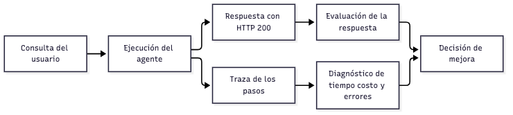

## Diagrama 2: Obsidian/posgrado/master/IA GENERATIVA Y AGENTES/17 Observabilidad y versionado de prompts/03 S17 - Tokens costos y atribución del gasto.md

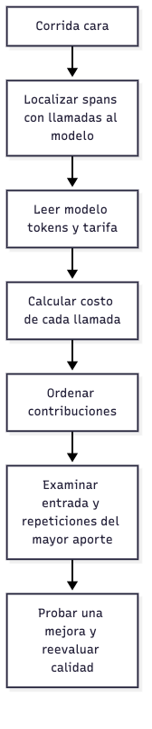

## Diagrama 3: Obsidian/posgrado/master/IA GENERATIVA Y AGENTES/17 Observabilidad y versionado de prompts/04 S17 - Latencia percentiles y diagnóstico de anomalías.md

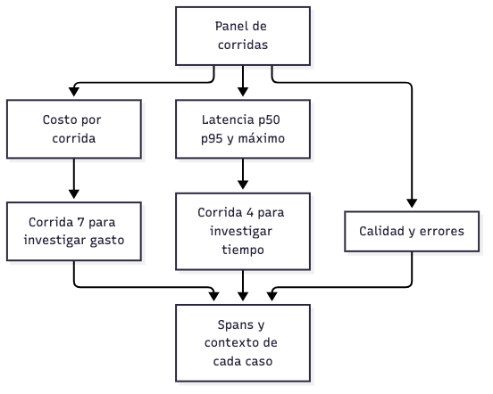

## Diagrama 4: Obsidian/posgrado/master/IA GENERATIVA Y AGENTES/17 Observabilidad y versionado de prompts/05 S17 - Instrumentar el bucle y conservar los errores.md

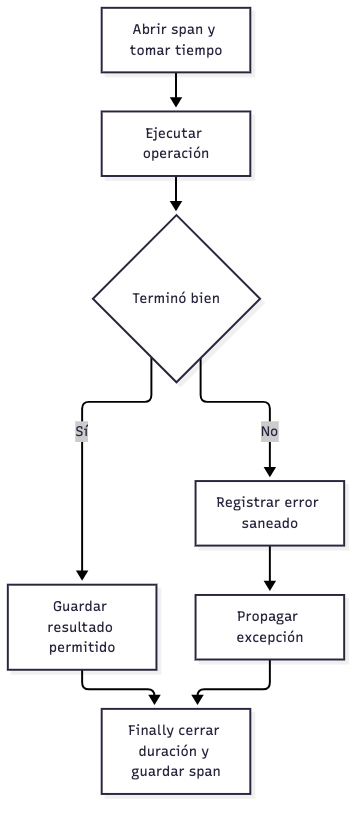

## Diagrama 5: Obsidian/posgrado/master/IA GENERATIVA Y AGENTES/17 Observabilidad y versionado de prompts/07 S17 - Configuración privacidad y exportación de trazas.md

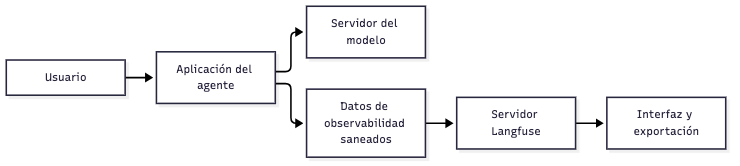

## Diagrama 6: Obsidian/posgrado/master/IA GENERATIVA Y AGENTES/17 Observabilidad y versionado de prompts/08 S17 - Versiones etiquetas evaluación y rollback de prompts.md

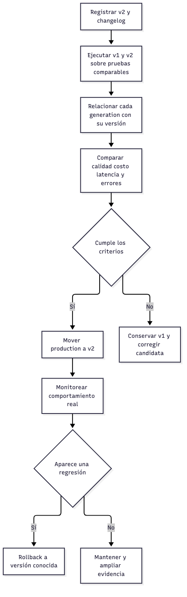

## Diagrama 7: Obsidian/posgrado/master/IA GENERATIVA Y AGENTES/17 Observabilidad y versionado de prompts/09 S17 - Laboratorio resuelto sin API ni servicios externos.md

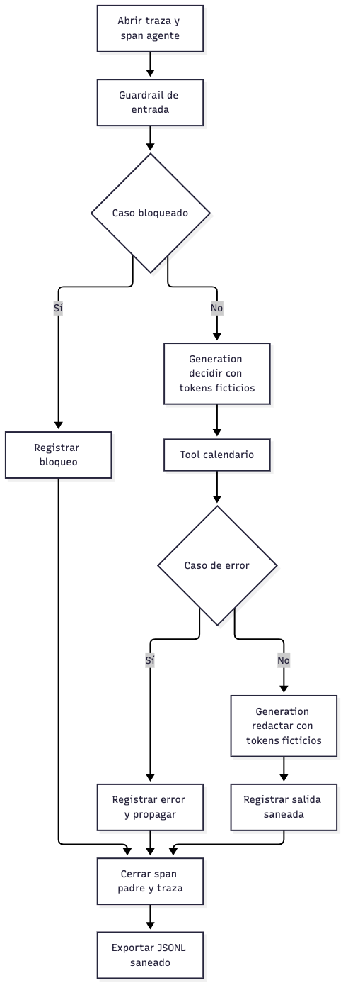

## Diagrama 8: Obsidian/posgrado/master/IA GENERATIVA Y AGENTES/18 Guardrails costo y latencia/01 S18 - Guardrails y bordes de confianza.md

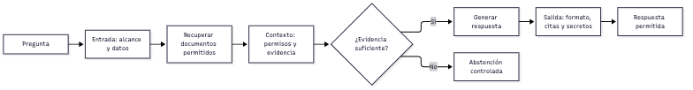

## Diagrama 9: Obsidian/posgrado/master/IA GENERATIVA Y AGENTES/18 Guardrails costo y latencia/02 S18 - Reglas patrones y normalización.md

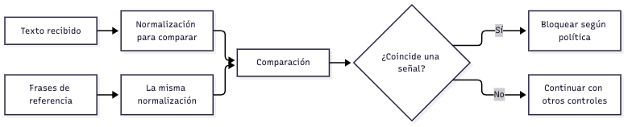

## Diagrama 10: Obsidian/posgrado/master/IA GENERATIVA Y AGENTES/18 Guardrails costo y latencia/03 S18 - Datos personales y errores de redacción.md

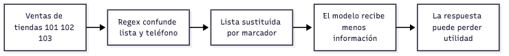

## Diagrama 11: Obsidian/posgrado/master/IA GENERATIVA Y AGENTES/18 Guardrails costo y latencia/04 S18 - Trazas secretos y retención.md

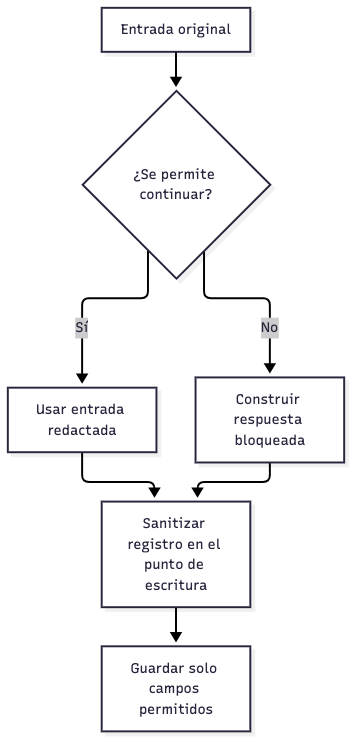

## Diagrama 12: Obsidian/posgrado/master/IA GENERATIVA Y AGENTES/18 Guardrails costo y latencia/05 S18 - Medir guardrails y equilibrar seguridad y utilidad.md

## Diagrama 13: Obsidian/posgrado/master/IA GENERATIVA Y AGENTES/18 Guardrails costo y latencia/07 S18 - Cachés streaming batching y latencia.md

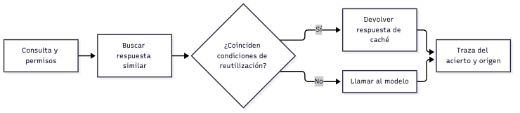

## Diagrama 14: Obsidian/posgrado/master/IA GENERATIVA Y AGENTES/18 Guardrails costo y latencia/08 S18 - Prompts versionados evaluación y rollback.md

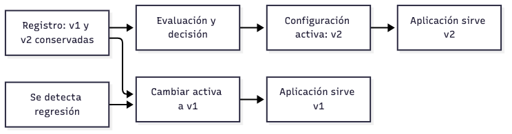

## Diagrama 15: Obsidian/posgrado/master/IA GENERATIVA Y AGENTES/18 Guardrails costo y latencia/09 S18 - Laboratorio local de guardrails y versiones.md

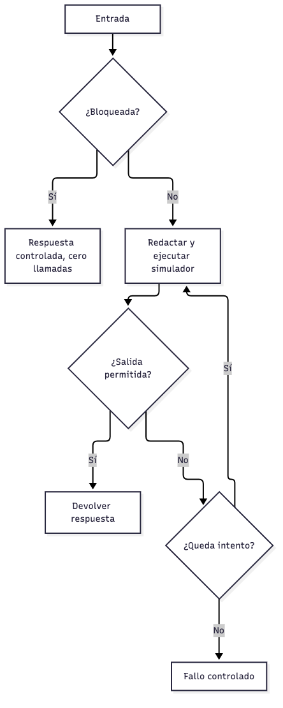

## Diagrama 16: Obsidian/posgrado/master/IA GENERATIVA Y AGENTES/00 Inicio/01 Guía - Entender las sesiones 17 y 18.md

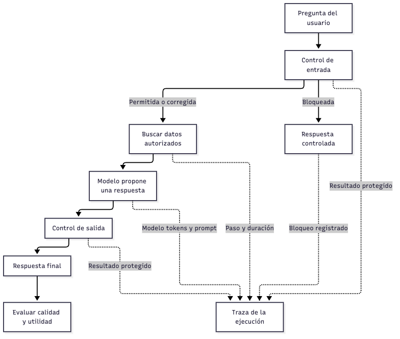

## Diagrama 17: Obsidian/posgrado/master/IA GENERATIVA Y AGENTES/00 Inicio/02 Caso resuelto - Diagnosticar y mejorar un asistente de ventas.md

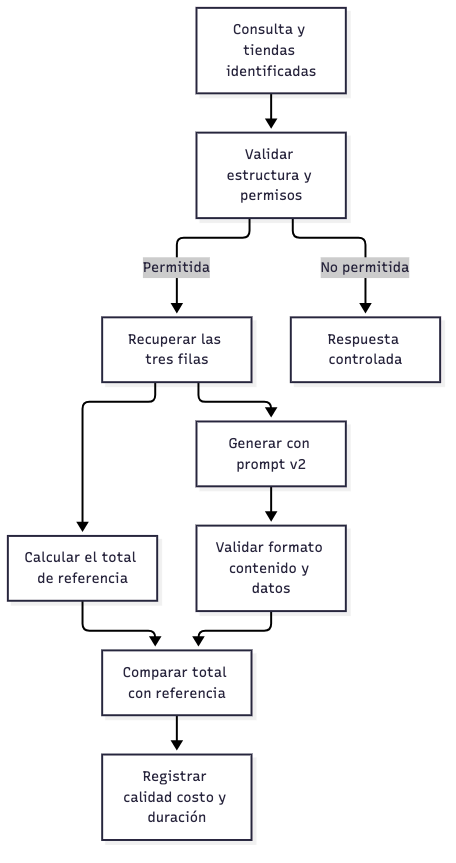