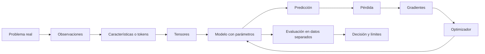

# INICIO: qué es cada cosa y cómo se conecta

> [!abstract] Propósito
> Esta es la nota a la que debes volver cuando una palabra técnica te haga perder el hilo. No pretende sustituir los módulos: recuerda **qué representa cada cosa**, qué pregunta responde y con qué se conecta.

## El mapa completo en una frase

Un **dato** se representa como números; un **modelo** transforma esos números usando **parámetros**; una **pérdida** mide el error; el **gradiente** indica cómo cambiar los parámetros; un **optimizador** decide el paso; y la **evaluación** comprueba si lo aprendido funciona en datos no utilizados para ajustar el modelo.

![[assets/ruta maestra ia/01-mapa-ruta-maestra.svg|900]]

## Diccionario para no confundir niveles

| Concepto | Qué es | Pregunta que responde | Ejemplo |
|---|---|---|---|
| observación | una unidad del mundo medida | ¿qué representa una fila? | una sesión de mouse |
| característica | número calculado de una observación | ¿qué aspecto medimos? | velocidad media |
| etiqueta | respuesta conocida | ¿qué queremos predecir? | legítimo/impostor |
| vector | lista ordenada de números | ¿cómo representamos una observación? | $x=(2.1,0.7,15)$ |
| matriz | colección rectangular | ¿cómo reunimos observaciones? | $X\in\mathbb R^{B\times D}$ |
| tensor | arreglo con ejes semánticos | ¿qué índices hacen falta? | lote, tiempo, característica |
| parámetro | número que aprende el modelo | ¿qué cambia durante entrenamiento? | un peso de $W$ |
| hiperparámetro | decisión externa al ajuste | ¿qué configuramos? | tasa de aprendizaje |
| logit | puntaje sin normalizar | ¿qué tan compatible parece una clase? | $z_1=2.4$ |
| probabilidad | masa normalizada entre resultados | ¿cuánta incertidumbre asignamos? | $p(y=1\mid x)=0.8$ |
| pérdida | objetivo escalar optimizable | ¿qué tan costosa fue esta predicción? | cross-entropy |
| métrica | resumen para evaluar | ¿qué desempeño importa? | F1, recall, EER |
| gradiente | sensibilidad local | ¿cómo cambia la pérdida si muevo parámetros? | $\nabla_\theta L$ |
| optimizador | regla para actualizar | ¿qué paso damos? | Adam, SGD |
| inferencia | usar el modelo ya ajustado | ¿qué predice para una entrada nueva? | puntaje de anomalía |

> [!warning] Tres confusiones que dañan todo lo demás
> 1. Una **característica** no es una etiqueta.
> 2. Una **pérdida** no es necesariamente la métrica final.
> 3. Una probabilidad alta no demuestra que el modelo esté bien calibrado ni que el dato sea correcto.

## La misma observación vista desde cada materia

Supón una sesión de mouse resumida como:

$$x=[\text{velocidad media},\text{pausas},\text{curvatura}]=[420,7,0.31].$$

- **Python** conserva nombres, tipos e invariantes.
- **Álgebra lineal** interpreta $x$ como punto y vector.
- **Tensores** sitúan muchas sesiones en $X\in\mathbb R^{B\times D}$.
- **Probabilidad** describe incertidumbre sobre legítimo o impostor.
- **Cálculo** mide cómo cambia la pérdida.
- **Machine Learning** elige una familia de funciones y aprende sus parámetros.
- **Estadística** cuantifica incertidumbre y evita conclusiones exageradas.
- **Ingeniería de software** hace el experimento repetible y auditable.

## Ruta maestra recomendada

1. [[UV]] y [[Estructuras de Python en un experimento de IA]].
2. [[poo ia/00 Índice - POO e IA|POO aplicada a IA]].
3. [[espacios vectoriales y embeddings/00 Índice - Espacios vectoriales y embeddings|Vectores y embeddings]].
4. [[tensores y algebra computacional con pytorch/00 Índice - Tensores y álgebra computacional con PyTorch|Tensores y PyTorch]].
5. [[espectro svd y rango bajo/00 Índice - Espectro, SVD y rango bajo|SVD, PCA y rango bajo]].
6. [[calculo multivariable y matricial/00 Índice - Cálculo multivariable y matricial|Cálculo multivariable]].
7. [[gradientes autodiferenciacion y optimizacion/00 Índice - Gradientes, autodiferenciación y optimización|Gradientes y optimización]].
8. [[probabilidad y estadistica para ia/00 Índice y recordatorio - Probabilidad para IA|Probabilidad para IA]].
9. [[machine learning clasico y generalizacion/00 Índice y recordatorio - Machine Learning clásico|Machine Learning clásico]].
10. [[redes neuronales desde cero/00 Índice y recordatorio - Redes neuronales desde cero|Redes neuronales]].
11. [[comparacion estadistica de modelos/00 Índice - Comparación estadística de modelos|Comparación estadística]].
12. [[modelos de lenguaje y transformers/00 Índice - Modelos de lenguaje y transformers|LLMs y Transformers]].
13. [[deteccion de anomalias y series temporales/00 Índice y recordatorio - Anomalías y secuencias|Anomalías y secuencias]].
14. [[ingenieria de software para machine learning/00 Índice y recordatorio - Ingeniería de software para ML|Ingeniería de software para ML]].
15. [[proyecto/README - Proyecto de dinámica de mouse|Proyecto integrador]].
16. [[proyecto/Resultados - Baseline de dinámica de mouse|Interpretación del baseline real]].

## Nuevos módulos del material de clase

Estos números corresponden a los PDF del curso, no a la numeración de la ruta recomendada de arriba.

- [[gradientes autodiferenciacion y optimizacion/15 Guía de comprensión - del ejemplo a todo el entrenamiento|M08 ampliado: guía del estudiante e imágenes explicadas]].
- [[contenedores y ejecucion reproducible con docker/00 Índice - M09 Docker y ejecución reproducible|M09: contenedores y ejecución reproducible con Docker]].
- [[modelo relacional y sql analitico/00 Índice - M10 Modelo relacional y SQL analítico|M10: modelo relacional y SQL analítico]].

- [[pipeline de datos para un producto analitico/00 Índice - M11 Pipeline de datos para un producto analítico|M11: pipeline de datos, contratos, pruebas y reconstrucción]].

En las nuevas notas, haz clic sobre cada pregunta al final para desplegar la respuesta.

## Método de estudio: cinco pruebas de dominio

Para afirmar que entiendes un concepto debes poder:

1. **Explicarlo:** una frase sin símbolos.
2. **Representarlo:** identificar objetos, formas, unidades y ejes.
3. **Calcularlo:** resolver un caso pequeño a mano.
4. **Implementarlo:** escribir código y predecir la salida antes de ejecutarlo.
5. **Auditarlo:** detectar una fuga, eje incorrecto o conclusión excesiva.

> [!tip] Regla de sesión
> Empieza cada tema respondiendo: “¿qué entra, qué sale, qué aprende y cómo sé si funciona?”. Si no puedes responder, vuelve a esta nota.

## Qué estudiar después según el bloqueo

| Si te confunde… | Vuelve a… |
|---|---|
| shapes, ejes o broadcasting | [[tensores y algebra computacional con pytorch/01 Prerrequisitos - vectores, matrices, índices y formas]] |
| por qué una pérdida es negativa logarítmica | [[probabilidad y estadistica para ia/03 Verosimilitud, entropía, cross-entropy y KL]] |
| de dónde sale backpropagation | [[calculo multivariable y matricial/02 Jacobianos, regla de la cadena y VJP]] |
| por qué un modelo memoriza | [[machine learning clasico y generalizacion/03 Generalización, sesgo-varianza y regularización]] |
| por qué una red profunda se vuelve inestable | [[redes neuronales desde cero/02 Inicialización y flujo del gradiente]] |
| por qué una métrica cambia con el umbral | [[machine learning clasico y generalizacion/05 Métricas, umbrales, calibración y validación]] |
| detección sin ejemplos de impostor | [[deteccion de anomalias y series temporales/03 Detección de anomalías e Isolation Forest]] |
| RAG frente a fine-tuning | [[modelos de lenguaje y transformers/20 Laboratorio aplicado - elegir prompting, RAG o fine-tuning]] |

## Autoevaluación inicial

Intenta responder sin mirar:

1. ¿Cuál es la diferencia entre parámetro e hiperparámetro?
2. ¿Por qué la pérdida debe ser escalar para iniciar `backward()`?
3. ¿Qué dimensión representa cada eje de $X\in\mathbb R^{B\times S\times D}$?
4. ¿Por qué el conjunto de prueba no debe decidir el umbral?
5. ¿Una salida softmax es automáticamente una probabilidad bien calibrada?

> [!question]- Respuestas mínimas
> 1. El parámetro se ajusta con datos; el hiperparámetro define el procedimiento. 2. Porque se desea una sensibilidad única del objetivo respecto de cada parámetro. 3. Lote, posición temporal y característica. 4. Porque adaptarlo al test convierte el test en datos de entrenamiento. 5. No: suma uno, pero puede ser sistemáticamente demasiado confiada.
