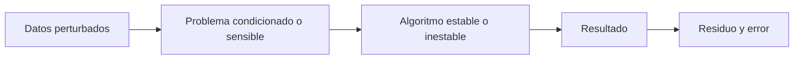

# Álgebra numérica para IA: índice y recordatorio

> [!abstract] Idea central
> Una identidad matemática exacta puede convertirse en un algoritmo inestable al ejecutarse con precisión finita. El objetivo es obtener respuestas confiables, no solo fórmulas correctas.

## Recordatorio

| Concepto | Pregunta |
|---|---|
| error de redondeo | ¿qué información perdió el formato numérico? |
| estabilidad | ¿el algoritmo amplifica errores evitables? |
| condicionamiento | ¿el problema amplifica perturbaciones inevitables? |
| residuo | ¿la respuesta satisface aproximadamente la ecuación? |
| error hacia adelante | ¿qué tan lejos está de la solución real? |

## Ruta

1. [[01 Punto flotante, estabilidad y condicionamiento]]
2. [[02 Sistemas lineales, factorización QR y evitar la inversa]]
3. [[03 Mínimos cuadrados, pseudoinversa, SVD y regularización]]
4. [[04 Laboratorio y autoevaluación - Álgebra numérica]]

---

Volver a [[../00 INICIO - Qué es cada cosa y ruta maestra de IA]] · Siguiente: [[01 Punto flotante, estabilidad y condicionamiento]]

