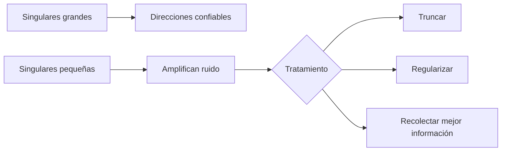

# Mínimos cuadrados, pseudoinversa, SVD y regularización

## SVD

$$A=U\Sigma V^T.$$

Cada singular $\sigma_i$ mide cuánto amplifica $A$ una dirección $v_i$ hacia $u_i$.

## Pseudoinversa

$$A^+=V\Sigma^+U^T,$$

donde $\Sigma^+$ invierte solo singulares no nulas bajo una tolerancia. La solución:

$$x^+=A^+b$$

minimiza el residuo y, entre soluciones equivalentes, tiene norma mínima.

## Sensibilidad

Una componente de $b$ en dirección $u_i$ se divide por $\sigma_i$:

$$x^+=\sum_{i:\sigma_i>0}\frac{u_i^Tb}{\sigma_i}v_i.$$

Si $\sigma_i$ es pequeña, ruido pequeño se amplifica mucho.

## Truncamiento

La pseudoinversa truncada omite direcciones pequeñas:

$$x_k=\sum_{i=1}^k\frac{u_i^Tb}{\sigma_i}v_i.$$

Introduce sesgo, pero reduce varianza y amplificación de ruido.

## Ridge

$$\hat x_\lambda=(A^TA+\lambda I)^{-1}A^Tb.$$

En coordenadas SVD aplica filtro:

$$\frac{\sigma_i}{\sigma_i^2+\lambda}.$$

No corta abruptamente; reduce de manera suave direcciones débiles.

## Conexión con PCA

PCA aplica SVD a datos centrados. Las componentes con singular grande describen direcciones de alta variación. Alta variación no implica automáticamente utilidad predictiva ni causalidad.

## Rango numérico

El rango depende de una tolerancia relativa a escala y precisión:

$$\sigma_i>\tau\sigma_{max}.$$

Preguntar “¿es exactamente cero?” suele ser incorrecto con datos y aritmética flotante.

## Autoevaluación

1. ¿Qué hace $1/\sigma_i$ al ruido?
2. ¿Qué propiedad distingue la solución pseudoinversa?
3. Compara truncamiento y ridge.
4. ¿Por qué rango numérico necesita tolerancia?

---

Anterior: [[02 Sistemas lineales, factorización QR y evitar la inversa]] · Siguiente: [[04 Laboratorio y autoevaluación - Álgebra numérica]]

