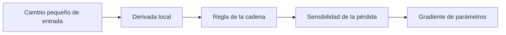

# Cálculo multivariable y matricial

> [!abstract] Pregunta del módulo
> ¿Cómo medimos el cambio de una salida cuando una entrada tiene muchas componentes y cómo propagamos esa sensibilidad por un programa completo?

## Recordatorio

| Objeto | Entrada | Salida | Derivada natural |
|---|---|---|---|
| $f:\mathbb R\to\mathbb R$ | escalar | escalar | escalar $f'$ |
| $f:\mathbb R^D\to\mathbb R$ | vector | escalar | gradiente $\nabla f\in\mathbb R^D$ |
| $f:\mathbb R^D\to\mathbb R^K$ | vector | vector | Jacobiano $J\in\mathbb R^{K\times D}$ |
| $f:\mathbb R^D\to\mathbb R$ dos veces derivable | vector | escalar | Hessiano $H\in\mathbb R^{D\times D}$ |

## Ruta

1. [[01 Derivadas parciales, gradiente, dirección y Taylor]]
2. [[02 Jacobianos, regla de la cadena y VJP]]
3. [[03 Hessiano, convexidad y cálculo matricial]]
4. [[04 Laboratorio y autoevaluación - Cálculo multivariable]]

## Convención de formas

Usaremos vectores columna para derivaciones matemáticas. En código, un lote suele usar filas:

$$x\in\mathbb R^D,\qquad X\in\mathbb R^{B\times D}.$$

Siempre declara la convención antes de transponer. Muchas contradicciones aparentes provienen de mezclar vectores fila y columna.

---

Volver a [[../00 INICIO - Qué es cada cosa y ruta maestra de IA]] · Siguiente: [[01 Derivadas parciales, gradiente, dirección y Taylor]]

