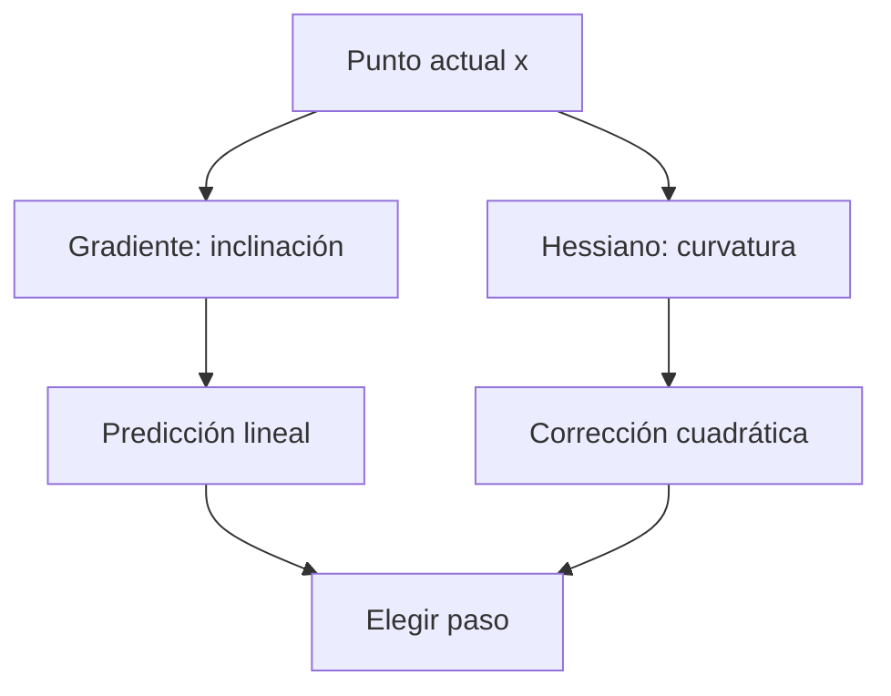

# Derivadas parciales, gradiente, dirección y Taylor

![[../assets/ruta maestra ia/04-gradiente-taylor.gif|900]]

## Derivada como modelo local

Para un cambio pequeño $\Delta x$:

$$f(x+\Delta x)\approx f(x)+f'(x)\Delta x.$$

La derivada no es solo una pendiente dibujada: es el coeficiente del mejor modelo lineal local.

## Derivada parcial

Si $f(x_1,\ldots,x_D)$, la parcial respecto de $x_j$ cambia esa coordenada y mantiene las demás fijas:

$$\frac{\partial f}{\partial x_j}=
\lim_{h\to0}\frac{f(x+he_j)-f(x)}h.$$

Ejemplo:

$$f(x,y)=x^2+3xy+y^2.$$

Entonces:

$$\frac{\partial f}{\partial x}=2x+3y,\qquad
\frac{\partial f}{\partial y}=3x+2y.$$

En $(1,2)$ el gradiente es $(8,7)$.

## Gradiente

$$\nabla f(x)=
\begin{bmatrix}
\partial f/\partial x_1\\
\vdots\\
\partial f/\partial x_D
\end{bmatrix}.$$

Su significado aparece en la aproximación:

$$f(x+\Delta x)\approx f(x)+\nabla f(x)^T\Delta x.$$

Cada componente responde: “si muevo solo esta coordenada una unidad infinitesimal, ¿cómo cambia la salida?”.

## Derivada direccional

Para dirección unitaria $u$:

$$D_uf(x)=\nabla f(x)^Tu.$$

Por Cauchy–Schwarz:

$$\nabla f^Tu\le\lVert\nabla f\rVert,$$

y el máximo ocurre cuando $u$ apunta en la dirección del gradiente. Por eso $-\nabla f$ es la dirección de descenso local más pronunciado bajo norma euclídea.

## Ejemplo numérico

En $(1,2)$, $\nabla f=(8,7)$. Si movemos $\Delta=(0.01,-0.02)$:

$$\Delta f\approx(8)(0.01)+(7)(-0.02)=-0.06.$$

La predicción es que la función disminuye aproximadamente 0.06.

## Taylor de primer y segundo orden

Primer orden:

$$f(x+\Delta)\approx f(x)+\nabla f(x)^T\Delta.$$

Segundo orden:

$$f(x+\Delta)\approx f(x)+\nabla f(x)^T\Delta+\frac12\Delta^TH(x)\Delta.$$

El gradiente describe inclinación; el Hessiano describe cómo cambia esa inclinación.

## Diferencias finitas

La derivada parcial puede auditarse:

$$\frac{\partial f}{\partial x_j}\approx
\frac{f(x+he_j)-f(x-he_j)}{2h}.$$

Esto verifica una derivada, pero no es un método práctico para entrenar millones de parámetros: necesita dos evaluaciones por componente.

## Errores frecuentes

- confundir el gradiente con el cambio real: solo predice localmente;
- usar una dirección no unitaria y llamarla pendiente direccional sin aclarar escala;
- creer que gradiente cero garantiza mínimo;
- olvidar que las unidades del gradiente son “unidades de salida por unidad de entrada”.

## Autoevaluación

1. ¿Qué mantiene fijo una derivada parcial?

> [!faq]- Ver respuesta
> Mantiene fijas todas las variables excepto aquella respecto de la cual se deriva. Solo se permite variar esa coordenada.

2. ¿Por qué $-\nabla f$ desciende?

> [!faq]- Ver respuesta
> Porque el gradiente $\nabla f$ apunta hacia la dirección de mayor aumento local. Por tanto, su opuesto $-\nabla f$ apunta hacia el descenso local más pronunciado bajo la norma euclídea.

3. ¿Qué añade Taylor de segundo orden?

> [!faq]- Ver respuesta
> Añade el término cuadrático $\frac12\Delta^T H(x)\Delta$, que incorpora la curvatura descrita por el Hessiano y mejora la aproximación local.

4. ¿Por qué una tasa de aprendizaje grande puede invalidar el modelo local?

> [!faq]- Ver respuesta
> Porque las aproximaciones de Taylor son fiables solo cerca del punto actual. Una tasa grande produce un paso que puede salir de esa región, donde la pendiente y la curvatura pueden ser muy diferentes.

---

Anterior: [[00 Índice - Cálculo multivariable y matricial]] · Siguiente: [[02 Jacobianos, regla de la cadena y VJP]]
