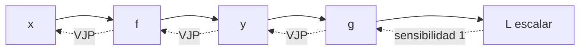

# Jacobianos, regla de la cadena y VJP

## Cuando la salida también es vector

Sea $f:\mathbb R^D\to\mathbb R^K$. El Jacobiano reúne todas las sensibilidades:

$$J_f(x)_{ij}=\frac{\partial f_i}{\partial x_j}.$$

Forma:

$$J_f\in\mathbb R^{K\times D}.$$

Filas corresponden a salidas; columnas, a entradas.

## Ejemplo

$$f(x,y)=
\begin{bmatrix}
x^2y\\
x+y
\end{bmatrix}.$$

$$J_f(x,y)=
\begin{bmatrix}
2xy & x^2\\
1 & 1
\end{bmatrix}.$$

En $(2,3)$:

$$J_f=
\begin{bmatrix}
12&4\\
1&1
\end{bmatrix}.$$

## Regla de la cadena

Si $x\xrightarrow{f}y\xrightarrow{g}z$:

$$J_{g\circ f}(x)=J_g(f(x))J_f(x).$$

Las formas explican el orden:

$$J_g\in\mathbb R^{M\times K},\qquad
J_f\in\mathbb R^{K\times D},$$

por tanto $J_gJ_f\in\mathbb R^{M\times D}$.

## Caso central: pérdida escalar

En entrenamiento:

$$x\to h\to z\to L,$$

donde $L\in\mathbb R$. No necesitamos materializar cada Jacobiano. Backpropagation propaga un vector de sensibilidad hacia atrás.

## VJP: vector–Jacobian product

Si llega una sensibilidad fila $v^T=\partial L/\partial y$:

$$\frac{\partial L}{\partial x}=v^TJ_f(x).$$

Esta operación se llama VJP. Calcula exactamente la combinación de filas del Jacobiano que necesita la pérdida.

## Ejemplo de una neurona

$$z=w^Tx+b,\qquad \hat y=\sigma(z),\qquad L=L(\hat y,y).$$

La cadena:

$$\frac{\partial L}{\partial w}
=\frac{\partial L}{\partial\hat y}
\frac{\partial\hat y}{\partial z}
\frac{\partial z}{\partial w}.$$

Como $\partial z/\partial w=x$:

$$\nabla_wL=\delta x,$$

donde $\delta=\partial L/\partial z$ resume la señal que llega desde la derecha.

## Broadcasting en backward

Si $Z=XW+b$ con $X\in\mathbb R^{B\times D}$ y $b\in\mathbb R^H$, el sesgo se repite en $B$ filas. Por tanto su gradiente suma sobre el eje de lote:

$$\frac{\partial L}{\partial b}=\sum_{i=1}^B\frac{\partial L}{\partial Z_{i,:}}.$$

Backward invierte operaciones:

- broadcasting hacia delante → reducción hacia atrás;
- reducción hacia delante → expansión/distribución hacia atrás;
- transposición hacia delante → transposición compatible hacia atrás.

## JVP frente a VJP

| Producto | Forma conceptual | Uso típico |
|---|---|---|
| JVP | $Jv$ | derivadas hacia adelante, pocas entradas variables |
| VJP | $v^TJ$ | reverse mode, pérdida escalar y muchos parámetros |

## Por qué reverse mode sirve para redes

Una red puede tener millones de parámetros y una sola pérdida. Reverse mode calcula todas las derivadas de esa salida escalar en un recorrido inverso, en lugar de recorrer una vez por parámetro.

## Autoevaluación

1. ¿Qué forma tiene el Jacobiano de $\mathbb R^5\to\mathbb R^3$?
2. ¿Por qué no se materializa el Jacobiano completo en backprop?
3. ¿Qué operación inversa produce el gradiente de un sesgo broadcast?
4. ¿Cuándo sería atractivo forward mode?

---

Anterior: [[01 Derivadas parciales, gradiente, dirección y Taylor]] · Siguiente: [[03 Hessiano, convexidad y cálculo matricial]]

