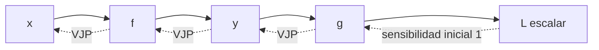

# Jacobianos, regla de la cadena y VJP

## Idea general

Cuando una función recibe **varios números** y devuelve **varios números**, una sola derivada ya no basta. Necesitamos registrar cómo cambia **cada salida** cuando modificamos **cada entrada**. Esa tabla de derivadas es el **Jacobiano**.

Estas ideas aparecen constantemente en redes neuronales:

- el **Jacobiano** describe las sensibilidades locales de una operación;
- la **regla de la cadena** conecta las sensibilidades de operaciones consecutivas;
- un **VJP** calcula solo la combinación del Jacobiano necesaria para retropropagar una pérdida.

> [!summary] Intuición
> En el paso hacia delante calculamos valores. En el paso hacia atrás calculamos cuánto influye cada valor en la pérdida.

## Explicación intuitiva: ¿qué es y para qué sirve?

La idea principal de esta nota es entender **cómo una red neuronal descubre qué valores o parámetros causaron su error**.

### 1. ¿Qué es el Jacobiano?

Cuando una función tiene varias entradas y varias salidas, existen muchas relaciones que debemos estudiar. Por ejemplo:

$$
f(x,y)=
\begin{bmatrix}
x^2y\\
x+y
\end{bmatrix}.
$$

Esta función tiene dos entradas, $x$ e $y$, y dos salidas, $f_1=x^2y$ y $f_2=x+y$. Queremos responder preguntas como:

- si modifico un poco $x$, ¿cuánto cambia $f_1$?;
- si modifico un poco $y$, ¿cuánto cambia $f_1$?;
- si modifico $x$ o $y$, ¿cuánto cambia $f_2$?

El **Jacobiano** es simplemente una matriz que organiza todas esas respuestas:

$$
J_f=
\begin{bmatrix}
\frac{\partial f_1}{\partial x} & \frac{\partial f_1}{\partial y}\\
\frac{\partial f_2}{\partial x} & \frac{\partial f_2}{\partial y}
\end{bmatrix}.
$$

Cada casilla responde:

> Si cambio ligeramente esta entrada, ¿cuánto cambia esta salida?

En una red neuronal esto sirve para medir cómo sus entradas, valores intermedios y parámetros influyen en el resultado.

### 2. ¿Qué hace la regla de la cadena?

Una red neuronal realiza varias operaciones consecutivas:

$$
x\longrightarrow z\longrightarrow \hat y\longrightarrow L,
$$

donde $x$ es la entrada, $z$ un resultado intermedio, $\hat y$ la predicción y $L$ el error. La **regla de la cadena** conecta los efectos de todas esas operaciones:

$$
\frac{\partial L}{\partial x}
=
\frac{\partial L}{\partial \hat y}
\frac{\partial \hat y}{\partial z}
\frac{\partial z}{\partial x}.
$$

La pregunta completa es:

> ¿Cómo afecta $x$ a $z$, cómo afecta $z$ a la predicción y cómo afecta la predicción al error?

Por ejemplo, si

$$y=x^2,\qquad L=3y,$$

entonces

$$
\frac{dL}{dx}
=\frac{dL}{dy}\frac{dy}{dx}
=3(2x)=6x.
$$

### 3. ¿Qué es un VJP?

**VJP** significa *Vector–Jacobian Product*, o **producto vector–Jacobiano**. Supongamos que $y=f(x)$ y que ya conocemos

$$
v^T=\frac{\partial L}{\partial y}.
$$

Este vector indica cuánto afecta cada componente de $y$ al error. Para descubrir cómo las entradas $x$ afectan al error calculamos

$$
\frac{\partial L}{\partial x}=v^TJ_f(x).
$$

La intuición es:

- el Jacobiano $J_f$ dice cómo $x$ afecta a $y$;
- el vector $v$ dice cómo $y$ afecta al error $L$;
- el VJP combina ambas relaciones para saber cómo $x$ afecta al error.

En el *forward* seguimos el camino

$$x\longrightarrow y\longrightarrow L,$$

mientras que el VJP lleva la sensibilidad en sentido contrario:

$$L\longrightarrow y\longrightarrow x.$$

### 4. Ejemplo numérico de VJP

Supongamos que

$$
J_f=
\begin{bmatrix}
12&4\\
1&1
\end{bmatrix},
\qquad
v^T=
\begin{bmatrix}
2&3
\end{bmatrix}.
$$

El primer número de $v$ indica que la primera salida afecta al error con sensibilidad $2$ y el segundo que la segunda salida lo afecta con sensibilidad $3$. Aplicamos el VJP:

$$
v^TJ_f=
\begin{bmatrix}
2&3
\end{bmatrix}
\begin{bmatrix}
12&4\\
1&1
\end{bmatrix}
=
\begin{bmatrix}
27&11
\end{bmatrix}.
$$

Por tanto:

- la sensibilidad del error respecto de la primera entrada es $27$;
- la sensibilidad del error respecto de la segunda entrada es $11$.

Esto no significa que el error sea $27$ u $11$, sino que indica **qué tan rápido cambiaría el error** al modificar ligeramente cada entrada.

### 5. ¿Por qué esto es importante en inteligencia artificial?

Para entrenar una red necesitamos calcular cómo cambia su error respecto de cada uno de sus pesos:

$$
\frac{\partial L}{\partial w_1},
\frac{\partial L}{\partial w_2},
\ldots,
\frac{\partial L}{\partial w_n}.
$$

Con esa información podemos saber:

- qué peso contribuyó al error;
- cuánto contribuyó;
- en qué dirección debemos modificarlo para reducir el error.

Por ejemplo, un peso puede actualizarse mediante

$$
w_{\text{nuevo}}
=w_{\text{actual}}-\eta\nabla_wL,
$$

donde $\eta$ es la tasa de aprendizaje. **Backpropagation** es esencialmente una secuencia de VJP que lleva la información del error desde la salida hasta todos los pesos de la red.

> [!summary] Resumen en una frase
> El **Jacobiano** describe las conexiones locales, la **regla de la cadena** conecta varias operaciones y el **VJP** lleva la sensibilidad del error hacia atrás para que la red pueda aprender.

## 1. Jacobiano

Sea

$$f:\mathbb R^D\to\mathbb R^K.$$

Esto significa que $f$ recibe un vector con $D$ entradas y devuelve un vector con $K$ salidas:

$$x=(x_1,\dots,x_D)
\quad\longmapsto\quad
f(x)=(f_1(x),\dots,f_K(x)).$$

El **Jacobiano** de $f$ es la matriz que contiene todas las derivadas parciales:

$$J_f(x)_{ij}=\frac{\partial f_i}{\partial x_j}.$$

Por tanto,

$$J_f(x)=
\begin{bmatrix}
\frac{\partial f_1}{\partial x_1} & \cdots & \frac{\partial f_1}{\partial x_D}\\
\vdots & \ddots & \vdots\\
\frac{\partial f_K}{\partial x_1} & \cdots & \frac{\partial f_K}{\partial x_D}
\end{bmatrix}
\in\mathbb R^{K\times D}.$$

- **Fila $i$:** cómo cambia la salida $f_i$ respecto de todas las entradas.
- **Columna $j$:** cómo cambian todas las salidas al modificar la entrada $x_j$.
- **Elemento $(i,j)$:** sensibilidad de la salida $i$ respecto de la entrada $j$.

> [!note] Aproximación local
> Para un cambio pequeño $\Delta x$,
> $$f(x+\Delta x)\approx f(x)+J_f(x)\Delta x.$$
> El Jacobiano es la mejor aproximación lineal de la función cerca de $x$.

### Relación con derivada y gradiente

- Si $D=K=1$, el Jacobiano es la derivada ordinaria $f'(x)$.
- Si $K=1$, la salida es escalar y el Jacobiano contiene las mismas derivadas que el gradiente. Según la convención, el Jacobiano se escribe como fila y el gradiente como columna:

$$J_f(x)=\nabla f(x)^T.$$

## 2. Ejemplo de Jacobiano

Sea

$$f(x,y)=
\begin{bmatrix}
f_1(x,y)\\
f_2(x,y)
\end{bmatrix}
=
\begin{bmatrix}
x^2y\\
x+y
\end{bmatrix}.$$

Hay dos entradas y dos salidas, así que el Jacobiano tiene forma $2\times2$:

$$J_f(x,y)=
\begin{bmatrix}
\frac{\partial f_1}{\partial x} & \frac{\partial f_1}{\partial y}\\
\frac{\partial f_2}{\partial x} & \frac{\partial f_2}{\partial y}
\end{bmatrix}
=
\begin{bmatrix}
2xy & x^2\\
1 & 1
\end{bmatrix}.$$

En $(x,y)=(2,3)$:

$$J_f(2,3)=
\begin{bmatrix}
12&4\\
1&1
\end{bmatrix}.$$

Interpretación:

- $12=\partial f_1/\partial x$: cerca de $(2,3)$, aumentar ligeramente $x$ cambia $f_1$ aproximadamente 12 veces ese incremento.
- $4=\partial f_1/\partial y$: cerca de ese punto, $f_1$ cambia aproximadamente 4 veces el incremento de $y$.
- Los dos unos indican que $f_2=x+y$ cambia al mismo ritmo respecto de $x$ y de $y$.

Por ejemplo, para $\Delta x=(0.01,0)^T$:

$$\Delta f\approx J_f(2,3)\Delta x
=
\begin{bmatrix}12&4\\1&1\end{bmatrix}
\begin{bmatrix}0.01\\0\end{bmatrix}
=
\begin{bmatrix}0.12\\0.01\end{bmatrix}.$$

## 3. Regla de la cadena

La **regla de la cadena** permite derivar una composición de funciones. Si

$$x\xrightarrow{f}y\xrightarrow{g}z,$$

entonces $y=f(x)$ y $z=g(y)=g(f(x))$. Su Jacobiano es

$$J_{g\circ f}(x)=J_g(f(x))J_f(x).$$

El orden no es arbitrario: primero actúa localmente $J_f$ sobre un cambio de $x$ y después $J_g$ sobre el cambio producido en $y$.

Si

$$J_f\in\mathbb R^{K\times D},
\qquad
J_g\in\mathbb R^{M\times K},$$

entonces

$$J_gJ_f\in\mathbb R^{M\times D}.$$

Las dimensiones internas $K$ coinciden. Comprobar las formas es una manera rápida de detectar un orden incorrecto.

### Ejemplo escalar breve

Si

$$y=x^2,\qquad z=\sin(y),$$

entonces

$$\frac{dz}{dx}
=\frac{dz}{dy}\frac{dy}{dx}
=\cos(y)\,2x
=2x\cos(x^2).$$

La fórmula matricial de Jacobianos es esta misma regla aplicada simultáneamente a muchas entradas y salidas.

## 4. Caso central en aprendizaje automático: pérdida escalar

Durante el entrenamiento suele existir una cadena como

$$x\longrightarrow h\longrightarrow z\longrightarrow L,$$

donde:

- $x$ es la entrada;
- $h$ es una representación intermedia;
- $z$ es la predicción o los *logits*;
- $L\in\mathbb R$ es la **pérdida**, un número que mide el error.

Queremos calcular cómo cambia $L$ respecto de cada parámetro. Podríamos formar todos los Jacobianos y multiplicarlos, pero serían matrices enormes. **Backpropagation** evita materializarlos: recorre el grafo desde $L$ hacia atrás y transmite únicamente la sensibilidad necesaria.

## 5. VJP: producto vector–Jacobiano

Supongamos que $y=f(x)$ y que desde la parte posterior de la red llega la sensibilidad

$$v^T=\frac{\partial L}{\partial y}.$$

La sensibilidad respecto de $x$ es

$$\frac{\partial L}{\partial x}=v^TJ_f(x).$$

Esta operación se llama **VJP** (*vector–Jacobian product*).

### ¿Qué hace realmente?

El vector $v$ expresa cuánto afecta cada componente de $y$ a la pérdida. Al multiplicarlo por $J_f$, esas sensibilidades se trasladan a las entradas $x$. El resultado responde:

> “¿Cuánto cambiaría la pérdida si modificara cada componente de $x$?”

No se necesita guardar todo el Jacobiano: basta con implementar cómo multiplicar por él. Esa es una razón clave de la eficiencia de la diferenciación automática en modo reverso.

> [!info] Convención de columnas
> Si los gradientes se representan como vectores columna, la misma operación se escribe
> $$\nabla_xL=J_f(x)^T\nabla_yL.$$
> Ambas expresiones dicen lo mismo; solo cambia la orientación elegida para los gradientes.

## 6. Ejemplo de una neurona

Una neurona puede escribirse como

$$z=w^Tx+b,
\qquad
\hat y=\sigma(z),
\qquad
L=L(\hat y,y).$$

- $x$: vector de entrada.
- $w$: pesos que la neurona debe aprender.
- $b$: sesgo.
- $z$: combinación lineal antes de la activación.
- $\sigma$: función de activación.
- $\hat y$: predicción.
- $y$: valor real esperado.
- $L$: error de la predicción.

Por la regla de la cadena,

$$\frac{\partial L}{\partial w}
=\frac{\partial L}{\partial\hat y}
\frac{\partial\hat y}{\partial z}
\frac{\partial z}{\partial w}.$$

Como

$$\frac{\partial z}{\partial w}=x,$$

definimos

$$\delta=\frac{\partial L}{\partial z}
=\frac{\partial L}{\partial\hat y}
\frac{\partial\hat y}{\partial z},$$

y obtenemos

$$\nabla_wL=\delta x.$$

$\delta$ resume toda la señal de error que llega desde la derecha. Cada peso recibe esa señal multiplicada por la entrada asociada. Además,

$$\frac{\partial L}{\partial b}=\delta,
\qquad
\nabla_xL=\delta w.$$

Estas tres derivadas permiten actualizar $w$ y $b$, y seguir propagando el error hacia capas anteriores mediante $x$.

## 7. Broadcasting en backward

Sea una capa por lotes:

$$Z=XW+b,$$

con

$$X\in\mathbb R^{B\times D},
\quad
W\in\mathbb R^{D\times H},
\quad
b\in\mathbb R^H,
\quad
Z\in\mathbb R^{B\times H}.$$

$B$ es el número de ejemplos del lote. En el paso hacia delante, el mismo vector $b$ se suma a cada una de las $B$ filas: eso es **broadcasting**.

Si llega $G=\partial L/\partial Z\in\mathbb R^{B\times H}$, entonces

$$\frac{\partial L}{\partial X}=GW^T,$$

$$\frac{\partial L}{\partial W}=X^TG,$$

$$\frac{\partial L}{\partial b}=\sum_{i=1}^{B}G_{i,:}.$$

El gradiente de $b$ es una suma porque el mismo sesgo influyó en todas las filas.

> [!tip] Regla del broadcasting
> En *backward*, una dimensión creada o repetida mediante broadcasting se reduce sumando sobre esa dimensión.

## 8. VJP frente a JVP

Hay dos formas importantes de usar un Jacobiano sin construirlo:

| Operación | Fórmula | Propaga | Modo de diferenciación |
|---|---|---|---|
| **JVP** (*Jacobian–vector product*) | $J_f(x)u$ | un cambio de entrada hacia la salida | *Forward mode* |
| **VJP** (*vector–Jacobian product*) | $v^TJ_f(x)$ | una sensibilidad de salida hacia la entrada | *Reverse mode* o backpropagation |

- **Forward mode** es atractivo cuando hay pocas entradas y muchas salidas.
- **Reverse mode** es atractivo cuando hay muchas entradas o parámetros y pocas salidas, especialmente una única pérdida escalar.

Por eso backpropagation usa VJP: una red puede tener millones de parámetros, pero normalmente optimiza un solo valor $L$.

## 9. Resumen mental

1. El **Jacobiano** guarda todas las derivadas salida–entrada de una función vectorial.
2. La **regla de la cadena** multiplica sensibilidades locales para derivar una composición.
3. Un **VJP** lleva hacia atrás la sensibilidad de la pérdida sin construir el Jacobiano completo.
4. **Backpropagation** es una secuencia de VJP desde la pérdida hasta los parámetros y entradas.
5. En operaciones con **broadcasting**, el gradiente se suma sobre las dimensiones repetidas.
