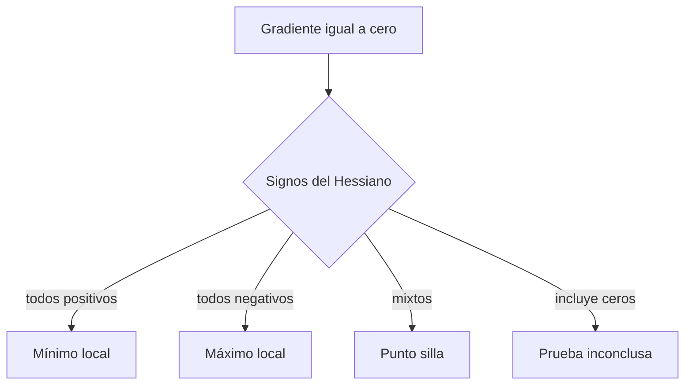

# Hessiano, convexidad y cálculo matricial

## Hessiano

Para $f:\mathbb R^D\to\mathbb R$:

$$H_{ij}=\frac{\partial^2f}{\partial x_i\partial x_j}.$$

Si las derivadas mixtas son continuas, $H$ es simétrico.

## Curvatura por dirección

Para dirección unitaria $u$:

$$u^THu$$

mide la curvatura local en esa dirección.

- positiva: forma de cuenco;
- negativa: forma de cúpula;
- signos mixtos: punto silla.

## Ejemplo cuadrático

$$f(x)=\frac12x^TAx-b^Tx,$$

con $A=A^T$. Entonces:

$$\nabla f=Ax-b,\qquad H=A.$$

El mínimo satisface $Ax=b$ si $A$ es definida positiva.

## Convexidad

Una función es convexa si el segmento entre dos puntos del gráfico no cae por debajo de la función:

$$f(\lambda x+(1-\lambda)y)
\le\lambda f(x)+(1-\lambda)f(y).$$

Para funciones dos veces derivables, $H\succeq0$ en todo el dominio implica convexidad.

> [!important] Ventaja
> En un problema convexo, todo mínimo local es global. Las redes profundas no son convexas, pero los casos convexos siguen siendo esenciales para comprender optimización y construir baselines.

## Condicionamiento y descenso

En un cuadrático, los autovalores del Hessiano describen curvaturas. El número de condición:

$$\kappa=\frac{\lambda_{\max}}{\lambda_{\min}}$$

mide qué tan alargado es el valle. Un $\kappa$ grande produce zigzag y hace difícil escoger una tasa que sea rápida y estable.

## Recetas de cálculo matricial

Con vectores columna:

| Función | Gradiente respecto de $x$ |
|---|---|
| $a^Tx$ | $a$ |
| $x^Tx$ | $2x$ |
| $\frac12\lVert Ax-b\rVert^2$ | $A^T(Ax-b)$ |
| $x^TAx$ | $(A+A^T)x$ |
| $\frac12x^TAx$, $A=A^T$ | $Ax$ |

## Derivada de mínimos cuadrados

$$L(w)=\frac12\lVert Xw-y\rVert^2.$$

Define $r=Xw-y$. Entonces:

$$dL=r^Tdr=r^TX\,dw.$$

Al identificar el coeficiente de $dw$:

$$\nabla_wL=X^Tr=X^T(Xw-y).$$

El Hessiano es:

$$H=X^TX.$$

Si $X$ tiene columnas casi redundantes, $X^TX$ está mal condicionado y la solución es sensible al ruido.

## Regularización L2

$$L_\lambda(w)=\frac12\lVert Xw-y\rVert^2+\frac\lambda2\lVert w\rVert^2.$$

$$\nabla L_\lambda=X^T(Xw-y)+\lambda w,$$

$$H_\lambda=X^TX+\lambda I.$$

La diagonal adicional aumenta curvaturas pequeñas y puede mejorar condicionamiento, además de controlar el tamaño de los parámetros.

## Punto crítico no significa mínimo

Si $\nabla f(x)=0$:

- $H\succ0$: mínimo local;
- $H\prec0$: máximo local;
- $H$ indefinido: punto silla;
- $H$ semidefinido: hace falta más análisis.

## Autoevaluación

1. ¿Qué mide $u^THu$?
2. ¿Por qué un valle alargado dificulta SGD?
3. Deriva $\nabla_w\frac12\lVert Xw-y\rVert^2$.
4. ¿Cómo afecta L2 al Hessiano?

---

Anterior: [[02 Jacobianos, regla de la cadena y VJP]] · Siguiente: [[04 Laboratorio y autoevaluación - Cálculo multivariable]]
