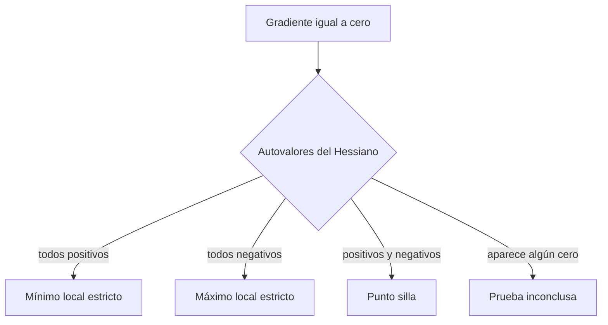

# Hessiano, convexidad y cálculo matricial

## Idea principal: ¿qué es el Hessiano?

El **Hessiano** es la matriz que reúne todas las segundas derivadas parciales de una función escalar de varias variables.

Si

$$
f:\mathbb R^D\to\mathbb R,
$$

su Hessiano es

$$
H_f(x)=\nabla^2f(x)=
\begin{bmatrix}
\frac{\partial^2f}{\partial x_1^2} & \cdots & \frac{\partial^2f}{\partial x_1\partial x_D}\\
\vdots & \ddots & \vdots\\
\frac{\partial^2f}{\partial x_D\partial x_1} & \cdots & \frac{\partial^2f}{\partial x_D^2}
\end{bmatrix}.
$$

> [!tip] Intuición
> El gradiente $\nabla f(x)$ indica hacia dónde aumenta la función. El Hessiano indica **cómo cambia ese gradiente** y, por tanto, describe la **curvatura local** de la función.

En una variable, la segunda derivada $f''(x)$ indica si la curva se dobla hacia arriba o hacia abajo. El Hessiano generaliza esa idea a varias variables, donde la curvatura puede ser distinta según la dirección.

Si las segundas derivadas son continuas, las derivadas mixtas coinciden:

$$
\frac{\partial^2f}{\partial x_i\partial x_j}
=
\frac{\partial^2f}{\partial x_j\partial x_i},
$$

y el Hessiano es simétrico: $H_f(x)=H_f(x)^T$.

## Cómo calcularlo

Para una función de dos variables $f(x,y)$:

1. Calcula el gradiente:

$$
\nabla f(x,y)=
\begin{bmatrix}
f_x\\
f_y
\end{bmatrix}.
$$

2. Deriva otra vez cada componente:

$$
H_f(x,y)=
\begin{bmatrix}
f_{xx} & f_{xy}\\
f_{yx} & f_{yy}
\end{bmatrix}.
$$

### Ejemplo paso a paso

Sea

$$
f(x,y)=x^2+xy+2y^2.
$$

Primero, el gradiente:

$$
\nabla f(x,y)=
\begin{bmatrix}
2x+y\\
x+4y
\end{bmatrix}.
$$

Después, el Hessiano:

$$
H_f(x,y)=
\begin{bmatrix}
2 & 1\\
1 & 4
\end{bmatrix}.
$$

En este ejemplo el Hessiano es constante porque $f$ es cuadrática.

## Curvatura en una dirección

Para una dirección unitaria $u$, la cantidad

$$
u^TH_f(x)u
$$

es la segunda derivada direccional de $f$ en la dirección $u$. Indica cómo se curva la función si nos movemos desde $x$ siguiendo esa dirección:

- $u^THu>0$: se curva hacia arriba;
- $u^THu<0$: se curva hacia abajo;
- $u^THu=0$: no hay curvatura de segundo orden en esa dirección.

Los autovectores del Hessiano representan direcciones principales de curvatura y sus autovalores indican la magnitud y el signo de esas curvaturas.

## Clasificación de puntos críticos

Un punto $x^*$ es **crítico** si

$$
\nabla f(x^*)=0.
$$

El signo de los autovalores de $H_f(x^*)$ permite clasificarlo:

| Hessiano en $x^*$ | Curvatura | Conclusión |
|---|---|---|
| $H\succ0$ | Todos los autovalores son positivos | Mínimo local estricto |
| $H\prec0$ | Todos los autovalores son negativos | Máximo local estricto |
| $H$ indefinido | Hay autovalores positivos y negativos | Punto silla |
| Semidefinido, con algún autovalor cero | Hay direcciones planas | Prueba inconclusa |

> [!warning] Gradiente cero no significa mínimo
> La condición $\nabla f(x^*)=0$ solo identifica un candidato. Es necesario estudiar el Hessiano —o usar otro análisis si la prueba es inconclusa— para conocer el tipo de punto crítico.

## Aproximación local de segundo orden

Cuando estamos cerca de un punto $x$, podemos reemplazar temporalmente una función complicada por una función cuadrática más sencilla. Esta es la **aproximación de Taylor de segundo orden**:

$$
f(x+\Delta x)\approx
f(x)+\nabla f(x)^T\Delta x
+\frac12\Delta x^TH_f(x)\Delta x.
$$

Aquí, $\Delta x$ es un desplazamiento pequeño desde el punto actual:

$$
\text{nuevo punto}=x+\Delta x.
$$

La fórmula estima cuál será el valor de la función en ese nuevo punto. Se compone de tres partes.

### 1. Valor actual

$$
f(x)
$$

Es la altura de la función en el punto donde estamos. Si no nos movemos, este es su valor.

### 2. Cambio explicado por la pendiente

$$
\nabla f(x)^T\Delta x
$$

El gradiente proporciona una aproximación lineal del cambio:

- si el producto es positivo, la función tiende a aumentar;
- si es negativo, tiende a disminuir;
- si es cero, el gradiente no predice ningún cambio en esa dirección.

Esta parte imagina que la superficie es localmente plana. Puede ser suficiente para desplazamientos muy pequeños, pero no considera que la pendiente también cambia mientras avanzamos.

### 3. Corrección debida a la curvatura

$$
\frac12\Delta x^TH_f(x)\Delta x
$$

Este término corrige la aproximación lineal teniendo en cuenta que la superficie puede estar curvada. El valor

$$
\Delta x^TH_f(x)\Delta x
$$

mide la curvatura en la dirección del desplazamiento $\Delta x$:

- si es positivo, la función se curva hacia arriba en esa dirección;
- si es negativo, se curva hacia abajo;
- si es cero, no se detecta curvatura de segundo orden en esa dirección.

> [!note] ¿Por qué aparece $\frac12$?
> Es el mismo factor que aparece en el Taylor de una variable:
> $$f(x+h)\approx f(x)+f'(x)h+\frac12f''(x)h^2.$$
> En varias variables, el gradiente sustituye a $f'(x)$ y el Hessiano sustituye a $f''(x)$.

### Ejemplo sencillo

Consideremos

$$
f(x,y)=x^2+2y^2
$$

y el punto actual $x_0=(1,1)$. Queremos estimar el valor después del desplazamiento

$$
\Delta x=
\begin{bmatrix}
0.1\\
-0.2
\end{bmatrix}.
$$

En $x_0$ tenemos:

$$
f(x_0)=3,
\qquad
\nabla f(x_0)=
\begin{bmatrix}
2\\
4
\end{bmatrix},
\qquad
H_f(x_0)=
\begin{bmatrix}
2&0\\
0&4
\end{bmatrix}.
$$

El cambio lineal estimado es

$$
\nabla f(x_0)^T\Delta x
=
\begin{bmatrix}2&4\end{bmatrix}
\begin{bmatrix}0.1\\-0.2\end{bmatrix}
=-0.6.
$$

La corrección por curvatura es

$$
\frac12\Delta x^TH_f(x_0)\Delta x
=0.09.
$$

Por tanto:

$$
f(x_0+\Delta x)
\approx 3-0.6+0.09
=2.49.
$$

Como la función del ejemplo es cuadrática, la aproximación es exacta:

$$
f(1.1,0.8)=1.1^2+2(0.8)^2=2.49.
$$

### Importancia en optimización

La aproximación permite construir un modelo cuadrático local de la función:

- el gradiente indica en qué dirección conviene moverse;
- el Hessiano indica cuánto cambia la pendiente y cómo ajustar el tamaño del movimiento;
- cerca de un punto crítico, donde $\nabla f(x)=0$, el término del Hessiano determina la forma local de la superficie.

Esta es la idea que utilizan métodos de segundo orden, como el método de Newton, para escoger pasos teniendo en cuenta tanto la pendiente como la curvatura.

## Hessiano y convexidad

### 1. Qué significa la desigualdad de convexidad

Elige dos entradas cualesquiera $x$ e $y$. El número $\lambda\in[0,1]$ sirve para escoger un punto intermedio entre ellas:

$$
z=\lambda x+(1-\lambda)y.
$$

Por ejemplo, si $\lambda=\tfrac12$, entonces $z=\tfrac{x+y}{2}$ es el punto medio. Hay dos alturas que podemos comparar:

- **Altura de la función:** $f(z)=f(\lambda x+(1-\lambda)y)$.
- **Altura del segmento que une $(x,f(x))$ con $(y,f(y))$:** $\lambda f(x)+(1-\lambda)f(y)$.

La función es **convexa** cuando, para cualquier elección de $x$, $y$ y $\lambda$,

$$
f(\lambda x+(1-\lambda)y)
\leq
\lambda f(x)+(1-\lambda)f(y).
$$

Es decir: **la curva nunca atraviesa por encima de la cuerda que une dos puntos de su gráfica**.

![[hessiano-convexidad-grafico.png]]

> [!tip] Imagen mental
> Una función convexa tiene forma de **cuenco**: puede contener segmentos rectos o direcciones planas, pero no puede curvarse hacia abajo.

### 2. Qué tiene que ver el Hessiano

En una variable miramos $f''(x)$:

- $f''(x)>0$: la curva se dobla hacia arriba;
- $f''(x)<0$: la curva se dobla hacia abajo.

En varias variables no existe una sola dirección. Para una dirección $u$, la curvatura es

$$
u^TH_f(x)u.
$$

Por eso, decir $H_f(x)\succeq0$ significa exactamente que

$$
u^TH_f(x)u\geq0
\qquad\text{para toda dirección }u.
$$

La función se curva hacia arriba o permanece plana en **todas** las direcciones. No basta comprobarlo en un solo punto: para garantizar convexidad hay que comprobarlo en todo el dominio.

### 3. Cómo interpretar los tres casos

Para una función dos veces diferenciable sobre un dominio convexo:

| Hessiano en todo el dominio | Significado geométrico | Conclusión |
|---|---|---|
| $H_f(x)\succeq0$ | Curvatura no negativa en cada dirección; puede haber direcciones planas | $f$ es convexa |
| $H_f(x)\succ0$ | Curvatura positiva en cada dirección no nula | $f$ es estrictamente convexa |
| $H_f(x)$ es indefinido en algún punto | En ese punto hay una dirección que sube y otra que baja | $f$ no es convexa en todo el dominio |

Los símbolos significan:

- $H\succeq0$: todos sus autovalores son mayores o iguales que cero;
- $H\succ0$: todos sus autovalores son estrictamente positivos;
- $H$ indefinido: tiene al menos un autovalor positivo y uno negativo.

### 4. Tres ejemplos que separan las ideas

#### Ejemplo A: estrictamente convexa

$$
f(x,y)=x^2+y^2,
\qquad
H_f=\begin{bmatrix}2&0\\0&2\end{bmatrix}.
$$

Sus autovalores son $2$ y $2$. El cuenco se curva hacia arriba en todas las direcciones, por lo que $f$ es estrictamente convexa y tiene un único mínimo global en $(0,0)$.

#### Ejemplo B: convexa, pero no estrictamente convexa

$$
f(x,y)=x^2,
\qquad
H_f=\begin{bmatrix}2&0\\0&0\end{bmatrix}.
$$

Sus autovalores son $2$ y $0$. En la dirección de $x$ se curva, pero en la de $y$ es completamente plana. Es convexa, aunque distintos puntos pueden tener el mismo valor a lo largo de esa dirección.

#### Ejemplo C: Hessiano indefinido

$$
f(x,y)=x^2-y^2,
\qquad
H_f=\begin{bmatrix}2&0\\0&-2\end{bmatrix}.
$$

Sus autovalores son $2$ y $-2$. La función se curva hacia arriba al moverse en $x$ y hacia abajo al moverse en $y$: tiene forma de silla y no es convexa.

> [!important] Regla práctica
> Para estudiar convexidad con el Hessiano: **calcúlalo, determina el signo de sus autovalores y verifica que ese signo se mantenga en todos los puntos del dominio**.

> [!important] ¿Por qué importa la convexidad?
> En un problema convexo, todo mínimo local es también global. Las redes neuronales profundas generalmente no producen problemas convexos, pero la convexidad sigue siendo esencial para comprender optimización y construir modelos de referencia.

## Caso fundamental: funciones cuadráticas

Sea

$$
f(x)=\frac12x^TAx-b^Tx,
$$

con $A=A^T$. Entonces:

$$
\nabla f(x)=Ax-b,
\qquad
H_f(x)=A.
$$

Por tanto:

- si $A\succ0$, la función tiene un único mínimo global;
- el mínimo satisface $Ax=b$;
- si $A\succeq0$, la función es convexa, aunque podría no tener un mínimo único;
- si $A$ es indefinida, la función presenta direcciones de subida y de bajada.

## Condicionamiento y descenso por gradiente

En una función cuadrática convexa, los autovalores del Hessiano miden la curvatura en sus direcciones principales. Si $H\succ0$, su número de condición es

$$
\kappa(H)=\frac{\lambda_{\max}}{\lambda_{\min}}.
$$

- $\kappa$ cercano a $1$: las curvaturas son parecidas y el valle es aproximadamente redondo;
- $\kappa$ grande: unas direcciones son mucho más curvas que otras y el valle es alargado.

Un valle muy alargado hace que el descenso por gradiente avance en zigzag: una tasa de aprendizaje grande puede ser inestable en la dirección de mayor curvatura, mientras que una pequeña avanza lentamente en la dirección de menor curvatura.

## Aplicación: mínimos cuadrados

Consideremos

$$
L(w)=\frac12\lVert Xw-y\rVert^2.
$$

Si definimos el residuo $r=Xw-y$, entonces

$$
dL=r^Tdr=r^TX\,dw.
$$

Al identificar el coeficiente de $dw$:

$$
\nabla_wL=X^Tr=X^T(Xw-y).
$$

Al derivar de nuevo obtenemos el Hessiano:

$$
H_L=X^TX.
$$

Como

$$
u^TX^TXu=\lVert Xu\rVert^2\geq0,
$$

$X^TX$ es semidefinida positiva y la pérdida de mínimos cuadrados es convexa. Si $X$ tiene columnas casi redundantes, $X^TX$ estará mal condicionada y la solución será sensible al ruido.

## Regularización L2

Añadimos una penalización al tamaño de los parámetros:

$$
L_\lambda(w)=
\frac12\lVert Xw-y\rVert^2
+\frac\lambda2\lVert w\rVert^2.
$$

Su gradiente y su Hessiano son

$$
\nabla L_\lambda=X^T(Xw-y)+\lambda w,
$$

$$
H_\lambda=X^TX+\lambda I.
$$

Para $\lambda>0$, sumar $\lambda I$ desplaza cada autovalor en $\lambda$. Esto aumenta las curvaturas pequeñas, suele mejorar el condicionamiento y ayuda a controlar el tamaño de los parámetros.

## Recetas de cálculo matricial

Usando vectores columna:

| Función | Gradiente respecto de $x$ |
|---|---|
| $a^Tx$ | $a$ |
| $x^Tx$ | $2x$ |
| $\frac12\lVert Ax-b\rVert^2$ | $A^T(Ax-b)$ |
| $x^TAx$ | $(A+A^T)x$ |
| $\frac12x^TAx$, con $A=A^T$ | $Ax$ |

## Resumen

> [!summary]
> - El Hessiano es la matriz de segundas derivadas de una función escalar.
> - Describe cómo cambia el gradiente y cuál es la curvatura local.
> - $u^THu$ mide la curvatura en la dirección $u$.
> - En un punto crítico, los signos de los autovalores ayudan a distinguir mínimos, máximos y puntos silla.
> - Un Hessiano semidefinido positivo en todo el dominio caracteriza la convexidad de una función dos veces diferenciable.
> - El cociente entre sus autovalores extremos explica el condicionamiento de muchos problemas de optimización.

## Autoevaluación

Haz clic en cada pregunta para desplegar u ocultar su respuesta.

> [!question]- 1. ¿Qué información aporta el Hessiano que no aporta el gradiente?
> El **gradiente** indica la pendiente local y la dirección de máximo crecimiento de la función. El **Hessiano** indica cómo cambia ese gradiente cuando nos desplazamos.
>
> Por tanto, el Hessiano aporta información sobre la **curvatura**:
>
> - si la función se curva hacia arriba o hacia abajo;
> - si la curvatura cambia según la dirección;
> - si un punto crítico puede ser un mínimo, un máximo o un punto silla.

> [!question]- 2. Calcula el Hessiano de $f(x,y)=3x^2+2xy+y^2$.
> Primero calculamos el gradiente:
>
> $$
> \nabla f(x,y)=
> \begin{bmatrix}
> 6x+2y\\
> 2x+2y
> \end{bmatrix}.
> $$
>
> Después derivamos nuevamente:
>
> $$
> H_f(x,y)=
> \begin{bmatrix}
> \frac{\partial^2f}{\partial x^2} & \frac{\partial^2f}{\partial x\partial y}\\
> \frac{\partial^2f}{\partial y\partial x} & \frac{\partial^2f}{\partial y^2}
> \end{bmatrix}
> =
> \begin{bmatrix}
> 6&2\\
> 2&2
> \end{bmatrix}.
> $$
>
> Sus autovalores son $4+2\sqrt2$ y $4-2\sqrt2$. Ambos son positivos, así que el Hessiano es definido positivo y la función es estrictamente convexa.

> [!question]- 3. ¿Qué mide $u^THu$?
> Mide la **curvatura de la función en la dirección $u$**. Si $u$ es unitario, coincide con la segunda derivada direccional.
>
> - $u^THu>0$: la función se curva hacia arriba en esa dirección.
> - $u^THu<0$: se curva hacia abajo.
> - $u^THu=0$: no se detecta curvatura de segundo orden en esa dirección.

> [!question]- 4. ¿Cómo se clasifican los puntos críticos usando los autovalores del Hessiano?
> Primero debe cumplirse $\nabla f(x^*)=0$. Después se estudian los autovalores de $H_f(x^*)$:
>
> - todos positivos: **mínimo local estricto**;
> - todos negativos: **máximo local estricto**;
> - positivos y negativos: **punto silla**;
> - aparece algún cero y los demás tienen el mismo signo: la prueba es **inconclusa** y hace falta otro análisis.

> [!question]- 5. ¿Por qué un valle alargado dificulta el descenso por gradiente?
> Porque la curvatura es muy grande en unas direcciones y pequeña en otras.
>
> - Una tasa de aprendizaje grande puede rebotar o volverse inestable en la dirección de mayor curvatura.
> - Una tasa pequeña es estable, pero avanza lentamente en la dirección de menor curvatura.
>
> Como resultado, el algoritmo suele avanzar en zigzag. Esto ocurre cuando el Hessiano tiene un número de condición $\kappa$ grande.

> [!question]- 6. Deriva $\nabla_w\frac12\lVert Xw-y\rVert^2$.
> Sea
>
> $$
> L(w)=\frac12\lVert Xw-y\rVert^2
> =\frac12(Xw-y)^T(Xw-y).
> $$
>
> Definimos el residuo $r=Xw-y$. Su diferencial es $dr=X\,dw$. Entonces:
>
> $$
> dL=r^Tdr=r^TX\,dw.
> $$
>
> Como el gradiente es el vector que multiplica a $dw$, obtenemos:
>
> $$
> \boxed{\nabla_wL=X^T(Xw-y)}.
> $$

> [!question]- 7. ¿Cómo modifica la regularización L2 al Hessiano?
> Al añadir
>
> $$
> \frac{\lambda}{2}\lVert w\rVert^2,
> $$
>
> el Hessiano cambia de
>
> $$
> H=X^TX
> $$
>
> a
>
> $$
> \boxed{H_\lambda=X^TX+\lambda I}.
> $$
>
> Esto suma $\lambda$ a cada autovalor. Para $\lambda>0$, aumenta las curvaturas pequeñas, suele mejorar el condicionamiento y puede hacer que la solución sea única y más estable.

---

Anterior: [[02 Jacobianos, regla de la cadena y VJP]] · Siguiente: [[04 Laboratorio y autoevaluación - Cálculo multivariable]]
