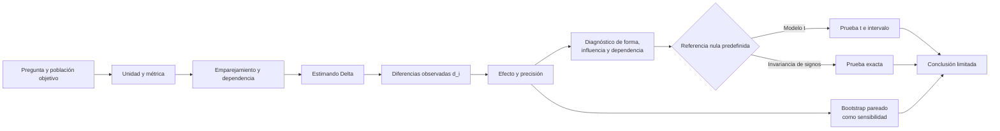

# Comparación estadística de modelos

Este módulo explica cómo pasar de una diferencia observada entre dos modelos a una conclusión **proporcional a la evidencia**. El objetivo no es aprender una receta para obtener $p<0.05$, sino entender qué autoriza realmente el diseño del experimento.

> [!important] Idea central
> Dos promedios distintos describen lo ocurrido en una muestra, pero no bastan para afirmar que un modelo es mejor en general. Antes de calcular hay que declarar la **unidad**, la **métrica**, el **emparejamiento**, la **fuente de variabilidad**, el **estimando** y la **población objetivo**.

## Antes de comenzar

Empieza por [[01 Conceptos para recordar antes de comparar modelos]]. Allí se reconstruyen desde cero los conceptos de población, muestra, métrica, diferencia, estimando, desviación estándar, error estándar, hipótesis, $p$-value e intervalo de confianza.

La métrica usada en el caso conductor es la *log-loss*. Si necesitas repasarla con más contexto, consulta [[funcion de perdida]].

## Mapa del módulo

### Cómo leer el diagrama

- Las flechas representan un **orden lógico**, no solo un orden de cálculo.
- De `Pregunta` a `Estimando` se toman decisiones que deberían fijarse antes de mirar el resultado.
- Las diferencias $d_i$ son la evidencia observada; el efecto promedio no borra su dispersión.
- Shapiro-Wilk puede aportar evidencia sobre la forma normal de las diferencias, pero no comprueba independencia ni selecciona un método automáticamente.
- La prueba $t$ y la prueba de cambios de signo usan **referencias nulas distintas**. Por eso sus $p$-values no son confirmaciones independientes ni se elige el menor.
- La conclusión aparece al final porque depende de todo lo anterior.

## Ruta de estudio recomendada

1. [[01 Conceptos para recordar antes de comparar modelos]]
2. [[02 Diseño pareado, diferencias e independencia]]
3. [[03 Efecto observado, estimando y precisión]]
4. [[04 Prueba t pareada, p-value e intervalo de confianza]]
5. [[04A Diagnóstico de normalidad con Shapiro-Wilk]]
6. [[05 Prueba exacta por cambios de signo]]
7. [[06 Unidad de análisis, dependencia y validación cruzada]]
8. [[07 Implementación reproducible en Python]]
9. [[08 Cómo redactar una conclusión defendible]]
10. [[09 Resumen, errores frecuentes y preguntas de repaso]]
11. [[10 Experimento real - Regresión Logística vs Random Forest en Iris]]
12. [[11 Ejercicio Semana 2 - auditoría, bootstrap pareado y pipeline]]

> [!tip] Del ejemplo didáctico al experimento real
> Las notas conceptuales 01-09, incluido el suplemento 04A, desarrollan el caso de diez diferencias de las diapositivas. La nota 10 transfiere el argumento a 30 flores de Iris, explica el código Python y añade un diagnóstico de Shapiro-Wilk con gráfico Q-Q.

## Guía visual y objetivo de cada nota

| Nota | Pregunta principal | Apoyo visual |
| --- | --- | --- |
| [[01 Conceptos para recordar antes de comparar modelos]] | ¿Qué significan población, estimando, $SE$, $p$ e intervalo? | Flujo población → muestra → diferencias → estimación |
| [[02 Diseño pareado, diferencias e independencia]] | ¿Cuándo existe un par y qué dependencia puede permanecer? | Diagramas de identidad y clúster hospitalario |
| [[03 Efecto observado, estimando y precisión]] | ¿Qué separa magnitud, dispersión y precisión? | Flujo del estimando y gráfico de los diez $d_i$ |
| [[04 Prueba t pareada, p-value e intervalo de confianza]] | ¿Qué contrasta la $t$ y cómo se interpreta su intervalo? | Flujos de cálculo y gráfico del $IC_{95\%}$ |
| [[04A Diagnóstico de normalidad con Shapiro-Wilk]] | ¿Qué diagnostican $W$, el $p$ de Shapiro y el Q-Q? | Histograma y Q-Q del experimento Iris |
| [[05 Prueba exacta por cambios de signo]] | ¿Cómo se construye otra referencia nula y qué supone? | Flujo de signos y distribución exacta de 1024 configuraciones |
| [[06 Unidad de análisis, dependencia y validación cruzada]] | ¿Qué generaliza un caso, una corrida, un dataset o un fold? | Tres diagramas de decisión y solapamiento |
| [[07 Implementación reproducible en Python]] | ¿Cómo se traduce todo el argumento a NumPy y SciPy? | Mapa de ejecución y tres gráficos reproducibles |
| [[08 Cómo redactar una conclusión defendible]] | ¿Cómo comunicar sin exagerar la evidencia? | Flujo de seis piezas e intervalo del efecto |
| [[09 Resumen, errores frecuentes y preguntas de repaso]] | ¿Cómo recordar la cadena completa y detectar errores? | Mapa resumen, preguntas y soluciones plegables |
| [[10 Experimento real - Regresión Logística vs Random Forest en Iris]] | ¿Cómo funciona el razonamiento en modelos entrenados de verdad? | Siete gráficos: datos, métricas, diferencias, IC, Q-Q, signos y CV |
| [[11 Ejercicio Semana 2 - auditoría, bootstrap pareado y pipeline]] | ¿Qué añade el ejercicio de 16 tiendas y cómo se implementa de extremo a extremo? | Auditoría de `store_id`, bootstrap percentil, resultados y pipeline verificable |

> [!success] Cobertura de la revisión
> Cada nota distingue definición, cálculo, interpretación y límite. Los recursos visuales no sustituyen las fórmulas: muestran qué objeto representa cada número y cómo se conecta con el diseño.

## Caso conductor

Dos modelos ya entrenados, A y B, se evalúan sobre los mismos diez casos. La métrica es *log-loss*, por lo que **un valor menor es mejor**. Se declara la diferencia

$$
d_i=\operatorname{loss}_A(i)-\operatorname{loss}_B(i).
$$

Por esta elección de signo:

| Valor de $d_i$ | Lectura |
| ---: | --- |
| $d_i>0$ | B tiene menor pérdida y el caso favorece a B. |
| $d_i=0$ | Empate en ese caso. |
| $d_i<0$ | A tiene menor pérdida y el caso favorece a A. |

Las diez diferencias son

$$
(0.04,\ 0.01,\ 0.03,\ -0.02,\ 0.05,\ 0,\ 0.02,\ 0.06,\ 0.01,\ -0.01).
$$

![[assets/diferencias-por-caso.png|900]]

### Cómo leer el gráfico

- Cada línea vertical es **un caso de prueba**, no una corrida ni un *fold*.
- El eje horizontal identifica el caso; el eje vertical muestra $A-B$ en puntos de *log-loss*.
- Los valores positivos indican ventaja de B; los negativos, ventaja de A; el cero es un empate.
- La línea naranja es la media $\bar d=0.019$. Resume el centro, pero no reemplaza los diez valores.
- El gráfico revela lo que dos promedios agregados ocultan: siete casos favorecen a B, dos a A y uno empata.

## Los siete pasos del argumento

| Paso | Pregunta que responde | ¿Se fija antes de ver el resultado? |
| --- | --- | :---: |
| 1. Pregunta | ¿Qué queremos comparar y para qué población? | Sí |
| 2. Unidad y métrica | ¿Quién aporta cada valor y qué significa mejorar? | Sí |
| 3. Estimando | ¿Qué cantidad poblacional queremos conocer? | Sí |
| 4. Diferencia observada | ¿Qué ocurrió en esta muestra? | No; es resultado |
| 5. Referencia nula | ¿Qué resultados serían compatibles con ausencia de efecto bajo un modelo? | Sí |
| 6. Incertidumbre y $p$-value | ¿Con qué precisión estimamos y qué tan extremo es el resultado? | Se calcula después, con un método fijado antes |
| 7. Conclusión limitada | ¿Qué autoriza el diseño y qué queda fuera de alcance? | Se redacta después |

> [!warning] Orden obligatorio
> Cambiar de función estadística no repara una unidad mal declarada, un par falso ni una dependencia ignorada. Se audita el diseño antes de calcular.

## Qué notas anteriores conviene revisar

### Esencial antes de estudiar este módulo

- [[funcion de perdida|Función de pérdida]]: explica qué es una pérdida, la diferencia entre *loss*, costo y métrica, y por qué una *log-loss* menor representa mejor desempeño. Es el enlace previo más importante porque todo el caso conductor compara pérdidas por observación.

### Recomendadas para comprender los datos y el código

- [[numpy pandas parquet arrow|NumPy, Pandas, Arrow y Parquet]]: revisa especialmente `array`, `shape`, ejes, índices e identidad de las filas. Ayuda a entender por qué `loss_a - loss_b` es una resta elemento a elemento y por qué el orden de los casos debe coincidir.
- [[Estructuras de Python en un experimento de IA]]: explica cómo conservar historiales, métricas, configuraciones e invariantes sin contaminar experimentos. Es útil para registrar qué modelos, semillas y datos produjeron cada comparación.
- [[UV]]: sirve para crear un entorno reproducible con versiones controladas de NumPy, SciPy y Matplotlib, de modo que otra persona pueda repetir el análisis.

### Contexto opcional sobre cómo se produce la pérdida

- [[poo ia/05 Scalar y autodiferenciación|Scalar y autodiferenciación]]: muestra cómo un valor escalar puede conservar la historia de las operaciones que lo produjeron.
- [[poo ia/06 Grafo computacional y neurona|Grafo computacional, neurona y backpropagation]]: conecta predicción, cálculo de la pérdida y propagación de gradientes. Revísala si quieres comprender el entrenamiento antes de comparar modelos ya entrenados.

### Notas relacionadas que están fuera de esta carpeta del máster

- [[Validacion Cruzada|Validación Cruzada]] introduce el uso de *folds*; en [[06 Unidad de análisis, dependencia y validación cruzada]] se explica por qué esos *folds* no son réplicas independientes.
- [[metricas para clasificadores|Métricas para clasificadores]] amplía la elección de métricas. La prueba estadística debe corresponder a la métrica y unidad realmente observadas.

> [!tip] Ruta mínima si quieres avanzar sin desviarte
> Lee [[funcion de perdida]], después [[01 Conceptos para recordar antes de comparar modelos]] y continúa en orden por este módulo. NumPy, estructuras de Python y UV son apoyos para la implementación. Autodiferenciación y backpropagation son contexto opcional.

> [!note] Temas que no son prerrequisitos directos
> Las notas de espacios vectoriales, embeddings, espectro y SVD pertenecen a la misma asignatura y se relacionan con la representación interna de los modelos, pero no necesitas dominarlas para entender esta comparación estadística.

## Fuente

- Presentación completa: ![[assets/module_06.pdf]]
- Guía del estudiante: ![[assets/Guia_estudiante_M06_comparacion_estadistica_modelos.pdf]]
- Diagnóstico de normalidad: [[04A Diagnóstico de normalidad con Shapiro-Wilk]]
- Aplicación reproducida: [[10 Experimento real - Regresión Logística vs Random Forest en Iris]]
- Los valores, fórmulas y caso conductor de estas notas provienen del módulo 06; las explicaciones, diagramas y gráficos se desarrollan para facilitar el aprendizaje.
