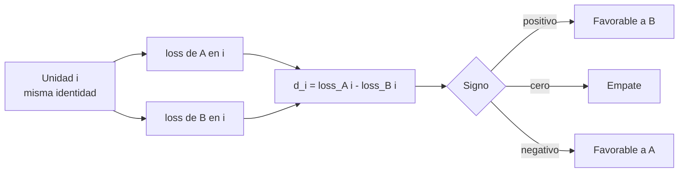
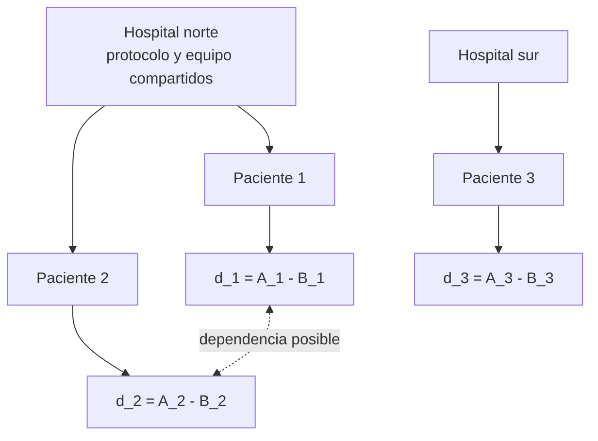

# Diseño pareado, diferencias e independencia

Anterior: [[01 Conceptos para recordar antes de comparar modelos]] · Volver al [[00 Índice - Comparación estadística de modelos|índice]] · Siguiente: [[03 Efecto observado, estimando y precisión]]

## 1. ¿Por qué comparar dentro de cada unidad?

Supón que A y B se evalúan sobre las mismas imágenes. Algunas imágenes son fáciles para ambos modelos y otras difíciles para ambos. Si solo comparamos dos promedios, mezclamos:

- la dificultad propia de cada imagen;
- la diferencia de comportamiento entre A y B.

El diseño pareado conserva la identidad y calcula dentro de cada caso:

$$
d_i=\operatorname{loss}_A(i)-\operatorname{loss}_B(i).
$$



### Cómo leer el diagrama

La unidad $i$ se bifurca en dos mediciones porque ambos modelos ven el mismo caso. Las ramas vuelven a unirse en $d_i$: la resta solo es interpretable porque conserva la identidad. El signo se interpreta después de fijar que la métrica es una pérdida y que la resta es $A-B$.

## 2. Tabla completa del ejemplo

| Caso $i$ | $\operatorname{loss}_A(i)$ | $\operatorname{loss}_B(i)$ | $d_i=A_i-B_i$ | Lectura |
| ---: | ---: | ---: | ---: | --- |
| 1 | 0.42 | 0.38 | +0.04 | favorece a B |
| 2 | 0.37 | 0.36 | +0.01 | favorece a B |
| 3 | 0.51 | 0.48 | +0.03 | favorece a B |
| 4 | 0.46 | 0.48 | -0.02 | favorece a A |
| 5 | 0.40 | 0.35 | +0.05 | favorece a B |
| 6 | 0.55 | 0.55 | 0.00 | empate |
| 7 | 0.48 | 0.46 | +0.02 | favorece a B |
| 8 | 0.44 | 0.38 | +0.06 | favorece a B |
| 9 | 0.39 | 0.38 | +0.01 | favorece a B |
| 10 | 0.52 | 0.53 | -0.01 | favorece a A |

La evidencia por unidad muestra siete signos positivos, dos negativos y un cero. La ventaja de B es frecuente, pero no uniforme.

> [!example] Cálculo de una fila
> En el caso 4, $d_4=0.46-0.48=-0.02$. Como la pérdida de A es menor, ese caso favorece a A. El signo negativo no significa «error de cálculo»; conserva la dirección declarada.

## 3. Qué gana el emparejamiento

Para dos mediciones aleatorias $A$ y $B$:

$$
\operatorname{Var}(A-B)
=\operatorname{Var}(A)+\operatorname{Var}(B)-2\operatorname{Cov}(A,B).
$$

Si los casos difíciles elevan tanto $A$ como $B$, entonces $\operatorname{Cov}(A,B)>0$. Al restar dentro del caso, el término $-2\operatorname{Cov}(A,B)$ reduce parte de esa variación compartida. Por eso un diseño pareado suele estimar la diferencia con más precisión que tratar las mediciones como si provinieran de grupos sin correspondencia.

Esto no es magia estadística: funciona porque la misma identidad aporta información comparable a ambos lados.

## 4. Un par válido depende de la procedencia

### Par válido

```text
imagen i ──> A evalúa imagen i
         └─> B evalúa imagen i
                 ↓
          existe d_i = A_i - B_i
```

### Par falso

```text
imagen i ──> A evalúa imagen i
imagen j ──> B evalúa imagen j
                 ↓
       no existe una diferencia por identidad
```

Que dos valores aparezcan en la misma fila o posición no crea un par. Debe existir una regla de correspondencia sustantiva: mismo caso, paciente, documento, dataset, corrida o bloque experimental.

> [!warning] Error frecuente
> Ordenar dos vectores por rendimiento y después restar sus posiciones fabrica pares artificiales. La resta deja de responder a una unidad real.

## 5. Pareado no significa independiente

El emparejamiento se exige **dentro de cada diferencia**. La independencia, cuando el método la necesita, se evalúa **entre diferencias**:

$$
d_1,d_2,\ldots,d_n.
$$

Ejemplo: tres pacientes se comparan con A y B. Los dos primeros pertenecen al mismo hospital y comparten protocolo, equipo y personal. Cada paciente forma un par válido, pero $d_1$ y $d_2$ podrían estar correlacionados por la influencia compartida.



### Cómo leer el diagrama

- Cada paciente conserva un par correcto: A y B se aplican a la misma persona.
- El hospital es una fuente común que puede vincular diferencias de pacientes distintos.
- Tener otro hospital no elimina automáticamente la estructura; hay que justificar o modelar la dependencia.

## 6. Tres contratos diferentes

| Estructura | Procedencia | Regla de comparación | Independencia |
| --- | --- | --- | --- |
| Pareada | A y B sobre la misma unidad | Restar dentro de unidad | Debe defenderse entre unidades |
| Independiente | Grupos sin correspondencia | Comparar distribuciones o medias de grupos | Depende del muestreo de cada grupo |
| Estructurada | Folds, clústeres, medidas repetidas o datos jerárquicos | Preservar la estructura | No asumir una prueba ingenua |

La forma rectangular de la tabla no permite escoger el contrato. La procedencia de los datos decide.

## 7. Qué variabilidad incluye este ejemplo

La unidad es el **caso de prueba** y A y B ya están entrenados. Por lo tanto, las diferencias incluyen heterogeneidad entre casos, pero el análisis queda condicionado en:

- los modelos entrenados concretos;
- la muestra de entrenamiento utilizada;
- las semillas e inicializaciones que produjeron esos modelos;
- el dominio y protocolo de evaluación.

El contraste no «vuelve a entrenar» los modelos de manera imaginaria. Si la pregunta incluye variabilidad entre entrenamientos, la unidad adecuada podría ser una corrida completa y el diseño tendría que reflejarlo.

## 8. Auditoría antes del cálculo

Responde estas preguntas en orden:

1. **Unidad:** ¿qué entidad aporta cada par de valores?
2. **Identidad:** ¿A y B se midieron realmente sobre la misma unidad?
3. **Métrica:** ¿qué significa mejorar y en qué escala se resta?
4. **Dependencia:** ¿qué unidades comparten datos, sujetos, tiempo, equipo o entrenamiento?
5. **Población:** ¿qué proceso representan las unidades observadas?
6. **Plan:** ¿la dirección del contraste y el método se fijaron antes de ver el signo?

Si falla una respuesta, se detiene la inferencia. Cambiar `ttest_rel` por otra función no repara el diseño.

## 9. Idea que debes conservar

> [!success] Regla operativa
> Primero demuestra por qué existe cada $d_i$. Después demuestra qué relación existe entre $d_i$ y $d_j$. Solo entonces elige una distribución de referencia.

Anterior: [[01 Conceptos para recordar antes de comparar modelos]] · Siguiente: [[03 Efecto observado, estimando y precisión]]

