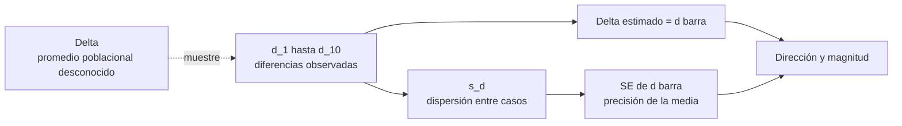

# Efecto observado, estimando y precisión

Anterior: [[02 Diseño pareado, diferencias e independencia]] · Volver al [[00 Índice - Comparación estadística de modelos|índice]] · Siguiente: [[04 Prueba t pareada, p-value e intervalo de confianza]]

## 1. El estimando se declara antes de calcular

El módulo quiere conocer la diferencia media de *log-loss* en la población objetivo:

$$
\Delta=\mathbb E[\operatorname{loss}_A-\operatorname{loss}_B].
$$

Esta expresión no está completa si se deja implícito:

- qué significa una unidad;
- qué población o proceso genera esas unidades;
- qué modelos se consideran fijos o variables;
- qué métrica y dirección usa la resta.

En el caso conductor, una lectura correcta es:

> $\Delta$ es la diferencia media esperada de *log-loss*, A menos B, para casos futuros comparables evaluados por estos modelos ya entrenados.

## 2. Del parámetro a la estimación



### Cómo leer el diagrama

- $\Delta$ es el objetivo, pero no se observa directamente.
- Los diez $d_i$ son una muestra del proceso definido.
- La media estima el centro; la desviación estándar resume heterogeneidad; el error estándar resume precisión.
- Una conclusión necesita tanto magnitud como incertidumbre.

## 3. Cálculo del efecto observado

Las diferencias suman:

$$
\sum_{i=1}^{10}d_i
=0.04+0.01+0.03-0.02+0.05+0+0.02+0.06+0.01-0.01
=0.19.
$$

Por tanto:

$$
\bar d=\frac{0.19}{10}=0.019.
$$

Como $\bar d>0$ y se declaró $d=A-B$, el efecto observado favorece a B: en estos diez casos, B redujo la *log-loss* en promedio $0.019$ puntos respecto de A.

> [!warning] Magnitud sin etiqueta universal
> $0.019$ no es automáticamente grande, pequeño ni relevante. Su importancia depende de la escala habitual, el desempeño base, los costos de errores, la calibración y un umbral sustantivo definido para el dominio.

## 4. La media no muestra la heterogeneidad

![[assets/diferencias-por-caso.png|900]]

### Explicación del gráfico

- La media naranja vale $0.019$, pero los casos van desde $-0.02$ hasta $0.06$.
- El caso 8 presenta la mayor ventaja para B; el caso 4 favorece a A.
- Dos muestras podrían compartir media $0.019$ y tener dispersiones muy distintas.
- Una muestra más dispersa aporta menos precisión para estimar el promedio, aunque su media sea idéntica.

## 5. Desviación estándar: variabilidad entre casos

Primero se calculan las distancias respecto a la media, $d_i-\bar d$. La suma de cuadrados es:

$$
\sum_{i=1}^{10}(d_i-\bar d)^2=0.00609.
$$

La varianza muestral es:

$$
s_d^2=\frac{0.00609}{10-1}=0.0006766667.
$$

Y la desviación estándar:

$$
s_d=\sqrt{0.0006766667}=0.0260128174.
$$

Esto responde: **¿cuánto varían las ventajas y desventajas entre los casos observados?**

## 6. Error estándar: incertidumbre de la media

$$
\operatorname{SE}(\bar d)
=\frac{s_d}{\sqrt n}
=\frac{0.0260128174}{\sqrt{10}}
=0.0082259751.
$$

Esto responde: **¿con qué precisión estima $\bar d$ al promedio poblacional $\Delta$ bajo el modelo de muestreo?**

La división por $\sqrt n$ aparece porque el promedio de observaciones independientes tiende a ser menos variable que una observación individual. Si las unidades dependen entre sí, esta reducción puede ser demasiado optimista.

## 7. Misma media, distinta precisión

Imagina dos estudios con $\bar d=0.019$:

```text
Estudio concentrado:  valores cercanos a 0.019
                       └─ menor s_d ─> menor SE ─> intervalo más estrecho

Estudio disperso:      valores muy alejados de 0.019
                       └─ mayor s_d ─> mayor SE ─> intervalo más ancho
```

Lo que permanece es el efecto observado. Lo que cambia es la incertidumbre. Por eso reportar solo la media borra parte esencial de la evidencia.

## 8. Precisión no equivale a validez

Un error estándar pequeño puede ser engañoso si:

- se trataron *folds* dependientes como réplicas;
- se duplicaron filas sin añadir unidades independientes;
- se ignoró una estructura por hospital, usuario o dataset;
- los pares no correspondían a la misma identidad;
- la población objetivo no coincide con el proceso de muestreo.

La precisión es una propiedad del estimador **bajo un modelo**. No compensa un contrato de diseño incorrecto.

## 9. Efecto estadístico y efecto práctico

Conviene definir antes del análisis un umbral $\delta_{\text{práctico}}$: la diferencia mínima que justificaría una decisión real.

Ejemplo conceptual:

- si ahorrar $0.005$ puntos de *log-loss* ya mejora una decisión crítica, $0.019$ podría ser relevante;
- si el despliegue de B cuesta mucho y se exige al menos $0.05$, el efecto observado no alcanza el umbral;
- el intervalo debe compararse con ese umbral, no solo con cero.

> [!tip] Dos referencias diferentes
> Cero responde a «ausencia de diferencia media». El umbral práctico responde a «diferencia suficientemente importante». No deben confundirse.

## 10. Qué debe reportarse antes de un contraste

Una descripción mínima de la muestra ya debería incluir:

- $n=10$ unidades pareadas;
- resta $d_i=\operatorname{loss}_A(i)-\operatorname{loss}_B(i)$;
- siete diferencias positivas, dos negativas y un empate;
- media $\bar d=0.019$;
- desviación estándar $s_d=0.0260$;
- error estándar $0.00823$;
- rango observado $[-0.02,0.06]$;
- alcance condicionado a los modelos ya entrenados y casos comparables.

La prueba estadística añade una referencia nula; no sustituye esta descripción.

Anterior: [[02 Diseño pareado, diferencias e independencia]] · Siguiente: [[04 Prueba t pareada, p-value e intervalo de confianza]]
