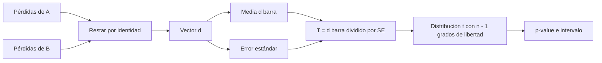
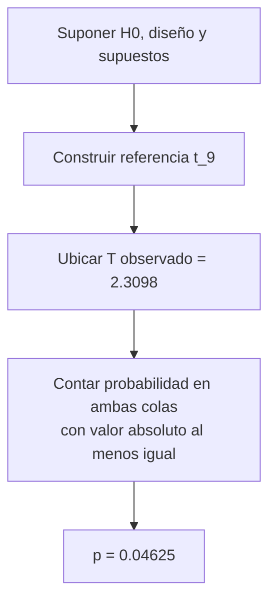

# Prueba t pareada, p-value e intervalo de confianza

Anterior: [[03 Efecto observado, estimando y precisión]] · Volver al [[00 Índice - Comparación estadística de modelos|índice]] · Siguiente: [[04A Diagnóstico de normalidad con Shapiro-Wilk]]

## 1. Qué pregunta formula la prueba

El estimando es

$$
\Delta=\mathbb E[\operatorname{loss}_A-\operatorname{loss}_B].
$$

Para una comparación bilateral:

$$
H_{0,t}:\Delta=0,
\qquad
H_{1,t}:\Delta\ne0.
$$

$H_{0,t}$ no afirma que A y B produzcan las mismas predicciones, tengan idéntica calibración o se comporten igual en todos los subgrupos. Afirma únicamente ausencia de diferencia **media** en el estimando declarado.

> [!important] La alternativa pertenece al plan
> Observar $\bar d>0$ no autoriza cambiar después a $H_1:\Delta>0$. Una prueba unilateral puede ser válida si su dirección se justifica y fija antes de mirar el resultado.

## 2. Prueba pareada = prueba de una muestra sobre diferencias

La prueba pareada no necesita modelar por separado los vectores de pérdidas de A y B. Primero forma

$$
d_i=A_i-B_i,
$$

y después aplica una prueba $t$ de una muestra a $d_1,\ldots,d_n$ contra la media nula $0$.

### Cómo leer el diagrama

- El emparejamiento ocurre en la resta.
- La señal es $\bar d$ y la incertidumbre es $\operatorname{SE}(\bar d)$.
- $T$ expresa la distancia desde cero en unidades de error estándar.
- La distribución $t$ solo es una referencia apropiada si los controles del diseño y forma de las diferencias son defendibles.

## 3. Cálculo del estadístico

$$
T_{\text{obs}}
=\frac{\bar d-0}{\operatorname{SE}(\bar d)}
=\frac{0.019}{0.0082259751}
=2.30975656.
$$

Interpretación correcta: la media observada está aproximadamente a $2.31$ errores estándar de la referencia nula.

Interpretaciones incorrectas:

- «el efecto es 2.31 veces importante»;
- «B es 2.31 veces mejor»;
- «hay 2.31 unidades de *log-loss*».

$T$ es adimensional porque numerador y denominador están en la misma unidad.

## 4. ¿Por qué hay nueve grados de libertad?

Con $n=10$ diferencias, se estima una media muestral. Una vez conocida $\bar d$, solo nueve desviaciones pueden variar libremente porque

$$
\sum_{i=1}^{10}(d_i-\bar d)=0.
$$

Por eso:

$$
df=n-1=9.
$$

La distribución $t_9$ tiene colas más pesadas que la normal estándar, reflejando que la desviación poblacional también se estima con una muestra pequeña.

## 5. Supuestos que condicionan la referencia $t$

Los supuestos se revisan sobre las **diferencias**, no sobre A y B por separado.

1. **Pares correctos:** cada $d_i$ compara la misma identidad.
2. **Independencia defendible entre diferencias:** o una estructura de dependencia modelada apropiadamente.
3. **Forma aproximadamente normal de las diferencias:** con $n=10$, la forma y asimetría importan más que en muestras grandes.
4. **Sin valores atípicos dominantes:** un solo $d_i$ extremo puede mover mucho $\bar d$ y $s_d$.
5. **Muestreo y población coherentes:** el proceso observado debe representar el alcance declarado.

> [!warning] «La prueba corrió» no valida los supuestos
> `scipy.stats.ttest_rel` puede devolver números aun cuando los *folds* dependan, los pares sean falsos o una unidad extrema domine el resultado.

> [!tip] Cómo diagnosticar la forma sin convertirla en un ritual
> [[04A Diagnóstico de normalidad con Shapiro-Wilk]] explica qué contrastan $W$ y su $p$-value, por qué se aplican al vector $d$, cómo combinarlos con un Q-Q y por qué no eligen automáticamente entre $t$, Wilcoxon o cambios de signo.

## 6. De $T$ al $p$-value

Para la alternativa bilateral:

$$
p=P\left(|T_9|\ge 2.30975656\mid H_{0,t},\text{ diseño y supuestos}\right)
=0.0462549274.
$$

### Qué significa

Bajo esa referencia nula, alrededor del $4.63\%$ de los resultados tendrían un $|T|$ al menos tan grande como el observado.

### Qué no significa

| Frase incorrecta | Por qué falla |
| --- | --- |
| «Hay 4.6 % de probabilidad de que no exista diferencia.» | Invierte $P(\text{datos}\mid H_0)$ como si fuera $P(H_0\mid\text{datos})$. |
| «Hay 95.4 % de probabilidad de que B sea mejor.» | La prueba frecuentista no asigna esa probabilidad posterior. |
| «Hay 95.4 % de probabilidad de repetir el signo.» | El $p$-value no es una probabilidad de replicación. |
| «El efecto es importante porque $p<0.05$.» | Extremidad estadística y relevancia práctica son objetos distintos. |

## 7. Cálculo del intervalo de confianza

Para $df=9$, el cuantil bilateral del $95\%$ es aproximadamente

$$
t_{0.975,9}=2.262157.
$$

Entonces:

$$
IC_{95\%}
=\bar d\pm t_{0.975,9}\operatorname{SE}(\bar d)
$$

$$
=0.019\pm 2.262157(0.0082259751)
=[0.00039155,\ 0.03760845].
$$

![[assets/intervalo-efecto.png|900]]

### Cómo leer el gráfico

- La línea naranja en cero es la referencia de ausencia de diferencia media.
- El punto morado es la estimación $0.019$.
- La línea verde muestra el rango de valores compatibles con los datos bajo el procedimiento $t$.
- El extremo inferior queda apenas por encima de cero: la precisión todavía permite efectos positivos casi nulos.
- El extremo superior admite una reducción media cercana a $0.0376$ puntos de *log-loss* a favor de B.

## 8. Relación entre intervalo y prueba bilateral

La prueba bilateral de nivel $\alpha=0.05$ y el intervalo $t$ del $95\%$ son dos expresiones del mismo modelo inferencial:

- si el intervalo excluye $0$, la prueba bilateral correspondiente produce $p<0.05$;
- si incluye $0$, produce $p\ge0.05$.

No son dos confirmaciones independientes. Ambos usan $\bar d$, $s_d$, $n$ y la misma referencia $t$.

## 9. Por qué el umbral no es un veredicto

Aquí $p_t=0.0463$ queda a un lado del umbral convencional $0.05$. Cambios pequeños en los datos, la unidad o el modelo de referencia podrían moverlo al otro lado. La evidencia debe leerse junto con:

- magnitud $0.019$;
- intervalo $[0.0004,0.0376]$;
- muestra pequeña $n=10$;
- supuestos sobre las diferencias;
- alcance condicionado a los modelos y casos analizados.

> [!danger] Dos saltos lógicos
> $p<0.05$ no demuestra superioridad práctica o general. $p>0.05$ no demuestra igualdad ni equivalencia.

## 10. Una redacción proporcional

> En diez casos pareados, B presentó una *log-loss* media $0.019$ puntos menor que A. Bajo una prueba $t$ bilateral sobre las diferencias, $t(9)=2.310$, $p=0.0463$, con $IC_{95\%}=[0.0004,0.0376]$. El resultado depende de los supuestos de la prueba, está condicionado a estos modelos ya entrenados y no establece por sí solo relevancia práctica ni superioridad general.

La comparación con otra referencia nula se estudia en [[05 Prueba exacta por cambios de signo]].

Anterior: [[03 Efecto observado, estimando y precisión]] · Siguiente: [[04A Diagnóstico de normalidad con Shapiro-Wilk]]
