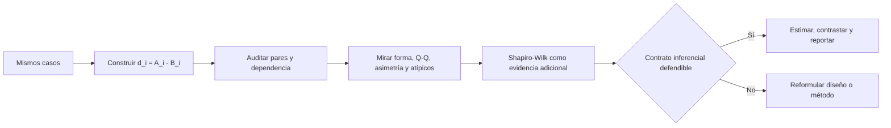

# Diagnóstico de normalidad con Shapiro-Wilk

Anterior: [[04 Prueba t pareada, p-value e intervalo de confianza]] · Volver al [[00 Índice - Comparación estadística de modelos|índice]] · Siguiente: [[05 Prueba exacta por cambios de signo]]

> [!important] Idea para recordar
> Shapiro-Wilk pregunta si la **forma de una muestra** es compatible con una distribución normal. En una comparación pareada se aplica a las diferencias $d_i$, no a los resultados de A y B por separado. No comprueba independencia, no demuestra normalidad cuando $p>0.05$ y no elige automáticamente la prueba estadística.

## 1. ¿Para qué sirve dentro de la comparación de modelos?

En este módulo se comparan dos modelos sobre las mismas unidades. Primero se construye

$$
d_i=\operatorname{loss}_A(i)-\operatorname{loss}_B(i).
$$

La prueba $t$ pareada es computacionalmente una prueba $t$ de una muestra sobre $d_1,\ldots,d_n$. Su referencia es exacta, en muestras finitas, cuando las diferencias pueden modelarse como observaciones independientes de una población normal. Shapiro-Wilk aporta un diagnóstico sobre la parte de **forma normal** de ese contrato.

No responde estas otras preguntas:

- si los pares se construyeron con la misma identidad;
- si las diferencias son independientes;
- si los *folds* solapados pueden tratarse como estudios;
- si la métrica elegida representa el objetivo de negocio;
- si el efecto es importante en la práctica;
- si un algoritmo será superior en otros entrenamientos o datasets.



La prueba aparece **después** de formar las diferencias y **junto con** otros diagnósticos. No debe ser el primer paso.

## 2. El objeto correcto: las diferencias pareadas

Supón que `loss_a[i]` y `loss_b[i]` pertenecen al mismo caso `i`:

```python
d = loss_a - loss_b
resultado = stats.shapiro(d)
```

La pregunta es si la distribución de $D=A-B$ es razonablemente normal. No hace falta que `loss_a` y `loss_b` sean normales por separado.

```python
# Esto responde otras dos preguntas y no diagnostica directamente
# el supuesto de la t pareada:
stats.shapiro(loss_a)
stats.shapiro(loss_b)
```

> [!warning] El orden de las filas no crea pares
> `loss_a - loss_b` solo es válido si ambos vectores conservan los mismos identificadores en el mismo orden. Shapiro-Wilk puede ejecutarse sobre una resta mal emparejada y devolver un número; no conoce la procedencia de las filas.

## 3. Hipótesis de Shapiro-Wilk

La formulación habitual es:

$$
H_{0,SW}: D \text{ sigue una distribución normal},
$$

$$
H_{1,SW}: D \text{ no sigue una distribución normal}.
$$

Es una prueba distinta del contraste principal entre modelos:

$$
H_{0,t}:\mathbb E[D]=0.
$$

| Prueba | Pregunta nula | Objeto |
| --- | --- | --- |
| Shapiro-Wilk | ¿La forma poblacional es normal? | Distribución de las diferencias |
| $t$ pareada | ¿La diferencia media poblacional es cero? | Media de las diferencias |

Por eso el $p$-value de Shapiro-Wilk **no dice si A y B difieren**. Solo aporta evidencia sobre una condición de forma usada por ciertos procedimientos.

## 4. Intuición del estadístico $W$

Ordena las observaciones:

$$
d_{(1)}\le d_{(2)}\le\cdots\le d_{(n)}.
$$

El estadístico puede escribirse como

$$
W=
\frac{\left(\sum_{i=1}^{n}a_i d_{(i)}\right)^2}
{\sum_{i=1}^{n}(d_i-\bar d)^2}.
$$

Los coeficientes $a_i$ se construyen a partir de los valores ordenados que se esperarían en muestras normales y de su covarianza.

Interpretación intuitiva:

- el denominador mide la variación total alrededor de la media;
- el numerador mide cuánto se parece el patrón ordenado observado al patrón esperado bajo normalidad;
- $W$ cercano a $1$ indica mayor concordancia con ese patrón;
- un $W$ menor indica desviación, por ejemplo asimetría, colas inusuales o valores extremos.

> [!note] No existe un corte universal para $W$
> No debe usarse una regla como «$W>0.95$ significa normal». La distribución de $W$ cambia con $n$; por eso SciPy calcula un $p$-value condicionado al tamaño muestral.

## 5. Cómo interpretar el $p$-value

El $p$-value responde, aproximadamente:

> Si una muestra independiente de tamaño $n$ proviniera de una distribución normal, ¿qué tan inusual sería obtener un $W$ tan pequeño como el observado?

Con un nivel descriptivo $α=0.05$:

- si $p<0.05$, hay evidencia contra la forma normal;
- si $p\ge0.05$, la muestra **no aporta evidencia suficiente para rechazarla**.

La segunda frase no equivale a «se demostró normalidad».

| Lectura incorrecta | Corrección |
| --- | --- |
| «$p=0.20$: hay 20 % de probabilidad de normalidad.» | El $p$-value no calcula $P(H_0\mid\text{datos})$. |
| «$p>0.05$: los datos son normales.» | Solo indica que esta muestra no detectó una desviación suficiente. |
| «$p<0.05$: los datos son incorrectos.» | La forma no normal puede ser una propiedad real y relevante del proceso. |
| «$p<0.05$: los modelos son diferentes.» | Shapiro-Wilk contrasta forma, no diferencia de rendimiento. |

## 6. Por qué el tamaño muestral cambia la lectura

### Muestras pequeñas

Con pocos datos, la prueba tiene poca capacidad para detectar algunas desviaciones. Un $p$ grande puede coexistir con una forma poblacional no normal. En el caso didáctico de diez diferencias:

```python
import numpy as np
from scipy import stats

d_didactico = np.array([
    0.04, 0.01, 0.03, -0.02, 0.05,
    0.00, 0.02, 0.06, 0.01, -0.01,
])

sw = stats.shapiro(d_didactico)
print(f"W = {sw.statistic:.4f}; p = {sw.pvalue:.4f}")
```

Salida:

```text
W = 0.9752; p = 0.9347
```

La conclusión proporcional es: **no se observa evidencia contra normalidad en estos diez valores**. No se concluye que la población sea necesariamente normal.

### Muestras grandes

Con muchos datos, la prueba puede detectar desviaciones pequeñas que tengan poca consecuencia práctica para la estimación de la media. Por eso tampoco debe rechazarse automáticamente un procedimiento solo porque Shapiro-Wilk detectó una imperfección minúscula.

En SciPy, el estadístico $W$ sigue siendo calculable para muestras grandes, pero la documentación advierte que, para $n>5000$, su aproximación del $p$-value puede perder exactitud.

## 7. El código del notebook, línea por línea

El notebook `experimento_m06_logreg_vs_rf.ipynb` ejecuta:

```python
shapiro = stats.shapiro(d)
asimetria = stats.skew(d, bias=False)

orden_absoluto = np.argsort(np.abs(d))[::-1]
participacion_tres = np.abs(d[orden_absoluto[:3]]).sum() / np.abs(d).sum()

print(f"asimetría                    = {asimetria:.6f}")
print(f"Shapiro-Wilk W               = {shapiro.statistic:.6f}")
print(f"Shapiro-Wilk p               = {shapiro.pvalue:.8f}")
print(f"participación de 3 mayores |d|= {participacion_tres:.1%}")
```

### `shapiro = stats.shapiro(d)`

- `stats` es el módulo `scipy.stats`.
- `d` es un `ndarray` de 30 diferencias pareadas.
- la función devuelve un objeto con dos atributos: `.statistic` y `.pvalue`;
- guardar el objeto en `shapiro` evita recalcular y permite nombrar cada resultado.

### `stats.skew(d, bias=False)`

Calcula la asimetría muestral. `bias=False` solicita una corrección del sesgo del estimador. Un valor negativo indica una cola más prolongada hacia valores negativos; no es otra prueba de normalidad, sino una descripción de forma.

### `np.argsort(np.abs(d))[::-1]`

Se lee desde adentro hacia afuera:

1. `np.abs(d)` transforma cada diferencia en su magnitud $|d_i|$;
2. `np.argsort(...)` devuelve los índices que ordenarían esas magnitudes de menor a mayor;
3. `[::-1]` invierte el orden para dejar primero los casos de mayor magnitud.

### `orden_absoluto[:3]`

Selecciona los índices de las tres diferencias con mayor $|d_i|$. No elimina esos casos: solo los identifica para diagnosticar influencia.

### La proporción de magnitud

```python
np.abs(d[orden_absoluto[:3]]).sum() / np.abs(d).sum()
```

El numerador suma la magnitud de los tres casos mayores. El denominador suma la magnitud de los 30. El cociente muestra qué parte del movimiento absoluto se concentra en tres casos.

### Los formatos de impresión

- `:.6f` muestra seis decimales en notación fija;
- `:.8f` muestra ocho decimales, útil para un $p$ muy pequeño;
- `:.1%` multiplica por 100 y muestra un decimal como porcentaje.

## 8. Resultado real del experimento Iris

La ejecución reproducible entrega:

```text
asimetría                    = -1.674769
Shapiro-Wilk W               = 0.748575
Shapiro-Wilk p               = 0.00000864
participación de 3 mayores |d|= 45.8%
```

![[assets/experimento-iris-shapiro-wilk.png|1000]]

### Lectura conjunta del gráfico

- El histograma concentra muchas diferencias cerca de cero y extiende una cola larga hacia la izquierda.
- La media $-0.299$ es mucho más negativa que la mediana $-0.014$, señal de asimetría.
- En el gráfico Q-Q, una muestra aproximadamente normal seguiría una línea recta.
- Los puntos de la cola izquierda caen muy por debajo de la referencia: varias diferencias negativas son mucho más extremas de lo esperado bajo una forma normal ajustada.
- $W=0.7486$ cuantifica una concordancia baja y $p=8.64\times10^{-6}$ aporta evidencia muy fuerte contra normalidad.
- Los tres mayores $|d_i|$ concentran $45.8\%$ de la magnitud absoluta. La conclusión no descansa en una ventaja uniforme de LR, sino en pocas diferencias grandes originadas por probabilidades muy seguras de Random Forest.

> [!important] Conclusión correcta del diagnóstico
> Las diferencias del test de Iris muestran fuerte asimetría y observaciones influyentes; por tanto, la referencia $t$ debe interpretarse con cautela. Esto no borra la diferencia media observada ni convierte en falsa la salida de SciPy: limita cuánta confianza depositamos en su calibración inferencial.

## 9. Shapiro-Wilk no es un selector automático de pruebas

Una regla como esta es demasiado mecánica:

```python
if stats.shapiro(d).pvalue < 0.05:
    usar_prueba_no_parametrica()
else:
    usar_t_pareada()
```

Falla por varias razones:

1. con $n$ pequeño, Shapiro-Wilk puede no detectar desviaciones relevantes;
2. con $n$ grande, puede detectar desviaciones triviales;
3. ninguna rama revisa independencia, pares, clústeres o *folds*;
4. una prueba «no paramétrica» también tiene un contrato;
5. escoger el método después de mirar un $p$ preliminar cambia el procedimiento global y puede afectar su calibración.

En particular:

- la prueba de Wilcoxon de rangos con signo no es simplemente «la $t$ sin normalidad»; para una interpretación de localización necesita condiciones sobre simetría y distribución de las diferencias;
- la prueba de cambios de signo de [[05 Prueba exacta por cambios de signo]] exige que las inversiones permitidas sean defendibles;
- un *bootstrap* o una permutación deben preservar sujetos, grupos, tiempo y todo el pipeline cuando corresponda.

La fuerte asimetría de Iris no solo cuestiona la $t$: también obliga a justificar con cuidado una referencia que invierte signos.

## 10. Independencia: la limitación que Shapiro-Wilk no puede detectar

Shapiro-Wilk analiza forma marginal. Su $p$-value se calibra para una muestra de observaciones independientes e idénticamente distribuidas. Una secuencia dependiente puede parecer perfectamente normal y aun así producir errores estándar incorrectos.

Ejemplo: cinco scores de validación cruzada pueden dar $p>0.05$ porque:

- solo hay cinco valores y la prueba tiene muy poca potencia;
- los entrenamientos se solapan;
- todos los *folds* reutilizan el mismo dataset.

Nada de eso queda validado por el $p$ de Shapiro-Wilk. Revisa [[06 Unidad de análisis, dependencia y validación cruzada]].

## 11. Implementación segura y reusable en Python

```python
import numpy as np
from scipy import stats


def diagnostico_shapiro(diferencias, alpha=0.05):
    d = np.asarray(diferencias, dtype=float).reshape(-1)

    if d.size < 3:
        raise ValueError("Shapiro-Wilk necesita al menos 3 observaciones.")
    if not np.isfinite(d).all():
        raise ValueError("Las diferencias contienen NaN o infinito.")
    if np.ptp(d) == 0:
        raise ValueError("Todas las diferencias son iguales; no hay forma que diagnosticar.")

    resultado = stats.shapiro(d, nan_policy="raise")

    return {
        "n": d.size,
        "W": float(resultado.statistic),
        "p_value": float(resultado.pvalue),
        "alpha_descriptivo": alpha,
        "evidencia_contra_normalidad": bool(resultado.pvalue < alpha),
    }
```

### Por qué está escrita así

- `np.asarray(..., dtype=float)` acepta listas o arreglos y normaliza el tipo;
- `.reshape(-1)` garantiza un vector unidimensional;
- `d.size < 3` comprueba el mínimo requerido por SciPy;
- `np.isfinite(d).all()` rechaza `NaN`, `+inf` y `-inf` antes del cálculo;
- `np.ptp(d)` calcula máximo menos mínimo; si vale cero, el vector es constante;
- `nan_policy="raise"` evita que datos faltantes pasen inadvertidos;
- convertir a `float` y `bool` facilita guardar el resultado como JSON;
- el nombre `evidencia_contra_normalidad` evita escribir la conclusión incorrecta `es_normal=True`.

## 12. Gráfico Q-Q reproducible

```python
import matplotlib.pyplot as plt
from scipy import stats

fig, ax = plt.subplots(figsize=(6, 5))
stats.probplot(d, dist="norm", plot=ax)
ax.set_title("Q-Q normal de las diferencias pareadas")
ax.set_xlabel("Cuantiles teóricos normales")
ax.set_ylabel("Diferencias observadas ordenadas")
plt.show()
```

`stats.probplot` ordena `d`, calcula los cuantiles normales esperados y ajusta una línea. Patrones frecuentes:

| Patrón Q-Q | Posible lectura |
| --- | --- |
| Puntos aproximadamente rectos | Compatibilidad visual con normalidad |
| Curvatura sistemática | Asimetría |
| Extremos alejados en ambos lados | Colas más pesadas que la normal |
| Uno o dos puntos aislados | Casos atípicos o influyentes que deben investigarse |

El gráfico no se usa para borrar puntos hasta que «quede recto». Primero se revisan etiqueta, preprocesamiento, procedencia y plausibilidad de cada caso.

## 13. Flujo recomendado de diagnóstico

1. **Confirma la unidad y los IDs.** La misma unidad debe aportar ambas pérdidas.
2. **Construye $d_i$.** Documenta el orden de la resta y qué signo favorece a cada modelo.
3. **Audita dependencia.** Sujetos repetidos, hospitales, tiempo, semillas y *folds* requieren estructura adicional.
4. **Describe la forma.** Grafica $d$, compara media y mediana y calcula asimetría.
5. **Inspecciona un Q-Q.** Identifica curvatura y colas.
6. **Calcula Shapiro-Wilk.** Úsalo como una evidencia más, no como veredicto.
7. **Estudia influencia.** Revisa los mayores $|d_i|$ y un análisis de sensibilidad planificado.
8. **Elige el contrato inferencial.** Debe corresponder al estimando y al diseño.
9. **Reporta efecto e incertidumbre.** Incluye límites; no informes solo el $p$.

## 14. Plantillas de redacción

### Cuando no se detecta desviación

> En las $n$ diferencias pareadas no se detectó evidencia contra normalidad mediante Shapiro-Wilk ($W=\ldots$, $p=\ldots$). Este resultado no demuestra normalidad y se interpretó junto con el gráfico Q-Q, los valores influyentes y la auditoría de dependencia.

### Cuando se detecta una desviación fuerte

> Las diferencias pareadas mostraron evidencia contra normalidad mediante Shapiro-Wilk ($W=\ldots$, $p=\ldots$), además de asimetría y desviaciones sistemáticas en el gráfico Q-Q. Por ello, la referencia $t$ se presenta con cautela y se complementa con análisis cuya validez depende de contratos explícitamente declarados.

### Aplicada al notebook

> En las 30 flores de test, las diferencias $L_{LR}-L_{RF}$ fueron fuertemente asimétricas ($g_1=-1.675$). Shapiro-Wilk produjo $W=0.7486$ y $p=8.64\times10^{-6}$, y el Q-Q mostró una cola izquierda pronunciada. Los tres mayores $|d_i|$ concentraron $45.8\%$ de la magnitud absoluta; por ello, la inferencia $t$ se interpreta con cautela y no como una prueba automática de superioridad general.

## 15. Tarjetas para recordar

> [!question]- ¿Sobre qué vector se aplica Shapiro-Wilk en una comparación pareada?
> Sobre $d_i=A_i-B_i$, porque la prueba $t$ pareada modela las diferencias.

> [!question]- ¿Qué significa $p>0.05$?
> Que la muestra no aporta evidencia suficiente para rechazar la forma normal bajo esta prueba; no demuestra normalidad.

> [!question]- ¿Qué significa $p<0.05$?
> Evidencia contra la forma normal; no demuestra diferencia entre modelos ni invalida los datos.

> [!question]- ¿Shapiro-Wilk comprueba independencia?
> No. Dependencia y forma son problemas distintos.

> [!question]- ¿Un resultado pequeño obliga a usar Wilcoxon o cambios de signo?
> No. Cada alternativa tiene su propio estimando, referencia nula y supuestos.

> [!question]- ¿Qué debe acompañar siempre a Shapiro-Wilk?
> Gráfico de diferencias, Q-Q, media y mediana, asimetría, revisión de casos influyentes y auditoría del diseño.

## Fuente y reproducción

- Guía conceptual: ![[assets/Guia_estudiante_M06_comparacion_estadistica_modelos.pdf]]
- Experimento y código explicado: [[10 Experimento real - Regresión Logística vs Random Forest en Iris]]
- Implementación base: [[07 Implementación reproducible en Python]]
- El gráfico se genera con [[python/generar_graficos_experimento_iris.py]] a partir de la misma semilla, partición y modelos del notebook.

Anterior: [[04 Prueba t pareada, p-value e intervalo de confianza]] · Siguiente: [[05 Prueba exacta por cambios de signo]]
