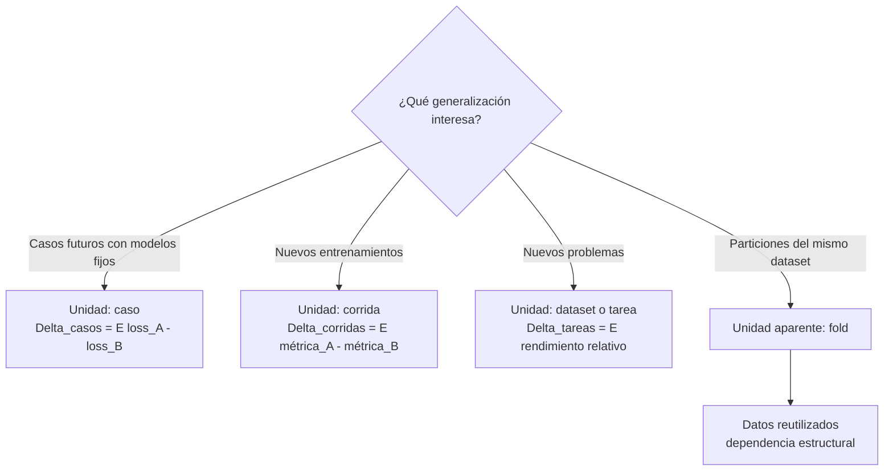
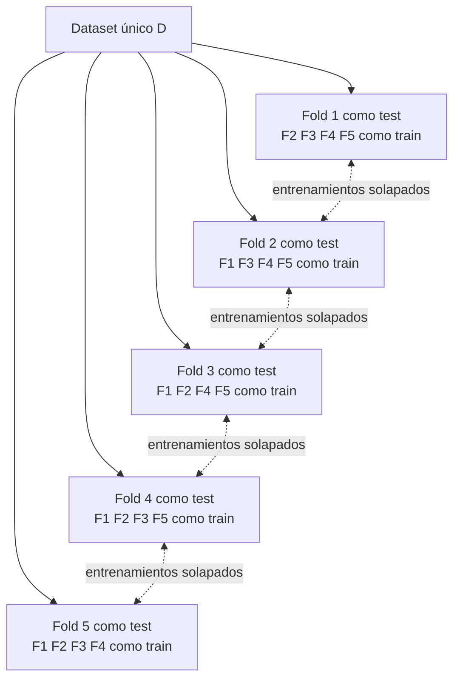
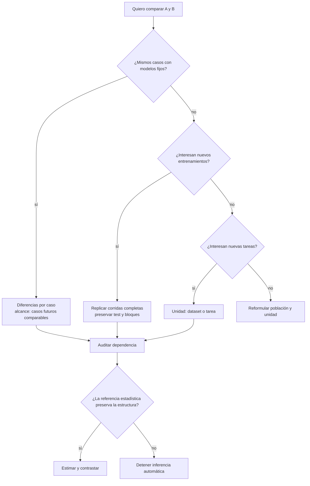

# Unidad de análisis, dependencia y validación cruzada

Anterior: [[05 Prueba exacta por cambios de signo]] · Volver al [[00 Índice - Comparación estadística de modelos|índice]] · Siguiente: [[07 Implementación reproducible en Python]]

## 1. Diez filas pueden representar cuatro experimentos distintos

| Unidad | Qué mide cada fila | Fuente de variabilidad | Alcance natural |
| --- | --- | --- | --- |
| Caso de prueba | Pérdida de A y B en una observación | Heterogeneidad entre casos | Casos futuros comparables con modelos fijos |
| Corrida o semilla | Métrica agregada de cada entrenamiento | Optimización y entrenamiento | Nuevas corridas del pipeline bajo condiciones semejantes |
| Dataset o tarea | Desempeño de A y B en un problema completo | Heterogeneidad entre problemas | Nuevas tareas comparables |
| Fold | Score de una partición del mismo dataset | Partición y entrenamiento solapado | No equivale a estudios independientes |

La cantidad de filas no define el tamaño efectivo de muestra. Lo define el proceso que produjo esas filas y la información que comparten.

## 2. Cambiar la unidad cambia el estimando

### Cómo leer el diagrama

La pregunta de generalización debe venir primero. Cada rama define una unidad y, con ella, otro promedio poblacional. Los *folds* aparecen como unidad aparente porque sus scores son visibles, pero comparten el mismo dataset y gran parte del entrenamiento.

## 3. Casos de prueba

Si A y B ya están entrenados y ambos predicen los mismos casos, cada caso permite calcular una diferencia de pérdida:

$$
d_i=\ell_A(i)-\ell_B(i).
$$

El análisis incorpora heterogeneidad entre casos, pero está condicionado a:

- los pesos concretos de A y B;
- la muestra de entrenamiento y preprocesamiento;
- la semilla usada;
- el dominio de evaluación.

No responde por sí solo qué ocurriría si se reentrena el pipeline.

> [!note] La métrica también afecta el método
> La *log-loss* produce una diferencia continua por caso. Si la métrica fuera acierto/error sobre los mismos casos, la estructura sería una tabla de resultados discordantes y una prueba como McNemar suele corresponder mejor que aplicar una $t$ ingenua a valores binarios.

## 4. Corridas o semillas

Una corrida completa incluye inicialización, orden de lotes, entrenamiento y evaluación. Si la unidad es la corrida, una fila podría ser:

$$
d_r=m_A(r)-m_B(r),
$$

donde $m$ es una métrica agregada.

Para formar pares defendibles, A y B deberían compartir las condiciones que definen el bloque experimental, por ejemplo la misma partición y una regla de semillas predefinida. Sin embargo, evaluar todas las corridas sobre el mismo test introduce una estructura compartida: nuevas corridas no son automáticamente nuevos casos.

## 5. Datasets o tareas

Cuando se comparan algoritmos en varios problemas, la unidad puede ser el dataset o tarea. Cada fila resume el rendimiento relativo dentro de un problema completo.

El estimando se acerca a:

> comportamiento medio de A frente a B en nuevas tareas comparables a las incluidas.

Aquí la heterogeneidad relevante está entre problemas. Diez datasets son conceptualmente distintos de diez casos dentro de un único dataset.

## 6. Por qué los folds no son réplicas independientes

En validación cruzada de cinco *folds*, cada corrida usa

$$
\text{TRAIN}_j=D\setminus F_j,
\qquad
\text{TEST}_j=F_j.
$$

### Cómo leer el diagrama

- El test rota, pero todos los scores provienen del mismo dataset $D$.
- Dos entrenamientos cualesquiera comparten tres de cinco bloques.
- Los modelos resultantes y sus errores están relacionados por el solapamiento.
- Cinco scores no equivalen a cinco estudios independientes.

Si se ignora esta dependencia, el error estándar puede quedar subestimado y la evidencia parecer más fuerte de lo que permite el diseño.

### Ejemplo real del notebook

![[assets/experimento-iris-cv-folds.png|1000]]

- Cada punto es un *score* descriptivo de una partición, no un estudio nuevo.
- Cada entrenamiento usa 56 flores y dos entrenamientos comparten 42: $42/56=75\%$.
- La gran *log-loss* de Random Forest en el *fold* 2 muestra sensibilidad a la partición, pero no transforma los cinco puntos en réplicas independientes.
- El gráfico sirve para observar variación; la procedencia y el solapamiento determinan cómo puede hacerse inferencia.

Revisa también [[Validacion Cruzada|Validación Cruzada]] para el propósito predictivo de la técnica; esta nota añade la advertencia inferencial.

## 7. Por qué una $t$ pareada sobre folds puede ser ingenua

Restar el score de A y B en cada *fold* sí conserva la correspondencia de partición:

$$
d_j=m_{A,j}-m_{B,j}.
$$

Pero `ttest_rel(scores_a, scores_b)` trata normalmente los $d_j$ como unidades independientes. El emparejamiento dentro de cada *fold* no elimina el solapamiento entre entrenamientos ni la reutilización del dataset.

Esto ilustra la regla:

$$
\text{pares correctos}\not\Rightarrow\text{independencia entre pares}.
$$

## 8. Shapiro-Wilk no convierte los folds en observaciones independientes

Aplicar `stats.shapiro(d_folds)` solo examina si la **forma marginal** de los scores o sus diferencias parece compatible con normalidad. No estudia cuánta información comparten los entrenamientos.

Con cinco *folds*, un $p>0.05$ sería especialmente débil como diagnóstico porque:

- $n=5$ ofrece poca potencia para detectar desviaciones de forma;
- los entrenamientos se solapan;
- todos los scores provienen del mismo dataset;
- la calibración usual del $p$-value supone observaciones independientes.

Por tanto:

$$
\text{Shapiro-Wilk no rechaza normalidad}
\not\Rightarrow
\text{folds independientes}.
$$

La normalidad y la independencia son condiciones distintas. La primera se diagnostica con forma, Q-Q y pruebas como Shapiro-Wilk; la segunda se justifica a partir del diseño o se modela explícitamente. Consulta [[04A Diagnóstico de normalidad con Shapiro-Wilk]] para la interpretación completa.

## 9. No hay una receta universal

El método depende de cuál sea la unidad realmente replicada. Opciones que pueden ser defendibles en diseños concretos incluyen:

- un conjunto de prueba independiente con diferencias por caso para modelos fijos;
- repeticiones completas del pipeline planificadas para estudiar variabilidad de entrenamiento;
- comparación sobre múltiples datasets cuando el objetivo son nuevas tareas;
- métodos de remuestreo o permutación que repitan **todo el pipeline** y preserven bloques, grupos o sujetos;
- modelos jerárquicos cuando hay casos anidados en pacientes, hospitales o datasets;
- procedimientos corregidos específicamente para esquemas de validación cruzada, cuando sus supuestos coincidan con el diseño.

> [!warning] Nombre de método no sustituye diseño
> «Bootstrap», «permutación», «5×2 CV» o «prueba corregida» no garantizan validez por sí solos. Debe quedar claro qué se remuestrea, qué permanece fijo y a qué población se generaliza.

## 10. Diagrama de decisión

### Por qué sirve

El diagrama evita comenzar por una función de SciPy. Primero fija la generalización deseada, después la unidad y finalmente la referencia que respeta la estructura.

## 11. Auditoría práctica de dependencia

Antes de declarar $n$, pregunta:

- ¿hay varios registros del mismo sujeto?
- ¿los casos provienen de un mismo usuario, centro o periodo?
- ¿se reutiliza el dataset entre filas?
- ¿los entrenamientos comparten observaciones?
- ¿las semillas se evalúan en el mismo conjunto de test?
- ¿existen series temporales o vecindad espacial?
- ¿la partición fue decidida después de mirar resultados?

Si la respuesta es sí, documenta la estructura y evita una inferencia que trate las filas como réplicas independientes.

Anterior: [[05 Prueba exacta por cambios de signo]] · Siguiente: [[07 Implementación reproducible en Python]]
