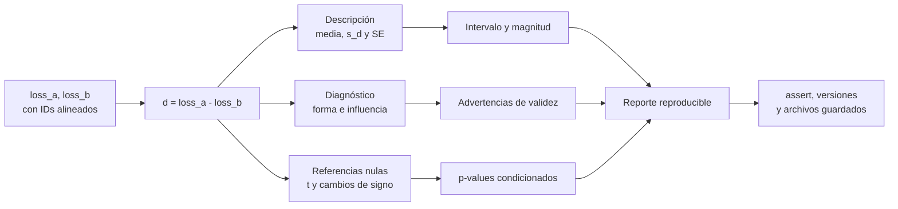

# Implementación reproducible en Python

Anterior: [[06 Unidad de análisis, dependencia y validación cruzada]] · Volver al [[00 Índice - Comparación estadística de modelos|índice]] · Siguiente: [[08 Cómo redactar una conclusión defendible]]

El código de esta nota reproduce los valores del módulo. Debe ejecutarse **después** de justificar unidad, pares, dependencia, métrica, estimando y contraste.

> [!info] Dos niveles de código
> Esta nota desarma el ejemplo didáctico de diez diferencias. Para seguir el experimento completo con carga de Iris, entrenamiento, probabilidades, diagnósticos, Monte Carlo, validación cruzada y gráficos, continúa en [[10 Experimento real - Regresión Logística vs Random Forest en Iris]].

> [!tip] Apoyos dentro de la carpeta de la asignatura
> Si `array`, `shape`, resta elemento a elemento o correspondencia entre filas todavía no están claros, revisa [[numpy pandas parquet arrow|NumPy, Pandas, Arrow y Parquet]]. Para registrar IDs, métricas y configuraciones sin modificar accidentalmente resultados anteriores, consulta [[Estructuras de Python en un experimento de IA]]. Para reproducir las dependencias del ejemplo, consulta [[UV]].

## Mapa visual de la ejecución



### Cómo leerlo

- La resta pareada `d` es el objeto común a todas las ramas.
- Describir, diagnosticar y contrastar son tareas distintas; ninguna sustituye a las otras.
- El reporte combina magnitud, incertidumbre, referencia y límites.
- `assert` comprueba resultados esperados del programa, no los supuestos estadísticos del diseño.

## 1. Datos del caso conductor

```python
import numpy as np

loss_a = np.array([
    0.42, 0.37, 0.51, 0.46, 0.40,
    0.55, 0.48, 0.44, 0.39, 0.52,
])

loss_b = np.array([
    0.38, 0.36, 0.48, 0.48, 0.35,
    0.55, 0.46, 0.38, 0.38, 0.53,
])

assert loss_a.shape == loss_b.shape
assert loss_a.ndim == 1

d = loss_a - loss_b
print(d)
```

Salida:

```text
[ 0.04  0.01  0.03 -0.02  0.05  0.    0.02  0.06  0.01 -0.01]
```

### Por qué sirve cada comprobación

- Igualdad de `shape` evita restar vectores de tamaños distintos.
- `ndim == 1` confirma que cada posición corresponde a una unidad.
- Ningún `assert` demuestra que los pares sean reales; la identidad debe venir de IDs y procedencia, no de la posición accidental.

En datos reales conviene verificar identificadores:

```python
assert np.array_equal(ids_a, ids_b), "A y B no conservan el mismo orden de casos"
```

## 2. Estadística descriptiva

```python
n = d.size
mean_d = d.mean()
sd_d = d.std(ddof=1)
se_d = sd_d / np.sqrt(n)

positive = np.count_nonzero(d > 0)
negative = np.count_nonzero(d < 0)
zero = np.count_nonzero(d == 0)

print(f"n = {n}")
print(f"positivas / negativas / ceros = {positive} / {negative} / {zero}")
print(f"media = {mean_d:.10f}")
print(f"desviación estándar = {sd_d:.10f}")
print(f"error estándar = {se_d:.10f}")
```

Salida esperada:

```text
n = 10
positivas / negativas / ceros = 7 / 2 / 1
media = 0.0190000000
desviación estándar = 0.0260128174
error estándar = 0.0082259751
```

### Detalle importante: `ddof=1`

NumPy usa por defecto divisor $n$ en `std`. Para la desviación estándar muestral usada por la prueba $t$ se necesita divisor $n-1$, por eso se escribe `ddof=1`.

## 3. Prueba $t$ pareada con SciPy

```python
from scipy import stats

result = stats.ttest_rel(
    loss_a,
    loss_b,
    alternative="two-sided",
)

print(f"t({n - 1}) = {result.statistic:.8f}")
print(f"p bilateral = {result.pvalue:.10f}")
```

Salida:

```text
t(9) = 2.30975656
p bilateral = 0.0462549274
```

La llamada es equivalente a una prueba de una muestra sobre `d`:

```python
equivalent = stats.ttest_1samp(d, popmean=0.0, alternative="two-sided")

assert np.isclose(result.statistic, equivalent.statistic)
assert np.isclose(result.pvalue, equivalent.pvalue)
```

Esto comprueba una identidad computacional; no valida independencia ni normalidad.

## 4. Intervalo de confianza del 95 %

```python
confidence = 0.95
df = n - 1

ci_low, ci_high = stats.t.interval(
    confidence=confidence,
    df=df,
    loc=mean_d,
    scale=se_d,
)

print(f"IC 95 % = [{ci_low:.8f}, {ci_high:.8f}]")
```

Salida:

```text
IC 95 % = [0.00039155, 0.03760845]
```

También puede verificarse la fórmula:

```python
t_critical = stats.t.ppf(0.975, df=df)
margin = t_critical * se_d

assert np.isclose(ci_low, mean_d - margin)
assert np.isclose(ci_high, mean_d + margin)
```

## 5. Shapiro-Wilk sobre las diferencias

```python
shapiro = stats.shapiro(d, nan_policy="raise")

print(f"Shapiro-Wilk W = {shapiro.statistic:.8f}")
print(f"Shapiro-Wilk p = {shapiro.pvalue:.10f}")
```

Salida del caso didáctico:

```text
Shapiro-Wilk W = 0.97523390
Shapiro-Wilk p = 0.9346854463
```

- La entrada es `d`, no `loss_a` y `loss_b` por separado.
- `nan_policy="raise"` detiene el cálculo si existe un dato faltante, en vez de ocultar el problema.
- `.statistic` contiene $W$ y `.pvalue` su $p$-value.
- Con $n=10$, $p=0.9347$ significa que no se detectó evidencia contra normalidad; **no demuestra** que la población sea normal.
- El resultado no comprueba independencia, pares ni ausencia de observaciones influyentes.

La teoría, el gráfico Q-Q, las limitaciones por tamaño muestral y el resultado real de Iris se explican en [[04A Diagnóstico de normalidad con Shapiro-Wilk]].

## 6. Enumeración exacta de cambios de signo

```python
from itertools import product

sign_vectors = np.array(
    list(product((-1.0, 1.0), repeat=n))
)

null_means = (sign_vectors * d).mean(axis=1)
observed = abs(mean_d)

# La tolerancia evita perder empates por representación binaria de decimales.
extreme = np.abs(null_means) >= observed - 1e-15
extreme_count = np.count_nonzero(extreme)
p_signs = extreme.mean()

print(f"configuraciones = {len(null_means)}")
print(f"extremas = {extreme_count}")
print(f"p bilateral por signos = {p_signs:.8f}")
```

Salida:

```text
configuraciones = 1024
extremas = 68
p bilateral por signos = 0.06640625
```

### Por qué no usa semilla

Se recorren las $2^{10}$ configuraciones. No hay muestreo aleatorio y, por tanto, no existe error Monte Carlo. Para $n$ grande, $2^n$ puede ser impracticable y se usa una aproximación por transformaciones aleatorias; en ese caso sí deben conservarse semilla y número de repeticiones.

## 7. Comprobaciones automáticas del caso

```python
expected_d = np.array([
    0.04, 0.01, 0.03, -0.02, 0.05,
    0.00, 0.02, 0.06, 0.01, -0.01,
])

assert np.allclose(d, expected_d)
assert np.isclose(mean_d, 0.019)
assert np.isclose(sd_d, 0.0260128174)
assert np.isclose(se_d, 0.0082259751)
assert np.isclose(result.statistic, 2.30975656)
assert np.isclose(result.pvalue, 0.0462549274)
assert np.isclose(shapiro.statistic, 0.9752339028)
assert np.isclose(shapiro.pvalue, 0.9346854463)
assert np.isclose(p_signs, 0.06640625)
```

Estas comprobaciones protegen contra cambios accidentales en los datos o fórmulas. No sustituyen una revisión del contrato estadístico.

## 8. Un reporte generado por código

```python
report = (
    f"Se compararon {n} casos pareados mediante d = loss_A - loss_B. "
    f"La diferencia media fue {mean_d:.3f} puntos de log-loss "
    f"(IC 95 % [{ci_low:.4f}, {ci_high:.4f}]). "
    f"Prueba t bilateral: t({df}) = {result.statistic:.3f}, "
    f"p = {result.pvalue:.4f}. "
    f"Cambios de signo exactos: p = {p_signs:.4f}."
)

print(report)
```

El texto todavía necesita una revisión humana que añada supuestos, alcance y relevancia práctica. Automatizar números no autoriza automatizar la conclusión.

## 9. Gráficos reproducibles

El script [[python/generar_graficos_m06.py]] genera:

- `diferencias-por-caso.png`;
- `intervalo-efecto.png`;
- `distribucion-nula-signos.png`.

Cada gráfico parte del mismo vector `d`, por lo que la exposición visual y los cálculos permanecen sincronizados.

### Resultado visual del ejemplo didáctico

![[assets/diferencias-por-caso.png|900]]

El primer gráfico conserva los diez $d_i$: muestra dirección, heterogeneidad y la media sin ocultar los casos que favorecen a A.

![[assets/intervalo-efecto.png|900]]

El segundo separa el punto estimado de su incertidumbre. La cercanía del extremo inferior a cero explica por qué el resultado $t$ es limítrofe.

![[assets/distribucion-nula-signos.png|900]]

El tercero no representa datos nuevos: muestra las 1024 medias obtenidas al recorrer la referencia exacta de signos y resalta las 68 configuraciones extremas.

Desde la carpeta de este módulo puede ejecutarse sin modificar el entorno global:

```bash
uv run --with numpy --with matplotlib python/generar_graficos_m06.py
```

Si ya tienes NumPy y Matplotlib instalados, también funciona con `python python/generar_graficos_m06.py`.

El experimento real usa un segundo generador, [[python/generar_graficos_experimento_iris.py]], que reproduce siete figuras desde la copia local de Iris y verifica los resultados principales con `assert`. La explicación de cada figura y de la sintaxis usada está en [[10 Experimento real - Regresión Logística vs Random Forest en Iris]].

También genera `experimento-iris-shapiro-wilk.png`, que combina histograma y Q-Q para evitar interpretar el $p$ de Shapiro-Wilk aislado.

## 10. Registro reproducible del análisis

Conserva tres grupos de decisiones.

### Antes

- pregunta y población objetivo;
- unidad, métrica y dirección de la resta;
- regla de emparejamiento;
- contraste primario y alternativa;
- análisis secundarios previstos;
- umbral de relevancia práctica.

### Durante

- diferencias por unidad con IDs;
- efecto e incertidumbre;
- diagnóstico de atípicos y dependencia;
- decisiones inesperadas justificadas;
- versiones de Python, NumPy y SciPy.

### Después

- dirección, magnitud e intervalo;
- todos los análisis realizados, no solo el favorable;
- datos, código y entorno;
- semilla si hubo Monte Carlo;
- límites de generalización.

> [!warning] Multiplicidad
> Si se prueban tres métricas con dos procedimientos, existen seis análisis. Debe registrarse cuál era primario y cómo se controló o interpretó la multiplicidad. No se reporta únicamente el menor $p$-value.

Para organizar configuraciones y resultados de experimentos, enlaza esta nota con [[Estructuras de Python en un experimento de IA]].

Anterior: [[06 Unidad de análisis, dependencia y validación cruzada]] · Aplicación: [[10 Experimento real - Regresión Logística vs Random Forest en Iris]] · Siguiente: [[08 Cómo redactar una conclusión defendible]]
