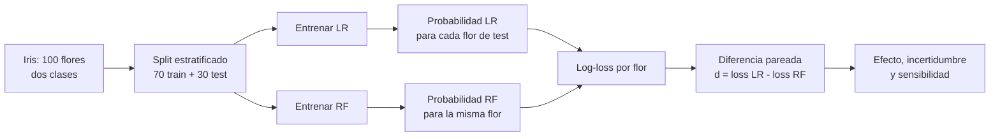

# Experimento real: Regresión Logística vs Random Forest en Iris

Anterior: [[09 Resumen, errores frecuentes y preguntas de repaso]] · Volver al [[00 Índice - Comparación estadística de modelos|índice]] · Conceptos: [[02 Diseño pareado, diferencias e independencia]] · Normalidad: [[04A Diagnóstico de normalidad con Shapiro-Wilk]] · Código base: [[07 Implementación reproducible en Python]]

Esta nota conecta el argumento estadístico del módulo con el experimento reproducible `m06-experimento-logreg-rf`. La pregunta no es cuál algoritmo «gana para siempre», sino qué ocurrió en **las mismas 30 flores de test**, qué incertidumbre tiene la diferencia y hasta dónde puede generalizarse.

> [!important] Resultado en una frase
> En este test, la Regresión Logística obtuvo menor *log-loss* media que Random Forest: $0.636$ frente a $0.935$. La diferencia pareada media fue $-0.299$ al definir $d_i=L_{LR,i}-L_{RF,i}$, pero las diferencias fueron muy asimétricas y unas pocas predicciones seguras aportaron gran parte de la magnitud.

## 1. No mezclar los dos ejemplos del módulo

La guía usa dos casos complementarios:

| Caso | Unidad | Tamaño | Convención | Resultado central |
| --- | --- | ---: | --- | --- |
| Ejemplo de las diapositivas | Caso genérico de prueba | 10 | $d=A-B$ | $\bar d=0.019$, $p_t=0.0463$, $p_{signos}=0.0664$ |
| Experimento de Iris | Una flor de test | 30 | $d=L_{LR}-L_{RF}$ | $\bar d=-0.2986$, $p_t=0.0188$, $p_{signos}\approx0.0145$ |

El primer caso permite enumerar exactamente $2^{10}=1024$ cambios de signo. El segundo entrena modelos reales y usa $2^{30}$ configuraciones posibles; por eso aproxima la referencia de signos mediante Monte Carlo.

> [!warning] El signo cambia de protagonista
> En ambos casos, negativo favorece al modelo escrito primero en la resta. Aquí $d<0$ favorece a Regresión Logística porque su pérdida es menor; $d>0$ favorece a Random Forest.

## 2. Contrato del experimento

| Decisión | Elección |
| --- | --- |
| Dataset | Iris, copia local de `vega_datasets==0.9.0` |
| Clases | `versicolor` = 0; `virginica` = 1 |
| Variables | `sepalLength` y `sepalWidth` |
| Partición | 70 % entrenamiento y 30 % test, estratificada |
| Semilla | `42` |
| Modelo A | `StandardScaler` + `LogisticRegression` |
| Modelo B | `RandomForestClassifier(n_estimators=300)` |
| Métrica primaria | *Log-loss* por flor |
| Métricas secundarias | *Accuracy*, *recall* y F1 con umbral 0.5 |
| Unidad inferencial | Una flor del conjunto de test |
| Emparejamiento | La misma flor recibe una probabilidad de ambos modelos |
| Estimando | $\Delta=\mathbb E[L_{LR}-L_{RF}]$ para casos comparables y estos modelos fijos |
| Contraste | Bilateral: $H_0:\Delta=0$ frente a $H_1:\Delta\ne0$ |



### Cómo leer el flujo

- La separación train/test ocurre una sola vez y antes de medir el resultado.
- Los modelos se ajustan con los mismos 70 casos, pero el par estadístico nace en el test: **una misma flor, dos pérdidas**.
- El vector final `d` contiene 30 diferencias y es el objeto que se resume y contrasta.

## 3. Los datos contienen solapamiento

![[assets/iris-solapamiento-train-test.png|950]]

Los puntos rellenos pertenecen al entrenamiento y los círculos blancos al test. Los colores representan especies. Con solo longitud y anchura del sépalo, las clases se mezclan en varias zonas; por eso una frontera sencilla no puede separarlas perfectamente.

Esta dificultad es útil: dos modelos pueden producir casi las mismas etiquetas y, al mismo tiempo, asignar probabilidades muy distintas.

### Python: cargar, filtrar y crear la etiqueta

```python
iris = pd.read_json(DATA_PATH)

datos = iris.loc[
    iris["species"].isin(["versicolor", "virginica"])
].copy()

datos["target"] = (datos["species"] == "virginica").astype(int)
```

Lectura línea por línea:

- `pd.read_json(...)` lee el archivo y devuelve un `DataFrame`, una tabla de pandas con filas, columnas e índice.
- `iris["species"]` selecciona una columna y devuelve una `Series`.
- `.isin([...])` produce una máscara de `True` y `False`: `True` para las dos especies que queremos conservar.
- `.loc[mascara]` conserva solo las filas verdaderas.
- `.copy()` crea una tabla independiente y evita modificar accidentalmente una vista del objeto anterior.
- La comparación `== "virginica"` también produce booleanos; `.astype(int)` transforma `False` en `0` y `True` en `1`.

> [!note] Qué es `DATA_PATH`
> Es un objeto `Path`, no el contenido del archivo. `Path` representa rutas y permite construirlas con `/`, por ejemplo `PROJECT_ROOT / "data" / "iris.json"`.

## 4. La partición conserva ambas clases

```python
X = datos[["sepalLength", "sepalWidth"]]
y = datos["target"]

X_train, X_test, y_train, y_test = train_test_split(
    X,
    y,
    test_size=0.30,
    stratify=y,
    random_state=42,
)
```

- `X` contiene las variables de entrada; por convención se usa mayúscula porque es una matriz.
- `y` contiene la respuesta que el modelo debe aprender.
- Una función puede devolver varios objetos; Python desempaqueta los cuatro resultados en una sola asignación.
- `test_size=0.30` reserva 30 de las 100 flores.
- `stratify=y` mantiene 15 flores de cada clase en test y 35 de cada clase en entrenamiento.
- `random_state=42` hace repetible esta partición; no demuestra que el resultado sea estable ante otras particiones.

> [!warning] Semilla fija no significa validez general
> La semilla permite repetir **este** experimento. Para estudiar variabilidad entre nuevas particiones o entrenamientos hay que diseñar un experimento que represente explícitamente esa fuente de variación.

## 5. Qué hace cada modelo

```python
modelos = {
    "Regresión Logística": Pipeline([
        ("scaler", StandardScaler()),
        ("model", LogisticRegression(max_iter=1000)),
    ]),
    "Random Forest": RandomForestClassifier(
        n_estimators=300,
        random_state=42,
    ),
}
```

### Regresión Logística

1. `StandardScaler` centra cada variable y la expresa en unidades de desviación estándar.
2. `LogisticRegression` combina linealmente las variables y transforma el resultado mediante una función logística para obtener una probabilidad.
3. `max_iter=1000` establece el máximo de iteraciones del optimizador; no son 1000 modelos ni 1000 observaciones.

El escalamiento no es un requisito matemático para que exista una regresión logística. Aquí se usa porque mejora el acondicionamiento numérico y hace que la penalización regularizadora actúe sobre variables en escalas comparables.

`Pipeline` encadena pasos. Al ejecutar `fit`, ajusta primero el escalador **solo con train** y después ajusta la regresión con los datos transformados. Al ejecutar `predict_proba`, aplica automáticamente la misma transformación al test.

### Random Forest

- Un árbol divide el espacio mediante preguntas como `sepalLength <= 6.1`.
- El bosque combina 300 árboles; `n_estimators=300` controla esa cantidad.
- Puede representar fronteras no lineales y no necesita escalamiento para realizar divisiones por umbral.
- Mayor flexibilidad no garantiza mejores probabilidades fuera del entrenamiento.

### Python: diccionario y ajuste

```python
modelos_ajustados = {
    nombre: clone(modelo).fit(X_train, y_train)
    for nombre, modelo in modelos.items()
}
```

Este bloque es una **comprensión de diccionario**:

- `modelos.items()` entrega pares `(clave, valor)`;
- `for nombre, modelo ...` recorre esos pares;
- `clone(modelo)` crea un estimador nuevo con la misma configuración, pero sin estado aprendido;
- `.fit(X_train, y_train)` aprende parámetros a partir del entrenamiento;
- el resultado mantiene cada nombre asociado con su modelo ya ajustado.

## 6. De probabilidades a pérdidas por flor

```python
def probabilidad_positiva(modelo, X_evaluacion):
    indice = int(np.flatnonzero(modelo.classes_ == 1)[0])
    return modelo.predict_proba(X_evaluacion)[:, indice]
```

- `def` crea una función reutilizable.
- `modelo.classes_` contiene el orden real de las clases aprendido por scikit-learn.
- `predict_proba` devuelve una matriz: una fila por flor y una columna por clase.
- `[:, indice]` significa «todas las filas, solo la columna de la clase positiva».
- `return` entrega el vector de probabilidades al código que llamó la función.

La pérdida binaria por caso se calcula como

$$
L_i=-\left[y_i\log(p_i)+(1-y_i)\log(1-p_i)\right].
$$

```python
epsilon = np.finfo(float).eps
p = np.clip(p, epsilon, 1.0 - epsilon)
loss = -(y * np.log(p) + (1.0 - y) * np.log(1.0 - p))
```

`np.clip` evita intentar calcular $\log(0)$ cuando un modelo produce una probabilidad numéricamente igual a 0 o 1. Las operaciones son **vectorizadas**: NumPy aplica la fórmula a todas las flores sin escribir un bucle manual.

> [!example] Por qué *accuracy* y *log-loss* pueden discrepar
> Si la clase real es `virginica`, probabilidades `0.51` y `0.99` generan la misma etiqueta con umbral 0.5. *Accuracy* las considera dos aciertos; *log-loss* premia mucho más la segunda probabilidad.

## 7. Las métricas agregadas describen preguntas distintas

![[assets/experimento-iris-metricas.png|1000]]

| Métrica | Regresión Logística | Random Forest | Dirección preferible |
| --- | ---: | ---: | --- |
| *Log-loss* | 0.6361 | 0.9348 | Menor |
| *Accuracy* | 0.6667 | 0.6000 | Mayor |
| *Recall* de `virginica` | 0.4667 | 0.4667 | Mayor |
| F1 de `virginica` | 0.5833 | 0.5385 | Mayor |

Los modelos producen la misma etiqueta dura en **28 de 30** flores y tienen el mismo *recall*. Sin embargo, Random Forest recibe peor *log-loss* porque algunas de sus probabilidades equivocadas son muy seguras.

### Python: convertir probabilidad en etiqueta

```python
prediccion = (probabilidad >= 0.5).astype(int)
```

El operador `>=` compara cada elemento con `0.5`. El resultado booleano se transforma en `0` o `1`. Cambiar el umbral puede cambiar *accuracy*, *recall* y F1, pero no cambia las probabilidades originales sobre las que se calcula *log-loss*.

> [!important] Dos promedios siguen sin bastar
> La tabla describe el test, pero no muestra qué flores sostienen la diferencia ni su dispersión. Para inferir se conserva la evidencia pareada por caso.

## 8. El vector de diferencias revela el patrón real

```python
resultados["d"] = resultados["loss_lr"] - resultados["loss_rf"]
d = resultados["d"].to_numpy()
```

`resultados["d"]` crea una columna nueva en el `DataFrame`. `.to_numpy()` extrae sus valores como un arreglo numérico para usar funciones de NumPy y SciPy.

![[assets/experimento-iris-diferencias.png|1000]]

| Resumen | Valor |
| --- | ---: |
| $n$ | 30 |
| Casos que favorecen LR | 16 |
| Casos que favorecen RF | 14 |
| Media | -0.298645 |
| Mediana | -0.013601 |
| Desviación estándar | 0.657510 |
| Error estándar de la media | 0.120044 |

### Cómo leer el gráfico

- Las barras moradas negativas favorecen a Regresión Logística.
- Las verdes positivas favorecen a Random Forest.
- El conteo 16 frente a 14 está casi equilibrado: no hubo una victoria uniforme.
- La media $-0.299$ queda muy lejos de la mediana $-0.014$ porque unas pocas diferencias negativas tienen gran magnitud.
- Los tres mayores $|d_i|$ concentran aproximadamente **45.8 %** de la suma de magnitudes absolutas.

```python
media = np.mean(d)
mediana = np.median(d)
desviacion = np.std(d, ddof=1)
error_estandar = desviacion / np.sqrt(len(d))
```

- `ddof=1` usa divisor $n-1$ para la desviación muestral.
- `len(d)` devuelve la cantidad de diferencias.
- `np.sqrt` calcula la raíz cuadrada.
- Media y mediana responden preguntas distintas: la media usa todas las magnitudes; la mediana localiza el centro por orden y es menos sensible a extremos.

## 9. Prueba t e intervalo: el cálculo no valida sus propios supuestos

```python
resultado_t = stats.ttest_1samp(d, popmean=0.0)
t_critico = stats.t.ppf(0.975, df=len(d) - 1)
ic = (
    media - t_critico * error_estandar,
    media + t_critico * error_estandar,
)
```

- `ttest_1samp` compara la media del vector `d` con `popmean=0.0`.
- Es computacionalmente la misma idea que una t pareada: primero se resta dentro de cada par y después se aplica una prueba de una muestra a las diferencias.
- `stats.t.ppf(0.975, df=29)` obtiene el cuantil crítico para un intervalo bilateral del 95 %.
- La tupla `(...)` guarda los dos extremos del intervalo.

Resultados:

$$
t(29)=-2.4878,\qquad p=0.018849,\qquad IC_{95\%}=[-0.5442,-0.0531].
$$

![[assets/experimento-iris-intervalo.png|950]]

El intervalo queda del lado negativo y, bajo el procedimiento t, es compatible con reducciones medias de *log-loss* de aproximadamente $0.053$ a $0.544$ puntos a favor de Regresión Logística.

### Diagnóstico de normalidad: Shapiro-Wilk y Q-Q

```python
shapiro = stats.shapiro(d)
asimetria = stats.skew(d, bias=False)

print(shapiro.statistic)  # W = 0.748575
print(shapiro.pvalue)     # p = 0.00000864
print(asimetria)          # -1.674769
```

![[assets/experimento-iris-shapiro-wilk.png|1000]]

- `stats.shapiro(d)` se aplica a las diferencias pareadas porque ese es el objeto modelado por la prueba $t$.
- `shapiro.statistic` es $W$: cuanto peor coincide el patrón ordenado con una forma normal, menor tiende a ser.
- `shapiro.pvalue` contrasta la forma normal; no contrasta si LR y RF rinden igual.
- `stats.skew(..., bias=False)` describe asimetría con una corrección de sesgo.
- El histograma muestra una cola izquierda pronunciada.
- En el Q-Q, los puntos de la cola se alejan sistemáticamente de la recta normal.

> [!warning] Cautela importante
> $W=0.7486$ y $p\approx8.64\times10^{-6}$ aportan evidencia fuerte contra normalidad. Esto no es un interruptor que seleccione otra prueba automáticamente: la separación media-mediana, el Q-Q, los casos influyentes y el diseño se interpretan en conjunto. [[04A Diagnóstico de normalidad con Shapiro-Wilk]] explica el código, las hipótesis y los errores de interpretación a detalle.

### Sensibilidad al retirar un caso

```python
for indice in range(len(d)):
    reducido = np.delete(d, indice)
    medias.append(reducido.mean())
    p_values.append(stats.ttest_1samp(reducido, popmean=0.0).pvalue)
```

- `range(len(d))` produce los índices de `0` a `29`.
- `np.delete(d, indice)` crea un vector sin esa observación.
- `.append(...)` agrega cada resultado al final de una lista.

Las medias quedan entre $-0.3186$ y $-0.2373$, y los $p$-values t entre $0.0147$ y $0.0362$. Ninguna eliminación individual invierte la dirección, pero esto **no autoriza eliminar casos**: es un diagnóstico de sensibilidad.

## 10. Cambios de signo mediante Monte Carlo

Con 30 diferencias existen

$$
2^{30}=1\,073\,741\,824
$$

configuraciones de signos. Enumerarlas todas no es práctico durante la clase, así que el notebook toma 200 000 configuraciones reproducibles.

```python
rng = np.random.default_rng(42)
signos = rng.choice([-1.0, 1.0], size=(200_000, len(d)))
medias_nulas = (signos * d).mean(axis=1)
```

- `default_rng(42)` crea un generador pseudoaleatorio independiente y reproducible.
- `size=(200_000, len(d))` solicita una matriz: 200 000 filas por 30 signos.
- `signos * d` usa *broadcasting*: multiplica cada fila de signos por el mismo vector `d`.
- `.mean(axis=1)` promedia a lo largo de las columnas; produce una media por configuración.

El notebook procesa en lotes de 20 000 para no mantener una matriz innecesariamente grande en memoria. El $p$-value aplica una corrección finita:

```python
p = (extremos + 1) / (n_resamples + 1)
```

![[assets/experimento-iris-signos-monte-carlo.png|950]]

El resultado reproducido es $p\approx0.0145$. Las colas naranjas contienen medias tan extremas como la observada en valor absoluto.

> [!warning] Monte Carlo preciso no significa contrato válido
> La aproximación reduce el error computacional al usar muchas transformaciones, pero sigue necesitando que invertir los signos sea defendible bajo la nulidad. La fuerte asimetría observada hace que esa invariancia merezca discusión. La t y los signos no son dos votos independientes ni se elige el menor $p$.

## 11. Validación cruzada: cinco filas no son cinco estudios

![[assets/experimento-iris-cv-folds.png|1000]]

La validación cruzada usa solamente los 70 casos de entrenamiento:

- cada fold valida con 14 casos y entrena con 56;
- dos conjuntos de entrenamiento cualesquiera comparten 42 casos;
- el solapamiento es $42/56=75\%$;
- Random Forest muestra una *log-loss* especialmente grande en el fold 2;
- los *scores* sirven para describir sensibilidad a las particiones, pero no son cinco réplicas independientes.

```python
from sklearn.base import clone
from sklearn.metrics import log_loss
from sklearn.model_selection import StratifiedKFold

cv = StratifiedKFold(n_splits=5, shuffle=True, random_state=42)
splits = list(cv.split(X_train, y_train))
filas_cv = []

for fold, (indices_train, indices_validacion) in enumerate(splits, start=1):
    X_fold_train = X_train.iloc[indices_train]
    y_fold_train = y_train.iloc[indices_train]
    X_validacion = X_train.iloc[indices_validacion]
    y_validacion = y_train.iloc[indices_validacion]

    for nombre, modelo in modelos.items():
        ajustado = clone(modelo).fit(X_fold_train, y_fold_train)
        probabilidad = probabilidad_positiva(ajustado, X_validacion)
        filas_cv.append({
            "fold": fold,
            "modelo": nombre,
            "log_loss": log_loss(
                y_validacion,
                probabilidad,
                labels=[0, 1],
            ),
        })

resultados_cv = pd.DataFrame(filas_cv)
```

- `StratifiedKFold` construye *folds* conservando aproximadamente la proporción de clases; en este problema cada validación contiene 7 casos de cada clase.
- `shuffle=True` mezcla antes de dividir; la semilla hace repetible esa mezcla.
- `cv.split(...)` produce pares de índices posicionales de entrenamiento y validación; por eso se selecciona con `.iloc`.
- `clone(modelo).fit(...)` ajusta un modelo nuevo usando solo las 56 observaciones del entrenamiento del *fold*. Así se evita reutilizar estado aprendido y filtrar información desde validación.
- Cada uno de los 70 casos aparece exactamente una vez en validación. `resultados_cv` contiene diez filas: cinco *folds* por dos modelos.
- El notebook completo calcula también *accuracy*, *recall* y F1; aquí se muestra *log-loss* para hacer explícito el ciclo de ajuste y evaluación.

El solapamiento se calcula con conjuntos de Python:

```python
compartidos = len(primer_train & segundo_train)
fraccion = compartidos / len(primer_train)
```

El operador `&` calcula la intersección: los índices presentes en ambos entrenamientos.

Consulta [[06 Unidad de análisis, dependencia y validación cruzada]] para distinguir casos, corridas, datasets y folds.

## 12. Conclusión defendible del experimento

> En 30 flores de test pareadas, Regresión Logística obtuvo una *log-loss* media de $0.636$, frente a $0.935$ para Random Forest. La diferencia media $L_{LR}-L_{RF}$ fue $-0.299$ puntos, por lo que la dirección observada favoreció a Regresión Logística. Bajo una referencia $t$ de una muestra sobre las diferencias, el $IC_{95\%}$ fue $[-0.544,-0.053]$ y el $p$-value bilateral fue $0.0188$. Sin embargo, las diferencias fueron fuertemente asimétricas (Shapiro-Wilk: $W=0.7486$, $p=8.64\times10^{-6}$) y varias predicciones seguras concentraron una parte importante del efecto. La aproximación por cambios de signo produjo $p\approx0.0145$, condicionada a una invariancia de signos que debe justificarse. El resultado no establece que cualquier Regresión Logística sea superior a cualquier Random Forest ni generaliza automáticamente a nuevas semillas, entrenamientos, variables o datasets.

## 13. Diccionario rápido de Python usado aquí

| Elemento | Qué representa | Ejemplo |
| --- | --- | --- |
| `list` | Secuencia ordenada y modificable | `FEATURES = ["sepalLength", "sepalWidth"]` |
| `tuple` | Secuencia fija, útil para varios retornos | `(ic_low, ic_high)` |
| `dict` | Asociación clave-valor | `{"LR": modelo_lr, "RF": modelo_rf}` |
| `Series` | Una columna de pandas con índice | `datos["target"]` |
| `DataFrame` | Tabla de pandas | `resultados` |
| `ndarray` | Arreglo numérico de NumPy | `d` |
| `Pipeline` | Cadena de transformaciones y modelo | escalador $\rightarrow$ regresión |
| `fit` | Aprende usando train | `modelo.fit(X_train, y_train)` |
| `predict_proba` | Devuelve probabilidades por clase | `modelo.predict_proba(X_test)` |
| `random_state` | Semilla o estado que fija operaciones pseudoaleatorias | `random_state=42` |
| `axis=1` | Opera horizontalmente por fila | `matriz.mean(axis=1)` |
| `assert` | Detiene la ejecución si una condición esperada falla | `assert len(d) == 30` |

### Signos de sintaxis frecuentes

| Sintaxis | Lectura |
| --- | --- |
| `objeto.metodo()` | Ejecuta una operación ofrecida por el objeto |
| `objeto.atributo` | Consulta un dato guardado en el objeto |
| `tabla["columna"]` | Selecciona una columna |
| `matriz[:, 1]` | Todas las filas, columna 1 |
| `a == b` | Compara igualdad; no asigna |
| `nombre = valor` | Asigna un valor a un nombre |
| `**metricas` | Expande pares clave-valor dentro de otro diccionario |
| `f"{valor:.3f}"` | Inserta un valor con tres decimales en texto |

## 14. Cómo reproducirlo

Desde la carpeta del proyecto:

```bash
uv sync --frozen
uv run python scripts/verify_package.py
uv run jupyter lab notebooks/experimento_m06_logreg_vs_rf.ipynb
```

El notebook para estudiantes no contiene resultados precargados: se ejecuta celda por celda. Para regenerar solamente los gráficos de esta nota:

```bash
uv run --project "/Users/alech/Downloads/m06-experimento-logreg-rf" --frozen \
  python "/Users/alech/Documents/notes/Obsidian/posgrado/master/MATEMÁTICAS Y PROGRAMACIÓN IA/comparacion estadistica de modelos/python/generar_graficos_experimento_iris.py" \
  --project-root "/Users/alech/Downloads/m06-experimento-logreg-rf"
```

El script verifica automáticamente los resultados principales mediante `assert` y guarda los PNG en `assets/`.

## 15. Preguntas para comprobar comprensión

1. ¿Por qué una diferencia negativa favorece a Regresión Logística?
2. ¿Cómo pueden coincidir 28 de 30 etiquetas y diferir mucho las *log-loss*?
3. ¿Qué explica la separación entre media $-0.299$ y mediana $-0.014$?
4. ¿Qué garantiza `random_state=42` y qué no garantiza?
5. ¿Por qué `predict_proba(X)[:, indice]` usa dos dimensiones?
6. ¿Por qué 200 000 cambios de signo no son 200 000 muestras nuevas?
7. ¿Por qué cinco folds no deben entrar en una t como cinco estudios independientes?
8. ¿Qué permite concluir Shapiro-Wilk con $p=8.64\times10^{-6}$ y qué no permite concluir?

> [!success]- Respuestas
> 1. Porque $d=L_{LR}-L_{RF}$ y menor pérdida es mejor.
> 2. La etiqueta conserva solo el lado del umbral; *log-loss* conserva la probabilidad y penaliza errores seguros.
> 3. Unas pocas diferencias negativas grandes arrastran la media; la mediana depende del orden y queda cerca de cero.
> 4. Reproduce esta secuencia pseudoaleatoria; no demuestra estabilidad ante otras particiones ni validez externa.
> 5. La primera dimensión representa casos y la segunda, clases; se selecciona la columna de `virginica`.
> 6. Son transformaciones de las mismas 30 magnitudes bajo una referencia nula, no datos nuevos.
> 7. Reutilizan el mismo dataset y sus entrenamientos comparten 75 % de los casos.
> 8. Aporta evidencia fuerte contra normalidad de las diferencias. No demuestra que LR y RF difieran, no mide la magnitud del efecto, no comprueba independencia y no selecciona automáticamente otra prueba.

## Fuentes y archivos reproducibles

- Guía del estudiante: ![[assets/Guia_estudiante_M06_comparacion_estadistica_modelos.pdf]]
- Presentación original: ![[assets/module_06.pdf]]
- Generador de estos gráficos: [[python/generar_graficos_experimento_iris.py]]
- Los números del experimento se reprodujeron con el `uv.lock`, la copia local de Iris y el notebook del paquete M06.
